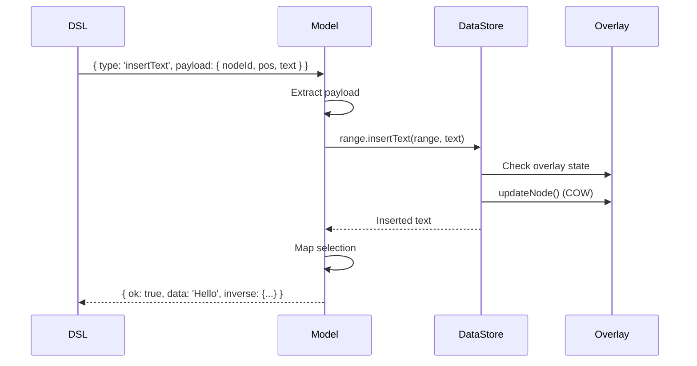

# Model Operations API

Model operations are business logic implementations that use DataStore operations. They handle selection mapping, inverse operations for undo/redo, and transaction context.

## Overview

Model operations are defined using `defineOperation()` and are executed within transactions. They bridge the gap between DSL helpers and DataStore operations.

## Operation Structure

```typescript
defineOperation('operationName', async (operation, context) => {
  // 1. Extract payload
  const { nodeId, ... } = operation.payload;
  
  // 2. Call DataStore operations
  context.dataStore.range.insertText(...);
  
  // 3. Map selection (if needed)
  if (context.selection?.current) {
    // Update selection offsets
  }
  
  // 4. Return result with inverse
  return {
    ok: true,
    data: result,
    inverse: { type: 'inverseOp', payload: {...} }
  };
});
```

## Transaction Context

All model operations receive a `TransactionContext`:

```typescript
interface TransactionContext {
  dataStore: DataStore;           // DataStore instance
  selection: {
    before: ModelSelection;       // Selection before transaction
    current: ModelSelection;      // Current selection (mutable)
  };
  schema: Schema;                  // Active schema
}
```

## Text Operations

### `insertText`

Inserts text at a position in a text node.

**DSL**: `insertText(pos, text)` or `insertText(nodeId, pos, text)`

**Payload**:
```typescript
{
  nodeId: string;
  pos: number;
  text: string;
}
```

**Behavior**:
- Calls `DataStore.range.insertText()`
- Maps selection: moves offsets after insertion point forward
- Returns inserted text
- Inverse: `deleteTextRange`

**Example**:
```typescript
// DSL
const ops = control('text-1', [
  insertText(5, 'Hello')
]);

// Executes:
// 1. DataStore.range.insertText({ startNodeId: 'text-1', startOffset: 5, ... }, 'Hello')
// 2. Updates selection offsets if selection is after position 5
// 3. Returns { ok: true, data: 'Hello', inverse: {...} }
```

### `deleteTextRange`

Deletes text in a range.

**DSL**: `deleteTextRange(startPosition, endPosition)` or `deleteTextRange(nodeId, startPosition, endPosition)`

**Payload**:
```typescript
{
  nodeId: string;
  startPosition: number;
  endPosition: number;
}
```

**Behavior**:
- Calls `DataStore.range.deleteText()`
- Maps selection: adjusts offsets
- Returns deleted text
- Inverse: `insertText`

### `replaceText`

Replaces text in a range.

**DSL**: `replaceText(newText)` or `replaceText(nodeId, newText)`

**Payload**:
```typescript
{
  nodeId: string;
  newText: string;
  startPosition?: number;
  endPosition?: number;
}
```

**Behavior**:
- Calls `DataStore.range.replaceText()`
- Maps selection
- Returns replaced text
- Inverse: `replaceText` with old text

---

## Node Operations

### `create`

Creates a node with children.

**DSL**: `create(stype, attributes?, content?)`

**Payload**:
```typescript
{
  node: INode;  // Node with nested children (objects)
  options?: any;
}
```

**Behavior**:
- Calls `DataStore.createNodeWithChildren()`
- Sets root node if first node
- Does not change selection
- Inverse: `delete`

**Example**:
```typescript
// DSL
const ops = [
  create('paragraph', {}, [
    { stype: 'inline-text', text: 'Hello' }
  ])
];

// Executes:
// 1. DataStore.createNodeWithChildren(node, schema)
// 2. Sets root if first node
// 3. Returns { ok: true, data: createdNode, inverse: { type: 'delete', ... } }
```

### `delete`

Deletes a node and its descendants.

**DSL**: `delete()` or `delete(nodeId)`

**Payload**:
```typescript
{
  nodeId: string;
}
```

**Behavior**:
- Recursively deletes all descendants
- Removes from parent's content array
- Cannot delete root node (throws error)
- Maps selection: clears if selection was in deleted node
- Inverse: `create`

**Example**:
```typescript
// DSL
const ops = control('node-1', [
  delete()
]);

// Executes:
// 1. Gets all descendants
// 2. Deletes descendants in reverse order
// 3. Removes from parent
// 4. Deletes node
// 5. Updates selection if needed
```

### `update`

Updates a node with partial changes.

**DSL**: `update(updates)`

**Payload**:
```typescript
{
  nodeId: string;
  data: Partial<INode>;  // Fields to update
}
```

**Behavior**:
- Calls `DataStore.updateNode()`
- Merges attributes (shallow-merge)
- Validates against schema
- Does not change selection
- Inverse: `update` with old data

**Example**:
```typescript
// DSL
const ops = control('text-1', [
  update({ text: 'Updated' })
]);

// Executes:
// 1. DataStore.updateNode('text-1', { text: 'Updated' })
// 2. Returns { ok: true, data: updatedNode, inverse: {...} }
```

### `transformNode`

Transforms a node to a different type.

**DSL**: `transformNode(newType, newAttrs?)`

**Payload**:
```typescript
{
  nodeId: string;
  newType: string;
  newAttrs?: Record<string, any>;
}
```

**Behavior**:
- Calls `DataStore.transformNode()`
- Validates new type against schema
- Preserves content and relationships
- Inverse: `transformNode` with old type

---

## Content Operations

### `addChild`

Adds a child to a parent's content array.

**DSL**: `addChild(child, position?)`

**Payload**:
```typescript
{
  nodeId: string;  // Parent node ID
  child: INode | string;
  position?: number;
}
```

**Behavior**:
- Calls `DataStore.content.addChild()`
- Creates child if object provided
- Updates parent's content array
- Updates child's parentId
- Inverse: `removeChild`

### `removeChild`

Removes a child from parent's content array.

**DSL**: `removeChild(childId)`

**Payload**:
```typescript
{
  nodeId: string;  // Parent node ID
  childId: string;
}
```

**Behavior**:
- Calls `DataStore.content.removeChild()`
- Removes from parent's content array
- Clears child's parentId
- Inverse: `addChild`

### `moveNode`

Moves a node to a new parent.

**DSL**: `moveNode(newParentId, position?)`

**Payload**:
```typescript
{
  nodeId: string;
  newParentId: string;
  position?: number;
}
```

**Behavior**:
- Calls `DataStore.content.moveNode()`
- Removes from old parent
- Adds to new parent
- Updates parentId
- Inverse: `moveNode` with old parent

### `reorderChildren`

Reorders children in a parent's content array.

**DSL**: `reorderChildren(childIds)`

**Payload**:
```typescript
{
  nodeId: string;  // Parent node ID
  childIds: string[];
}
```

**Behavior**:
- Calls `DataStore.content.reorderChildren()`
- Updates parent's content array
- Inverse: `reorderChildren` with old order

---

## Mark Operations

### `applyMark`

Applies a mark to a range.

**DSL**: `applyMark(markType, range, attrs?)`

**Payload**:
```typescript
{
  nodeId: string;
  markType: string;
  range: [number, number];
  attrs?: Record<string, any>;
}
```

**Behavior**:
- Calls `DataStore.mark.setMarks()` or `DataStore.range.applyMark()`
- Adds mark to node
- Merges with existing marks
- Inverse: `removeMark`

### `removeMark`

Removes a mark from a range.

**DSL**: `removeMark(markType, range?)`

**Payload**:
```typescript
{
  nodeId: string;
  markType: string;
  range?: [number, number];
}
```

**Behavior**:
- Calls `DataStore.mark.removeMark()`
- Removes mark from node
- Updates marks array
- Inverse: `applyMark`

### `toggleMark`

Toggles a mark on/off.

**DSL**: `toggleMark(markType, range, attrs?)`

**Payload**:
```typescript
{
  nodeId: string;
  markType: string;
  range: [number, number];
  attrs?: Record<string, any>;
}
```

**Behavior**:
- Calls `DataStore.mark.toggleMark()`
- Adds if not present, removes if present
- Inverse: `toggleMark` (self-inverse)

### `updateMark`

Updates mark attributes.

**DSL**: `updateMark(markType, attrs, range?)`

**Payload**:
```typescript
{
  nodeId: string;
  markType: string;
  attrs: Record<string, any>;
  range?: [number, number];
}
```

**Behavior**:
- Calls `DataStore.mark.updateMark()`
- Updates mark attributes
- Inverse: `updateMark` with old attrs

---

## Split/Merge Operations

### `splitTextNode`

Splits a text node at a position.

**DSL**: `splitTextNode(splitPosition)`

**Payload**:
```typescript
{
  nodeId: string;
  splitPosition: number;
}
```

**Behavior**:
- Calls `DataStore.splitMerge.splitTextNode()`
- Creates new node with text after split
- Updates original node with text before split
- Maps selection if needed
- Inverse: `mergeTextNodes`

### `mergeTextNodes`

Merges two adjacent text nodes.

**DSL**: `mergeTextNodes(rightNodeId)`

**Payload**:
```typescript
{
  nodeId: string;  // Left node ID
  rightNodeId: string;
}
```

**Behavior**:
- Calls `DataStore.splitMerge.mergeTextNodes()`
- Concatenates text
- Merges marks
- Removes right node
- Maps selection if needed
- Inverse: `splitTextNode`

### `splitBlockNode`

Splits a block node at a position.

**DSL**: `splitBlockNode(splitPosition)`

**Payload**:
```typescript
{
  nodeId: string;
  splitPosition: number;
}
```

**Behavior**:
- Calls `DataStore.splitMerge.splitBlockNode()`
- Creates new block with children after split
- Updates original block
- Inverse: `mergeBlockNodes`

### `mergeBlockNodes`

Merges two adjacent block nodes.

**DSL**: `mergeBlockNodes(rightNodeId)`

**Payload**:
```typescript
{
  nodeId: string;  // Left node ID
  rightNodeId: string;
}
```

**Behavior**:
- Calls `DataStore.splitMerge.mergeBlockNodes()`
- Merges children
- Removes right node
- Inverse: `splitBlockNode`

---

## Selection Operations

### `selectRange`

Sets selection to a range.

**DSL**: `selectRange(startNodeId, startOffset, endNodeId, endOffset)`

**Payload**:
```typescript
{
  startNodeId: string;
  startOffset: number;
  endNodeId: string;
  endOffset: number;
}
```

**Behavior**:
- Updates `context.selection.current`
- Does not call DataStore (selection is managed by Editor Core)
- Inverse: `selectRange` with old selection

### `selectNode`

Sets selection to a node.

**DSL**: `selectNode(nodeId)`

**Payload**:
```typescript
{
  nodeId: string;
}
```

**Behavior**:
- Sets selection to cover entire node
- Inverse: `selectRange` with old selection

### `clearSelection`

Clears selection.

**DSL**: `clearSelection()`

**Payload**: None

**Behavior**:
- Clears `context.selection.current`
- Inverse: `selectRange` with old selection

---

## Transform Operations

### `wrap`

Wraps a range with a new node.

**DSL**: `wrap(wrapperType, wrapperAttrs?)`

**Payload**:
```typescript
{
  nodeId: string;  // Start node ID
  endNodeId: string;
  wrapperType: string;
  wrapperAttrs?: Record<string, any>;
}
```

**Behavior**:
- Creates wrapper node
- Moves selected nodes into wrapper
- Updates parent relationships
- Inverse: `unwrap`

### `unwrap`

Removes wrapper node, promoting children.

**DSL**: `unwrap()`

**Payload**:
```typescript
{
  nodeId: string;  // Wrapper node ID
}
```

**Behavior**:
- Moves children to wrapper's parent
- Deletes wrapper node
- Inverse: `wrap`

### `indentNode` / `outdentNode`

Indents or outdents a block node.

**DSL**: `indentNode()` / `outdentNode()`

**Payload**:
```typescript
{
  nodeId: string;
}
```

**Behavior**:
- Moves node to previous/next block's content
- Updates parent relationships
- Inverse: `outdentNode` / `indentNode`

### `indentText` / `outdentText`

Indents or outdents text (adds/removes prefix).

**DSL**: `indentText(prefix?)` / `outdentText(prefix?)`

**Payload**:
```typescript
{
  nodeId: string;
  prefix?: string;
}
```

**Behavior**:
- Adds/removes prefix from text
- Updates text content
- Inverse: `outdentText` / `indentText`

---

## Clipboard Operations

### `copy`

Copies selected content.

**DSL**: `copy()`

**Payload**: None (uses current selection)

**Behavior**:
- Extracts text/content from selection
- Stores in clipboard
- Does not modify document
- No inverse

### `cut`

Cuts selected content.

**DSL**: `cut()`

**Payload**: None (uses current selection)

**Behavior**:
- Copies content
- Deletes selected content
- Inverse: `paste`

### `paste`

Pastes content at selection.

**DSL**: `paste(content?)`

**Payload**:
```typescript
{
  content?: INode[];  // Optional content to paste
}
```

**Behavior**:
- Inserts content at selection
- Creates nodes from clipboard
- Maps selection after paste
- Inverse: `delete` (if content provided)

---

## Utility Operations

### `autoMergeTextNodes`

Automatically merges adjacent text nodes.

**DSL**: `autoMergeTextNodes()`

**Payload**:
```typescript
{
  nodeId: string;
}
```

**Behavior**:
- Finds adjacent text nodes
- Merges if same type and no marks
- Inverse: `splitTextNode`

### `cloneNodeWithChildren`

Clones a node with all its children.

**DSL**: `cloneNodeWithChildren(newParentId?)`

**Payload**:
```typescript
{
  nodeId: string;
  newParentId?: string;
}
```

**Behavior**:
- Recursively clones node and children
- Assigns new IDs
- Optionally adds to new parent
- Inverse: `delete` (for cloned nodes)

---

## Operation Execution Flow



## Return Value Structure

All model operations return:

```typescript
{
  ok: boolean;           // Success/failure
  data?: any;            // Operation result data
  inverse?: TransactionOperation;  // Inverse operation for undo
  error?: string;        // Error message (if ok: false)
}
```

## Selection Mapping

Model operations automatically map selection when content changes:

- **Text insertion**: Moves offsets after insertion point forward
- **Text deletion**: Moves offsets after deletion point backward
- **Node deletion**: Clears selection if in deleted node
- **Node creation**: Does not change selection

## Inverse Operations

All operations provide inverse operations for undo/redo:

- `insertText` → `deleteTextRange`
- `deleteTextRange` → `insertText`
- `create` → `delete`
- `delete` → `create`
- `update` → `update` (with old data)
- `toggleMark` → `toggleMark` (self-inverse)

---

## Related

- [Operations Overview](./operations-overview) - Understanding the operation hierarchy
- [DataStore Operations API](./datastore-operations) - DataStore layer operations
- [Model Operation DSL API](./model-operation-dsl) - DSL helpers
- [Operation Selection Guide](./operation-selection-guide) - How to choose operations
- [Custom Operations Guide](../guides/custom-operations) - Creating custom operations
