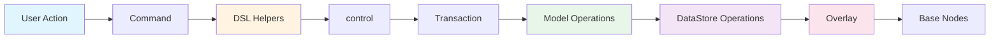

# Operation Selection Guide

This guide helps you choose the right operation for your needs based on the operation hierarchy.

## Quick Decision Tree

```
Need to modify document?
│
├─ Writing a Command?
│  └─ Use DSL Layer ✅
│     └─ transaction(editor, [control(...), ...])
│
├─ Creating Custom Operation?
│  └─ Use Model Layer ✅
│     └─ defineOperation('customOp', ...)
│
└─ Direct DataStore Access?
   └─ Use DataStore Layer ⚠️ (Rare)
      └─ dataStore.range.insertText(...)
```

---

## When to Use DSL Layer

**Use DSL operations when:**

1. ✅ **Writing Commands** (most common)
   ```typescript
   // In Extension command
   const result = await transaction(editor, [
     ...control(selection.startNodeId, [
       insertText(0, 'Hello'),
       toggleMark('bold', [0, 5])
     ])
   ]).commit();
   ```

2. ✅ **Type Safety Needed**
   - DSL helpers are type-safe
   - Compile-time checking

3. ✅ **Composability**
   - Easy to combine multiple operations
   - `control()` injects nodeId automatically

4. ✅ **Transaction DSL**
   - Natural fit for `transaction(editor, [ops])`

**Example**:
```typescript
// ✅ Good: Use DSL
const result = await transaction(editor, [
  ...control('text-1', [
    insertText(5, 'Hello'),
    toggleMark('bold', [0, 10])
  ])
]).commit();
```

---

## When to Use Model Layer

**Use Model operations when:**

1. ✅ **Creating Custom Operations**
   ```typescript
   defineOperation('customOp', async (operation, context) => {
     // Access context.dataStore, context.selection
     // Implement business logic
     // Return result with inverse
   });
   ```

2. ✅ **Complex Business Logic**
   - Need transaction context
   - Need selection mapping
   - Need inverse operations

3. ✅ **Extending Functionality**
   - Adding new operation types
   - Customizing existing operations

**Example**:
```typescript
// ✅ Good: Custom operation
defineOperation('highlightSelection', async (operation, context) => {
  const selection = context.selection.current;
  if (!selection) return { ok: false };
  
  // Complex logic with selection mapping
  // ...
  
  return { ok: true, data: result, inverse: {...} };
});
```

---

## When to Use DataStore Layer

**Use DataStore operations when:**

1. ⚠️ **Direct Access Needed** (rare)
   ```typescript
   // Direct DataStore manipulation
   const rangeOps = new RangeOperations(dataStore);
   rangeOps.insertText(range, 'Hello');
   ```

2. ⚠️ **Performance Critical**
   - Need maximum performance
   - Bypassing Model layer

3. ⚠️ **Low-Level Control**
   - Need overlay/lock control
   - Custom transaction management

**Note**: Usually not needed in extensions. Use DSL or Model layers instead.

**Example**:
```typescript
// ⚠️ Rare: Direct DataStore access
dataStore.begin();
dataStore.range.insertText(range, 'Hello');
dataStore.commit();
```

---

## Operation Categories

### Text Operations

**DSL**: `insertText`, `deleteTextRange`, `replaceText`
- ✅ Use for: Text insertion, deletion, replacement
- ✅ Best for: Commands that modify text

**Model**: `insertText`, `deleteTextRange`, `replaceText`
- ✅ Use for: Custom text operations
- ✅ Best for: Complex text manipulation logic

**DataStore**: `RangeOperations.insertText()`, `RangeOperations.deleteText()`
- ⚠️ Use for: Direct text manipulation (rare)

### Node Operations

**DSL**: `create`, `delete`, `update`
- ✅ Use for: Node creation, deletion, updates
- ✅ Best for: Commands that modify nodes

**Model**: `create`, `delete`, `update`
- ✅ Use for: Custom node operations
- ✅ Best for: Complex node manipulation

**DataStore**: `CoreOperations.setNode()`, `CoreOperations.deleteNode()`
- ⚠️ Use for: Direct node manipulation (rare)

### Content Operations

**DSL**: `addChild`, `removeChild`, `moveNode`, `reorderChildren`
- ✅ Use for: Parent-child relationships
- ✅ Best for: Commands that modify structure

**Model**: `addChild`, `removeChild`, `moveNode`, `reorderChildren`
- ✅ Use for: Custom content operations
- ✅ Best for: Complex structure manipulation

**DataStore**: `ContentOperations.addChild()`, `ContentOperations.moveNode()`
- ⚠️ Use for: Direct content manipulation (rare)

### Mark Operations

**DSL**: `applyMark`, `removeMark`, `toggleMark`, `updateMark`
- ✅ Use for: Mark management
- ✅ Best for: Formatting commands

**Model**: `applyMark`, `removeMark`, `toggleMark`, `updateMark`
- ✅ Use for: Custom mark operations
- ✅ Best for: Complex mark logic

**DataStore**: `MarkOperations.setMarks()`, `MarkOperations.toggleMark()`
- ⚠️ Use for: Direct mark manipulation (rare)

---

## Common Patterns

### Pattern 1: Simple Text Insertion

```typescript
// ✅ Use DSL
const result = await transaction(editor, [
  ...control(selection.startNodeId, [
    insertText(selection.startOffset, 'Hello')
  ])
]).commit();
```

### Pattern 2: Format Selection

```typescript
// ✅ Use DSL
const result = await transaction(editor, [
  ...control(selection.startNodeId, [
    toggleMark('bold', [selection.startOffset, selection.endOffset])
  ])
]).commit();
```

### Pattern 3: Create Node Structure

```typescript
// ✅ Use DSL
const result = await transaction(editor, [
  create('paragraph', {}, [
    { stype: 'inline-text', text: 'Hello' }
  ])
]).commit();
```

### Pattern 4: Complex Multi-Operation

```typescript
// ✅ Use DSL (composable)
const result = await transaction(editor, [
  // Create node
  create('paragraph', {}, [
    { stype: 'inline-text', text: 'Hello' }
  ]),
  
  // Modify text
  ...control('text-1', [
    insertText(5, ' World'),
    toggleMark('bold', [0, 11])
  ]),
  
  // Move node
  ...control('paragraph-1', [
    moveNode('new-parent-1', 0)
  ])
]).commit();
```

### Pattern 5: Custom Operation

```typescript
// ✅ Use Model Layer
defineOperation('customHighlight', async (operation, context) => {
  const { nodeId, range } = operation.payload;
  
  // Complex logic
  const node = context.dataStore.getNode(nodeId);
  // ... custom logic ...
  
  // Call DataStore
  context.dataStore.mark.setMarks(nodeId, marks);
  
  // Map selection
  if (context.selection?.current) {
    // Update selection
  }
  
  return { ok: true, data: result, inverse: {...} };
});

// Use in DSL
const highlight = defineOperationDSL(
  (nodeId: string, range: [number, number]) => ({
    type: 'customHighlight',
    payload: { nodeId, range }
  })
);

// Use in transaction
const result = await transaction(editor, [
  ...control('text-1', [
    highlight([0, 5])
  ])
]).commit();
```

---

## Operation Flow Diagram



---

## Best Practices

### 1. Prefer DSL Layer

```typescript
// ✅ Good: Use DSL
const result = await transaction(editor, [
  ...control(nodeId, [
    insertText(5, 'Hello')
  ])
]).commit();

// ❌ Avoid: Direct DataStore
dataStore.range.insertText(range, 'Hello');
```

### 2. Use control() for Node-Scoped Operations

```typescript
// ✅ Good: control() injects nodeId
control('text-1', [
  insertText(5, 'Hello'),
  toggleMark('bold', [0, 10])
])

// ❌ Avoid: Manual nodeId
insertText('text-1', 5, 'Hello')
```

### 3. Combine Related Operations

```typescript
// ✅ Good: Multiple operations in one control
control('text-1', [
  insertText(5, 'Hello'),
  toggleMark('bold', [0, 10])
])

// ❌ Avoid: Separate transactions
await transaction(editor, [control('text-1', [insertText(5, 'Hello')])]).commit();
await transaction(editor, [control('text-1', [toggleMark('bold', [0, 10])])]).commit();
```

### 4. Use Appropriate Layer

```typescript
// ✅ Good: DSL for commands
const result = await transaction(editor, [
  ...control(nodeId, [insertText(5, 'Hello')])
]).commit();

// ✅ Good: Model for custom operations
defineOperation('customOp', async (operation, context) => {
  // Custom logic
});

// ⚠️ Rare: DataStore for direct access
dataStore.range.insertText(range, 'Hello');
```

---

## Operation Comparison

| Task | DSL | Model | DataStore |
|------|-----|-------|-----------|
| Insert text | ✅ `insertText(5, 'Hello')` | ✅ `defineOperation('insertText', ...)` | ⚠️ `range.insertText()` |
| Delete text | ✅ `deleteTextRange(0, 5)` | ✅ `defineOperation('deleteTextRange', ...)` | ⚠️ `range.deleteText()` |
| Create node | ✅ `create('paragraph', ...)` | ✅ `defineOperation('create', ...)` | ⚠️ `core.setNode()` |
| Update node | ✅ `update({ text: 'New' })` | ✅ `defineOperation('update', ...)` | ⚠️ `core.updateNode()` |
| Add mark | ✅ `applyMark('bold', [0, 5])` | ✅ `defineOperation('applyMark', ...)` | ⚠️ `mark.setMarks()` |
| Custom logic | ❌ | ✅ `defineOperation('custom', ...)` | ❌ |

---

## Related

- [Operations Overview](./operations-overview) - Understanding the operation hierarchy
- [DataStore Operations API](./datastore-operations) - Complete DataStore operation reference
- [Model Operations API](./model-operations) - Complete Model operation reference
- [Model Operation DSL API](./model-operation-dsl) - Complete DSL helper reference
- [Custom Operations Guide](../guides/custom-operations) - Creating custom operations
