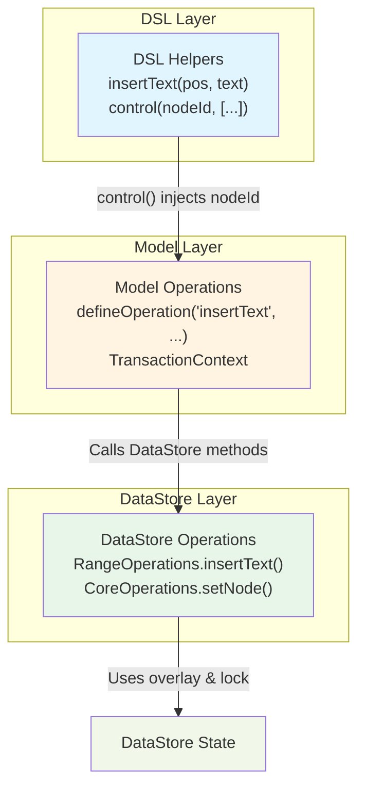
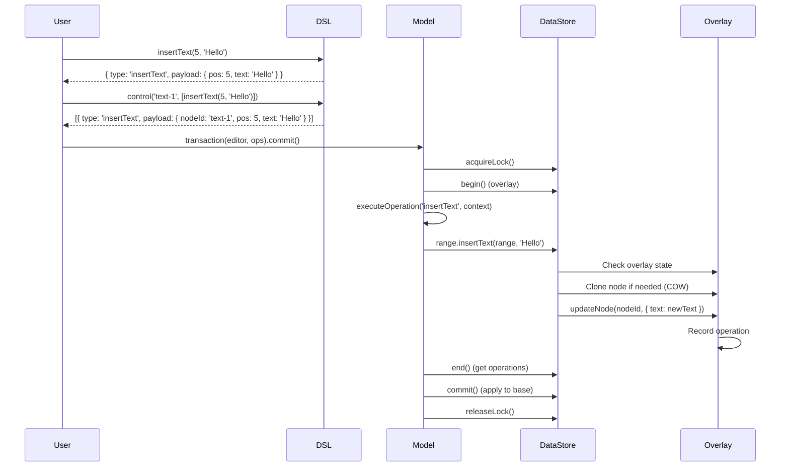

# Operations Overview

Operations in Barocss Editor are organized in three layers: **DSL**, **Model**, and **DataStore**. Understanding this hierarchy helps you choose the right operation for your needs.

## Operation Hierarchy



## Three Layers Explained

### 1. DSL Layer (User-Friendly)

**Purpose**: Simple, declarative API for defining operations

**Location**: `packages/model/src/operations-dsl/`

**Example**:
```typescript
import { insertText, control } from '@barocss/model';

// DSL helper
const op = insertText(5, 'Hello');
// Returns: { type: 'insertText', payload: { pos: 5, text: 'Hello' } }

// With control (injects nodeId)
const ops = control('text-1', [
  insertText(5, 'Hello')
]);
// Returns: [{ type: 'insertText', payload: { nodeId: 'text-1', pos: 5, text: 'Hello' } }]
```

**Characteristics**:
- ✅ Simple function calls
- ✅ Type-safe
- ✅ Composable with `control()`
- ✅ No direct DataStore access

### 2. Model Layer (Business Logic)

**Purpose**: Implements operation logic, handles selection mapping, calls DataStore

**Location**: `packages/model/src/operations/`

**Example**:
```typescript
// Defined with defineOperation
defineOperation('insertText', async (operation, context) => {
  const { nodeId, pos, text } = operation.payload;
  
  // 1. Call DataStore operation
  const inserted = context.dataStore.range.insertText({
    startNodeId: nodeId,
    startOffset: pos,
    endNodeId: nodeId,
    endOffset: pos
  }, text);
  
  // 2. Map selection
  if (context.selection?.current) {
    // Update selection offsets
  }
  
  // 3. Return result with inverse
  return { ok: true, data: inserted, inverse: {...} };
});
```

**Characteristics**:
- ✅ Business logic implementation
- ✅ Selection mapping
- ✅ Transaction context access
- ✅ Inverse operations for undo
- ✅ Calls DataStore operations

### 3. DataStore Layer (Low-Level)

**Purpose**: Direct data manipulation with overlay and lock support

**Location**: `packages/datastore/src/operations/`

**Example**:
```typescript
// RangeOperations class
class RangeOperations {
  insertText(range: ModelSelection, text: string): string {
    const node = this.dataStore.getNode(range.startNodeId);
    const newText = node.text.substring(0, range.startOffset) + 
                    text + 
                    node.text.substring(range.startOffset);
    
    // Uses overlay if transaction active
    this.dataStore.updateNode(range.startNodeId, { text: newText });
    return text;
  }
}
```

**Characteristics**:
- ✅ Direct DataStore access
- ✅ Overlay-aware (COW)
- ✅ Lock-aware
- ✅ Schema validation
- ✅ Operation events

## Operation Flow

### Complete Example: Insert Text



### Detailed Connection Flow

Here's how operations flow through the three layers:

#### 1. DSL Layer → Model Layer

```typescript
// DSL: insertText helper
export const insertText = defineOperationDSL(
  (...args: [number, string] | [string, number, string]) => {
    if (args.length === 2) {
      const [pos, text] = args;
      return { type: 'insertText', payload: { pos, text } };
    }
    const [nodeId, pos, text] = args;
    return { type: 'insertText', payload: { nodeId, pos, text } };
  }
);

// control() injects nodeId
control('text-1', [insertText(5, 'Hello')])
// → [{ type: 'insertText', payload: { nodeId: 'text-1', pos: 5, text: 'Hello' } }]
```

#### 2. Model Layer → DataStore Layer

```typescript
// Model: defineOperation
defineOperation('insertText', async (operation, context) => {
  const { nodeId, pos, text } = operation.payload;
  
  // Calls DataStore operation
  const inserted = context.dataStore.range.insertText({
    startNodeId: nodeId,
    startOffset: pos,
    endNodeId: nodeId,
    endOffset: pos
  }, text);
  
  // Maps selection
  if (context.selection?.current) {
    // Update selection offsets
  }
  
  return { ok: true, data: inserted, inverse: {...} };
});
```

#### 3. DataStore Layer → Overlay

```typescript
// DataStore: RangeOperations.insertText
class RangeOperations {
  insertText(contentRange: ModelSelection, text: string): string {
    const node = this.dataStore.getNode(contentRange.startNodeId);
    const newText = node.text.substring(0, range.startOffset) + 
                    text + 
                    node.text.substring(range.startOffset);
    
    // Uses overlay if transaction active
    this.dataStore.updateNode(contentRange.startNodeId, { text: newText });
    return text;
  }
}

// updateNode() is overlay-aware
updateNode(nodeId: string, updates: Partial<INode>): void {
  const overlay = this._overlay;
  if (overlay && overlay.isActive()) {
    // Write to overlay (COW)
    overlay.upsertNode(updatedNode, 'update');
  } else {
    // Write directly to base
    this.setNodeInternal(updatedNode);
  }
}
```

### Complete Connection Example

```typescript
// 1. DSL Layer: User writes
const ops = control('text-1', [
  insertText(5, 'Hello'),
  toggleMark('bold', [0, 10])
]);

// DSL returns:
// [
//   { type: 'insertText', payload: { nodeId: 'text-1', pos: 5, text: 'Hello' } },
//   { type: 'toggleMark', payload: { nodeId: 'text-1', markType: 'bold', range: [0, 10] } }
// ]

// 2. Model Layer: Transaction executes
await transaction(editor, ops).commit();

// For each operation:
// - Model operation receives: { type: 'insertText', payload: {...} }
// - Model operation calls: context.dataStore.range.insertText(...)
// - Model operation maps selection
// - Model operation returns: { ok: true, data: 'Hello', inverse: {...} }

// 3. DataStore Layer: RangeOperations.insertText
// - Reads node from overlay/base
// - Clones to overlay if needed (COW)
// - Applies text insertion
// - Calls updateNode() which writes to overlay
// - Records operation in overlay

// 4. Overlay: All changes collected
// - Operations recorded in opBuffer
// - end() returns operations
// - commit() applies to base in order
```

### Operation Mapping Table

| DSL Helper | Model Operation | DataStore Operation |
|------------|----------------|---------------------|
| `insertText(pos, text)` | `defineOperation('insertText', ...)` | `RangeOperations.insertText()` |
| `deleteTextRange(start, end)` | `defineOperation('deleteTextRange', ...)` | `RangeOperations.deleteText()` |
| `create(stype, attrs, content)` | `defineOperation('create', ...)` | `CoreOperations.createNodeWithChildren()` |
| `update(updates)` | `defineOperation('update', ...)` | `CoreOperations.updateNode()` |
| `addChild(child, pos?)` | `defineOperation('addChild', ...)` | `ContentOperations.addChild()` |
| `moveNode(newParentId, pos?)` | `defineOperation('moveNode', ...)` | `ContentOperations.moveNode()` |
| `applyMark(markType, range, attrs?)` | `defineOperation('applyMark', ...)` | `MarkOperations.setMarks()` or `RangeOperations.applyMark()` |
| `toggleMark(markType, range, attrs?)` | `defineOperation('toggleMark', ...)` | `MarkOperations.toggleMark()` |
| `splitTextNode(splitPos)` | `defineOperation('splitTextNode', ...)` | `SplitMergeOperations.splitTextNode()` |
| `mergeTextNodes(rightNodeId)` | `defineOperation('mergeTextNodes', ...)` | `SplitMergeOperations.mergeTextNodes()` |

## When to Use Each Layer

### Use DSL Layer When:
- ✅ **Writing Commands**: Commands should use DSL operations
- ✅ **Transaction DSL**: `transaction(editor, [control(...), ...])`
- ✅ **Type Safety**: Want compile-time type checking
- ✅ **Composability**: Need to combine multiple operations

**Example**:
```typescript
// In Extension command
const result = await transaction(editor, [
  ...control(selection.startNodeId, [
    insertText(0, 'Hello'),
    toggleMark('bold', [0, 5])
  ])
]).commit();
```

### Use Model Layer When:
- ✅ **Custom Operations**: Creating new operation types
- ✅ **Complex Logic**: Need transaction context, selection mapping
- ✅ **Inverse Operations**: Need undo/redo support

**Example**:
```typescript
// Define custom operation
defineOperation('customOp', async (operation, context) => {
  // Access context.dataStore, context.selection, etc.
  // Implement business logic
  // Return result with inverse
});
```

### Use DataStore Layer When:
- ✅ **Direct Access**: Need direct DataStore manipulation
- ✅ **Low-Level Control**: Need overlay/lock control
- ✅ **Performance**: Need maximum performance
- ⚠️ **Rare**: Usually not needed in extensions

**Example**:
```typescript
// Direct DataStore access (rare)
const rangeOps = new RangeOperations(dataStore);
rangeOps.insertText(range, 'Hello');
```

## Operation Categories

### Text Operations
- **DSL**: `insertText`, `deleteTextRange`, `replaceText`
- **Model**: `insertText`, `deleteTextRange`, `replaceText`
- **DataStore**: `RangeOperations.insertText()`, `RangeOperations.deleteText()`

### Node Operations
- **DSL**: `create`, `delete`, `update`, `transformNode`
- **Model**: `create`, `delete`, `update`, `transformNode`
- **DataStore**: `CoreOperations.setNode()`, `CoreOperations.deleteNode()`

### Content Operations
- **DSL**: `addChild`, `removeChild`, `moveNode`, `reorderChildren`
- **Model**: `addChild`, `removeChild`, `moveNode`, `reorderChildren`
- **DataStore**: `ContentOperations.addChild()`, `ContentOperations.moveNode()`

### Mark Operations
- **DSL**: `applyMark`, `removeMark`, `toggleMark`, `updateMark`
- **Model**: `applyMark`, `removeMark`, `toggleMark`, `updateMark`
- **DataStore**: `MarkOperations.addMark()`, `MarkOperations.removeMark()`

### Selection Operations
- **DSL**: `selectRange`, `selectNode`, `clearSelection`
- **Model**: `selectRange`, `selectNode`, `clearSelection`
- **DataStore**: (Selection managed by Editor Core)

## Quick Reference

| Task | Use This | Example |
|------|----------|---------|
| Insert text | DSL: `insertText` | `control(nodeId, [insertText(5, 'Hello')])` |
| Delete text | DSL: `deleteTextRange` | `control(nodeId, [deleteTextRange(0, 5)])` |
| Create node | DSL: `create` | `create('paragraph', {}, [])` |
| Update node | DSL: `update` | `control(nodeId, [update({ text: 'New' })])` |
| Add mark | DSL: `applyMark` | `control(nodeId, [applyMark('bold', [0, 5])])` |
| Move node | DSL: `moveNode` | `moveNode(nodeId, newParentId, 0)` |
| Custom operation | Model: `defineOperation` | See [Custom Operations Guide](../guides/custom-operations) |

## Related Documentation

- [DataStore Operations API](./datastore-operations) - Complete DataStore operation reference
- [Model Operations API](./model-operations) - Complete Model operation reference
- [Model Operation DSL API](./model-operation-dsl) - Complete DSL helper reference
- [Operation Selection Guide](./operation-selection-guide) - How to choose the right operation
- [Custom Operations Guide](../guides/custom-operations) - Creating custom operations
