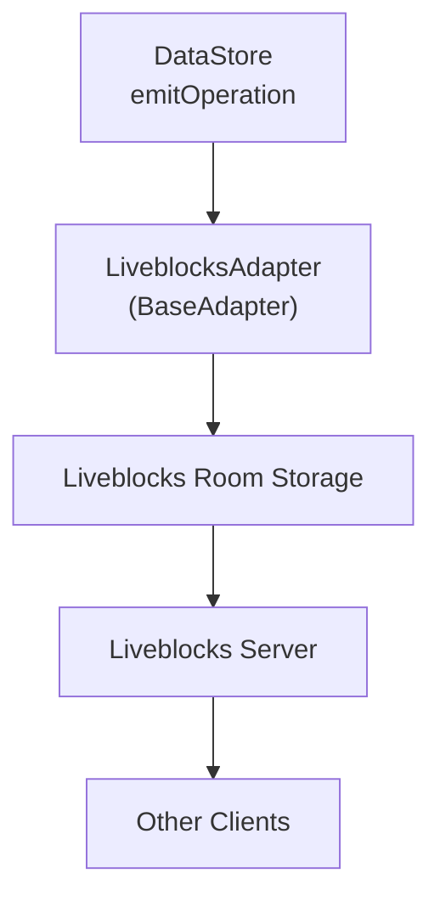

# @barocss/collaboration-liveblocks

`@barocss/collaboration-liveblocks` connects `DataStore` to Liveblocks rooms for managed realtime collaboration.

## Components

- `LiveblocksAdapter` (extends `BaseAdapter`)
- `@liveblocks/client` `Room` (entered via `client.enter(roomId)`)
- Liveblocks presence, storage, broadcast channels

## Quick Start

```ts
import { DataStore } from '@barocss/datastore';
import { LiveblocksAdapter } from '@barocss/collaboration-liveblocks';
import { createClient } from '@liveblocks/client';

const client = createClient({ publicApiKey: 'pk_live_...' });
const room = client.enter('room-id');

const adapter = new LiveblocksAdapter({
  room,
  config: {
    clientId: 'user-1',
    user: { id: 'user-1', name: 'User 1', color: '#ff0000' },
    debug: true,
  },
});

const dataStore = new DataStore();
await adapter.connect(dataStore);
```

## Adapter Options

- `room: Room` (required) – Liveblocks room instance
- `config?: AdapterConfig` (see base collaboration)

## Flow



## Presence & Events

- Presence: `room.updatePresence({ cursor, selection })`
- Room events: `room.subscribe('connection'|'error'|'others'|'storage'|'event', handler)`
- Broadcast: `room.broadcastEvent({ type, data })`

## Troubleshooting

- Connection: verify API key or `authEndpoint`; watch `connection` events.
- Storage not updating: subscribe to `storage` and inspect `storage.root`.
- Operations not syncing: ensure storage structure matches adapter expectations and room subscriptions are active.

## Best Practices

- Use auth (`authEndpoint`) in production.
- Handle reconnection on `connection`/`error` events.
- Leverage presence for cursors/highlighting.
- Always `disconnect`/`leave` on teardown.
# @barocss/collaboration-liveblocks

Liveblocks adapter for Barocss Editor collaboration.

## Purpose

Integrates Barocss Editor with Liveblocks for real-time collaborative editing.

## Key Exports

- `LiveblocksAdapter` - Liveblocks collaboration adapter

## Basic Usage

```typescript
import { Editor } from '@barocss/editor-core';
import { LiveblocksAdapter } from '@barocss/collaboration-liveblocks';
import { createClient } from '@liveblocks/client';

// Create Liveblocks client
const client = createClient({
  publicApiKey: 'your-api-key'
});

// Enter room
const room = client.enter('room-name');

// Create adapter
const adapter = new LiveblocksAdapter({
  dataStore: editor.dataStore,
  room: room
});
```

## Liveblocks Integration

The adapter:
- Converts Barocss operations to Liveblocks updates
- Converts Liveblocks updates to Barocss operations
- Handles Liveblocks room synchronization
- Manages presence and awareness

## Related

- [Collaboration](./collaboration) - Base collaboration system
- [Liveblocks Documentation](https://liveblocks.io/docs) - Liveblocks documentation
