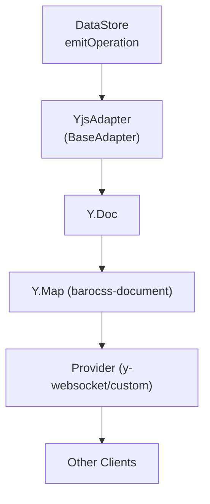

# @barocss/collaboration-yjs

`@barocss/collaboration-yjs` connects `DataStore` to Yjs (`Y.Doc` + provider) for CRDT-based realtime sync.

## Components

- `YjsAdapter` (extends `BaseAdapter`)
- `Y.Doc` and `Y.Map` (default: `ydoc.getMap('barocss-document')`)
- Provider: `y-websocket` or custom

## Quick Start

```ts
import { DataStore } from '@barocss/datastore';
import { YjsAdapter } from '@barocss/collaboration-yjs';
import * as Y from 'yjs';
import { WebsocketProvider } from 'y-websocket';

const ydoc = new Y.Doc();
const ymap = ydoc.getMap('barocss-document');
const provider = new WebsocketProvider('ws://localhost:1234', 'room-id', ydoc);

const adapter = new YjsAdapter({
  ydoc,
  ymap,
  config: {
    clientId: 'user-1',
    user: { id: 'user-1', name: 'User 1', color: '#ff0000' },
    debug: true,
  },
});

const dataStore = new DataStore();
await adapter.connect(dataStore);
```

## Adapter Options

- `ydoc: Y.Doc` (required)
- `ymap?: Y.Map<any>` (optional, default `ydoc.getMap('barocss-document')`)
- `config?: AdapterConfig` (see base collaboration)

## Flow



## Notes & Tips

- Use `provider.on('status')` / `provider.on('sync')` for connection state.
- Presence/awareness: use `y-protocols/awareness` with the same `Y.Doc`.
- Custom sync: you can skip `y-websocket` and wire your own transport; just supply `ydoc` and manage updates.

## Troubleshooting

- Not syncing: check provider connection and `ymap` name consistency.
- Circular updates: adapter guards apply; ensure remote updates are identified by Yjs origin.
- State load: verify `ymap` contains initial document; call `getDocumentState()` if needed.
# @barocss/collaboration-yjs

Yjs adapter for Barocss Editor collaboration.

## Purpose

Integrates Barocss Editor with Yjs CRDT library for real-time collaborative editing.

## Key Exports

- `YjsAdapter` - Yjs collaboration adapter

## Basic Usage

```typescript
import { Editor } from '@barocss/editor-core';
import { YjsAdapter } from '@barocss/collaboration-yjs';
import * as Y from 'yjs';

// Create Yjs document
const ydoc = new Y.Doc();

// Create adapter
const adapter = new YjsAdapter({
  dataStore: editor.dataStore,
  ydoc: ydoc
});

// Connect to Yjs provider (e.g., y-websocket)
const provider = new WebsocketProvider('ws://localhost:1234', 'room-name', ydoc);
```

## Yjs Integration

The adapter:
- Converts Barocss operations to Yjs updates
- Converts Yjs updates to Barocss operations
- Handles Yjs document synchronization
- Manages conflict resolution

## Related

- [Collaboration](./collaboration) - Base collaboration system
- [Yjs Documentation](https://docs.yjs.dev/) - Yjs library documentation
