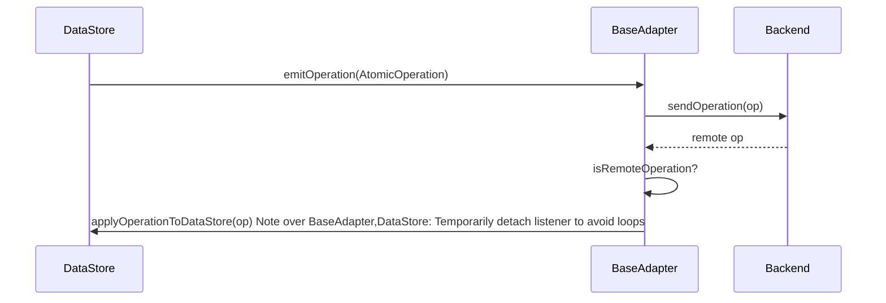

# @barocss/collaboration

Core interfaces and base adapter for connecting Barocss `DataStore` to CRDT/OT backends. All concrete adapters (Yjs, Liveblocks) extend this package.

## Role in Architecture

- Listens to `DataStore` `emitOperation` events and forwards atomic operations to the backend.
- Applies remote operations back to `DataStore` while preventing circular re-emission.
- Provides shared config (client/user metadata, debug, transformOperation) and lifecycle (`connect / disconnect`).

## Operation Flow



## Key Interfaces

- `CollaborationAdapter`
  - `connect(dataStore): Promise<void>`
  - `disconnect(): Promise<void>`
  - `isConnected(): boolean`
  - `sendOperation(op): Promise<void>`
  - `receiveOperation(op): Promise<void>`
  - `getDocumentState(): Promise<INode | null>`
  - `setDocumentState(root: INode): Promise<void>`

- `AdapterConfig`
  - `clientId?: string`
  - `user?: { id: string; name?: string; color?: string; avatar?: string }`
  - `debug?: boolean`
  - `transformOperation?: (op: AtomicOperation) => AtomicOperation`

## BaseAdapter Hooks (for implementers)

- `doConnect() / doDisconnect()`
- `doSendOperation(op)`
- `doReceiveOperation(op)`
- `doGetDocumentState() / doSetDocumentState(root)`
- Helpers: `applyOperationToDataStore(op)`, `isRemoteOperation(op)`, `handleLocalOperation(op)`

## Implementing a Custom Adapter (sketch)

```ts
class CustomAdapter extends BaseAdapter {
  constructor(private backend: YourBackend, config?: AdapterConfig) {
    super(config);
  }

  protected async doConnect() {
    await this.backend.connect();
    this.backend.on('remote-op', (op) => this.receiveOperation(op));
  }

  protected async doSendOperation(op) {
    await this.backend.send(op);
  }

  protected async doReceiveOperation(op) {
    await this.applyOperationToDataStore(op);
  }

  protected async doGetDocumentState() {
    return this.backend.loadAsINode();
  }

  protected async doSetDocumentState(root: INode) {
    await this.backend.saveFromINode(root);
  }
}
```

## When to Use

- Building a new collaborative backend.
- Extending existing adapters with extra metadata (`transformOperation`).
- Adding presence/awareness on top of a CRDT/OT layer.
# @barocss/collaboration

Core collaboration interfaces and base adapter for Barocss Editor. Provides the foundation for integrating with CRDT/OT libraries.

## Purpose

Enables real-time collaborative editing by:
- Providing base adapter interface
- Handling operation synchronization
- Managing conflict resolution
- Supporting multiple collaboration backends

## Key Exports

- `CollaborationAdapter` - Base adapter interface
- `BaseAdapter` - Common adapter logic
- `AdapterConfig` - Adapter configuration
- `OperationMetadata` - Operation metadata types

## Architecture

```
Editor → DataStore → BaseAdapter → Backend (Yjs/Liveblocks/etc.)
                ↑                        ↓
                └─── Remote Operations ───┘
```

## Base Adapter

The base adapter provides common functionality:

```typescript
import { BaseAdapter } from '@barocss/collaboration';

class MyAdapter extends BaseAdapter {
  async sendOperation(operation: AtomicOperation): Promise<void> {
    // Send to backend
  }
  
  async receiveOperation(operation: AtomicOperation): Promise<void> {
    // Receive from backend and apply
    await this.applyOperationToDataStore(operation);
  }
}
```

## Operation Flow

### Local Operations

1. User performs action
2. DataStore executes operation
3. BaseAdapter receives operation via listener
4. BaseAdapter sends to backend

### Remote Operations

1. Backend receives operation from other client
2. Backend syncs with other clients
3. BaseAdapter receives remote operation
4. BaseAdapter applies to DataStore (temporarily disables listener)
5. DataStore updates model
6. View re-renders

## Adapter Configuration

```typescript
import { BaseAdapter } from '@barocss/collaboration';

const adapter = new BaseAdapter({
  dataStore: dataStore,
  onOperation: (operation) => {
    // Handle operation
  },
  onError: (error) => {
    // Handle error
  }
});
```

## Integration with DataStore

Adapters listen to DataStore operations:

```typescript
// Adapter listens to DataStore
dataStore.on('operation', (operation) => {
  adapter.handleLocalOperation(operation);
});

// Adapter applies remote operations
adapter.applyOperationToDataStore(remoteOperation);
```

## Conflict Resolution

The base adapter handles conflicts:
- **Operation Ordering**: Ensures operations are applied in correct order
- **Temporary Listener Disable**: Prevents circular updates
- **Error Handling**: Handles operation failures gracefully

## Available Adapters

### Yjs Adapter

```typescript
import { YjsAdapter } from '@barocss/collaboration-yjs';

const adapter = new YjsAdapter({
  dataStore: dataStore,
  ydoc: yjsDoc
});
```

### Liveblocks Adapter

```typescript
import { LiveblocksAdapter } from '@barocss/collaboration-liveblocks';

const adapter = new LiveblocksAdapter({
  dataStore: dataStore,
  room: liveblocksRoom
});
```

## When to Use

- **Real-time Collaboration**: Enable multiple users to edit simultaneously
- **Sync Across Clients**: Keep documents in sync
- **Conflict Resolution**: Handle concurrent edits
- **Backend Integration**: Connect to collaboration backends

## Related

- [Collaboration Yjs](./collaboration-yjs) - Yjs integration
- [Collaboration Liveblocks](./collaboration-liveblocks) - Liveblocks integration
- [DataStore](./datastore) - Operation source and target
