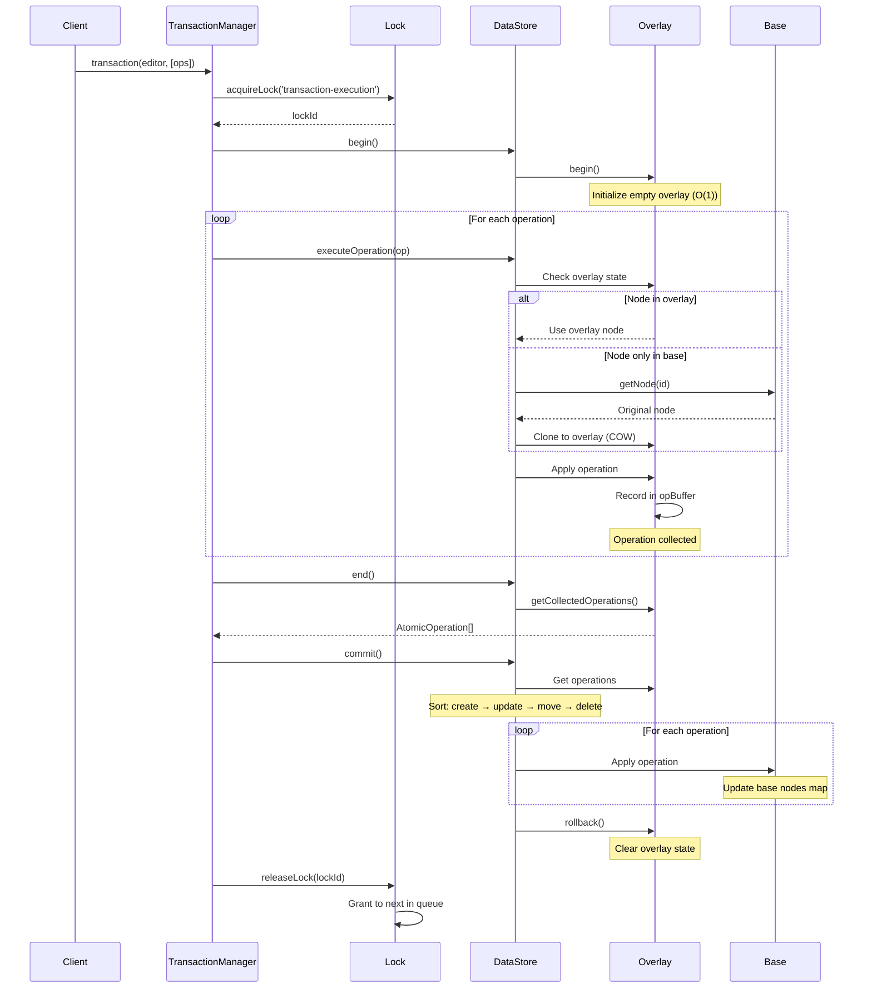

# @barocss/datastore

The DataStore package provides transactional, schema-aware node storage with a normalized data structure. It's the single source of truth for your document data.

## Purpose

Transactional node storage with schema awareness and efficient data management. All document changes go through the DataStore.

## Key Exports

- `DataStore` - Main storage class
- `RangeOperations` - Text range operations
- `DecoratorOperations` - Decorator management

## Basic Usage

```typescript
import { DataStore } from '@barocss/datastore';

// Create DataStore with schema
const dataStore = new DataStore(undefined, schema);

// Create a node
dataStore.createNode({ 
  sid: 'p1', 
  stype: 'paragraph', 
  content: [] 
});

// Update a node
dataStore.updateNode('p1', {
  text: 'Updated text'
});

// Get a node
const node = dataStore.getNode('p1');
```

## Core Features

### Transactional Overlay (Copy-on-Write)

DataStore uses a Copy-on-Write (COW) overlay mechanism for efficient transactions:

```typescript
// Begin transaction (creates empty overlay)
dataStore.begin();

// Make changes (only modified nodes are copied)
dataStore.createNode({ sid: 'p1', stype: 'paragraph', content: [] });
dataStore.updateNode('p1', { text: 'Hello' });

// End transaction (returns collected operations)
const operations = dataStore.end();

// Commit (applies changes to base in order: create → update → move → delete)
dataStore.commit();

// Or rollback (discards overlay without applying)
dataStore.rollback();
```

**How it works:**
1. **begin()**: Creates empty overlay (O(1) - no copying)
2. **Read**: Checks overlay → base (only modified nodes in overlay)
3. **Write**: Clones from base to overlay only when needed (COW)
4. **end()**: Returns collected operations
5. **commit()**: Applies operations to base in deterministic order
6. **rollback()**: Discards overlay

**Benefits:**
- O(1) transaction start (no copying on begin)
- Memory efficient (only modified nodes duplicated)
- Atomic operations (all or nothing)
- Operation history (for collaboration)

### Schema Validation

All operations are validated against the schema:

```typescript
// ✅ Valid - 'paragraph' is in schema
dataStore.createNode({ sid: 'p1', stype: 'paragraph', content: [] });

// ❌ Invalid - 'invalid-node' is not in schema
dataStore.createNode({ sid: 'n1', stype: 'invalid-node', content: [] });
// Throws validation error
```

### Normalized Storage

Data is stored in a normalized structure for efficiency:

```typescript
// Nodes are stored by ID, not nested
// This makes updates and lookups fast
const node = dataStore.getNode('p1');  // O(1) lookup
```

### Lock System

Global write lock prevents concurrent write conflicts:

```typescript
// Acquire lock
const lockId = await dataStore.acquireLock('transaction-execution');

try {
  // Perform operations
  dataStore.begin();
  // ... operations ...
  dataStore.commit();
} finally {
  // Always release lock
  dataStore.releaseLock(lockId);
}
```

**Lock features:**
- FIFO queue for waiting transactions
- Timeout support (prevents deadlocks)
- Lock statistics tracking
- Automatic timeout handling

### Operation Execution Flow with Lock and Overlay

Operations are executed within a transaction that uses both lock and overlay:



**Key Points:**

1. **Lock Acquisition (Before Overlay)**
   - Lock is acquired before any operations
   - Prevents concurrent write conflicts
   - FIFO queue for waiting transactions

2. **Overlay Begin (O(1))**
   - Creates empty overlay without copying base nodes
   - All subsequent operations write to overlay

3. **Operation Execution**
   - **Read Path**: `deletedNodeIds` → `overlayNodes` → `baseNodes`
   - **Write Path**: Clone from base to overlay if needed (COW), then apply changes
   - Operations are recorded in overlay's `opBuffer`

4. **Overlay End**
   - Returns collected operations
   - Overlay remains active (not committed yet)

5. **Overlay Commit**
   - Operations applied to base in deterministic order: `create` → `update` → `move` → `delete`
   - For `update`: Fields are merged (attributes shallow-merge)
   - Overlay is cleared after commit

6. **Lock Release**
   - Lock is released after commit (in finally block)
   - Next transaction in queue is granted lock

**Example: Multiple Operations in One Transaction**

```typescript
// 1. Lock acquisition (TransactionManager)
const lockId = await dataStore.acquireLock('transaction-execution');

try {
  // 2. Overlay begin (O(1) - no copying)
  dataStore.begin();
  
  // 3. Operations execute (write to overlay)
  dataStore.createNode({ sid: 'p1', stype: 'paragraph', content: [] });
  // → Overlay: Clone not needed (new node)
  // → Overlay: Record 'create' operation
  
  dataStore.updateNode('text-1', { text: 'Updated' });
  // → Overlay: Check if 'text-1' in overlay (no)
  // → Overlay: Clone 'text-1' from base to overlay (COW)
  // → Overlay: Apply changes to cloned node
  // → Overlay: Record 'update' operation
  
  dataStore.content.moveNode('p1', 'document', 0);
  // → Overlay: Record 'move' operation
  
  // 4. Overlay end (returns operations)
  const operations = dataStore.end();
  // Returns: [
  //   { type: 'create', nodeId: 'p1', ... },
  //   { type: 'update', nodeId: 'text-1', ... },
  //   { type: 'move', nodeId: 'p1', ... }
  // ]
  
  // 5. Overlay commit (applies to base)
  dataStore.commit();
  // → Sort operations: create → update → move
  // → Apply to base nodes map
  // → Clear overlay
  
} finally {
  // 6. Lock release
  dataStore.releaseLock(lockId);
}
```

**Benefits of This Flow:**

- **Atomicity**: All operations succeed or fail together
- **Isolation**: Lock prevents concurrent conflicts
- **Efficiency**: Only modified nodes are duplicated (COW)
- **Operation History**: All operations collected for collaboration
- **Rollback Support**: Overlay can be discarded without affecting base

### SID System

Stable ID (SID) system for node identification:

```typescript
// SID format: sessionId:globalCounter
// Example: '0:1', '1:5'

// SID ensures:
// - Same node = same SID across sessions
// - O(1) node lookup
// - Consistent references for collaboration
```

**SID benefits:**
- Consistent node references
- O(1) lookup performance
- Collaboration support (same node = same SID)
- Stable across sessions

### Operation Events

DataStore emits operations for collaboration:

```typescript
// Listen to operations
dataStore.onOperation((operation) => {
  // operation: AtomicOperation
  // Send to collaboration backend
  collaborationAdapter.sendOperation(operation);
});

// Operations are emitted after commit
// Format: { type: 'create' | 'update' | 'delete' | 'move', ... }
```

## Common Operations

### Node Operations

All operations respect the overlay system when a transaction is active:

```typescript
// Without transaction (direct to base)
dataStore.createNode({ sid: 'p1', stype: 'paragraph', content: [] });
dataStore.updateNode('p1', { text: 'New text' });

// With transaction (write to overlay)
dataStore.begin();
dataStore.createNode({ sid: 'p1', stype: 'paragraph', content: [] });
dataStore.updateNode('p1', { text: 'New text' });
dataStore.commit(); // Applies to base
```

**Operation Behavior:**

- **createNode**: Creates new node in overlay (or base if no transaction)
- **updateNode**: Clones from base to overlay if needed (COW), then applies changes
- **deleteNode**: Marks node as deleted in overlay
- **getNode**: Reads from overlay → base (overlay takes precedence)

### Operation Execution Details

**Read Operations (getNode):**
```typescript
// Read path: deletedNodeIds → overlayNodes → baseNodes
const node = dataStore.getNode('text-1');

// 1. Check if deleted in overlay
if (overlay.hasDeleted('text-1')) {
  return undefined;
}

// 2. Check if in overlay
if (overlay.hasOverlayNode('text-1')) {
  return overlay.getOverlayNode('text-1'); // Overlay version
}

// 3. Fallback to base
return baseNodes.get('text-1'); // Base version
```

**Write Operations (updateNode):**
```typescript
// Write path: Clone if needed (COW), then apply
dataStore.updateNode('text-1', { text: 'Updated' });

// 1. Check if overlay is active
if (overlay.isActive()) {
  // 2. Check if node in overlay
  if (!overlay.hasOverlayNode('text-1')) {
    // 3. Clone from base to overlay (COW)
    const baseNode = baseNodes.get('text-1');
    overlay.upsertNode(baseNode, 'update');
  }
  
  // 4. Apply changes to overlay node
  const overlayNode = overlay.getOverlayNode('text-1');
  overlayNode.text = 'Updated';
  overlay.upsertNode(overlayNode, 'update');
  
  // 5. Record operation
  overlay.recordOperation({
    type: 'update',
    nodeId: 'text-1',
    data: { text: 'Updated' }
  });
} else {
  // Direct to base (no transaction)
  baseNodes.set('text-1', { ...baseNode, text: 'Updated' });
}
```

### Text Range Operations

```typescript
import { RangeOperations } from '@barocss/datastore';

// Insert text at position
RangeOperations.insertText(dataStore, 'text-1', 5, 'Hello');

// Delete text range
RangeOperations.deleteText(dataStore, 'text-1', 0, 5);
```

**Operation Behavior with Overlay:**

All operations automatically use overlay when a transaction is active:

```typescript
dataStore.begin(); // Transaction starts

// These operations write to overlay (not base)
RangeOperations.insertText(dataStore, 'text-1', 5, 'Hello');
// → Reads 'text-1' from overlay/base
// → Clones to overlay if needed (COW)
// → Applies text insertion
// → Records operation in overlay

RangeOperations.deleteText(dataStore, 'text-1', 0, 5);
// → Reads 'text-1' from overlay (has updated text)
// → Applies text deletion
// → Records operation in overlay

dataStore.commit(); // All changes applied to base atomically
```

### Complete Transaction Example

Here's a complete example showing how operations, lock, and overlay work together:

```typescript
import { DataStore } from '@barocss/datastore';
import { RangeOperations } from '@barocss/datastore';

const dataStore = new DataStore();

// Step 1: Acquire lock (prevents concurrent writes)
const lockId = await dataStore.acquireLock('my-transaction');

try {
  // Step 2: Begin transaction (creates empty overlay - O(1))
  dataStore.begin();
  
  // Step 3: Execute operations (all write to overlay)
  
  // Create node (new node, no cloning needed)
  dataStore.createNode({
    sid: 'p1',
    stype: 'paragraph',
    content: ['text-1']
  });
  // → Overlay: Record 'create' operation
  // → Base: Not updated yet
  
  // Create text node
  dataStore.createNode({
    sid: 'text-1',
    stype: 'inline-text',
    text: 'Hello',
    parentId: 'p1'
  });
  // → Overlay: Record 'create' operation
  
  // Update node (COW: clone from base to overlay if needed)
  dataStore.updateNode('text-1', { text: 'Hello World' });
  // → Overlay: Check if 'text-1' in overlay (yes, from create)
  // → Overlay: Update overlay node
  // → Overlay: Record 'update' operation
  
  // Range operation (reads from overlay, writes to overlay)
  RangeOperations.insertText(dataStore, 'text-1', 11, '!');
  // → Overlay: Read 'text-1' from overlay (has 'Hello World')
  // → Overlay: Apply text insertion → 'Hello World!'
  // → Overlay: Record 'update' operation
  
  // Step 4: End transaction (returns collected operations)
  const operations = dataStore.end();
  // Returns: [
  //   { type: 'create', nodeId: 'p1', ... },
  //   { type: 'create', nodeId: 'text-1', ... },
  //   { type: 'update', nodeId: 'text-1', data: { text: 'Hello World' }, ... },
  //   { type: 'update', nodeId: 'text-1', data: { text: 'Hello World!' }, ... }
  // ]
  
  // Step 5: Commit (applies to base in order)
  dataStore.commit();
  // → Sort operations: create → update
  // → Apply to base:
  //   1. Create 'p1' in base nodes map
  //   2. Create 'text-1' in base nodes map
  //   3. Update 'text-1' with merged changes (final: 'Hello World!')
  // → Clear overlay
  
} catch (error) {
  // Step 6: Rollback on error (discards overlay)
  dataStore.rollback();
  // → Overlay: Clear all state
  // → Base: Unchanged
} finally {
  // Step 7: Release lock (always, even on error)
  dataStore.releaseLock(lockId);
  // → Lock: Grant to next transaction in queue
}
```

**Key Takeaways:**

1. **Lock First**: Always acquire lock before beginning transaction
2. **Overlay for All Operations**: All operations during transaction write to overlay
3. **COW Efficiency**: Only modified nodes are cloned (not entire document)
4. **Atomic Commit**: All operations applied together in deterministic order
5. **Operation History**: All operations collected for collaboration/sync
6. **Rollback Safety**: Overlay can be discarded without affecting base

## When to Use

- **Document Storage**: All document data is stored in DataStore
- **Model Operations**: All model changes go through DataStore
- **Transaction Management**: Use transactions for atomic operations

## Integration

DataStore is used by:

- **Editor**: All commands operate on DataStore
- **Model Package**: Transaction DSL uses DataStore
- **Renderer**: Reads from DataStore for rendering

## Operation Types and Overlay Behavior

### Core Operations

**Node Operations:**
- `createNode`: Creates new node in overlay (no cloning needed)
- `updateNode`: Clones from base to overlay if needed (COW), then applies changes
- `deleteNode`: Marks node as deleted in overlay
- `getNode`: Reads from overlay → base (overlay takes precedence)

**Content Operations:**
- `content.addChild`: Updates parent's content array in overlay
- `content.removeChild`: Updates parent's content array in overlay
- `content.moveNode`: Records move operation in overlay

**Range Operations:**
- `RangeOperations.insertText`: Reads node from overlay/base, applies text insertion
- `RangeOperations.deleteText`: Reads node from overlay/base, applies text deletion
- `RangeOperations.replaceText`: Reads node from overlay/base, applies text replacement

### Overlay Read/Write Path

**Read Path (getNode):**
```
1. Check deletedNodeIds → return undefined if deleted
2. Check overlayNodes → return overlay version if exists
3. Fallback to baseNodes → return base version
```

**Write Path (updateNode/createNode):**
```
1. Check if overlay is active
2. If active:
   - Check if node in overlayNodes
   - If not, clone from baseNodes to overlayNodes (COW)
   - Apply changes to overlay node
   - Record operation in opBuffer
3. If not active:
   - Write directly to baseNodes
```

### Commit Order

Operations are committed in deterministic order:

1. **create** - Create all new nodes first
2. **update** - Update existing nodes (fields merged)
3. **move** - Move nodes between parents
4. **delete** - Delete nodes last

This order ensures:
- Nodes exist before being referenced
- Updates don't conflict with moves
- Deletes don't affect other operations

## Related

- [Core Concepts: Schema & Model](../concepts/schema-and-model) - Understanding the model
- [Model Package](./model) - High-level operations on DataStore
- [Editor Core Package](./editor-core) - How editor uses DataStore

For complete API reference, see the [DataStore package README](https://github.com/barocss/barocss-editor/tree/main/packages/datastore) in the repository.
