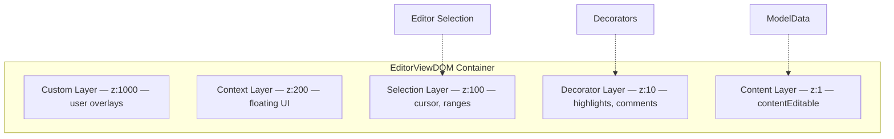
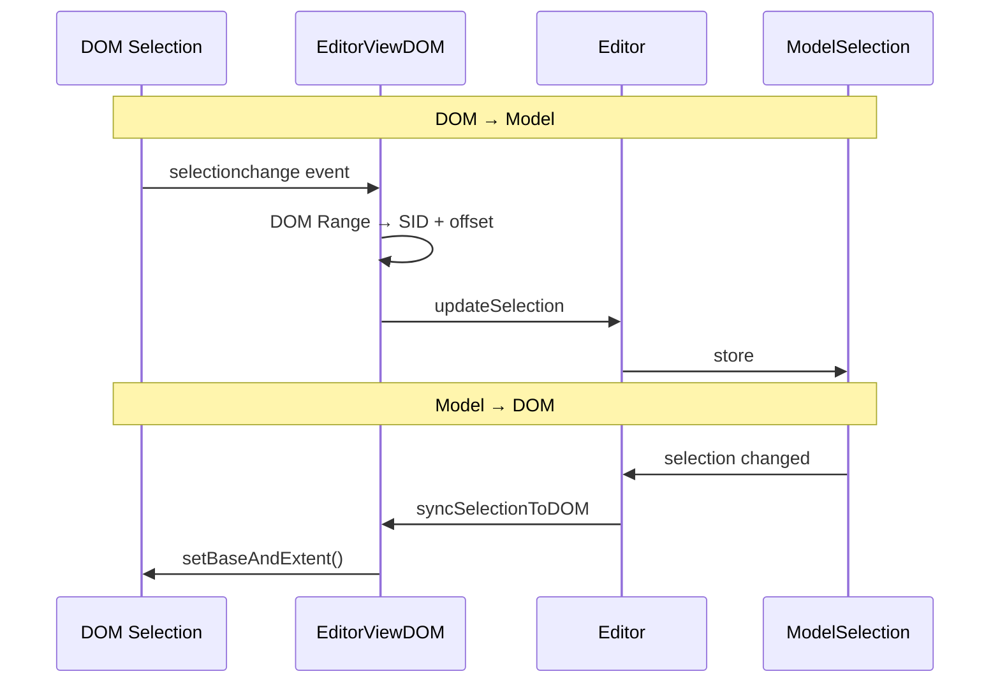
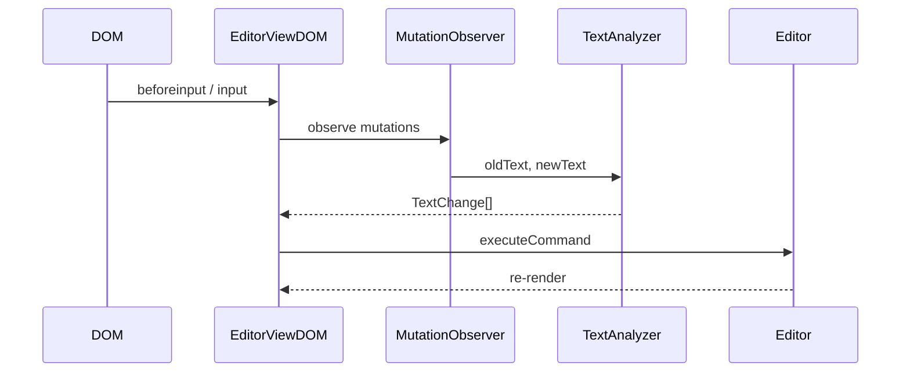

# @barocss/editor-view-dom

The Editor-View-DOM package provides the view layer that connects the Editor to the DOM. It handles user input, selection synchronization, and triggers rendering.

## Purpose

View layer connecting Editor and DOM. Bridges user interactions (typing, clicking, keyboard shortcuts) with editor commands.

## Key Exports

- `EditorViewDOM` - Main view class
- Selection synchronization utilities
- Input handling utilities
- Keybinding dispatch

## Basic Usage

```typescript
import { EditorViewDOM } from '@barocss/editor-view-dom';

const container = document.getElementById('editor');
const view = new EditorViewDOM(editor, container);
view.mount();
```

## Core Features

### Multi-Layer Architecture

EditorViewDOM renders into 5 independent layers, each with its own DOMRenderer:



### Selection Synchronization

Bidirectional synchronization between DOM selection and editor selection:



### Input Handling



Processes user input and converts it to editor commands:

### Keybinding Dispatch

Dispatches keyboard shortcuts to editor commands:

```typescript
// User presses Ctrl+B
// → View captures keyboard event
// → Dispatches to editor
// → Editor executes 'bold' command
// → Model updated
// → View re-renders
```

### Rendering Integration

Triggers rendering when model changes:

```typescript
// Model changes
// → View detects change
// → Calls renderer.build()
// → Calls renderer.render()
// → DOM updated
```

## View Lifecycle

```typescript
// 1. Create view
const view = new EditorViewDOM(editor, container);

// 2. Mount (attaches event listeners, initial render)
view.mount();

// 3. User interacts with editor
// → View handles input
// → Updates editor
// → Triggers rendering

// 4. Unmount (cleanup)
view.unmount();
```

## Decorator Management

The view manages decorators:

```typescript
// Add decorator
view.addDecorator({
  sid: 'highlight-1',
  stype: 'highlight',
  target: { nodeId: 'p1', range: [0, 5] }
});

// Remove decorator
view.removeDecorator('highlight-1');
```

## When to Use

- **Editor Integration**: Required to connect editor to DOM
- **User Input**: Handles all user interactions
- **Selection Management**: Manages selection synchronization

## Integration

Editor-View-DOM connects:

- **Editor**: Executes commands on editor
- **Renderer-DOM**: Triggers rendering
- **DOM**: Listens to DOM events and updates DOM

## Related

- [Getting Started: Basic Usage](../basic-usage) - How to use EditorViewDOM
- [Editor-Core](./editor-core) - The editor it connects to
- [Editor Core Package](./editor-core) - How editor orchestrates operations
- [Renderer-DOM Package](./renderer-dom) - DOM rendering layer
