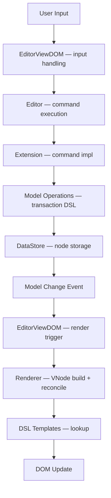
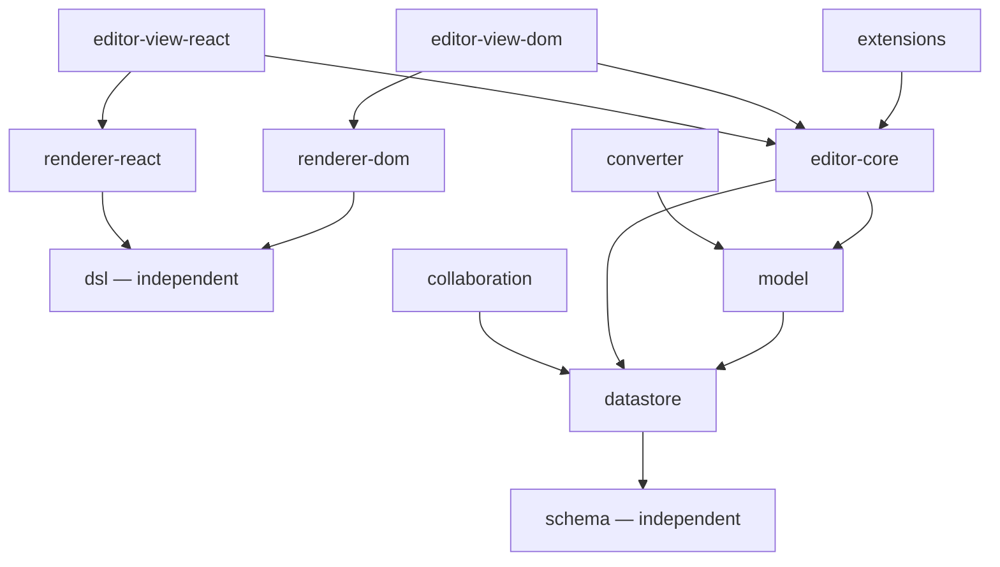

# Package Overview

This document provides an overview of all Barocss Editor packages. For detailed information about each package, see the individual package documentation in the [Packages](./packages) section.

## Package Overview

Barocss Editor is organized into focused packages, each with a specific responsibility:

### Core Packages

#### `@barocss/schema`
**Purpose**: Define document structure and validation rules

**Key Exports**:
- `createSchema()` - Create a schema definition
- `Schema` - Schema class for validation

**How to Use**:
```typescript
import { createSchema } from '@barocss/schema';

const schema = createSchema('my-doc', {
  topNode: 'document',
  nodes: {
    document: { name: 'document', group: 'document', content: 'block+' },
    paragraph: { name: 'paragraph', group: 'block', content: 'inline*' },
    'inline-text': { name: 'inline-text', group: 'inline' }
  },
  marks: {
    bold: { name: 'bold', group: 'text-style' }
  }
});
```

#### `@barocss/datastore`
**Purpose**: Transactional node storage with schema awareness

**Key Exports**:
- `DataStore` - Main storage class
- `RangeOperations` - Text range operations
- `DecoratorOperations` - Decorator management

**How to Use**:
```typescript
import { DataStore } from '@barocss/datastore';

const dataStore = new DataStore(undefined, schema);
dataStore.createNode({ sid: 'p1', stype: 'paragraph', content: [] });
```

#### `@barocss/model`
**Purpose**: High-level model operations and transaction DSL

**Key Exports**:
- `transaction()` - Transaction DSL
- `defineOperation()` - Define custom operations
- `defineOperationDSL()` - Define operations with DSL helpers

**How to Use**:
```typescript
import { transaction, control, insertText } from '@barocss/model';

await transaction(editor, control('text-1', [
  insertText({ text: 'Hello' })
])).commit();
```

### Rendering Packages

#### `@barocss/dsl`
**Purpose**: Template definition layer

**Key Exports**:
- `define()` - Register templates
- `element()` - Create element templates
- `data()` - Data binding
- `when()` - Conditional rendering
- `component()` - Component templates
- `slot()` - Slot templates
- `portal()` - Portal templates

**How to Use**:
```typescript
import { define, element, data, slot } from '@barocss/dsl';

define('paragraph', element('p', { className: 'paragraph' }, [slot('content')]));
define('inline-text', element('span', { className: 'text' }, [data('text', '')]));
```

#### `@barocss/renderer-dom`
**Purpose**: DOM rendering from model using templates

**Key Exports**:
- `DOMRenderer` - Main renderer class
- `VNodeBuilder` - VNode generation
- Component and decorator management

**How to Use**:
```typescript
import { DOMRenderer } from '@barocss/renderer-dom';
import { getGlobalRegistry } from '@barocss/dsl';

const renderer = new DOMRenderer(getGlobalRegistry());
const vnode = renderer.build(model, decorators);
renderer.render(container, vnode);
```

### Editor Packages

#### `@barocss/editor-core`
**Purpose**: Core editor logic (selection, keybinding, context)

**Key Exports**:
- `Editor` - Main editor class
- `SelectionManager` - Selection management
- `KeyBindingManager` - Keyboard shortcut handling

**How to Use**:
```typescript
import { Editor } from '@barocss/editor-core';

const editor = new Editor({
  schema,
  dataStore,
  extensions: []
});
```

#### `@barocss/extensions`
**Purpose**: Built-in extensions and extension system

**Key Exports**:
- `Extension` - Extension interface
- `createCoreExtensions()` - Core editing extensions
- `createBasicExtensions()` - Basic formatting extensions

**How to Use**:
```typescript
import { createCoreExtensions, createBasicExtensions } from '@barocss/extensions';

const editor = new Editor({
  extensions: [...createCoreExtensions(), ...createBasicExtensions()]
});
```

#### `@barocss/editor-view-dom`
**Purpose**: DOM integration layer

**Key Exports**:
- `EditorViewDOM` - Main view class
- Selection synchronization
- Input handling

**How to Use**:
```typescript
import { EditorViewDOM } from '@barocss/editor-view-dom';

const view = new EditorViewDOM(editor, { container });
view.render();
```

## How Packages Connect

### Data Flow



### Package Dependencies



## Package Responsibilities Summary

| Package | Primary Role | Extension Points |
|---------|-------------|------------------|
| `schema` | Document structure definition | Add new node/mark types |
| `datastore` | Transactional node storage | Use in operations |
| `model` | Operations & transactions | Define custom operations |
| `dsl` | Template definition | Register templates |
| `renderer-dom` | VNode → DOM rendering | Custom rendering logic |
| `renderer-react` | Direct → ReactNode rendering | React components |
| `editor-core` | Editor orchestration | Register commands |
| `extensions` | 30+ built-in features | Create custom extensions |
| `editor-view-dom` | DOM view layer | Custom input handling |
| `editor-view-react` | React view layer | React hooks integration |
| `collaboration` | CRDT/OT base adapter | Custom backends |
| `converter` | Format conversion | Custom format rules |

## Individual Package Documentation

For detailed information about each package, see:

- [Schema](./schema) - Document structure definition
- [DataStore](./datastore) - Node storage and transactions
- [Model](./model) - Model operations and transaction DSL
- [DSL](./dsl) - Template definition layer
- [Renderer-DOM](./renderer-dom) - DOM rendering
- [Renderer-React](./renderer-react) - React rendering
- [Editor-Core](./editor-core) - Core editor logic
- [Editor-View-DOM](./editor-view-dom) - DOM integration
- [Editor-View-React](./editor-view-react) - React integration
- [Extensions](./extensions) - Built-in extensions
- [Collaboration](./collaboration) - Collaboration adapters
- [Converter](./converter) - Format conversion
- [Text-Analyzer](./text-analyzer) - Text diff algorithm

## Next Steps

- [Architecture Overview](./overview) - Understand the complete architecture
- [Core Concepts: Rendering](../concepts/rendering) - Understand the rendering pipeline
- [Extension Design Guide](../guides/extension-design) - Learn how to extend the editor
