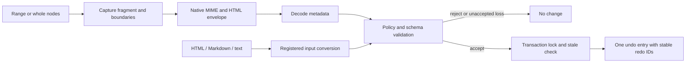

:::note Scope
This page describes schema-backed body clipboard commands. See the [current package guides](/packages) for installation and onboarding. DND, table-cell ranges, and canvas clipboard operations have separate contracts.
:::

# Clipboard (Copy / Cut / Paste)

The schema-backed clipboard command uses a document fragment, an editing plan, and one transaction. The product owns the policy. See the [schema editing guide](https://github.com/barocss/barocss-editor/blob/main/docs/schema-editing-guide.md) for custom schemas and the [clipboard contract](https://github.com/barocss/barocss-editor/blob/main/packages/extensions/docs/copy-paste-cut-spec.md) for supported inputs and limitations.

## Flow



DOM and React views pass the visible selection and native clipboard data to the command. Native copy writes synchronously. The asynchronous Clipboard API carries the same fragment in an HTML attribute when custom MIME is unavailable.

## Commands

```ts
await editor.executeCommand('copy');
await editor.executeCommand('copyBlocks', { nodeIds: ['block-id'] });
await editor.executeCommand('cut');
await editor.executeCommand('paste');
await editor.executeCommand('paste', { clipboardHtml: html, clipboardText: text });
await editor.executeCommand('paste', { nodes: nestedStandardNodes });
```

Copy does not add history. Cut deletes only after the clipboard write succeeds. Paste records one undo entry. Read-only editors allow copy and reject cut and paste.

`copy` preserves a text range and its open boundaries. `copyBlocks` preserves closed sibling nodes. Copying `BC` from `ABCD` and pasting at `x|y` can produce `xBC|y`. Copying the whole block produces three blocks: `x`, `ABCD`, and `y`. The policy and final schema validation decide whether the result is allowed.

## Input and compatibility

1. Native `application/x-wonffice-fragment+json` takes priority.
2. An internal `data-wonffice-fragment` HTML envelope preserves the same metadata.
3. Metadata-free HTML and Markdown use the converter and a registered source adapter. Plain text uses the destination text type.

Malformed internal metadata is rejected. It does not silently fall back to visible HTML. External parsers do not preserve every foreign style or application object. Text-only transport loses structure, marks, references, and whole-block boundaries.

The existing `nodes: INode[]` command accepts nested standard clipboard nodes. It does not prove arbitrary schema compatibility or whole-block selection. The low-level model `paste(nodes, range)` operation remains a separate legacy API.

## Product policy

Configure `FragmentEditor` before the first clipboard command. The command reuses that policy owner. Products can declare a portable `schemaId` and `schemaRevision`, register adapters, select boundary rules, and declare references. Equal type names alone do not establish compatibility.

The standard extension installs `standardClipboardPolicy` when no custom policy exists. Custom policies can explicitly compose it to support the standard converter vocabulary. Its `rangeReplacement: 'preserve-boundaries'` option supports inline replacement across different container paths while preserving schema-required roles. Isolated boundaries remain protected. A `code: true` ancestor imports literal text and reports the known conversion losses.

Inspect `editor:clipboard.plan` for rejection reasons, losses, and rule traces. Known losses normally require a new request with `acceptLosses: true`; code regions explicitly accept their literal conversion. A changed document, selection, schema, or policy invalidates an asynchronous request. Application checks again under the transaction lock.

DND, table-cell ranges, and canvas paste have separate integration work. This body clipboard flow does not complete those paths.

## Related concepts

- [Transactions](./transactions)
- [Converter architecture](../architecture/converter)
- [Extension design](../guides/extension-design)
