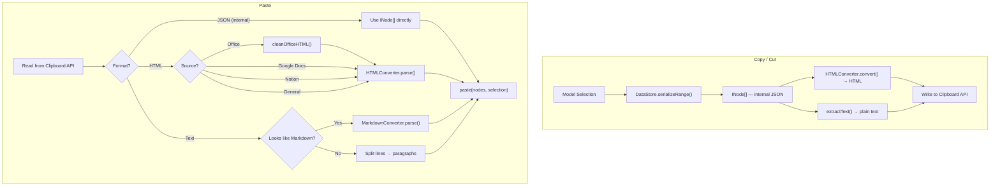

# Clipboard (Copy / Cut / Paste)

The clipboard system handles copying, cutting, and pasting content between the editor and external applications. It integrates with the converter package to support rich formats like HTML, Markdown, and content from Office, Google Docs, and Notion.

## Clipboard Pipeline



## Commands

The `CopyPasteExtension` registers three commands:

### copy

Copies the selected range without removing it.

```typescript
await editor.executeCommand('copy');
```

1. Runs model-level `copy` operation (for history)
2. Serializes the selection range to `INode[]`
3. Extracts plain text via `extractText()`
4. Converts to HTML via `HTMLConverter.convert()`
5. Writes JSON, text, and HTML to the Clipboard API

### cut

Copies the selection, then deletes it.

```typescript
await editor.executeCommand('cut');
```

Same as `copy` for the clipboard write step, then executes a model-level `cut` operation that removes the selected content.

### paste

Inserts content from the clipboard at the current selection.

```typescript
await editor.executeCommand('paste', { nodes: myNodes });
// or let it read from Clipboard API automatically:
await editor.executeCommand('paste');
```

The paste pipeline has a priority-based format resolution:

1. **Internal JSON** (`INode[]`) — highest fidelity, used when pasting within the same editor
2. **HTML** — parsed with source detection (Office, Google Docs, Notion, or standard HTML)
3. **Plain text** — checked for Markdown heuristics; if it looks like Markdown, parsed as GFM; otherwise split into paragraph nodes

## Source Detection

When pasting HTML, the extension auto-detects the source to apply the correct parsing rules:

| Source | Detection signals |
|--------|-------------------|
| **Microsoft Office** | `MsoNormal`, `mso-*`, `<o:p>`, `xmlns:o=...` |
| **Google Docs** | `docs-internal`, `data-docs-*`, `id="docs-internal-guid-..."` |
| **Notion** | `data-block-id`, `class="notion-"` |
| **General HTML** | Default fallback |

Office HTML is pre-cleaned via `cleanOfficeHTML()` before parsing.

## Markdown Detection

For plain text, the extension uses a heuristic scoring system to determine if the content looks like Markdown:

```typescript
// Scored patterns (first 20 lines):
// +2: headings (# Title), code fences (```)
// +1: bullet lists (- item), ordered lists (1. item), images, links
// +2: task lists (- [x] item)
// If score >= 3, treat as Markdown
```

## Integration with EditorViewDOM

`EditorViewDOM` automatically handles DOM `paste` events by:

1. Intercepting the `paste` event
2. Reading `clipboardData` (HTML, text, files)
3. Calling `editor.executeCommand('paste', { ... })`

Similarly, `copy` and `cut` events are handled automatically when the user uses keyboard shortcuts (Ctrl+C, Ctrl+X) via the keybinding system.

## Extending Clipboard Behavior

The `CopyPasteExtension` provides protected methods that can be overridden:

```typescript
class CustomCopyPaste extends CopyPasteExtension {
  protected async _writeClipboard(data: ClipboardLike): Promise<void> {
    // Custom write logic (e.g., write to custom clipboard format)
  }

  protected async _readClipboard(): Promise<ClipboardLike> {
    // Custom read logic (e.g., read from custom clipboard format)
  }
}
```

## Next Steps

- Learn about [Transactions](./transactions) — How clipboard operations are atomic
- See [Architecture: Converter](../architecture/converter) — HTML/Markdown conversion details
- See [Extension Design](../guides/extension-design) — Building custom extensions
