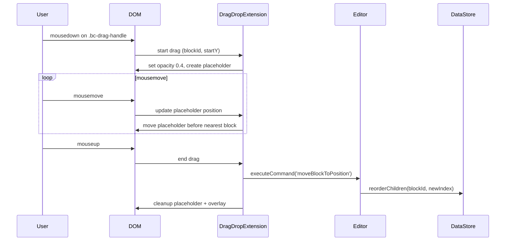
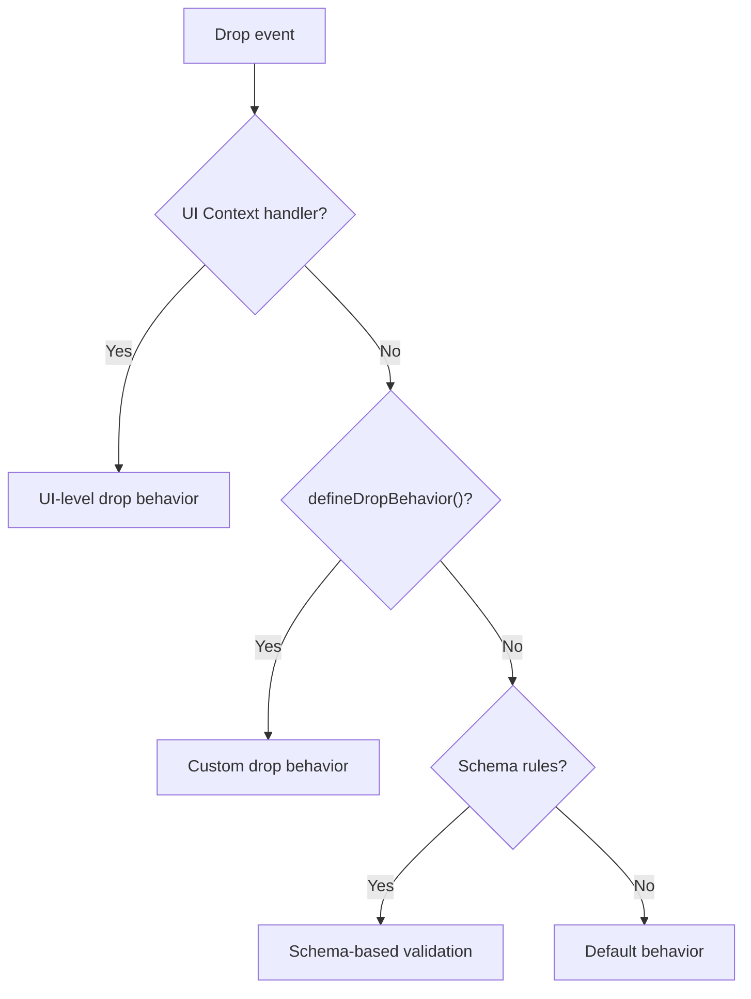

# Drag and Drop

Drag and drop allows users to reorder blocks by dragging them with a handle. The `DragDropExtension` provides a mouse-based drag system that integrates with the model's `reorderChildren` operation.

## How It Works



## Setup

```typescript
import { DragDropExtension } from '@barocss/extensions';

const editor = new Editor({
  extensions: [
    new DragDropExtension({
      enabled: true,
      handleSelector: '[data-bc-stype]'  // which elements are draggable
    })
  ]
});
```

## Drag Handle

Blocks must have a `.bc-drag-handle` element that serves as the grab target. Only clicks on this handle initiate a drag — clicking the block content itself does not.

```html
<!-- Rendered block structure -->
<div data-bc-sid="p1" data-bc-stype="paragraph">
  <div class="bc-drag-handle">⠿</div>
  <p>Paragraph content</p>
</div>
```

## Visual Feedback

During drag, the extension provides visual cues:

| Element | Effect |
|---------|--------|
| **Dragged block** | Opacity reduced to 0.4 |
| **Placeholder** | 2px blue line (`#3b82f6`) shown at the drop position |

The placeholder moves in real-time as the mouse moves over different block boundaries (top half = insert before, bottom half = insert after).

## The moveBlockToPosition Command

The extension registers a `moveBlockToPosition` command:

```typescript
await editor.executeCommand('moveBlockToPosition', {
  blockId: 'p1',
  targetIndex: 3
});
```

Internally, this creates a transaction with a `reorderChildren` operation, which atomically moves the node to the new index within its parent's `content` array.

## Drop Behavior System

For more advanced drop scenarios, the DataStore provides a `DropBehaviorRegistry` with a priority-based resolution:



Priority order (highest to lowest):
1. **UI Context** — registered by view-level plugins for special drop targets
2. **defineDropBehavior** — custom rules via `dataStore.defineDropBehavior()`
3. **Schema rules** — content expressions determine valid parent-child relationships
4. **Defaults** — built-in fallback behavior

## Node Capability Checks

The DataStore provides capability checks for drag/drop:

```typescript
// Can this node be dragged?
dataStore.isDraggableNode(nodeId);

// Can content be dropped here?
dataStore.isDroppableNode(targetId);

// Can this specific node be dropped onto this target?
dataStore.canDropNode(nodeId, targetId);

// Get all draggable/droppable nodes
dataStore.getDraggableNodes();
dataStore.getDroppableNodes();
```

These checks are based on the schema's node type definitions.

## Next Steps

- Learn about [Editor View DOM](./editor-view-dom) — How input events are handled
- See [Transactions](./transactions) — How block moves are atomic
- See [Extension Design](../guides/extension-design) — Creating your own extensions
