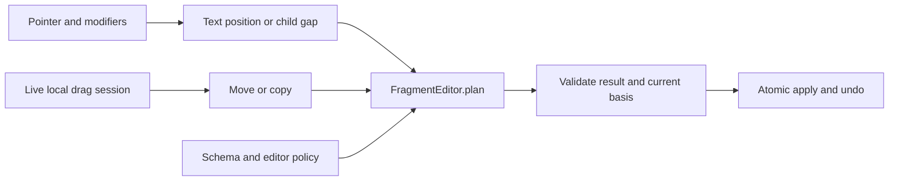

# Drag and Drop

Native text and node drops in `EditorViewDOM` and React `EditorView` use the same fragment editing planner as clipboard input. Install `CopyPasteExtension`, or use `createCoreExtensions()`, to provide the drag commands. Product overlays can call `transferNodes` directly.

## Flow



The view resolves the pointer position. It does not paste at the old cursor. A local live session authorizes source removal. Serialized node IDs do not. Other editors and external apps are copy sources.

Alt or Ctrl requests copy. A local drag without these modifiers requests move. Meta alone is not a copy modifier. Preview uses the same planner; an external payload hidden by the browser gets a lighter position candidate until drop validation.

## Product block moves

`ReorderExtension` registers `moveBlockToPosition`. It does not draw handles or install global pointer listeners. Its `targetIndex` is the destination sibling slot after removing the source.

```ts
await editor.executeCommand('moveBlockToPosition', {
  blockId: 'p1',
  targetIndex: 3,
});
```

For a product adapter, convert its post-removal content slot into the planner's original gap:

```ts
import { gapBeforeRemoval } from '@barocss/model';
import { transferNodes } from '@barocss/extensions';

const parentId = 'body';
const nodeIds = ['p1'];
const content = editor.dataStore.getNode(parentId)!.content as string[];
await transferNodes(editor, {
  nodeIds,
  intent: 'move',
  target: { kind: 'children', parentId, index: gapBeforeRemoval(content, nodeIds, 3) },
});
```

This is a trusted local API. Do not supply source IDs directly from external drop data. Products provide their own native draggable element and node selection, or their existing pointer overlay. The shared view does not create a handle UI.

## Policies and limits

Use editor-scoped `defineEditingPolicy`, `defineEditingRule`, and `FragmentEditor` from `@barocss/model`. There is no `defineDropBehavior` registry or compatibility API. Copy/move describes source handling; join/preserve/transform describes the destination structure. These decisions are separate.

Whole-node moves retain IDs and local metadata. A partial text move retains the remaining source run ID and creates IDs for transferred/split runs. A move with unchanged order, or a text drop inside its own range, creates no history. Schema violations, cycles, isolated boundaries and stale sessions are rejected before mutation. Apply failure restores both endpoints.

The flow consumer supports sibling nodes, including noncontiguous selections, and single-source-run text moves with a lossless inline join. Multi-run text moves and cross-document atomic moves are not supported. Node moves need a child gap. Copy uses existing schema adapters and reference rules. Code destinations accept literal copy with reported conversion losses.

`draggable: false` blocks the selected source node; `droppable: false` blocks the destination container. These flags do not override structural validation. Files, calendar MIME, table ranges and canvas coordinates retain their dedicated product paths.

See the [DND architecture contract](https://github.com/barocss/barocss-editor/blob/main/docs/specs/fragment-drag-and-drop.md) for custom schemas, position conversion, ID rules, product coverage and the common-ancestor replacement cost. The [editing guide](https://github.com/barocss/barocss-editor/blob/main/docs/schema-editing-guide.md) explains rule ownership and registration.

File drops cancel browser navigation while preserving event bubbling and the original File payload for the product upload handler.
