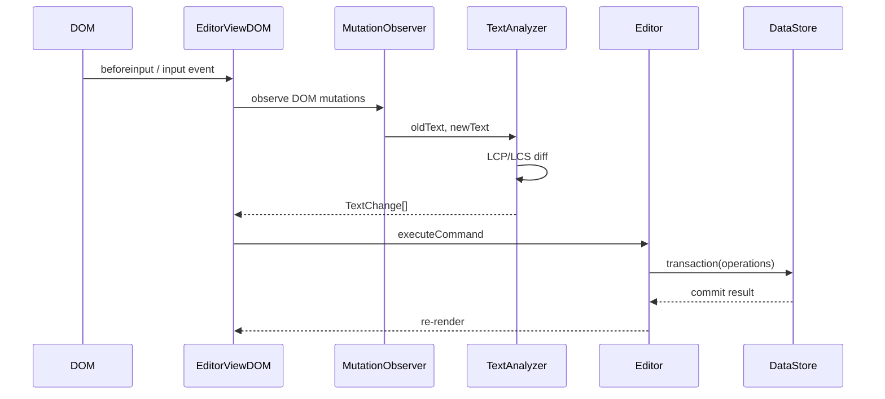
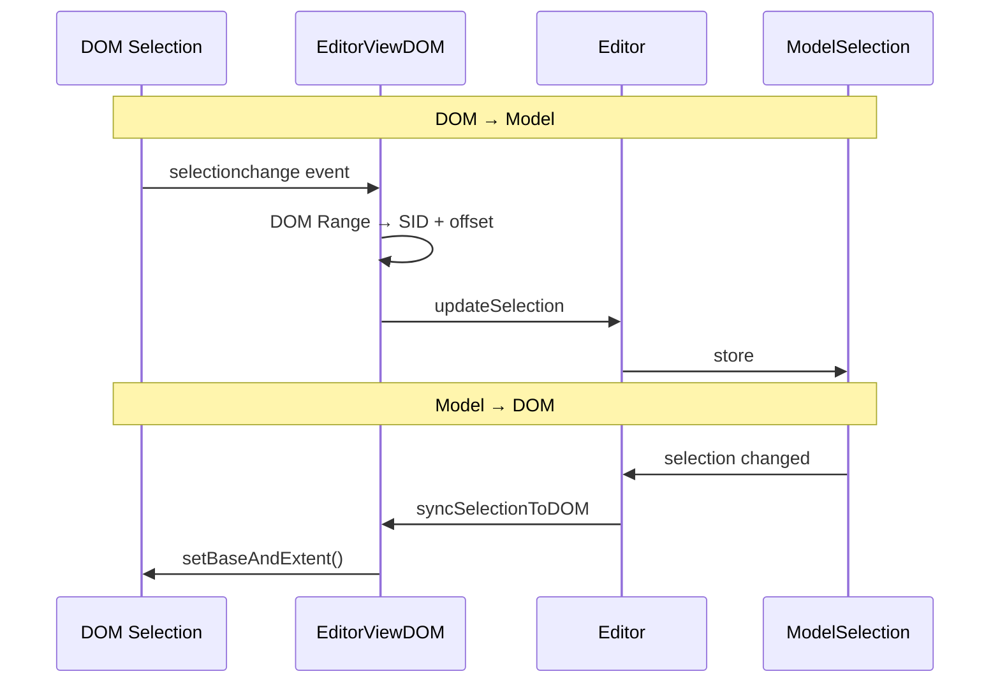
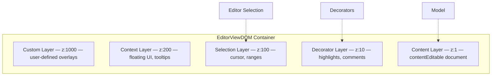
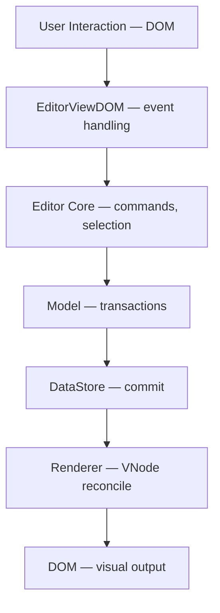

# Editor View DOM

Editor View DOM (`@barocss/editor-view-dom`) is the view layer that connects the Editor to the DOM. It handles user input, selection synchronization, and triggers rendering.

## What is Editor View DOM?

Editor View DOM bridges the gap between:
- **User Interactions**: Typing, clicking, keyboard shortcuts
- **Editor Commands**: Commands that modify the document
- **DOM Rendering**: Visual representation of the document

## Core Responsibilities

### 1. User Input Handling



Automatically converts user input into editor commands:

**Input types handled automatically:**
- **Text Input**: Typing characters
- **Keyboard Shortcuts**: Ctrl+B, Ctrl+Z, etc. (via editor keybinding system)
- **Mouse Events**: Clicking, selecting text
- **Paste Events**: Clipboard content
- **IME Input**: Composition events for Korean, Japanese, Chinese

### 2. Selection Synchronization



Bidirectional synchronization between DOM and editor:

**Selection sync flow:**
1. User selects text in DOM
2. View captures DOM selection (via `selectionchange` event)
3. Converts to editor selection format (`ModelSelection`)
4. Updates editor via `editor.setSelection()`
5. Editor operations use selection
6. View syncs DOM selection after operations

### 3. Rendering Integration

Triggers rendering when model changes:

```typescript
// Model changes
// → View detects change (via editor events)
// → Calls renderer.build() to create VNode
// → Calls renderer.render() to update DOM
// → DOM reflects new model state
```

**Rendering flow:**
1. Editor executes command
2. Model updates via transaction
3. View detects model change (via editor events)
4. View triggers renderer
5. Renderer builds VNode from model
6. Renderer reconciles VNode to DOM
7. DOM updated

### 4. Layered Architecture

Editor View DOM uses a 5-layer architecture, each with its own DOMRenderer:



## Basic Usage

```typescript
import { EditorViewDOM } from '@barocss/editor-view-dom';

// Create editor instance
const editor = new Editor({
  dataStore,
  schema,
  extensions: [...]
});

// Create view with container
const container = document.getElementById('editor-container');
const view = new EditorViewDOM(editor, {
  container: container,
  // Optional: customize layers
  layers: {
    contentEditable: {
      className: 'my-editor-content',
      attributes: { 'data-testid': 'editor' }
    }
  },
  // Optional: initial render
  initialTree: modelData,
  autoRender: true  // Default: true
});

// View is now active:
// - Event listeners are automatically attached
// - Selection synchronization is active
// - Rendering is ready
```

**Note**: There is no `mount()` or `unmount()` method. The view is automatically set up when created and cleaned up with `destroy()`.

## View Lifecycle

```typescript
// 1. Create view
const view = new EditorViewDOM(editor, {
  container: container
});
// - Automatically creates 5 layers
// - Attaches event listeners (input, keyboard, mouse, paste, selection)
// - Sets up MutationObserver
// - Initializes decorator system
// - If autoRender is true and initialTree is provided, renders immediately

// 2. Active state
// - User interacts with editor
// - View handles input → updates editor → triggers rendering
// - Selection stays in sync
// - Decorators are managed

// 3. Destroy
view.destroy();
// - Removes event listeners
// - Disconnects MutationObserver
// - Cleans up resources
```

## Event Handling

All event handling is automatic. You don't need to manually attach event listeners:

```typescript
// Input events are automatically handled
// - beforeinput → prevented for format commands, allowed for text
// - input → analyzed and converted to model changes
// - compositionstart/update/end → IME support

// Keyboard events are automatically handled
// - keydown → dispatched to editor keybinding system
// - Shortcuts execute commands automatically

// Selection events are automatically handled
// - selectionchange → converted to ModelSelection
// - Updates editor selection automatically

// Paste events are automatically handled
// - paste → extracts clipboard data
// - Converts to insertText command
```

## Decorator Management

View manages decorators (overlays on the document):

```typescript
// Add decorator
view.decoratorManager.add({
  id: 'highlight-1',
  category: 'layer',  // 'layer' | 'inline' | 'block'
  type: 'highlight',
  target: { nodeId: 'text-1', startOffset: 0, endOffset: 5 },
  data: { backgroundColor: 'yellow' }
});

// Remove decorator
view.decoratorManager.remove('highlight-1');

// Query decorators
const decorators = view.decoratorManager.query({
  nodeId: 'text-1'
});
```

**Decorator categories:**
- **Layer**: CSS-only overlays (included in diff)
- **Inline**: DOM widgets inserted within text (excluded from diff)
- **Block**: DOM widgets inserted at block level (excluded from diff)

## Rendering

Render the document model to DOM:

```typescript
// Manual render
view.render(modelData);

// ModelData format
const modelData = {
  sid: 'doc-1',
  stype: 'document',
  content: [
    {
      sid: 'p1',
      stype: 'paragraph',
      content: [...]
    }
  ]
};
```

**Rendering is automatic when:**
- Model changes via editor commands
- Editor emits model change events
- `autoRender` is enabled (default: true)

## How View Fits



**View's role:**
- **Automatic Event Handling**: All DOM events are handled automatically
- **Input → Command**: Converts user actions to commands
- **Selection Sync**: Keeps DOM and editor selection in sync
- **Render Trigger**: Triggers rendering when model changes
- **Decorator Management**: Manages visual overlays

## Key Concepts

### 1. Automatic Setup

View automatically sets up everything when created:
- Event listeners are attached
- MutationObserver is configured
- Selection synchronization is active
- No manual `mount()` needed

### 2. All Changes Go Through Editor

View never directly modifies the model:

```typescript
// ✅ Good: Use editor commands
editor.executeCommand('insertText', { text: 'Hello' });

// ❌ Bad: Direct model manipulation
dataStore.updateNode('text-1', { text: 'Hello' }); // Bypasses view
```

### 3. Selection is Bidirectional

Selection syncs both ways automatically:
- **DOM → Editor**: User selects text → editor selection updated
- **Editor → DOM**: Editor operations → DOM selection updated

### 4. Layered Architecture

5 layers provide separation of concerns:
- **Content**: Core document (editable)
- **Decorator**: Visual overlays (non-interactive by default)
- **Selection**: Selection indicators (read-only)
- **Context**: Contextual UI (event-driven)
- **Custom**: User-defined overlays

## When to Use Editor View DOM

- **Connecting Editor to DOM**: Required to make editor interactive
- **Handling User Input**: View automatically handles all user interactions
- **Selection Management**: View automatically manages selection synchronization
- **Rendering**: View triggers rendering on model changes
- **Decorators**: Add visual overlays without modifying model

## Next Steps

- Learn about [Editor Core](./editor-core) - The editor that View connects to
- See [Getting Started: Basic Usage](../basic-usage) - How to use EditorViewDOM
- See [Architecture: Editor View DOM](../architecture/editor-view-dom) - Detailed package documentation
