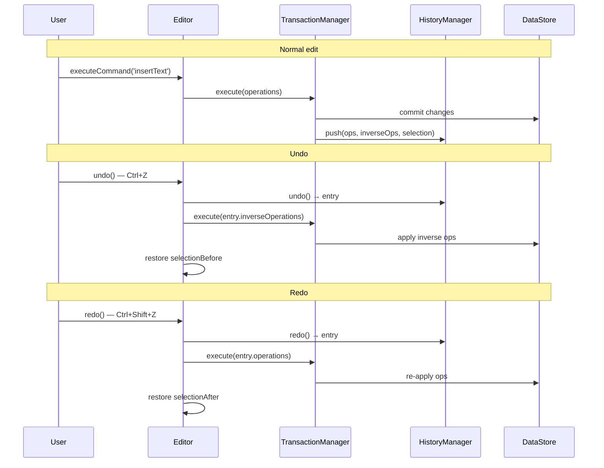
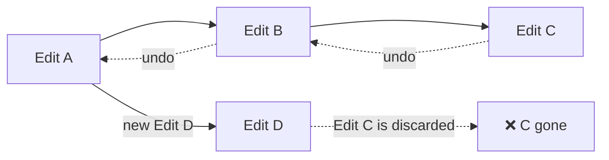
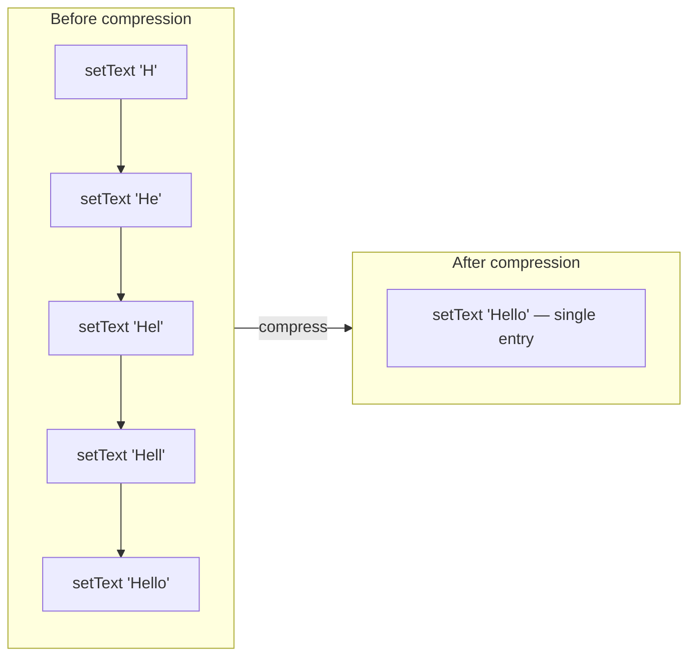
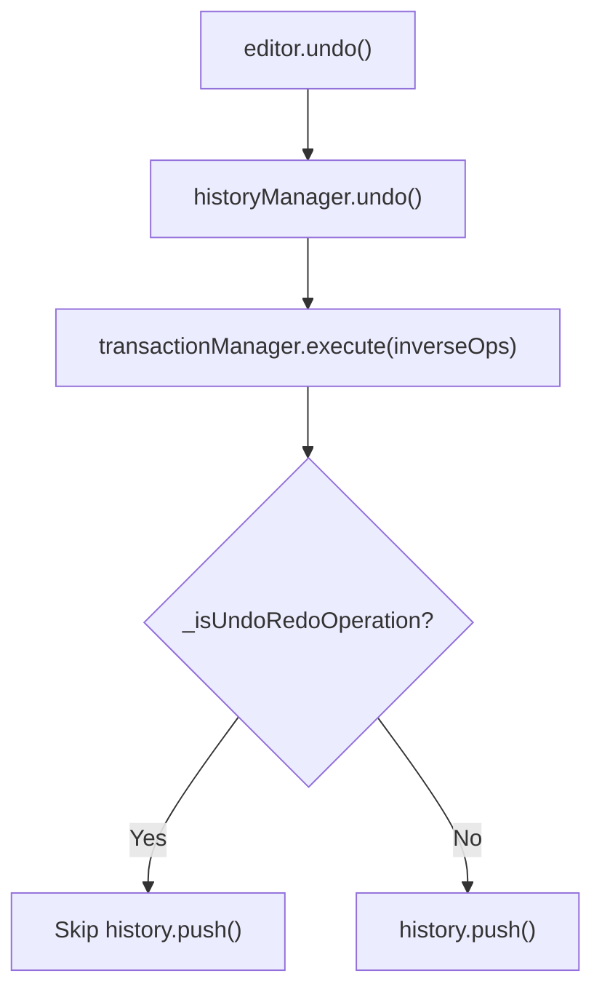

# History (Undo/Redo)

History manages the undo/redo stack for the editor. Every transaction is recorded as a history entry with both forward and inverse operations, enabling reliable undo and redo.

## How It Works



## History Entry

Each history entry stores everything needed to undo or redo:

```typescript
interface HistoryEntry {
  id: string;
  timestamp: Date;
  operations: TransactionOperation[];
  inverseOperations: TransactionOperation[];
  description?: string;
  metadata?: {
    selectionBefore?: ModelSelection | null;
    selectionAfter?: ModelSelection | null;
  };
}
```

- **operations** — the forward operations that were executed
- **inverseOperations** — the reverse operations (stored in reverse order for undo)
- **selectionBefore / selectionAfter** — selection state snapshots for restoring cursor position

## Basic Usage

```typescript
// Undo the last operation
await editor.undo();

// Redo the last undone operation
await editor.redo();

// Check availability
editor.canUndo();  // boolean
editor.canRedo();  // boolean
```

## History Branch Pruning

When the user makes a new edit after undoing, the redo stack is discarded:



This follows the standard linear undo model — once you branch off with a new edit, the old redo history is removed.

## History Size Management

```typescript
// Default max size: 100 entries
const editor = new Editor({
  history: { maxSize: 200 }  // increase limit
});

// Dynamically resize at runtime
editor.historyManager.resize(50);

// Check memory usage (approximate bytes)
editor.historyManager.getMemoryUsage();

// Get statistics
editor.historyManager.getStats();
// { totalEntries: 42, currentIndex: 41, canUndo: true, canRedo: false }
```

When the limit is reached, the oldest entries are removed first.

## History Compression

Compression merges consecutive similar operations into a single entry. For example, typing "Hello" character by character normally creates 5 history entries — compression merges them into one:

```typescript
editor.historyManager.compress();
```

**Compression rules:**
- Only consecutive single-operation entries of the same type are merged
- Currently targets `setText` operations on the same node
- Inverse operations are combined in reverse order



## History Validation

Validate the integrity of the history stack:

```typescript
const { isValid, errors } = editor.historyManager.validate();
if (!isValid) {
  console.error('History corruption:', errors);
  editor.historyManager.clear();  // reset if corrupted
}
```

Validation checks:
- `currentIndex` is within valid bounds
- Every entry has required fields (`id`, `timestamp`, `operations`)
- `operations` and `inverseOperations` have matching lengths

## Querying History

```typescript
// Get all entries
const entries = editor.historyManager.getHistory();

// Get a specific entry
const entry = editor.historyManager.getEntry(5);

// Search entries by predicate
const textOps = editor.historyManager.findEntries(
  e => e.operations.some(op => op.type === 'setText')
);

// Get entries in a time range
const recentOps = editor.historyManager.getEntriesByTimeRange(
  new Date('2026-01-01'),
  new Date()
);
```

## Selection Preservation

By default, undo/redo restores the cursor to where it was before/after the operation. This behavior can be controlled per transaction:

```typescript
await editor.executeTransaction(operations, {
  preserveSelectionInHistory: false  // don't store selection snapshots
});
```

When `preserveSelectionInHistory` is `true` (default), the `HistoryEntry.metadata` stores both `selectionBefore` and `selectionAfter`, and undo/redo restores the appropriate one.

## Undo/Redo and Transactions

Undo/redo operations are themselves executed as transactions, but they are **not recorded** in history (to prevent infinite loops). The `TransactionManager` tracks this via an `_isUndoRedoOperation` flag.



## Next Steps

- Learn about [Transactions](./transactions) — How operations are atomically executed
- Learn about [Editor Core](./editor-core) — The editor's command system
- See [Extension Design](../guides/extension-design) — Using history in extensions
