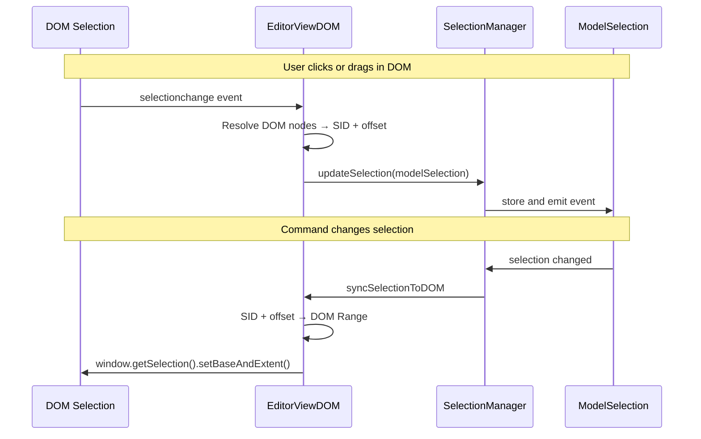
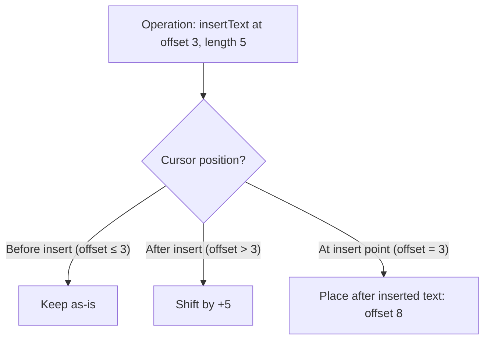

# Selection

Selection represents the user's current cursor position or highlighted range within the document. It is the bridge between what the user sees in the DOM and what the editor model operates on.

## Selection Model

Barocss uses `ModelSelection` — a framework-agnostic representation that maps directly to document node IDs and text offsets rather than DOM nodes:

```typescript
interface ModelSelection {
  type: SelectionType;      // 'range' | 'node' | 'cell' | 'table'
  startNodeId: string;      // SID of the start node
  startOffset: number;      // Character offset within start node
  endNodeId: string;        // SID of the end node
  endOffset: number;        // Character offset within end node
  collapsed?: boolean;      // true = cursor (no range)
  direction?: 'forward' | 'backward' | 'none';
}
```

### Selection Types

| Type | Description | Example |
|------|-------------|---------|
| `range` | Text cursor or text range | Typing, selecting words |
| `node` | Entire node selected | Selecting an image or code block |
| `cell` | Table cell selection | Selecting cells in a table |
| `table` | Entire table selected | Selecting a whole table |

### Cursor vs Range

A **cursor** (caret) is a collapsed range where start and end are identical:

```typescript
// Cursor at position 5 in node 'text-1'
{ type: 'range', startNodeId: 'text-1', startOffset: 5,
  endNodeId: 'text-1', endOffset: 5, collapsed: true }

// Range selecting characters 2-8 in node 'text-1'
{ type: 'range', startNodeId: 'text-1', startOffset: 2,
  endNodeId: 'text-1', endOffset: 8, collapsed: false }
```

## Selection Synchronization

Selection must stay in sync between the DOM (what the user sees) and the model (what the editor operates on). This is bidirectional.



### DOM → Model

When the user clicks or drags in the editor:

1. Browser fires `selectionchange` event
2. `EditorViewDOM` captures the DOM `Selection` object
3. Resolves DOM nodes to document SIDs using `data-bc-sid` attributes
4. Computes text offsets within the resolved nodes
5. Creates a `ModelSelection` and updates the `SelectionManager`

### Model → DOM

When a command or transaction changes the selection:

1. `SelectionManager` emits a selection change event
2. `EditorViewDOM` receives the new `ModelSelection`
3. Finds the corresponding DOM nodes by SID lookup
4. Computes DOM offsets
5. Calls `window.getSelection().setBaseAndExtent()` to update the browser caret

## Selection After Operations

When text is inserted, deleted, or nodes are restructured, the selection must be **remapped** to remain valid.



### Remapping Rules

- **Insert text**: Offsets after the insertion point shift forward by the inserted length
- **Delete text**: Offsets within the deleted range collapse to the deletion start; offsets after shift backward
- **Split node**: Selection in the split portion moves to the new node
- **Merge nodes**: Selection in the merged-away node moves to the corresponding offset in the surviving node
- **Delete node**: If the selected node is deleted, selection moves to the nearest valid position

### Transaction Selection Options

Transactions can specify how selection should be handled:

```typescript
const result = await transaction(editor, [
  ...control('text-1', [
    insertText({ text: 'Hello', offset: 0 })
  ])
], {
  applySelectionToView: true,  // sync result to DOM (default)
  selection: {                  // explicit selection override
    type: 'range',
    startNodeId: 'text-1',
    startOffset: 5,
    endNodeId: 'text-1',
    endOffset: 5,
    collapsed: true,
  }
});
```

## SelectionManager

The `SelectionManager` in `@barocss/editor-core` is responsible for:

- Storing the current `ModelSelection`
- Emitting events on selection change
- Validating selection against the current document state
- Providing selection to commands and extensions

```typescript
// Get current selection
const sel = editor.getSelection();

// Set selection programmatically
editor.setRange({ startNodeId: 'text-1', startOffset: 0,
                  endNodeId: 'text-1', endOffset: 10 });

// Set node selection
editor.setNode({ nodeId: 'image-1' });

// Clear selection
editor.clearSelection();
```

## IME and Composition

During IME input (Korean, Japanese, Chinese), selection behaves differently:

1. **Composition starts**: Selection is locked — no sync to model
2. **Composition updates**: DOM selection moves within the composing range
3. **Composition ends**: Final text is committed, selection is synced back to model

EditorViewDOM tracks composition state (`_isComposing`) and suppresses selection sync during composition to prevent interference.

## Next Steps

- Learn about [Editor Core](./editor-core) - Commands and selection management
- Learn about [Editor View DOM](./editor-view-dom) - How selection syncs with DOM
- See [Extension Design](../guides/extension-design) - Using selection in extensions
