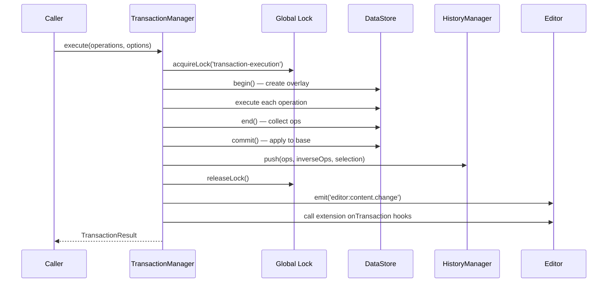
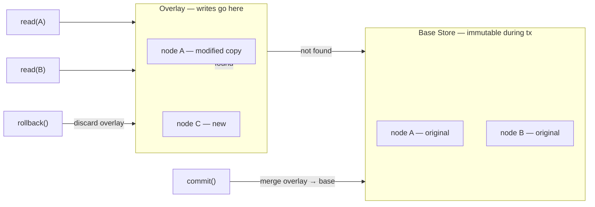
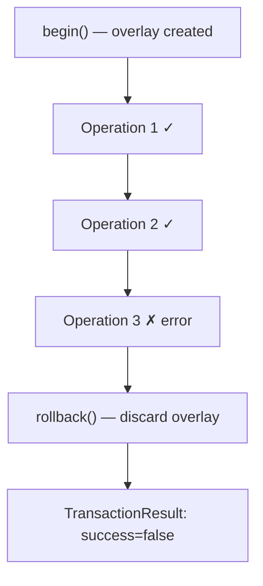

# Transactions

Every document modification in Barocss goes through a **transaction** — an atomic, all-or-nothing unit of work. Transactions ensure data integrity, enable undo/redo, and coordinate with collaboration.

## Transaction Lifecycle



## Key Properties

| Property | Description |
|----------|-------------|
| **Atomic** | All operations succeed or all are rolled back |
| **Locked** | Only one transaction runs at a time via global lock |
| **Overlayed** | Changes are buffered in a COW overlay before commit |
| **Undoable** | Forward and inverse operations are stored in history |
| **Observable** | Extensions receive `onTransaction` hooks after commit |

## Creating Transactions

### Using the Transaction DSL

The most common way to create transactions:

```typescript
import { transaction, control, insertText, toggleMark } from '@barocss/model';

const result = await transaction(editor, [
  ...control('text-1', [
    insertText({ text: 'Hello', offset: 0 }),
    toggleMark('bold', [0, 5])
  ])
]).commit();

if (!result.success) {
  console.error('Transaction failed:', result.errors);
}
```

### Using executeTransaction

For programmatic use within extensions:

```typescript
const result = await editor.executeTransaction([
  { type: 'insertText', payload: { nodeId: 'text-1', text: 'Hello', offset: 0 } },
  { type: 'toggleMark', payload: { nodeId: 'text-1', markType: 'bold', range: [0, 5] } }
]);
```

## Copy-on-Write Overlay

The DataStore uses a **Copy-on-Write (COW) overlay** during transactions. This means the base data is never modified until `commit()`:



**Benefits:**
- Reads during a transaction see the latest writes
- If the transaction fails, rollback is instant (just discard the overlay)
- No partial state is ever visible to other parts of the system

## Global Lock

Only one transaction can execute at a time. The `DataStore.acquireLock()` system ensures serialized access:

```typescript
// Internally, TransactionManager does:
const lockId = await dataStore.acquireLock('transaction-execution');
try {
  // ... execute operations ...
} finally {
  dataStore.releaseLock(lockId);
}
```

If another transaction is already running, `acquireLock` queues the request and waits.

## TransactionResult

Every transaction returns a result:

```typescript
interface TransactionResult {
  success: boolean;
  errors: string[];
  transactionId?: string;
  operations?: TransactionOperation[];
  selectionBefore?: ModelSelection | null;
  selectionAfter?: ModelSelection | null;
}
```

## Error Handling and Rollback

If any operation fails, the overlay is rolled back and no changes are applied:



```typescript
try {
  // operations execute in overlay...
} catch (error) {
  dataStore.rollback();  // discard overlay
  return { success: false, errors: [error.message] };
}
```

## Transaction Options

```typescript
interface TransactionOptions {
  applySelectionToView?: boolean;      // sync selection to DOM (default: true)
  preserveSelectionInHistory?: boolean; // store selection in history entry (default: true)
}
```

- **`applySelectionToView: false`** — useful for remote sync or programmatic changes where you don't want to move the user's cursor
- **`preserveSelectionInHistory: false`** — for operations where selection restoration doesn't make sense

## Alias System

During a transaction, operations can create temporary aliases for newly created nodes. This is useful when a later operation needs to reference a node whose SID is generated at execution time:

```typescript
// The insertParagraph operation creates a new node with a generated SID
// and stores it as an alias: dataStore.setAlias('$newBlock', generatedSid)
// The next operation can reference '$newBlock'
const result = await transaction(editor, [
  insertParagraph({ after: 'p1' }),
  // internally references '$newBlock' alias
]).commit();
```

Aliases are **overlay-scoped** — they exist only within the transaction and are cleared after commit or rollback.

## Extension Hooks

Extensions can intercept transactions before they are committed:

```typescript
class MyExtension implements Extension {
  onBeforeTransaction(editor: Editor, tx: Transaction): Transaction | null {
    // Return null to cancel
    // Return modified transaction to change operations
    // Return original to pass through
    return tx;
  }

  onTransaction(editor: Editor, tx: Transaction): void {
    // Called after commit (notification only)
  }
}
```

See [Before Hooks Use Cases](../guides/before-hooks-use-cases) for detailed patterns.

## Next Steps

- Learn about [History](./history) — Undo/redo powered by transactions
- Learn about [Editor Core](./editor-core) — Command system that creates transactions
- See [Custom Operations](../guides/custom-operations) — Defining your own operations
- See [Architecture: DataStore](../architecture/datastore) — Overlay/COW implementation details
