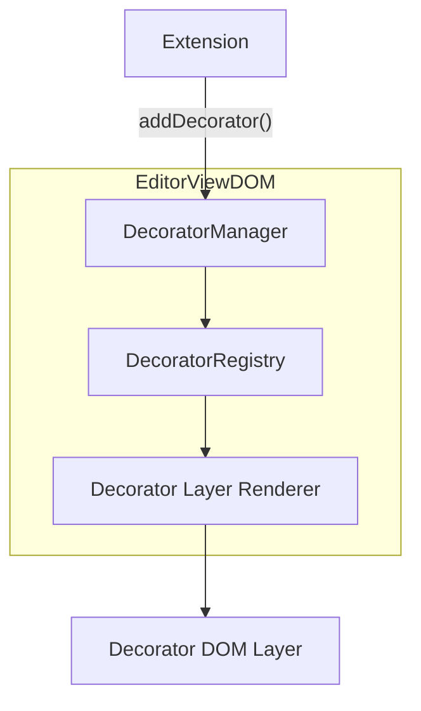
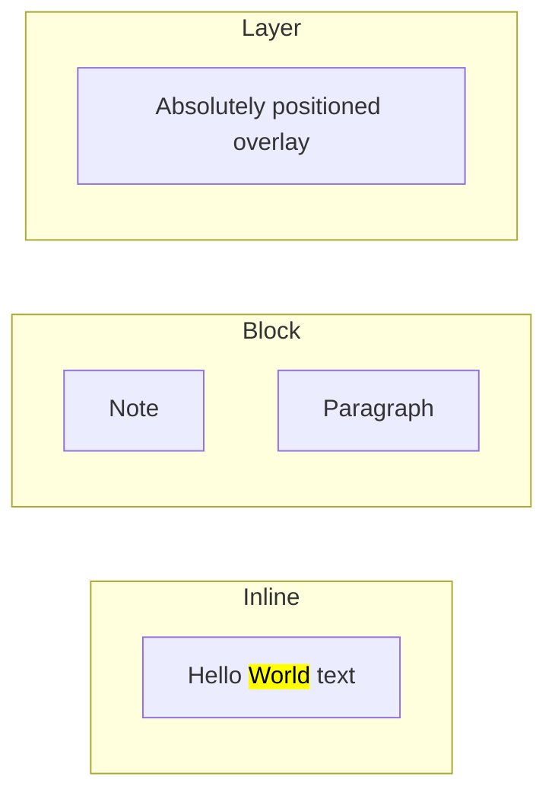
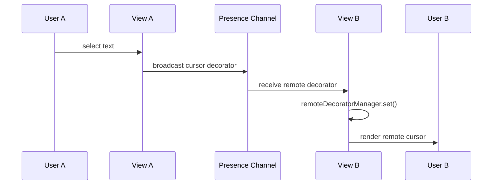
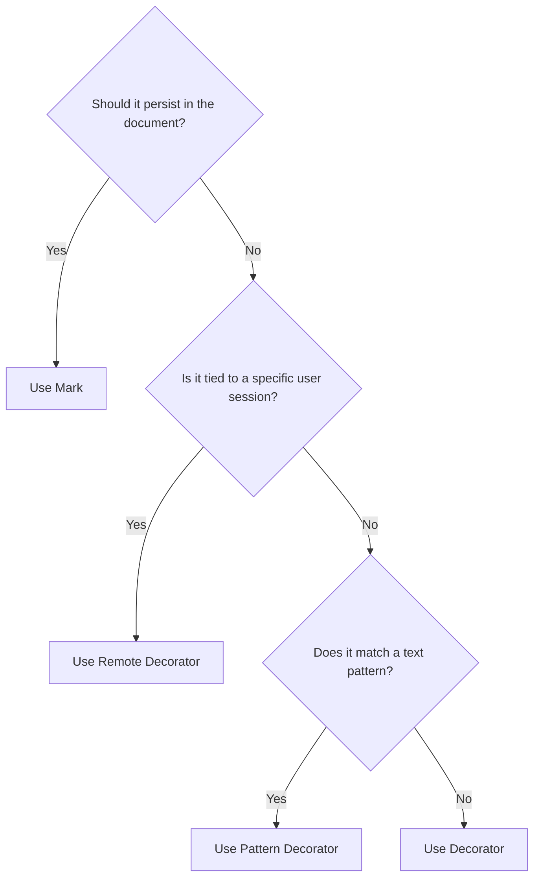

# Decorator Guide

Decorators add temporary visual overlays to the editor without modifying the document model. This guide walks through practical implementation patterns.

For the conceptual overview, see [Decorators](../concepts/decorators).

## Architecture



Decorators live entirely in the **view layer** — they never touch DataStore or the document model.

## Step-by-Step: Search Highlight

### 1. Define the decorator template

```typescript
import { defineDecorator, element, data } from '@barocss/dsl';

defineDecorator('search-highlight', element('mark', {
  className: 'search-highlight',
  style: { backgroundColor: 'rgba(255, 213, 0, 0.4)' }
}, [data('text')]));
```

### 2. Find matches and add decorators

```typescript
function highlightSearchResults(view: EditorViewDOM, query: string) {
  const nodes = view.editor.dataStore.query.getAllTextNodes();

  for (const node of nodes) {
    let idx = 0;
    while ((idx = node.text.indexOf(query, idx)) !== -1) {
      view.decoratorManager.add({
        sid: `search-${node.sid}-${idx}`,
        stype: 'search-highlight',
        category: 'inline',
        target: { sid: node.sid, startOffset: idx, endOffset: idx + query.length },
        data: {},
      });
      idx += query.length;
    }
  }
}
```

### 3. Clear highlights

```typescript
function clearSearchHighlights(view: EditorViewDOM) {
  const all = view.decoratorManager.getAll();
  all.filter(d => d.stype === 'search-highlight')
     .forEach(d => view.decoratorManager.remove(d.sid));
}
```

## Decorator Categories

| Category | Rendering | Included in Diff? | Typical Use |
|----------|-----------|-------------------|-------------|
| `inline` | `<span>` within text flow | Yes (layer decorator) | Highlights, inline annotations |
| `block` | `<div>` at block level | No | Block comments, widgets |
| `layer` | Absolute-positioned overlay | No | Cursors, tooltips, floating UI |



## Using Decorators from Extensions

Extensions are the typical place to manage decorators:

```typescript
import { Extension, Editor } from '@barocss/editor-core';

class SpellCheckExtension implements Extension {
  name = 'spell-check';
  private _view: EditorViewDOM | null = null;

  onCreate(editor: Editor): void {
    editor.registerCommand('spellCheck.run', async () => {
      if (!this._view) return false;
      this._clearAll();
      this._runCheck();
      return true;
    });
  }

  setView(view: EditorViewDOM) {
    this._view = view;
  }

  private _runCheck() {
    const nodes = this._view!.editor.dataStore.query.getAllTextNodes();
    for (const node of nodes) {
      const errors = checkSpelling(node.text);
      for (const err of errors) {
        this._view!.decoratorManager.add({
          sid: `spell-${node.sid}-${err.start}`,
          stype: 'spell-error',
          category: 'inline',
          target: { sid: node.sid, startOffset: err.start, endOffset: err.end },
          data: { suggestion: err.suggestion },
        });
      }
    }
  }

  private _clearAll() {
    this._view!.decoratorManager.getAll()
      .filter(d => d.stype === 'spell-error')
      .forEach(d => this._view!.decoratorManager.remove(d.sid));
  }
}
```

## Pattern Decorators

Pattern decorators automatically match regex patterns across all text nodes:

```typescript
view.decoratorManager.add({
  sid: 'url-pattern',
  stype: 'link-preview',
  category: 'inline',
  decoratorType: 'pattern',
  target: { sid: '' },
  data: {
    pattern: /https?:\/\/[^\s]+/g,
    extractData: (match) => ({ url: match[0] }),
    createDecorator: (nodeId, start, end, data) => ({
      sid: `url-${nodeId}-${start}`,
      target: { sid: nodeId, startOffset: start, endOffset: end },
      data,
    }),
  },
});
```

Pattern decorators re-evaluate when text changes — no manual cleanup needed.

## Collaboration: Remote Decorators

In multi-user editing, each user's decorators are managed via the presence channel:



```typescript
view.remoteDecoratorManager.setRemoteDecorator(
  {
    sid: 'cursor-user2',
    stype: 'remote-cursor',
    category: 'layer',
    target: { sid: 'text-1', startOffset: 5, endOffset: 5 },
    data: { color: '#ff6b6b', name: 'Alice' },
  },
  { userId: 'user-2', sessionId: 'sess-2' }
);
```

## Decorator vs Mark Decision Tree



## Related

- [Concepts: Decorators](../concepts/decorators) - Full conceptual overview with all categories
- [Examples: Decorators](../examples/decorators) - Runnable examples
- [Extension Design](./extension-design) - Building extensions that use decorators
