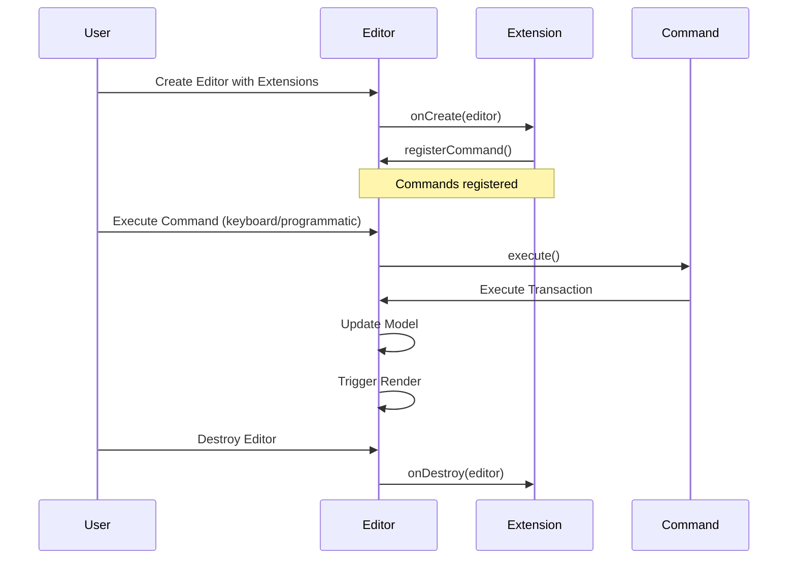
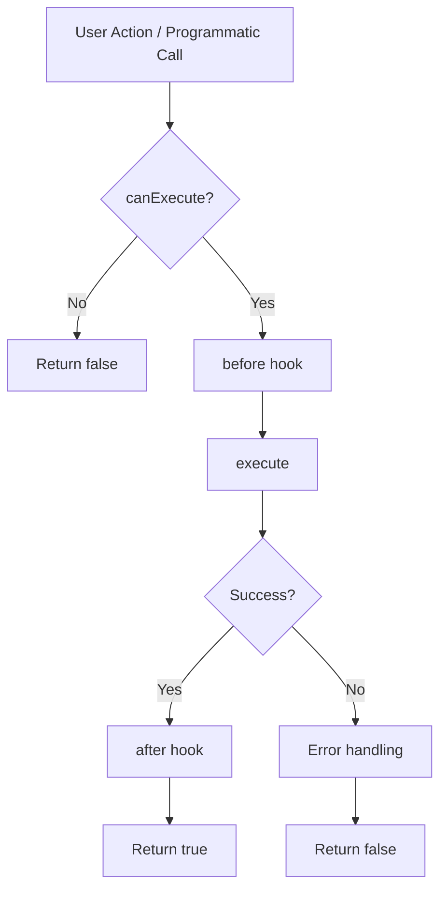

# Extension Design Guide

Extensions are the primary way to add custom functionality to Barocss Editor. This guide explains how to create extensions step by step.

## What You'll Learn

- How extensions work and their role in the editor
- How to create commands and connect them to keybindings
- How to use transactions and operations to modify documents
- How to implement a complete extension

## Table of Contents

1. [What is an Extension?](#what-is-an-extension)
2. [Creating Your First Extension](#creating-your-first-extension)
3. [Commands](#commands)
4. [Using Transactions](#using-transactions)
5. [Keybindings](#keybindings)
6. [Complete Example: Highlight Extension](#complete-example-highlight-extension)

---

## What is an Extension?

An **Extension** is a module that adds new functionality to the editor. Extensions register commands that can be executed by users through keyboard shortcuts or programmatic calls.

### Extension Interface

```typescript
interface Extension {
  name: string;              // Unique extension identifier
  priority?: number;         // Execution priority (lower = earlier)
  
  // Lifecycle
  onCreate?(editor: Editor): void;    // Called when editor is created
  onDestroy?(editor: Editor): void;   // Called when editor is destroyed
  
  // Command registration
  commands?: Command[];      // Commands provided by this extension
  
  // Before hooks (intercept and modify core model changes)
  // Only core model changes (Transaction, Selection, Content) are provided as hooks.
  // Other changes should use editor.on() events.
  onBeforeTransaction?(editor: Editor, transaction: Transaction): Transaction | null | void;
  onBeforeSelectionChange?(editor: Editor, selection: SelectionState): SelectionState | null | void;
  onBeforeContentChange?(editor: Editor, content: DocumentState): DocumentState | null | void;
  
  // After hooks (notification for core model changes)
  // For type safety. Alternatively, you can use editor.on() events.
  onTransaction?(editor: Editor, transaction: Transaction): void;
  onSelectionChange?(editor: Editor, selection: SelectionState): void;
  onContentChange?(editor: Editor, content: DocumentState): void;
}
```

**Note:** Only core model changes (Transaction, Selection, Content) are provided as hooks. For other changes (Node, Command, History, etc.), use `editor.on()` events.

### Extension Lifecycle



---

## Creating Your First Extension

Let's create a simple extension that adds a "Insert Hello" command.

### Step 1: Define the Extension Class

```typescript
import { Extension, Editor } from '@barocss/editor-core';
import { transaction, control, insertText } from '@barocss/model';

export class InsertHelloExtension implements Extension {
  name = 'insert-hello';
  priority = 100;

  onCreate(editor: Editor): void {
    // Register command
    editor.registerCommand({
      name: 'insertHello',
      execute: async (editor: Editor, payload?: { nodeId?: string }) => {
        return await this._executeInsertHello(editor, payload);
      },
      canExecute: (editor: Editor, payload?: any) => {
        // Check if command can be executed
        return !!payload?.nodeId || !!editor.selection?.startNodeId;
      }
    });
  }

  onDestroy(_editor: Editor): void {
    // Cleanup if needed
  }

  private async _executeInsertHello(
    editor: Editor,
    payload?: { nodeId?: string }
  ): Promise<boolean> {
    // Get target node ID
    const nodeId = payload?.nodeId || editor.selection?.startNodeId;
    if (!nodeId) {
      return false;
    }

    // Execute transaction
    const result = await transaction(editor, [
      ...control(nodeId, [
        insertText({ text: 'Hello', offset: 0 })
      ])
    ]).commit();

    return result.success;
  }
}
```

### Step 2: Use the Extension

```typescript
import { Editor } from '@barocss/editor-core';
import { createCoreExtensions } from '@barocss/extensions';
import { InsertHelloExtension } from './insert-hello-extension';

const editor = new Editor({
  dataStore,
  schema,
  extensions: [
    ...createCoreExtensions(),
    new InsertHelloExtension()
  ]
});

// Execute command programmatically
await editor.executeCommand('insertHello', { nodeId: 'text-1' });
```

---

## Commands

Commands are executable actions that modify the document. All document changes go through commands.

### Command Structure

```typescript
interface Command {
  name: string;                                    // Command identifier
  execute: (editor: Editor, payload?: any) => Promise<boolean> | boolean;
  canExecute?: (editor: Editor, payload?: any) => boolean;
  before?: (editor: Editor, payload?: any) => void;
  after?: (editor: Editor, payload?: any) => void;
}
```

### Command Execution Flow



### Command Example

```typescript
editor.registerCommand({
  name: 'toggleBold',
  execute: async (editor: Editor, payload?: { selection?: ModelSelection }) => {
    const selection = payload?.selection || editor.selection;
    if (!selection || selection.type !== 'range') {
      return false;
    }

    // Execute transaction to toggle bold mark
    const result = await transaction(editor, [
      ...control(selection.startNodeId, [
        toggleMark('bold', [selection.startOffset, selection.endOffset])
      ])
    ]).commit();

    return result.success;
  },
  canExecute: (editor: Editor, payload?: any) => {
    const selection = payload?.selection || editor.selection;
    return !!selection && selection.type === 'range';
  }
});
```

---

## Using Transactions

Commands **must** use transactions to modify documents. Never directly modify DataStore.

### Why Transactions?

1. **Atomicity**: All operations succeed or fail together
2. **Schema Validation**: Operations validated before commit
3. **Undo/Redo**: Transactions recorded for history
4. **Lock Management**: Prevents concurrent conflicts
5. **Operation Events**: Emitted for collaboration

### Transaction Pattern

```typescript
import { transaction, control, insertText, toggleMark } from '@barocss/model';

// Single operation
const result = await transaction(editor, [
  insertText({ text: 'Hello', nodeId: 'text-1', offset: 0 })
]).commit();

// Multiple operations
const result = await transaction(editor, [
  ...control('text-1', [
    insertText({ text: 'Hello' }),
    toggleMark('bold', [0, 5])
  ])
]).commit();

if (!result.success) {
  console.error('Transaction failed:', result.error);
}
```

### Available Operations

Common operations from `@barocss/model`:

- **Text Operations**: `insertText`, `deleteText`, `replaceText`
- **Mark Operations**: `applyMark`, `removeMark`, `toggleMark`
- **Node Operations**: `create`, `update`, `delete`, `moveNode`
- **Block Operations**: `indentNode`, `outdentNode`, `moveBlockUp`, `moveBlockDown`

### ❌ Wrong Way: Direct DataStore Access

```typescript
// ❌ NEVER do this
private async _executeBadCommand(editor: Editor): Promise<boolean> {
  const dataStore = editor.dataStore;
  
  // Direct modification - bypasses transactions
  dataStore.updateNode('node-1', { text: 'Updated' });
  
  // Problems:
  // - No transaction guarantee
  // - No lock management
  // - No history recording
  // - No operation events
  // - No schema validation
  
  return true;
}
```

### ✅ Correct Way: Use Transactions

```typescript
// ✅ Always use transactions
import { transaction, control, updateNode } from '@barocss/model';

private async _executeGoodCommand(editor: Editor): Promise<boolean> {
  const result = await transaction(editor, [
    ...control('node-1', [
      updateNode({ text: 'Updated' })
    ])
  ]).commit();

  return result.success;
}
```

---

## Keybindings

Keybindings connect keyboard shortcuts to commands. They can include conditions (`when`) for context-aware activation.

### Registering Keybindings

```typescript
// In extension onCreate
editor.keybindings.register({
  key: 'Mod+b',              // Ctrl+B (or Cmd+B on Mac)
  command: 'toggleBold',
  when: 'editorFocus && editorEditable'  // Optional condition
});
```

### Key Format

- **Mod**: `Ctrl` on Windows/Linux, `Cmd` on Mac
- **Alt**: Alt key
- **Shift**: Shift key
- **Keys**: `a-z`, `0-9`, `Enter`, `Backspace`, `Delete`, `ArrowUp`, etc.

Examples:
- `Mod+b` - Ctrl+B / Cmd+B
- `Mod+Shift+h` - Ctrl+Shift+H / Cmd+Shift+H
- `Alt+Enter` - Alt+Enter
- `Escape` - Escape key

### When Conditions

Conditions control when keybindings are active (inspired by VS Code):

```typescript
// Only active when editor is focused and editable
editor.keybindings.register({
  key: 'Mod+b',
  command: 'toggleBold',
  when: 'editorFocus && editorEditable'
});

// Only active when text is selected
editor.keybindings.register({
  key: 'Mod+k',
  command: 'formatSelection',
  when: 'hasSelection'
});

// Multiple conditions
editor.keybindings.register({
  key: 'Mod+/',
  command: 'toggleComment',
  when: 'editorFocus && !readonly'
});
```

### Available Context Variables

- `editorFocus` - Editor has focus
- `editorEditable` - Editor is editable
- `hasSelection` - Text is selected
- `readonly` - Editor is read-only
- Custom context via `editor.setContext(key, value)`

---

## Complete Example: Highlight Extension

Let's implement a complete Highlight extension that toggles highlight marks on selected text.

### Step 1: Define the Extension

```typescript
import { Extension, Editor, ModelSelection } from '@barocss/editor-core';
import { transaction, control, toggleMark } from '@barocss/model';

export interface HighlightExtensionOptions {
  enabled?: boolean;
  defaultColor?: string;
  keyboardShortcut?: string;
}

export class HighlightExtension implements Extension {
  name = 'highlight';
  priority = 100;

  private _options: HighlightExtensionOptions;

  constructor(options: HighlightExtensionOptions = {}) {
    this._options = {
      enabled: true,
      defaultColor: 'yellow',
      keyboardShortcut: 'Mod+Shift+h',
      ...options
    };
  }

  onCreate(editor: Editor): void {
    if (!this._options.enabled) return;

    // Register command
    editor.registerCommand({
      name: 'toggleHighlight',
      execute: async (editor: Editor, payload?: {
        selection?: ModelSelection;
        color?: string;
      }) => {
        return await this._executeToggleHighlight(
          editor,
          payload?.selection,
          payload?.color
        );
      },
      canExecute: (editor: Editor, payload?: { selection?: ModelSelection }) => {
        const selection = payload?.selection || editor.selection;
        return !!selection && selection.type === 'range';
      }
    });

    // Register keybinding
    if (this._options.keyboardShortcut) {
      editor.keybindings.register({
        key: this._options.keyboardShortcut,
        command: 'toggleHighlight',
        when: 'editorFocus && editorEditable && hasSelection'
      });
    }
  }

  onDestroy(_editor: Editor): void {
    // Cleanup if needed
  }

  private async _executeToggleHighlight(
    editor: Editor,
    selection?: ModelSelection,
    color?: string
  ): Promise<boolean> {
    // Get selection
    const currentSelection = selection || editor.selection;
    if (!currentSelection || currentSelection.type !== 'range') {
      return false;
    }

    // Validate node
    const node = editor.dataStore.getNode(currentSelection.startNodeId);
    if (!node || typeof node.text !== 'string') {
      return false;
    }

    // Validate range
    const { startOffset, endOffset } = currentSelection;
    const text = node.text as string;
    if (
      startOffset < 0 ||
      endOffset > text.length ||
      startOffset >= endOffset
    ) {
      return false;
    }

    // Execute transaction
    const result = await transaction(editor, [
      ...control(currentSelection.startNodeId, [
        toggleMark('highlight', [startOffset, endOffset], {
          color: color || this._options.defaultColor
        })
      ])
    ]).commit();

    return result.success;
  }
}
```

### Step 2: Define Mark Template

```typescript
import { defineMark, element, data } from '@barocss/dsl';

// Define highlight mark template
defineMark('highlight', element('mark', {
  className: 'highlight',
  style: {
    backgroundColor: (model) => model.attrs?.color || 'yellow',
    padding: '2px 0'
  }
}, [data('text')]));
```

### Step 3: Use the Extension

```typescript
import { Editor } from '@barocss/editor-core';
import { createCoreExtensions } from '@barocss/extensions';
import { HighlightExtension } from './highlight-extension';

const editor = new Editor({
  dataStore,
  schema,
  extensions: [
    ...createCoreExtensions(),
    new HighlightExtension({
      defaultColor: 'yellow',
      keyboardShortcut: 'Mod+Shift+h'
    })
  ]
});

// User can now:
// 1. Select text
// 2. Press Ctrl+Shift+H (or Cmd+Shift+H on Mac)
// 3. Text is highlighted
```

---

## Extension Best Practices

### 1. Always Use Transactions

```typescript
// ✅ Good
const result = await transaction(editor, [/* operations */]).commit();

// ❌ Bad
editor.dataStore.updateNode(id, changes);
```

### 2. Validate Inputs

```typescript
private async _executeCommand(editor: Editor, payload?: any): Promise<boolean> {
  // Validate inputs
  if (!payload?.nodeId) {
    return false;
  }

  const node = editor.dataStore.getNode(payload.nodeId);
  if (!node) {
    return false;
  }

  // Proceed with execution
  // ...
}
```

### 3. Provide canExecute

```typescript
editor.registerCommand({
  name: 'myCommand',
  execute: async (editor, payload) => { /* ... */ },
  canExecute: (editor, payload) => {
    // Check if command can be executed
    return !!payload?.requiredField;
  }
});
```

### 4. Handle Errors

```typescript
private async _executeCommand(editor: Editor): Promise<boolean> {
  try {
    const result = await transaction(editor, [/* operations */]).commit();
    if (!result.success) {
      console.error('Transaction failed:', result.error);
      return false;
    }
    return true;
  } catch (error) {
    console.error('Command execution failed:', error);
    return false;
  }
}
```

### 5. Use Extension Options

```typescript
export interface MyExtensionOptions {
  enabled?: boolean;
  customOption?: string;
}

export class MyExtension implements Extension {
  private _options: MyExtensionOptions;

  constructor(options: MyExtensionOptions = {}) {
    this._options = {
      enabled: true,
      customOption: 'default',
      ...options
    };
  }

  onCreate(editor: Editor): void {
    if (!this._options.enabled) return;
    // ...
  }
}
```

---

## Extension Checklist

When creating an extension:

- [ ] Implement `Extension` interface
- [ ] Define `name` and optional `priority`
- [ ] Register commands in `onCreate`
- [ ] Use transactions for all document modifications
- [ ] Provide `canExecute` for commands
- [ ] Register keybindings (optional)
- [ ] Handle errors appropriately
- [ ] Clean up in `onDestroy` if needed
- [ ] Test extension thoroughly

---

## Related

- [Core Concepts: Decorators](../concepts/decorators) - Add visual overlays
- [Architecture: Extensions](../architecture/extensions) - Extension package details
- [Architecture: Editor Core](../architecture/editor-core) - How editor orchestrates extensions
- [Examples: Custom Extensions](../examples/custom-extensions) - More examples
