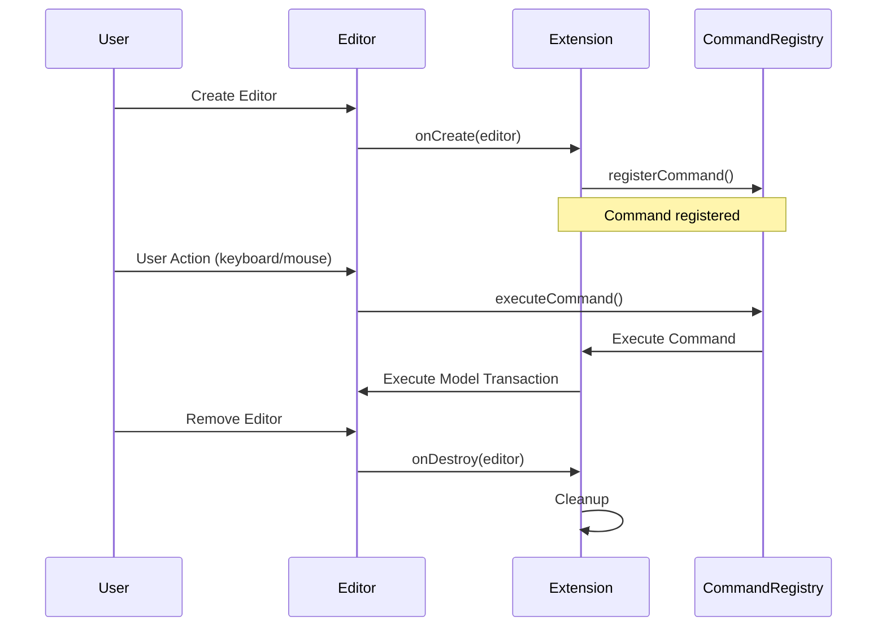
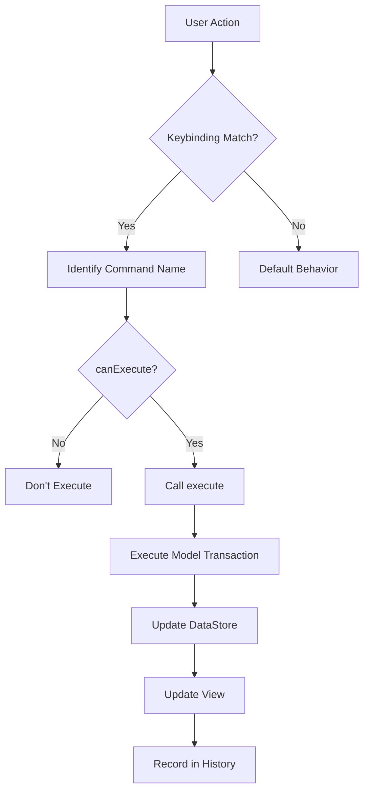
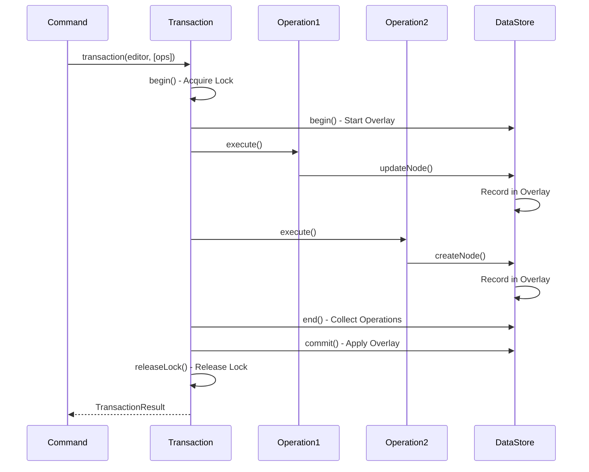
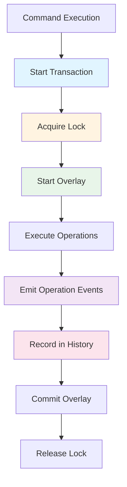
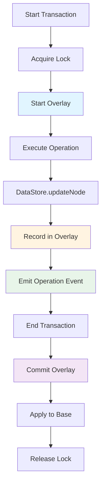
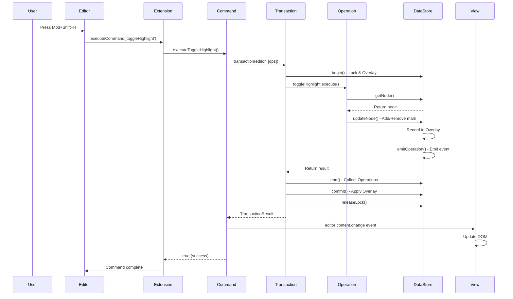

# Extension Design and Implementation Guide

This document explains how to design and implement Extensions in BaroCSS Editor step by step.

## Table of Contents

1. [What is an Extension?](#1-what-is-an-extension)
2. [What to Define in Extensions](#2-what-to-define-in-extensions)
3. [What is a Command?](#3-what-is-a-command)
4. [Model Transaction and Operation in Commands](#4-model-transaction-and-operation-in-commands)
5. [Why Commands Should Not Directly Handle DataStore](#5-why-commands-should-not-directly-handle-datastore)
6. [How to Define Model Transactions and Operations](#6-how-to-define-model-transactions-and-operations)
7. [DataStore Basic Functionality Design](#7-datastore-basic-functionality-design)
8. [Complete Sample: Highlight Extension Implementation](#8-complete-sample-highlight-extension-implementation)

---

## 1. What is an Extension?

An **Extension** is a module that adds new functionality to the editor. Extensions handle user actions (keyboard input, mouse clicks, etc.) and provide commands that modify documents.

### Role of Extensions

- **Command Registration**: Register new commands with the editor
- **Keybinding Connection**: Connect keyboard shortcuts to commands
- **Event Handling**: Detect and handle user actions
- **Feature Extension**: Extend the editor's basic functionality

### Extension Interface

```typescript
interface Extension {
  name: string;              // Extension name (unique identifier)
  priority: number;          // Priority (lower numbers execute first)
  
  onCreate(editor: Editor): void;    // Extension initialization
  onDestroy(editor: Editor): void;  // Extension cleanup
}
```

### Extension Lifecycle



---

## 2. What to Define in Extensions

Extensions primarily define the following:

### 2.1 Command Definition

Commands are actions that users can execute. Examples: `toggleBold`, `insertText`, `deleteNode`

### 2.2 Command Execution Logic

Define the work to be performed when a command is executed.

### 2.3 Command Execution Availability Check

Use the `canExecute` method to check if a command can be executed.

### 2.4 Keybindings (Optional)

Connect keyboard shortcuts to commands.

### Basic Structure

```typescript
export class MyExtension implements Extension {
  name = 'myExtension';
  priority = 100;

  onCreate(editor: Editor): void {
    // 1. Register Command
    (editor as any).registerCommand({
      name: 'myCommand',
      execute: async (ed: Editor, payload?: any) => {
        return await this._executeMyCommand(ed, payload);
      },
      canExecute: (_ed: Editor, payload?: any) => {
        return this._canExecuteMyCommand(_ed, payload);
      }
    });
  }

  onDestroy(_editor: Editor): void {
    // Cleanup
  }

  private async _executeMyCommand(editor: Editor, payload?: any): Promise<boolean> {
    // Command execution logic
    return true;
  }

  private _canExecuteMyCommand(_editor: Editor, payload?: any): boolean {
    // Check execution availability
    return true;
  }
}
```

---

## 3. What is a Command?

A **Command** is a unit of executable work in the editor. User actions (keyboard input, menu clicks, etc.) are converted into commands and executed.

### Role of Commands

1. **Express User Intent**: Clearly express what the user wants to do
2. **Check Execution Availability**: Use `canExecute` to check if execution is possible
3. **Atomic Work Unit**: One command represents one complete action
4. **Undo/Redo Support**: Commands are recorded in history for undo/redo

### Command Structure

```typescript
interface Command {
  name: string;                                    // Command name
  execute: (editor: Editor, payload?: any) => Promise<boolean> | boolean;
  canExecute?: (editor: Editor, payload?: any) => boolean;
}
```

### Command Execution Flow



### Command Example

```typescript
// Bold toggle Command
{
  name: 'toggleBold',
  execute: async (editor, payload) => {
    // Bold toggle logic
    return true;
  },
  canExecute: (editor, payload) => {
    // Check if text is selected
    return !!payload?.selection;
  }
}
```

---

## 4. Model Transaction and Operation in Commands

Commands modify documents through **Model Transactions**. A transaction consists of one or more **Operations**.

### 4.1 What is a Transaction?

A **Transaction** is a unit that bundles multiple operations into one atomic action. All operations within a transaction either succeed or all fail.

### 4.2 What is an Operation?

An **Operation** is the minimum unit for modifying documents. Examples: `create`, `update`, `delete`, `move`, `transformNode`, `toggleMark`

### 4.3 Command → Transaction → Operation Flow



### 4.4 Using Transactions in Commands

```typescript
import { transaction, control, toggleMark } from '@barocss/model';

private async _executeToggleBold(
  editor: Editor,
  selection?: ModelSelection
): Promise<boolean> {
  if (!selection || selection.type !== 'range') {
    return false;
  }

  // 1. Create Transaction
  const ops = [
    ...control(selection.startNodeId, [
      toggleMark('bold', [startOffset, endOffset])
    ])
  ];

  // 2. Execute Transaction
  const result = await transaction(editor, ops).commit();
  
  // 3. Return Result
  return result.success;
}
```

---

## 5. Why Commands Should Not Directly Handle DataStore

Commands **must never directly modify DataStore**. They must always go through Model Transactions and Operations.

### 5.1 Why Not Direct Handling?

#### 1. **Transaction Guarantee Failure**

```typescript
// ❌ Wrong Way
private async _executeBadCommand(editor: Editor): Promise<boolean> {
  const dataStore = (editor as any).dataStore;
  
  // Direct modification - no transaction
  dataStore.updateNode('node-1', { text: 'Updated' });
  dataStore.createNode({ stype: 'paragraph' });
  
  // Problem: If error occurs in the middle, only partial changes are applied
  return true;
}
```

#### 2. **Lock Management Missing**

DataStore uses a lock system for concurrency control. Direct modification doesn't acquire locks, which can cause race conditions.

#### 3. **History Recording Missing**

Transactions are automatically recorded in history. Direct modification makes undo/redo impossible.

#### 4. **Operation Event Missing**

Operation events are needed for collaboration. Direct modification doesn't emit events.

#### 5. **Overlay System Bypass**

Transactions guarantee atomicity through overlays. Direct modification bypasses the overlay.

### 5.2 Correct Way

```typescript
// ✅ Correct Way
import { transaction, control, updateNode, createNode } from '@barocss/model';

private async _executeGoodCommand(editor: Editor): Promise<boolean> {
  // Modify through Transaction
  const ops = [
    ...control('node-1', [
      updateNode({ text: 'Updated' })
    ]),
    createNode({ stype: 'paragraph' })
  ];

  const result = await transaction(editor, ops).commit();
  return result.success;
}
```

### 5.3 Benefits of Transactions



---

## 6. How to Define Model Transactions and Operations

This section explains how to define operations in Model and use them in transactions.

### 6.1 Defining Operations

Operations are defined using `defineOperation`.

#### 6.1.1 Basic Operation Definition

```typescript
// packages/model/src/operations/myOperation.ts
import { defineOperation } from './define-operation';
import type { TransactionContext } from '../types';
import type { INode } from '@barocss/datastore';

// 1. Define Operation Type
export interface MyOperation {
  type: 'myOperation';
  nodeId: string;
  data: any;
}

// 2. Define Operation Execution Logic
defineOperation('myOperation', async (operation: MyOperation, context: TransactionContext) => {
  const { nodeId, data } = operation;
  
  // Modify node through DataStore
  const node = context.dataStore.getNode(nodeId);
  if (!node) {
    throw new Error(`Node not found: ${nodeId}`);
  }

  // Perform modification
  context.dataStore.updateNode(nodeId, data);

  // Return result
  return {
    ok: true,
    data: context.dataStore.getNode(nodeId),
    inverse: { type: 'myOperation', payload: { nodeId, data: node } } // For undo
  };
});
```

#### 6.1.2 Registering Operations

```typescript
// packages/model/src/operations/register-operations.ts
import './myOperation';
// Import other operations...
```

### 6.2 Defining Operation DSL

Operation DSL provides helper functions for convenient use in transactions.

#### 6.2.1 DSL Definition

```typescript
// packages/model/src/operations-dsl/myOperation.ts
import { defineOperationDSL } from './define-operation-dsl';

export const myOperation = defineOperationDSL(
  (nodeId: string, data: any) => ({
    type: 'myOperation',
    payload: { nodeId, data }
  }),
  { atom: false, category: 'content' }
);
```

#### 6.2.2 Using DSL

```typescript
import { transaction, control, myOperation } from '@barocss/model';

const ops = [
  ...control('node-1', [
    myOperation('node-1', { text: 'Updated' })
  ])
];

await transaction(editor, ops).commit();
```

### 6.3 Transaction DSL

Transactions bundle multiple operations for execution.

#### 6.3.1 Creating Transactions

```typescript
import { transaction, control, node, textNode } from '@barocss/model';

// 1. Create Operation Array
const ops = [
  // Group operations for a specific node using control()
  ...control('parent-id', [
    createNode(node('paragraph', {}, [
      textNode('inline-text', 'Hello')
    ]))
  ])
];

// 2. Execute Transaction
const result = await transaction(editor, ops).commit();

if (result.success) {
  console.log('Transaction succeeded');
} else {
  console.error('Transaction failed:', result.errors);
}
```

#### 6.3.2 Transaction DSL Elements

- **`transaction(editor, ops)`**: Create transaction
- **`control(nodeId, ops)`**: Group operations for a specific node
- **`node(stype, attrs, content)`**: Create node
- **`textNode(stype, text, marks, attrs)`**: Create text node
- **`mark(type, attrs)`**: Create mark

### 6.4 Real Example: toggleMark Operation

```typescript
// packages/model/src/operations/toggleMark.ts
import { defineOperation } from './define-operation';
import type { TransactionContext } from '../types';

export interface ToggleMarkOperation {
  type: 'toggleMark';
  nodeId: string;
  markType: string;
  range: [number, number];
}

defineOperation('toggleMark', async (operation: ToggleMarkOperation, context: TransactionContext) => {
  const { nodeId, markType, range } = operation;
  const node = context.dataStore.getNode(nodeId);
  
  if (!node || typeof node.text !== 'string') {
    throw new Error(`Invalid node for toggleMark: ${nodeId}`);
  }

  const marks = node.marks || [];
  const [start, end] = range;
  
  // Check if mark exists
  const existingMark = marks.find(m => m.type === markType && m.range[0] === start && m.range[1] === end);
  
  if (existingMark) {
    // Remove mark
    const newMarks = marks.filter(m => m !== existingMark);
    context.dataStore.updateNode(nodeId, { marks: newMarks });
  } else {
    // Add mark
    const newMark = { type: markType, range: [start, end] };
    context.dataStore.updateNode(nodeId, { marks: [...marks, newMark] });
  }

  return {
    ok: true,
    data: context.dataStore.getNode(nodeId),
    inverse: { type: 'toggleMark', payload: { nodeId, markType, range } }
  };
});
```

```typescript
// packages/model/src/operations-dsl/toggleMark.ts
import { defineOperationDSL } from './define-operation-dsl';

export const toggleMark = defineOperationDSL(
  (markType: string, range: [number, number]) => ({
    type: 'toggleMark',
    payload: { markType, range }
  }),
  { atom: false, category: 'format' }
);
```

---

## 7. DataStore Basic Functionality Design

DataStore is the core storage that stores and manages document nodes. Operations call DataStore methods to modify documents.

### 7.1 Role of DataStore

1. **Node Storage**: Store nodes in `Map<sid, INode>` format
2. **Transaction Management**: Manage transactions through Overlay and Lock
3. **Schema Validation**: Validate that nodes conform to schema
4. **Operation Events**: Emit events when operations occur

### 7.2 DataStore Basic Methods

#### 7.2.1 Node Retrieval

```typescript
// Get node
const node = dataStore.getNode('node-id');

// Get root node
const root = dataStore.getRootNode();
```

#### 7.2.2 Node Modification

```typescript
// Update node
dataStore.updateNode('node-id', { text: 'Updated' });

// Create node
const newNode = dataStore.createNode({
  stype: 'paragraph',
  text: 'Hello'
});

// Delete node
dataStore.deleteNode('node-id');
```

#### 7.2.3 Node Transformation

```typescript
// Transform node type (paragraph → heading)
dataStore.transformNode('node-id', 'heading', { level: 1 });
```

#### 7.2.4 Content Management

```typescript
// Add child
dataStore.content.addChild('parent-id', childNode, 0);

// Remove child
dataStore.content.removeChild('parent-id', 'child-id');

// Move node
dataStore.content.moveNode('node-id', 'new-parent-id', 0);
```

### 7.3 Using DataStore in Operations

Operations access DataStore through TransactionContext.

```typescript
defineOperation('myOperation', async (operation, context: TransactionContext) => {
  // Access through context.dataStore
  const node = context.dataStore.getNode(operation.nodeId);
  context.dataStore.updateNode(operation.nodeId, operation.data);
  
  return { ok: true, data: node };
});
```

### 7.4 Relationship Between DataStore and Transaction



---

## 8. Complete Sample: Highlight Extension Implementation

Now we'll implement a working Highlight Extension to demonstrate the complete flow.

### 8.1 Requirements

- When user selects text and presses `Mod+Shift+H`, toggle highlight mark
- Highlight is displayed with yellow background
- Toggling the same range again removes the highlight

### 8.2 Step-by-Step Implementation

#### Step 1: Verify Highlight Mark Type Support in DataStore

DataStore already supports marks through the `IMark` interface, so no additional work is needed.

```typescript
// DataStore already supports marks
interface IMark {
  type: string;           // 'highlight'
  range: [number, number]; // [start, end]
  attrs?: Record<string, any>; // { color?: string }
}
```

#### Step 2: Define Model Operation

```typescript
// packages/model/src/operations/toggleHighlight.ts
import { defineOperation } from './define-operation';
import type { TransactionContext } from '../types';

export interface ToggleHighlightOperation {
  type: 'toggleHighlight';
  nodeId: string;
  range: [number, number];
  color?: string; // Default: 'yellow'
}

defineOperation('toggleHighlight', async (
  operation: ToggleHighlightOperation,
  context: TransactionContext
) => {
  const { nodeId, range, color = 'yellow' } = operation;
  const node = context.dataStore.getNode(nodeId);
  
  if (!node || typeof node.text !== 'string') {
    throw new Error(`Invalid node for toggleHighlight: ${nodeId}`);
  }

  const marks = node.marks || [];
  const [start, end] = range;
  
  // Check if highlight mark exists
  const existingMark = marks.find(
    m => m.type === 'highlight' && 
         m.range[0] === start && 
         m.range[1] === end &&
         m.attrs?.color === color
  );
  
  if (existingMark) {
    // Remove mark
    const newMarks = marks.filter(m => m !== existingMark);
    context.dataStore.updateNode(nodeId, { marks: newMarks });
    
    return {
      ok: true,
      data: context.dataStore.getNode(nodeId),
      inverse: {
        type: 'toggleHighlight',
        payload: { nodeId, range, color }
      }
    };
  } else {
    // Add mark
    const newMark = {
      type: 'highlight',
      range: [start, end],
      attrs: { color }
    };
    context.dataStore.updateNode(nodeId, {
      marks: [...marks, newMark]
    });
    
    return {
      ok: true,
      data: context.dataStore.getNode(nodeId),
      inverse: {
        type: 'toggleHighlight',
        payload: { nodeId, range, color }
      }
    };
  }
});
```

#### Step 3: Define Operation DSL

```typescript
// packages/model/src/operations-dsl/toggleHighlight.ts
import { defineOperationDSL } from './define-operation-dsl';

export const toggleHighlight = defineOperationDSL(
  (range: [number, number], color?: string) => ({
    type: 'toggleHighlight',
    payload: { range, color }
  }),
  { atom: false, category: 'format' }
);
```

#### Step 4: Register Operation

```typescript
// packages/model/src/operations/register-operations.ts
import './toggleHighlight'; // Add

// ... other operations
```

```typescript
// packages/model/src/operations-dsl/index.ts
export * from './toggleHighlight'; // Add

// ... other DSL exports
```

#### Step 5: Implement Extension

```typescript
// packages/extensions/src/highlight.ts
import { Editor, Extension, type ModelSelection } from '@barocss/editor-core';
import { transaction, control, toggleHighlight } from '@barocss/model';

export interface HighlightExtensionOptions {
  enabled?: boolean;
  defaultColor?: string;
}

export class HighlightExtension implements Extension {
  name = 'highlight';
  priority = 100;

  private _options: HighlightExtensionOptions;

  constructor(options: HighlightExtensionOptions = {}) {
    this._options = {
      enabled: true,
      defaultColor: 'yellow',
      ...options
    };
  }

  onCreate(editor: Editor): void {
    if (!this._options.enabled) return;

    // Register toggleHighlight command
    (editor as any).registerCommand({
      name: 'toggleHighlight',
      execute: async (ed: Editor, payload?: { 
        selection?: ModelSelection;
        color?: string;
      }) => {
        return await this._executeToggleHighlight(
          ed,
          payload?.selection,
          payload?.color
        );
      },
      canExecute: (_ed: Editor, payload?: { selection?: ModelSelection }) => {
        return !!payload?.selection && payload.selection.type === 'range';
      }
    });
  }

  onDestroy(_editor: Editor): void {
    // Add cleanup if needed
  }

  private async _executeToggleHighlight(
    editor: Editor,
    selection?: ModelSelection,
    color?: string
  ): Promise<boolean> {
    // 1. Validate Selection
    if (!selection || selection.type !== 'range') {
      return false;
    }

    const dataStore = (editor as any).dataStore;
    if (!dataStore) {
      console.error('[HighlightExtension] dataStore not found');
      return false;
    }

    // 2. Only handle same-node ranges (simple implementation)
    if (selection.startNodeId !== selection.endNodeId) {
      console.warn('[HighlightExtension] Cross-node selection not supported yet');
      return false;
    }

    // 3. Validate Node
    const node = dataStore.getNode(selection.startNodeId);
    if (!node || typeof node.text !== 'string') {
      return false;
    }

    const text = node.text as string;
    const { startOffset, endOffset } = selection;

    // 4. Validate Range
    if (
      typeof startOffset !== 'number' ||
      typeof endOffset !== 'number' ||
      startOffset < 0 ||
      endOffset > text.length ||
      startOffset >= endOffset
    ) {
      return false;
    }

    // 5. Create and Execute Transaction
    const ops = [
      ...control(selection.startNodeId, [
        toggleHighlight([startOffset, endOffset], color || this._options.defaultColor)
      ])
    ];

    const result = await transaction(editor, ops).commit();
    return result.success;
  }
}

// Convenience function
export function createHighlightExtension(
  options?: HighlightExtensionOptions
): HighlightExtension {
  return new HighlightExtension(options);
}
```

#### Step 6: Register Extension

```typescript
// packages/extensions/src/index.ts
export * from './highlight'; // Add

// ... other exports
```

#### Step 7: Add Keybinding

```typescript
// packages/editor-core/src/keybinding/default-keybindings.ts
export const DEFAULT_KEYBINDINGS = [
  // ... existing keybindings
  
  // Highlight toggle
  { 
    key: 'Mod+Shift+h', 
    command: 'toggleHighlight', 
    when: 'editorFocus && editorEditable' 
  },
];
```

#### Step 8: Use Extension

```typescript
// Usage example
import { Editor } from '@barocss/editor-core';
import { createHighlightExtension } from '@barocss/extensions';

const editor = new Editor({
  extensions: [
    createHighlightExtension({
      defaultColor: 'yellow'
    })
  ]
});
```

### 8.3 Complete Code Flow



### 8.4 Testing

```typescript
// packages/extensions/test/highlight-extension.test.ts
import { describe, it, expect, beforeEach } from 'vitest';
import { Editor } from '@barocss/editor-core';
import { DataStore } from '@barocss/datastore';
import { Schema } from '@barocss/schema';
import { HighlightExtension } from '../src/highlight';
import '../../model/src/operations/register-operations';

describe('HighlightExtension', () => {
  let editor: Editor;
  let dataStore: DataStore;

  beforeEach(() => {
    const schema = new Schema('test-schema', {
      nodes: {
        document: { content: 'block+' },
        paragraph: { content: 'inline*', group: 'block' },
        'inline-text': { content: 'text*', group: 'inline' }
      },
      topNode: 'document'
    });

    dataStore = new DataStore(undefined, schema);
    editor = new Editor({
      dataStore,
      extensions: [new HighlightExtension()]
    });
  });

  it('should toggle highlight on selected text', async () => {
    // Test implementation...
  });
});
```

---

## Summary

### Extension Design Principles

1. **Commands modify documents through Transactions**
2. **Never directly modify DataStore**
3. **Design Operations for reusability**
4. **Provide convenience through DSL**
5. **Include error handling and validation**

### Implementation Checklist

- [ ] Define Extension class (`implements Extension`)
- [ ] Register Command (`registerCommand`)
- [ ] Implement `canExecute` method
- [ ] Use Transaction in `execute` method
- [ ] Define Model Operation (`defineOperation`)
- [ ] Define Operation DSL (`defineOperationDSL`)
- [ ] Register Operation (`register-operations.ts`)
- [ ] Add keybinding (optional)
- [ ] Write tests

### References

- [Extension README](../README.md)
- [Model README](../../model/README.md)
- [DataStore README](../../datastore/README.md)
- [Transaction Integration Guide](../../datastore/docs/transaction-integration.md)
