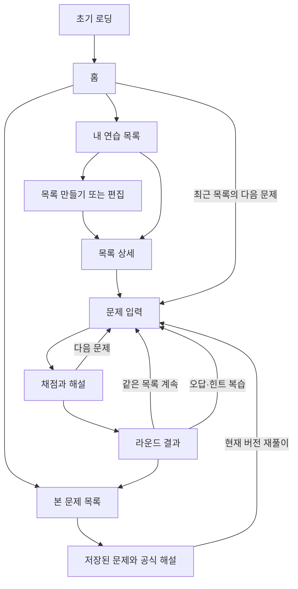

# 공식 한 칸: 화면 흐름과 연습 목록

작성일: 2026-09-10

## 학교 과목으로 찾기 — 현재 구현

기본 경로는 학교 → 배우는 과목 → 단원 → 내 연습 목록이다. 새 목록 화면에서 ‘분야로 직접 찾기’를 선택하면 기존의 과목·수준·분야·주제 조건을 사용할 수 있다. 두 편집 화면의 입력은 전환 중 유지된다. 기존 저장 목록은 원래 경로로 편집한다.

현재 중2 수학, 중3 수학, 공통수학1, 공통수학2의 일부 단원을 제공한다. 공통수학2의 도형의 방정식 단원에는 원점까지의 거리와 원의 방정식 4문제가 있다. 다른 단원은 준비 중이다. 표시하는 개수는 제공 분량이며, 과목 전체 수록을 뜻하지 않는다. 여러 과목의 단원을 한 목록에 담을 수 있다. 풀이 개수와 순서는 접힌 ‘풀이 설정’에 둔다.

홈의 ‘한 줄씩 유도하기’는 별도 경로다. [유도 연습 설계](derivation-play.md)를 참고한다.

## 제품의 중심 단위

사용자가 저장하는 것은 ‘연습 목록’이다. 목록은 조건, 이름, 출제 방식으로 구성한다. 과목이나 분야의 고정 목록을 게임 메뉴로 사용하지 않는다.

예: ‘대학 응용통계’ = 수학 + 대학 + 응용통계. 같은 목록으로 계속 연습한다. 나중에 조건에 맞는 새 공식이 공개되면 자동으로 포함한다. 아직 문제가 없어도 목록을 저장할 수 있다. 이때 문제 수 0과 준비 중 상태를 표시하고 시작 버튼은 비활성화한다.

## 화면의 역할

| 화면             | 역할                       | 주요 행동                                           |
| ---------------- | -------------------------- | --------------------------------------------------- |
| 초기 로딩        | 앱을 준비하는 상태를 알림  | 준비되면 즉시 홈 표시                               |
| 홈               | 다음 행동 선택             | 최근 목록으로 다음 문제, 내 목록 열기, 본 문제 열기 |
| 내 연습 목록     | 저장한 목록 관리           | 검색, 목록 선택, 새로 만들기                        |
| 목록 만들기·편집 | 개인 학습 범위 정의        | 범위 추가, 여러 조건 선택, 이름과 출제 방식 저장    |
| 목록 상세        | 이 목록의 현재 콘텐츠 확인 | 문제 시작, 편집, 복제, 삭제                         |
| 문제·피드백      | 빈칸 입력과 이해           | 정답 확인, 공식 해설, 다음 문제                     |
| 결과             | 이번 라운드 확인           | 같은 목록의 다음 문제, 오답·힌트 복습, 본 문제 열기 |
| 본 문제·해설     | 본 내용을 다시 확인        | 검색, 기록 필터, 해설 읽기, 현재 버전으로 재풀이    |

## 학교 과목 데이터

`curriculum.ts`에서 학교 과목과 단원을 학문 분야와 따로 관리한다. 과목 ID에는 분류 또는 교육과정 판본을 구분한다. 단원은 공식 ID를 참조한다. 학년별 문항 제한이 필요하면 questionIds로 출제 문항을 지정한다. 중3 목록에는 세제곱·네제곱 변형 문제를 넣지 않는다.

중학교 단원 이름은 [EBSMath](https://www.ebsmath.co.kr/siteMap)의 학습 분류를 참고했다. 고교 과목과 다항식 범위는 [경기도교육청 2022 개정 자료](https://www.goe.go.kr/resource/old/BBSMSTR_000000030224/BBS_202503100916461641.pdf)를 참고했다. 개별 공식과 문항 배치는 앱의 편집 판단이며 전체 교육과정 인증을 뜻하지 않는다.

기존 범위에 선택적인 courseId와 unitIds를 더한다. 과목 안에서 단원 ID가 비어 있으면 등록 단원 전체다. 특정 단원을 저장하면 그 단원만 포함한다. 여러 범위는 합치고 중복 문제를 제거한다. 알 수 없는 ID는 저장 상태를 유지하며 전체 문제로 확대하지 않는다. 기존 분야 조건은 변환하지 않는다.

## 직접 찾기의 목록 규칙

- 각 범위는 과목·학습 수준·분야·주제를 가진다. 선택하지 않은 항목은 전체다.
- 같은 항목에서 여러 개를 고르면 그중 하나에 속하는 콘텐츠를 포함한다.
- 서로 다른 항목은 함께 만족해야 한다. ‘수학 + 대학 + 응용통계’는 세 조건을 모두 만족해야 한다.
- 범위를 추가하면 결과를 합친다. 예: ‘수학·대학·응용통계’와 ‘물리·고등·역학’. 중복 문제는 한 번만 포함한다.
- 관련 없는 선택을 조용히 지우지 않는다. 결과가 0이면 현재 조건을 유지하고 설명한다.
- 과목·분야·학습 수준·주제는 콘텐츠 데이터에서 읽는다. 검색과 복수 선택을 지원한다. 학습 수준도 고정 enum으로 제한하지 않는다.
- 난이도, 라운드 크기, 이어 익히기·섞기·복습은 목록 전체에 적용한다.
- 목록에는 문제 목록을 고정 저장하지 않는다. 안정된 분류 ID로 조건을 저장하고, 실행할 때 현재 공개 콘텐츠에서 선택한다.
- 분류가 삭제되면 해당 ID를 목록에서 자동 제거하지 않는다. 누락된 조건을 표시하고 사용자가 편집하게 한다.

## 상태와 돌아가기

홈과 목록 선택은 분리한다. 편집 취소는 저장된 목록을 바꾸지 않는다. 목록 삭제는 풀이 기록과 본 문제를 지우지 않는다. 삭제 직후 되돌리기를 제공한다. 저장 실패는 화면에서 알린다.

‘계속 풀기’는 같은 조건의 다음 라운드다. 종료한 화면의 커서까지 복원하는 기능은 아니다. 현재 라운드를 나가면 그동안 본 문제와 제출한 답안은 보관함에 남는다. 이번 구현은 기존 라운드 통계를 유지한다. 제출 즉시 통계 저장과 중단 라운드 복원은 후속 과제다.

현재 목록과 보관함은 이 기기의 익명 사용자 ID별로 저장한다. 계정 로그인과 서버 동기화는 별도 작업이다. 사용자 조건과 공식 원본을 분리해, 서버 저장소로 바꿀 때 같은 목록 모델을 사용할 수 있게 한다.

## 앱인토스 시작 화면 조사

- [콘솔 앱 등록 안내](https://developers-apps-in-toss.toss.im/prepare/console-workspace.html): 스크린샷은 검색 결과와 앱 미리보기용이다. 현재 문서는 제출을 선택 사항으로 안내한다. 로딩 화면 이미지라고 설명하지 않는다.
- [로딩 화면 커스터마이징](https://developers-apps-in-toss.toss.im/unity/sdk/loading-screen.html): `loading.html`과 진행률 API 안내는 Unity SDK용이다. 현재 React WebView 앱에 같은 API를 적용하지 않는다.
- [WebView 전역 설정](https://developers-apps-in-toss.toss.im/bedrock/reference/framework/UI/Config.html): 브랜드 이름·색상·아이콘 설정을 안내한다. 확인한 문서 범위에서 스크린샷을 WebView 스플래시로 지정하는 기능은 확인하지 못했다.

현재 구현은 웹 콘텐츠가 준비되는 동안 작은 로고와 로딩 문구를 표시한다. 인위적인 대기 시간이나 가짜 진행률은 넣지 않는다. 준비되면 홈으로 바뀐다. 토스 호스트 자체의 시작 화면과 실제 표시 순서는 실기기에서 확인해야 한다. 미리보기용 스크린샷은 화면 구성이 안정된 뒤 별도로 제작한다.
