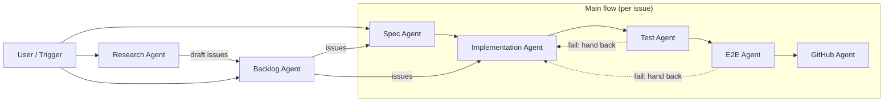
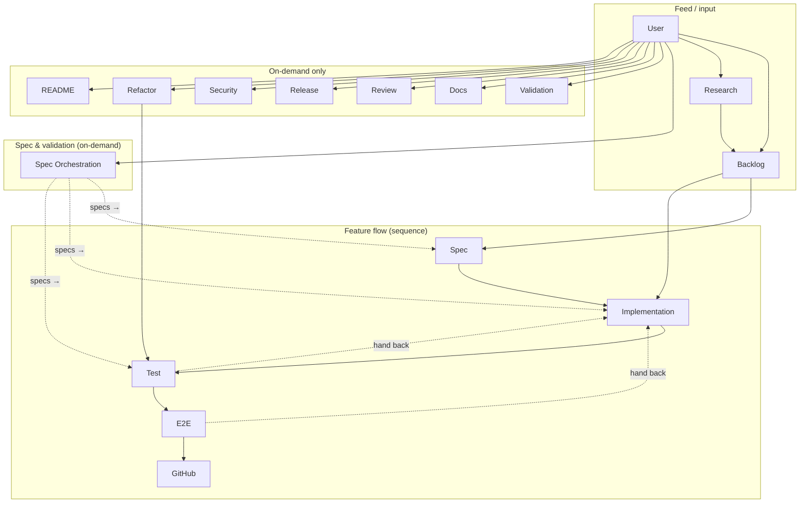

# Agent Roles and Orchestration

This doc defines **role-based sub-agents** so that work can be split and run in sequence without a human giving every command. Each role has a clear **focus**, **inputs**, **outputs**, and **handoff** to the next role. Orchestration can be **manual** (“act as X Agent”) or **trigger-based** (e.g. issue labels, PR events) for automation.

---

## 0. Single entry: "What needs to be done? Proceed."

When the user says **"What needs to be done? Proceed."** or **"Proceed with the next task."** or **"다음 할일 진행해줘"** (or equivalent), the agent should:

1. **Determine next task**: **Backlog = GitHub issues.** List open issues (`gh issue list --state open`). Pick the first open issue (or one labeled `next`). **If none (no open issues)**: do **not** stop. Run **Research Agent** (research other editors and materials, suggest what we need, output draft issues) → **Backlog Agent** (create GitHub issues from draft) → pick the **first new issue**, then continue to step 2. If `gh` is not available, run Research Agent only and show draft issue bodies so the user can create issues manually.
2. **Report**: "Current task: [issue title] (issue #N)".
3. **Spec verification first**: Before the full flow, run **spec verification**: run tests for the scope of the current task. If the issue targets a specific package (e.g. "fix(test): renderer-dom — foo.test.ts"), run **that package's tests only**: `pnpm --filter @barocss/<package> test -- --run` (e.g. `pnpm --filter @barocss/renderer-dom test -- --run`). Otherwise run full repo tests (`pnpm test`) or per-package in order per `docs/internal-logic-validation.md`. If any test fails, consult the spec for the failing behavior (`docs/specs/`, `packages/<name>/SPEC.md`) and follow the spec-first rule (fix test if test is wrong, fix code if spec is correct and code is wrong). See **AGENTS.md** §7.1.
4. **Proceed**: Run the full flow for that task (Spec → Implementation → Test → E2E → GitHub, or Implementation → Test → E2E → GitHub if the issue already has a checklist). Use the role definitions in this doc (§2). Do not stop between roles unless a handback is needed (e.g. tests fail). When the PR is merged with "Closes #N", the issue is closed automatically.

Full procedure is in **`.cursor/AGENTS.md`** § "Single command: What needs to be done? Proceed.".

---

## 1. Roles overview

| Role | Focus | Input | Output | Next role |
|------|--------|--------|--------|-----------|
| **Backlog** | GitHub issue lifecycle as backlog | User request (create/triage/order) | New issues, labels, issue list report | Spec / Implementation (consume issues) |
| **Research** | Research other editors, suggest new features | User request (topic or "what to add") | Report (editors, features, recommendations), draft issue bodies | User / Backlog Agent (create issues) |
| **Spec** | Spec and feature definition (per issue) | User request, existing docs/specs | Issue (optional), spec docs, checklist for Implementation | Implementation |
| **Spec Orchestration** | Full spec creation and validation | User request or schedule | Updated docs/specs + package SPECs, validation report (spec ↔ implementation ↔ test) | Spec / Test / Implementation (consume specs) |
| **Implementation** | Implement defined spec/feature | Issue + spec (docs/specs, package SPEC) | Code (model, extension, view), exec tests, docs-site updates | Test |
| **Test** | Unit and scenario tests | Code from Implementation | Unit test code/updates, test run results | E2E (if unit pass) |
| **E2E** | Browser E2E and behavior guarantee | Code + unit test results | E2E spec/updates, E2E run results | GitHub (if E2E pass) |
| **GitHub** | Issue, PR, merge, deploy | Branch + passing tests | PR, merge (if allowed), deploy (on merge) | — |
| **Docs** | Documentation only (apps/docs-site) | Spec/code change or user request | Updated docs-site pages (api, architecture, guides, examples) | — |
| **Review** | PR / branch review | PR or branch | Review comment (approve / request changes) | — |
| **Release** | Package release (changeset, version, publish) | User request or post-merge | Version PR or npm publish | — |
| **Security** | Dependency / security | User request or schedule | Audit report, dependency update PR | — |
| **Refactor** | Refactoring only (no new features) | User request or scope | Refactored code; Test Agent must pass after | Test |
| **Validation** | Internal logic validation (package tests in order) | User request or "Validate internal logic" | Per-package test:run in order; pass/fail report; fix or escalate | — |
| **README** | README only (root + packages/*/README.md) | User request or new package/feature | Updated root README.md, updated packages/*/README.md | — |

---

## 2. Role definitions

### 2.1 Spec Agent

**Focus**: Spec and feature definition only. Does not write implementation code.

**Input**:
- User request (e.g. “add insertList”, “fix selectionAfter in insertParagraph”).
- Existing `docs/specs/editor.md`, `packages/model/SPEC.md`, and related docs.

**Output**:
- **Issue** (optional): Create or update a GitHub issue from `.github/ISSUE_TEMPLATE/` (feature / bug_fix / e2e_test). Fill scope, layers, verification checklist.
- **Spec docs**: Create or update `docs/specs/editor.md` and/or `packages/<name>/SPEC.md` with behavior, invariants, operation semantics. No code.
- **Implementation checklist**: A short list for the Implementation Agent: “Implement X in model (operation + DSL + exec test), Y in extensions (command), Z in docs-site (api/model-operations).”

**Handoff**: Implementation Agent consumes the issue (and/or spec docs + checklist). Spec Agent does **not** create branches or write code.

**References**: `docs/specs/README.md`, `docs/specs/editor.md`, `.github/ISSUE_TEMPLATE/`.

---

### 2.2 Implementation Agent

**Focus**: Implement the spec/feature only. Does not define new behavior beyond the spec; does not run E2E or manage GitHub.

**Input**:
- Issue (title, body, verification section) and/or spec docs (`docs/specs/editor.md`, `packages/model/SPEC.md`) and implementation checklist from Spec Agent (or equivalent from user).

**Output**:
- **Code**: Operation + DSL + exec test (model), command (extension), key/input (view if needed). Follow `.cursor/AGENTS.md` feature loop and `packages/model/SPEC.md`.
- **Docs-site**: Add or update `apps/docs-site/docs/` (api/model-operations, architecture/model, guides, examples) and `sidebars.ts` per `docs/docs-site-integration.md`.
- **Branch**: Create branch from `main` (e.g. `feat/insert-list`, `fix/insert-paragraph-selection`). Commit and push.

**Handoff**: Test Agent consumes the branch/code and runs unit tests. Implementation Agent does **not** run E2E or open PRs (that is GitHub Agent).

**References**: `.cursor/AGENTS.md`, `.cursor/skills/model-operation-creation/SKILL.md`, `docs/specs/editor.md`, `packages/model/SPEC.md`, `docs/docs-site-integration.md`.

---

### 2.3 Test Agent

**Focus**: Unit and scenario tests. Ensures all touched packages have passing tests; does not run E2E or manage GitHub.

**Input**:
- Branch/code from Implementation Agent (or current branch).
- List of touched packages (model, extensions, editor-view, etc.).

**Output**:
- **Test code**: Add or update unit tests (e.g. exec tests, extension tests) so that the spec and behavior are covered. Fix failing tests by changing tests or escalating to Implementation (e.g. spec violation).
- **Spec-first when tests fail**: Before changing code or test, consult the spec for the failing behavior (`docs/specs/`, `packages/<name>/SPEC.md`, package docs). If the spec says X and the test expects Y, treat the spec as source of truth and fix the test (or update the spec if wrong, then fix code/test). See **AGENTS.md** §7.1.
- **No test files**: If a touched package has a `test`/`test:run` script but vitest exits with "No test files found", create a minimal test file in that package (e.g. one smoke test that imports and asserts core behavior), then re-run `test:run` for that package.
- **Test results**: Run `pnpm --filter @barocss/<package> test:run` for each touched package. Report pass/fail. If fail, consult spec first (above), then fix or hand back to Implementation.

**Handoff**: If all unit tests pass, E2E Agent runs. If tests fail and the failure is in implementation, hand back to Implementation Agent. Test Agent does **not** run E2E or open PRs.

**References**: `docs/testing-verification.md`, `.cursor/AGENTS.md` § How to verify, `packages/model/test/operations/*.exec.test.ts`.

---

### 2.4 E2E Agent

**Focus**: Browser E2E and behavior guarantee. Runs E2E and adds/updates E2E specs; does not manage GitHub.

**Input**:
- Branch/code from Implementation Agent.
- Unit test results (all pass) from Test Agent.

**Output**:
- **E2E spec**: Add or update `apps/editor-react/tests/*.spec.ts` (or editor-test) for the feature/flow. Follow existing spec style (content layer, assertions).
- **E2E results**: Run `pnpm test:e2e:react` (or `pnpm test:e2e`). Report pass/fail. If fail, fix E2E spec or escalate to Implementation (e.g. behavior bug).

**Handoff**: If E2E passes, GitHub Agent can open PR and manage merge/deploy. If E2E fails, fix or hand back to Implementation. E2E Agent does **not** open PRs or merge.

**References**: `docs/testing-verification.md` §2.4, `apps/editor-react/tests/`, `.cursor/AGENTS.md` § Verification by scenario.

---

### 2.5 GitHub Agent

**Focus**: Issue lifecycle, PR, merge, deploy. Does not write spec or implementation code; operates on branches and CI status.

**Input**:
- Branch with passing unit tests (Test Agent) and passing E2E (E2E Agent).
- Optionally: issue number to link (e.g. Closes #123).

**Output**:
- **Push branch**: Push the branch (`git push origin <branch>`). Do **not** merge the branch into `main` locally and push `main`.
- **PR**: Open PR from branch to `main` using `.github/PULL_REQUEST_TEMPLATE.md` (what changed, verification checklist). **Include "Closes #N" in the PR body** so the issue is closed when the PR is merged. Use `gh pr create` (or GitHub web UI).
- **Merge via PR**: When CI passes (and optional review), merge the PR on GitHub (merge button or `gh pr merge`). Do **not** run `git merge <branch> main` locally and push `main`.
- **Deploy**: Docs deploy via `.github/workflows/docs.yml` on push to `main`. Package release via changesets + `pnpm release` when desired (see `docs/github-agent-integration.md`).

**Handoff**: None. After merge, deploy runs automatically (docs). GitHub Agent does **not** edit specs or implementation; does **not** merge locally and push main.

**References**: `docs/github-agent-integration.md`, `.github/PULL_REQUEST_TEMPLATE.md`, `.github/workflows/ci.yml`, `.github/workflows/docs.yml`.

---

### 2.6 Backlog Agent

**Focus**: GitHub issue lifecycle as backlog — create, label, order, triage. Does not implement or write spec/code.

**Input**:
- User request (e.g. “Create an issue: add insertList”, “Triage backlog”, “Add next label to the issue to do next”, “List open issues”).
- Optionally: Research Agent report (draft issue bodies) to turn into issues.

**Output**:
- **New issues**: Create issues from `.github/ISSUE_TEMPLATE/` (feature / bug_fix / e2e_test). Fill title and body from user or from Research draft.
- **Labels**: Add or remove labels (e.g. `next`, `backlog`, `priority:high`) to order or triage.
- **Report**: List open issues with labels (e.g. “Open: #5 next, #6 #7 backlog”). Optionally suggest “Next task: #5”.

**Handoff**: Spec Agent or Implementation Agent consumes issues. Backlog Agent does **not** implement or write spec docs.

**References**: `.github/ISSUE_TEMPLATE/`, `docs/github-agent-integration.md` §2, `.cursor/backlog.md`.

---

### 2.7 Research Agent

**Focus**: Research other editors and suggest new features to add. Does not implement or write code.

**Input**:
- User request (e.g. “Research other editors and suggest features we could add”, “Research how other editors handle list editing”, “Compare list features in ProseMirror / Slate / Lexical / TipTap”).

**Output**:
- **Report** (markdown or comment): Editors reviewed, features found, recommendation (what to add, priority, brief rationale). Optionally: draft issue title + body for each suggestion so Backlog Agent or user can create issues.
- Does **not** create issues directly unless user asks (e.g. “Research and create issues” → then coordinate with Backlog Agent or create via `gh issue create`).

**Handoff**: Report → user (to decide) or Backlog Agent (to create issues from suggestions). Research Agent does **not** implement.

**References**: None in repo; use web search or public docs for ProseMirror, Slate, Lexical, TipTap, Notion, etc.

---

### 2.8 Docs Agent

**Focus**: Documentation only — update `apps/docs-site` (api, architecture, guides, examples) when spec or code changed. Does not implement or write spec/code.

**Input**:
- User request (e.g. “Update docs only”, “Align api/model-operations docs”).
- Spec or code change (e.g. new operation added; Docs Agent syncs docs-site to match).

**Output**:
- **Updated docs-site**: Add or update `apps/docs-site/docs/` (api/model-operations, architecture/model, guides, examples) and `sidebars.ts` per `docs/docs-site-integration.md`. Build with `pnpm --filter @barocss/docs-site build` to verify.

**Handoff**: None. Docs Agent does **not** implement or change spec/code.

**References**: `docs/docs-site-integration.md`, `apps/docs-site/docs/`, `.cursor/AGENTS.md` § Feature-adding loop step 6.

---

### 2.9 Review Agent

**Focus**: PR or branch review — check against spec, patterns, tests. Output review comment (approve / request changes). Does not implement.

**Input**:
- PR (e.g. `gh pr view`) or branch + diff.
- Spec docs, `.cursor/AGENTS.md` verification checklist.

**Output**:
- **Review comment**: Does the PR match the issue/spec? Are tests run and passing? Are docs-site updates included if needed? Approve or request changes (list concrete items). Does **not** push code or merge.

**Handoff**: None. Review Agent does **not** implement or merge.

**References**: `.github/PULL_REQUEST_TEMPLATE.md`, `docs/specs/README.md`, `docs/testing-verification.md`.

---

### 2.10 Release Agent

**Focus**: Package release — changeset add, version-packages, publish (npm). Separate from GitHub Agent (merge/deploy docs).

**Input**:
- User request (e.g. “Release”, “Bump version and publish”) or trigger after merge to `main`.

**Output**:
- **Changeset**: Run `pnpm changeset` (or add changeset file) to describe the change and version bump type.
- **Version**: Run `pnpm version-packages` (consumes changesets, updates versions); commit and push (or open “Version packages” PR).
- **Publish**: Run `pnpm release` (`pnpm build && changeset publish`) when ready to publish to npm. Requires npm token in environment.

**Handoff**: None. Release Agent does **not** implement features or merge PRs.

**References**: `docs/github-agent-integration.md` §6.2, `.changeset/config.json`, root `package.json` scripts `changeset`, `version-packages`, `release`.

---

### 2.11 Security Agent

**Focus**: Dependency and security — audit, suggest or apply updates. Does not implement features.

**Input**:
- User request (e.g. “Update dependencies”, “Security audit”) or schedule (e.g. weekly).

**Output**:
- **Audit**: Run `pnpm audit`; report vulnerabilities and suggest fixes.
- **Updates**: Run `pnpm update` or update specific packages; run tests; open PR with dependency bumps if requested. Does **not** change application code beyond dependency versions.

**Handoff**: None. Security Agent does **not** implement features; optional handoff to Test Agent to run tests after dependency update.

**References**: `pnpm audit`, `pnpm update`, root and package `package.json`.

---

### 2.12 Refactor Agent

**Focus**: Refactoring only — improve structure, naming, patterns without changing behavior. No new features. Test Agent must pass after.

**Input**:
- User request (e.g. “Refactor this package”, “Clean up naming in model package”) or scope (e.g. `packages/model`).

**Output**:
- **Refactored code**: Same behavior, improved structure/naming/patterns. Run `pnpm --filter @barocss/<package> test:run` after; if fail, fix or hand back. Does **not** add new features or change spec.

**Handoff**: Test Agent runs after refactor; if tests fail, hand back to Refactor Agent (or Implementation if the failure is behavioral). Refactor Agent does **not** open PR (GitHub Agent) or change spec.

**References**: `.cursor/AGENTS.md` (feature loop, verification), `docs/testing-verification.md`.

---

### 2.13 README Agent

**Focus**: README documentation only — root **README.md** and per-package **packages/*/README.md**. Important for open source: first impression, package discovery, usage. Does not implement or change spec/code; does not touch apps/docs-site (that is Docs Agent).

**Input**:
- User request (e.g. “Update README”, “Align package READMEs”, “Add new package to root README”).
- New package or feature (sync root README packages list and package README to match current API/usage).

**Output**:
- **Root README.md**: Project overview, features, packages list (with links to packages/*/README.md), quick start, contribution/development, links to docs. Keep in sync with actual packages and apps.
- **packages/*/README.md**: Per-package description, architecture (optional), installation, basic usage, API summary, links to spec or docs-site. Keep in sync with package exports and SPEC.md if present.

**Handoff**: None. README Agent does **not** implement, change spec/code, or edit apps/docs-site.

**References**: Root `README.md`, `packages/*/README.md`, `packages/*/SPEC.md` (for package contract summary), `docs/docs-site-integration.md` (docs-site is separate; README is repo-level).

---

### 2.14 Validation Agent

**Focus**: Internal logic validation — run package tests in dependency order so that each package’s behavior is verified before adding features. Uses **`docs/internal-logic-validation.md`** as the single source of order and scope. Does not add features or change spec; only runs tests and fixes or reports failures.

**Input**:
- User request (e.g. “Validate internal logic”, “Act as Validation Agent. Validate internal logic”, “Run package tests in order”).
- **`docs/internal-logic-validation.md`**: validation order (shared → schema → … → devtool), per-package scope, and run commands.

**Output**:
- **Test runs**: For each package in the documented order, run `pnpm --filter @barocss/<package> test:run`. If a package has no `test:run`, skip or note.
- **No test files**: If a package has a `test`/`test:run` script but vitest exits with "No test files found", create a minimal test file in that package (e.g. one smoke test that imports and asserts core behavior), then re-run `test:run` for that package.
- **Report**: Pass/fail per package. Before fixing: create GitHub issues for each failing package (title + body with failure summary). Do not fix until issues exist. Then proceed per issue: branch → fix → verify → commit → PR → merge (see docs/github-agent-integration.md). If escalate (e.g. “model tests fail: …”).
- **No new features**: Validation Agent does **not** implement new behavior or change specs; it only validates existing logic with tests.

**Handoff**: None. When all packages in scope pass, validation is done. If the user asked for “validate then add features”, hand off to Spec/Implementation Agent after validation passes.

**References**: **`docs/internal-logic-validation.md`** (validation order, per-package scope, run commands), `.cursor/AGENTS.md` § Where to do what (Internal logic validation), `docs/testing-verification.md`.

---

### 2.15 Spec Orchestration Agent

**Focus**: Full spec creation and validation orchestration. Ensures specs exist, are complete, and that implementation and tests align with them. Keeps spec as the single source of truth so test code stays safe. Does not implement features or run E2E; only creates/updates spec docs and validates alignment.

**Input**:
- User request (e.g. “Act as Spec Orchestration Agent. Create/update full specs and validate.”, “Validate specs against implementation and tests”).
- Existing `docs/specs/`, `packages/*/SPEC.md`, package docs (e.g. `packages/renderer-dom/docs/renderer-dom-spec.md`).

**Output**:
- **Full spec creation/update**: Ensure editor-wide specs (`docs/specs/editor.md`, `docs/specs/README.md`) and package-level specs (`packages/<name>/SPEC.md` or package docs) exist and are complete. Create or update missing or outdated spec docs. No implementation code.
- **Spec validation**: Check that implementation and tests align with specs (e.g. for each package, does code and test match what SPEC.md says?). Produce a validation report: aligned / misaligned (with package and behavior). For misalignments: create GitHub issues or update spec or hand off to Implementation/Test Agent with a concrete checklist.
- **Report**: Summary of spec coverage (what is specified, what is missing) and alignment (spec vs implementation vs test). This gives Test Agent and Implementation Agent a safe baseline: when tests fail, they consult these specs first (AGENTS.md §7.1).

**Handoff**: Spec Agent (per-issue spec) and Implementation/Test Agent consume updated specs. Spec Orchestration does **not** write implementation or run E2E; it only orchestrates spec creation and validation.

**When to run**: On demand (“Create/update full specs and validate”) or periodically (e.g. before Validation Agent runs) so that spec remains the source of truth and tests stay safe.

**References**: `docs/specs/README.md`, `docs/specs/editor.md`, `packages/*/SPEC.md`, `.cursor/AGENTS.md` §7.1 (Spec verification when tests fail).

---

## 3. Flow (sequence)

```
User / Trigger
      │
      ▼
┌─────────────┐
│ Spec Agent  │  → Issue (optional) + spec docs + implementation checklist
└─────────────┘
      │
      ▼
┌─────────────────┐
│ Implementation  │  → Branch + code + exec tests + docs-site
│ Agent          │
└─────────────────┘
      │
      ▼
┌─────────────┐
│ Test Agent  │  → Unit test pass/fail; fix or hand back
└─────────────┘
      │ (if pass)
      ▼
┌─────────────┐
│ E2E Agent   │  → E2E spec + E2E pass/fail; fix or hand back
└─────────────┘
      │ (if pass)
      ▼
┌─────────────┐
│ GitHub      │  → PR → (merge) → deploy
│ Agent       │
└─────────────┘
```

- **Handback**: If Test or E2E fails and the cause is implementation, hand back to Implementation Agent (same branch or new commit). Spec Agent is only re-invoked when the feature/spec itself changes.

**Backlog Agent** and **Research Agent** sit outside this flow: Backlog feeds issues (→ Spec/Implementation); Research feeds a report (→ user or Backlog to create issues).

### 3.0 Agent order and connections (diagrams)

**Main feature flow** — order and handbacks:



**All agents and connections** — main flow, on-demand, and spec orchestration:



| Connection | Meaning |
|------------|--------|
| **A → B** | Normal order: A runs first, output goes to B. |
| **A -.-> B** | Handback or optional feed: on failure A hands back to B; or A’s output is consumed by B when invoked. |
| **User → X** | Agent X is invoked by user (or trigger) on demand. |
| **Spec Orchestration → Spec / Implementation / Test** | Spec Orchestration updates specs; Spec, Implementation, and Test use those specs when they run. |

---

### 3.1 Orchestrator: parallel vs serial (splitting work across sub-agents)

When the **orchestrator** splits work across sub-agents:

| Phase | Parallel? | Reason |
|-------|-----------|--------|
| **Research** | ✅ Parallel OK | Read-only (other editors, materials). N agents each take a topic and output report/draft issues → orchestrator merges and picks e.g. 3 issues. |
| **Backlog** | Serial preferred | After Research results are collected, create issues. One Backlog Agent creates issues at a time. |
| **Spec** | One per issue | N issues can trigger N Spec calls, but touching the same docs/specs causes conflicts. Serial per issue or split by file/scope. |
| **Implementation** | ❌ Serial preferred | Editing the same repo/package concurrently causes conflicts and style drift. **One issue (one branch)** at a time: Implementation → Test → E2E → GitHub. |
| **Test** | Conditional | Parallel if different packages/spec files. Serial if same `*.spec.ts` or same package. |
| **E2E** | Conditional | Parallel if different `*.spec.ts` per issue. Serial if editing the same file. |

**Recommended pattern**: Orchestrator (1) runs 3 Research agents in parallel → merge results → pick e.g. 3 issues (2) Issue 1 → Spec → Implementation → Test → E2E → GitHub (3) Issue 2 same (4) Issue 3 same. **Implementation is serial per issue.** Run research in parallel; run code/tests one issue per agent in sequence for easier source maintenance.

---

## 4. How to invoke (manual vs trigger-based)

### 4.1 Manual invocation (human or coordinator)

Invoke by **role name** so the agent behaves as that role only:

| Role | Say / prompt |
|------|----------------|
| **Spec Agent** | “Act as **Spec Agent**. For [feature/fix]: create or update the issue and spec docs (docs/specs, package SPEC). Output an implementation checklist for Implementation Agent. Do not write code.” |
| **Spec Orchestration Agent** | "Act as **Spec Orchestration Agent**. Create/update full specs (docs/specs, package SPECs) and validate that implementation and tests align with specs. Report alignment and misalignments. Do not write implementation or run E2E." |
| **Implementation Agent** | “Act as **Implementation Agent**. For issue #N (or spec in docs/specs): implement per the checklist. Create branch, add operation + DSL + exec test, extension, docs-site. Do not run E2E or open PR.” |
| **Test Agent** | “Act as **Test Agent**. For the current branch: run unit tests for [packages]. If any fail, add or fix tests (or report that Implementation must fix). Do not run E2E or open PR.” |
| **E2E Agent** | “Act as **E2E Agent**. For the current branch: run E2E (pnpm test:e2e:react). Add or update E2E spec if needed. Report pass/fail. Do not open PR.” |
| **GitHub Agent** | “Act as **GitHub Agent**. For the current branch (unit + E2E passed): open PR with template, link issue #N. Do not edit spec or code.” |
| **Backlog Agent** | "Act as **Backlog Agent**. [Create an issue / Triage backlog / List open issues]. Do not implement or write spec." |
| **Research Agent** | "Act as **Research Agent**. [Research other editors and suggest features]. Output report; optionally draft issue bodies. Do not implement." |
| **Docs Agent** | "Act as **Docs Agent**. [Update docs only / Align api docs]. Update apps/docs-site only; do not implement or change spec/code." |
| **Review Agent** | "Act as **Review Agent**. [Review this PR / Review this branch]. Check against spec, patterns, tests; output review comment. Do not implement or merge." |
| **Release Agent** | "Act as **Release Agent**. [Release / Bump version and publish]. Run changeset, version-packages, release. Do not implement or merge PR." |
| **Security Agent** | "Act as **Security Agent**. [Update dependencies / Security audit]. Run pnpm audit; suggest or open PR for dependency updates. Do not implement features." |
| **Refactor Agent** | "Act as **Refactor Agent**. [Refactor this package / Clean up naming in model package]. Improve structure/naming only; no new features. Run tests after. Do not open PR." |
| **README Agent** | "Act as **README Agent**. [Update README / Align package READMEs / Add new package to root README]. Update root README.md and packages/*/README.md only; do not implement or touch apps/docs-site." |

The **orchestrator** (human or another agent) can run these in sequence: first Spec, then Implementation, then Test, then E2E, then GitHub. Backlog, Research, Docs, Review, Release, Security, Refactor, README are invoked when the user wants to manage issues, get feature suggestions, update docs only, review PR, release, audit deps, refactor, or update READMEs.

### 4.2 Trigger-based (for automation)

To run agents automatically, define **triggers** and **artifacts** so that each role knows what to consume.

| Trigger | Who runs | Consumes | Action |
|---------|----------|----------|--------|
| New issue with label `needs-spec` | Spec Agent | Issue body, existing specs | Update spec docs, add implementation checklist (e.g. in issue comment), remove `needs-spec`, add `spec-ready`. |
| Issue with label `spec-ready` | Implementation Agent | Issue + spec docs + checklist | Create branch, implement, push. Add comment “Branch: feat/xxx. Ready for Test Agent.” Add label `ready-for-test`. |
| Branch/comment “Ready for Test Agent” or label `ready-for-test` | Test Agent | Branch | Run unit tests, report in comment. If pass: add `unit-pass`. If fail: comment failure, leave for Implementation. |
| Label `unit-pass` on PR or branch | E2E Agent | Branch | Run E2E, add/update spec if needed, report in comment. If pass: add `e2e-pass`. If fail: comment failure. |
| PR with `e2e-pass` (or CI green) | GitHub Agent | PR | Optional: auto-merge when CI green and review (if configured). Deploy runs on merge. |

Implementation details (e.g. GitHub Actions, Cursor Rules, or external orchestrator) can use these labels and comments as the contract. This doc does not implement the automation; it defines the contract so that you can add it (e.g. `workflows/spec-agent.yml` that posts checklist, or a bot that assigns “Implementation Agent” when `spec-ready` is added).

### 4.3 Role files (.cursor/roles/)

Per-role scope is in **`.cursor/roles/`** so that “Act as X Agent” can @-mention the right file:

- **SPEC_AGENT.md** — Spec and feature definition (per issue); no code.
- **SPEC_ORCHESTRATION_AGENT.md** — Full spec creation and validation; keeps spec as source of truth so tests stay safe.
- **IMPLEMENTATION_AGENT.md** — Implement spec; no E2E, no PR.
- **TEST_AGENT.md** — Unit tests only; no E2E, no PR.
- **E2E_AGENT.md** — E2E spec and run only; no PR.
- **GITHUB_AGENT.md** — PR, merge, deploy; no spec/code edits.
- **DOCS_AGENT.md** — Documentation only (apps/docs-site); no implement, no spec.
- **REVIEW_AGENT.md** — PR/branch review; no implement, no merge.
- **RELEASE_AGENT.md** — Package release (changeset, version, publish); no implement, no merge.
- **SECURITY_AGENT.md** — Dependency/security; no feature implement.
- **REFACTOR_AGENT.md** — Refactoring only; no new features; Test Agent runs after.
- **README_AGENT.md** — README only (root + packages/*/README.md); no implement, no apps/docs-site.

See **`.cursor/roles/README.md`** for the table and flow. When invoking, e.g. “Act as Spec Agent (@.cursor/roles/SPEC_AGENT.md): for [feature], create issue and spec docs.”

---

## 5. Summary

- **Thirteen roles**: Backlog, Research, Spec, Implementation, Test, E2E, GitHub, Docs, Review, Release, Security, Refactor, README.
- **Clear handoff**: Each role has defined inputs and outputs; the next role consumes the output. Handback to Implementation when tests fail due to code.
- **Manual**: Invoke by “Act as X Agent” and follow the prompt table in §4.1.
- **Automation**: Use triggers (e.g. issue labels `spec-ready`, `ready-for-test`, `unit-pass`, `e2e-pass`) and comments/branches as the contract; implement automation (GitHub Actions, bot, orchestrator) to match this contract.

**References**: `.cursor/AGENTS.md` (feature loop, verification), `docs/specs/README.md`, `docs/docs-site-integration.md`, `docs/github-agent-integration.md`, `docs/testing-verification.md`.

---

## 6. All roles (summary)

All **thirteen roles** are defined in §2: Backlog (§2.6), Research (§2.7), Spec (§2.1), Implementation (§2.2), Test (§2.3), E2E (§2.4), GitHub (§2.5), Docs (§2.8), Review (§2.9), Release (§2.10), Security (§2.11), Refactor (§2.12), README (§2.13). Invocation: §4.1. Role files: `.cursor/roles/<NAME>_AGENT.md`.
