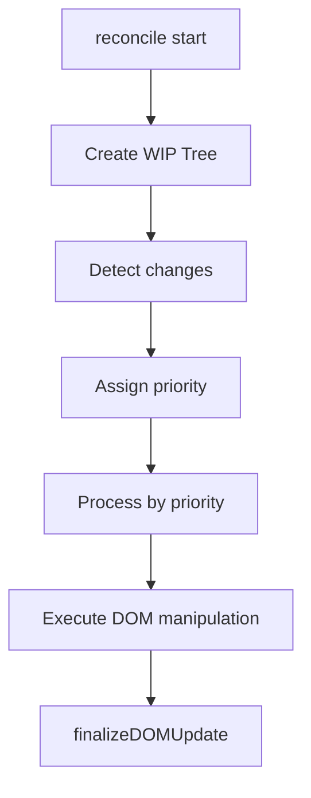

# Barocss Reconcile Algorithm - Children Reconciliation

## Overview

Barocss's DOM reconciliation uses a React-style efficient DOM update algorithm. It manages DOM changes step by step through the **Work In Progress (WIP)** pattern.

## Core Principles

### 1. VNode is Not Dynamically Evaluated

**Important**: The reconcile phase does not dynamically interpret VNode content. VNode is already fully evaluated and expanded in `VNodeBuilder`.

```typescript
// Build Phase (VNodeBuilder)
const vnode = builder.build(template, data);
// vnode is already complete

// Reconcile Phase
// Compare prev vnode and next vnode without modifying vnode
reconcile(prevVNode, nextVNode, container, context);
```

### 2. Key First, Then Position-based

- **With Key**: Match 1:1 in sibling scope using `key`, and reuse/move DOM nodes.
- **Without Key**: Match by same index (position) in parent-child relationship.
- **Mixed List**: Place keyed items first, then fit unkeyed items into remaining slots by index. Keys must never be duplicated.

### 3. Special Attributes/DOM id Not Used for Matching

Internal identification attributes like `data-bc-sid`, `data-bc-stype` are no longer used. Also, general DOM attributes like `attrs.sid` are not included in matching criteria. Matching is performed only by key or position.

### 4. Decorator Inclusion

Decorators are included in the VNode tree in a fully included state from the build phase:

- Decorators are processed in the VNode build phase and become part of regular VNode children
- All decorators (inline, block, layer) are included in the VNode tree and reconciled the same as other VNodes
- No special filtering or exclusion is needed in the Reconciliation phase
- Decorator VNodes are identified by `attrs['data-decorator-sid']` but are processed normally in reconcile

## WIP (Work In Progress) Concept

### WIP Structure

```typescript
interface DOMWorkInProgress {
  id: string;                    // WIP node ID
  type: 'text' | 'element' | 'component' | 'portal' | 'canvas';
  vnode: VNode;                   // Current VNode
  domNode?: Node;                 // Actual DOM node
  parent?: DOMWorkInProgress;      // Parent WIP
  children: DOMWorkInProgress[];   // Child WIPs
  
  // Change tracking
  needsUpdate: boolean;
  isNew: boolean;
  isDeleted: boolean;
  changes: string[];              // ['insert', 'text', 'attrs', 'style', 'children']
  
  previousVNode?: VNode;          // Previous VNode (for comparison)
  
  // Rendering priority
  renderPriority: DOMRenderPriority;
  isRendered: boolean;
}
```

### WIP Role

1. **State Tracking**: Track mapping state between VNode and DOM nodes
2. **Change Detection**: Compare previous VNode and current VNode to detect changes
3. **Priority Management**: Determine rendering priority based on change importance
4. **DOM Manipulation Planning**: Plan before actual DOM manipulation

### WIP Tree Creation

```typescript
createWorkInProgressTree(nextVNode, container, prevVNode): DOMWorkInProgress[] {
  // 1. Create WIP node for each VNode
  // 2. Maintain parent-child relationships
  // 3. Store previous VNode information (previousVNode)
  // 4. Detect basic changes (insert, delete, etc.)
}
```

## Children Reconciliation Algorithm

### Overall Flow



### 1. WIP Tree Creation Phase

```typescript
private createWorkInProgressNode(
  vnode: VNode, 
  container: HTMLElement, 
  parent?: DOMWorkInProgress, 
  prevVNode?: VNode | null
): DOMWorkInProgress {
  const isNew = !prevVNode;
  const changes = isNew ? ['insert'] : this.calculateChanges(prevVNode, vnode);
  
  // Find existing DOM node
  let domNode: Node | undefined;
  if (isNew) {
    domNode = this.findDOMNode(vnode, container);
  } else {
    domNode = this.findDOMNode(prevVNode, container);
  }
  
  const workInProgress: DOMWorkInProgress = {
    id: this.generateId(vnode),
    type: this.detectVNodeType(vnode),
    vnode,
    domNode,
    parent,
    children: [],
    needsUpdate: false,
    isNew,
    isDeleted: false,
    changes,
    previousVNode: prevVNode,
    renderPriority: DOMRenderPriority.NORMAL,
    isRendered: false
  };
  
  // Recursively process child nodes
  if (vnode.children) {
    const prevChildren = prevVNode?.children || [];
    // ... create children WIP
  }
  
  return workInProgress;
}
```

### 2. Children Reconcile Phase

Children reconcile uses a **simultaneous traversal algorithm**:

```typescript
private reconcileChildren(wip: DOMWorkInProgress, prevChildren: VNode[], nextChildren: VNode[]): void {
  let domIndex = 0;  // Current DOM index
  let prevIndex = 0; // Previous VNode index
  let nextIndex = 0; // New VNode index
  
  // Traverse both sides simultaneously and compare
  while (prevIndex < prevChildren.length || nextIndex < nextChildren.length) {
    const prevChild = prevChildren[prevIndex];
    const nextChild = nextChildren[nextIndex];
    
    // Case 1: No new child → Remove
    if (!nextChild) {
      const nodeToRemove = domNode.childNodes[domIndex];
      domNode.removeChild(nodeToRemove);
      prevIndex++;
      // Keep domIndex (used in next comparison)
    }
    
    // Case 2: No existing child → Add
    else if (!prevChild) {
      // Check if decorator should be excluded
      if (wip.context?.excludeDecorators && nextChild.attrs?.['data-decorator'] === 'true') {
        nextIndex++;
        continue; // Skip decorator nodes
      }
      
      const newNode = this.createNewDOMNode(nextChild);
      const referenceNode = domIndex < domNode.childNodes.length 
        ? domNode.childNodes[domIndex] 
        : null;
      domNode.insertBefore(newNode, referenceNode);
      
      // Set child WIP's domNode
      const childWip = wip.children[nextIndex];
      if (childWip) {
        childWip.domNode = newNode;
      }
      
      domIndex++;
      nextIndex++;
    }
    
    // Case 3: Same node → Preserve (reuse DOM node)
    else if (this.isSameNode(prevChild, nextChild)) {
      domIndex++;
      prevIndex++;
      nextIndex++;
    }
    
    // Case 4: Different node → Replace
    else {
      // Check if decorator should be excluded
      if (wip.context?.excludeDecorators && nextChild.attrs?.['data-decorator'] === 'true') {
        nextIndex++;
        continue; // Skip decorator nodes
      }
      
      const newNode = this.createNewDOMNode(nextChild);
      
      if (domIndex < domNode.childNodes.length) {
        const oldNode = domNode.childNodes[domIndex];
        domNode.replaceChild(newNode, oldNode);
      } else {
        domNode.appendChild(newNode);
      }
      
      // Set child WIP's domNode
      const childWip = wip.children[nextIndex];
      if (childWip) {
        childWip.domNode = newNode;
      }
      
      domIndex++;
      prevIndex++;
      nextIndex++;
    }
  }
}
```

### 3. Advantages of Simultaneous Traversal Algorithm

#### Example: Insert/Delete/Reorder

**Previous State**:
```html
<div>
  <span>A</span>  <!-- index 0 -->
  <span>B</span>  <!-- index 1 -->
  <span>C</span>  <!-- index 2 -->
</div>
```

**New State**:
```html
<div>
  <span>B</span>  <!-- index 0 -->
  <span>D</span>  <!-- index 1 -->
  <span>C</span>  <!-- index 2 -->
</div>
```

**Algorithm Operation**:

| Step | prevChild | nextChild | Action |
|------|-----------|-----------|------|
| 1 | `<span>A</span>` | `<span>B</span>` | Different → Replace: A → B |
| 2 | `<span>B</span>` | `<span>D</span>` | Different → Replace: B → D |
| 3 | `<span>C</span>` | `<span>C</span>` | Same → Preserve |

**Final Result**: Only A is removed, B is preserved

### 4. isSameNode Determination

```typescript
private isSameNode(prevChild: VNode, nextChild: VNode): boolean {
  // 1. Compare tag
  if (prevChild.tag !== nextChild.tag) return false;
  
  // 2. Compare text
  if (prevChild.text !== nextChild.text) return false;
  
  // 3. Compare component name
  if (prevChild.component?.name !== nextChild.component?.name) return false;
  
  // 4. Compare key (if present)
  if (prevChild.attrs?.key || nextChild.attrs?.key) {
    return prevChild.attrs?.key === nextChild.attrs?.key;
  }
  
  return true;
}
```

## Key-based Matching

### When Key is Present

Key is used to efficiently match children:

```typescript
// Key-based matching
const prevItem = { tag: 'li', attrs: { key: 'item-1' }, text: 'Item 1' };
const nextItem = { tag: 'li', attrs: { key: 'item-1' }, text: 'Item 1 (updated)' };

// If keys are the same, treat as same node
// → Only update text, preserve DOM node
```

### Position-based Matching Without Key

When key is absent, match by index and structure:

```typescript
// Position-based matching
// 1. Same parent
// 2. Same index
// 3. Same tag
```

## Children WIP and DOM Node Synchronization

### Important: Set child WIP's domNode

When manipulating DOM during children reconcile, **update the child WIP's domNode**:

```typescript
if (!prevChild) {
  // Insert new node
  const newNode = this.createNewDOMNode(nextChild);
  domNode.insertBefore(newNode, referenceNode);
  
  // Set child WIP's domNode
  const childWip = wip.children[nextIndex];
  if (childWip) {
    childWip.domNode = newNode;  // ⭐ Important!
  }
}
```

This prevents duplicate append in `finalizeDOMUpdate`.

### Prevent Duplicate Append

If `insertBefore` was already done in children reconcile, appending again in `finalizeDOMUpdate` causes duplication:

```typescript
// ❌ Wrong example: append in finalizeDOMUpdate after children reconcile
reconcileChildren(wip, prevChildren, nextChildren);  // execute insertBefore
finalizeDOMUpdate(wip);  // execute append again → duplicate!

// ✅ Correct example: reuse by setting child WIP's domNode
reconcileChildren(wip, prevChildren, nextChildren);  // execute insertBefore + set childWip.domNode
finalizeDOMUpdate(wip);  // don't append since domNode already exists
```

## Text Node Update

### Text Node Special Handling

```typescript
public processTextNode(wip: DOMWorkInProgress): void {
  if (changes.includes('insert')) {
    // Create new text node
    const textNode = document.createTextNode(String(vnode.text));
    wip.domNode = textNode;
    this.domOperations.insertDOMNode(textNode, wip, this.currentContainer);
  } 
  else if (changes.includes('text')) {
    // Update existing text node
    let targetNode = domNode;
    
    if (!targetNode && wip.previousVNode) {
      // Find in parent's children or container's direct children
      if (wip.parent?.domNode) {
        const parentDomNode = wip.parent.domNode;
        const childNodes = Array.from(parentDomNode.childNodes);
        for (const node of childNodes) {
          if (node.nodeType === Node.TEXT_NODE && 
              node.textContent === String(wip.previousVNode.text)) {
            targetNode = node;
            break;
          }
        }
      }
    }
    
    if (targetNode) {
      targetNode.textContent = String(vnode.text);
      wip.domNode = targetNode;
    }
  }
}
```

### Text Node Matching Principles

1. **Parent-child relationship based**: Find text node at same position in parent's childNodes
2. **Content-based**: Match by previous text content (tag-based matching not possible)
3. **No special attributes**: Do not use special attributes like `data-bc-sid`

## DOM Node Finding Strategy

### 1. Key-based (Priority)

```typescript
// Note: Current implementation does not store key in DOM attributes.
// Key matching is performed only at VNode level,
// and actual DOM node search uses previous VNode characteristics (text, etc.) and current parent's child order.
```

### 2. Position-based (No Key)

```typescript
// Find child at parent's corresponding position
if (wip.parent?.domNode && wip.parent.domNode instanceof HTMLElement) {
  const parentDomNode = wip.parent.domNode;
  const tagName = wip.previousVNode?.tag || wip.vnode.tag;
  
  if (tagName) {
    const childNodes = Array.from(parentDomNode.childNodes);
    const elementNodes = childNodes.filter(node => 
      node.nodeType === Node.ELEMENT_NODE
    ) as HTMLElement[];
    
    for (const element of elementNodes) {
      if (element.tagName.toLowerCase() === tagName) {
        return element;
      }
    }
  }
}
```

## Examples: Actual Behavior

### Example 1: List Reordering

**Before**:
```html
<ul>
  <li>Item 1</li>
  <li>Item 2</li>
  <li>Item 3</li>
</ul>
```

**After**:
```html
<ul>
  <li>Item 3</li>
  <li>Item 1</li>
  <li>Item 2</li>
</ul>
```

**Without Key**:
- Item 1 (0) → Item 3 (0): Different → Replace (content change)
- Item 2 (1) → Item 1 (1): Different → Replace (content change)
- Item 3 (2) → Item 2 (2): Different → Replace (content change)

**With Key** (key='item-1', key='item-2', key='item-3'):
- Item 1 (key='item-1') → Item 3 (key='item-3'): Different key → Replace
- Item 2 (key='item-2') → Item 1 (key='item-1'): Different key → Replace
- Item 3 (key='item-3') → Item 2 (key='item-2'): Different key → Replace

**Optimization**: Reuse possible with key-based matching, but without key, sequential comparison prevents reuse

### Example 2: Text Node Update

```typescript
// VNode 1
const vnode1 = { attrs: {}, text: 'Hello' };

// VNode 2
const vnode2 = { attrs: {}, text: 'World' };

// reconcile(prevVNode, nextVNode, container, context)
// 1. Detect prevVNode.text !== nextVNode.text
// 2. Add changes = ['text']
// 3. Call processTextNode()
// 4. Find text 'Hello' in parent's childNodes
// 5. Update found text node's textContent to 'World'
```

## Priority Processing

### Priority Levels

```typescript
enum DOMRenderPriority {
  IMMEDIATE = 1,    // Immediate processing (animations, user input)
  HIGH = 2,         // High priority (layout changes)
  NORMAL = 3,       // Normal priority (general updates)
  LOW = 4,          // Low priority (background tasks)
  IDLE = 5          // Idle time (statistics, logging)
}
```

### Priority Assignment Rules

```typescript
calculatePriority(changes: string[], wip: DOMWorkInProgress): DOMRenderPriority {
  if (changes.includes('insert') || changes.includes('delete')) {
    return DOMRenderPriority.HIGH;
  }
  if (changes.includes('text') || changes.includes('attrs')) {
    return DOMRenderPriority.NORMAL;
  }
  return DOMRenderPriority.LOW;
}
```

## Summary

### Key Points

1. **VNode is not dynamically evaluated in reconcile** - Already completed in build phase
2. **Key first, then position-based matching** - No special attributes used
3. **Simultaneous traversal algorithm** - Traverse and compare prev and next simultaneously
4. **Child WIP's domNode synchronization** - Must update child WIP's domNode when manipulating DOM
5. **No fallback** - Only use clear matching strategies

---

## Improved Implementation Details

Implementation summary reflecting recent `renderer-dom` improvements.

### A. Key-based Reconciler Behavior

- File: `packages/renderer-dom/src/key-based-reconciler.ts`
- Key points:
  - Filter decorators from prev/next children based on `excludeDecorators` option and create key map
  - When traversing next, nodes without key use index-based, nodes with key reuse existing DOM + move with `insertBefore` if needed
  - When moving DOM, use only `insertBefore` without calling remove()
  - Set `__barocss_inserted=true` and `isRendered=true` on moved/inserted child WIP to prevent duplicate insertion in finalization

### B. finalizeDOMUpdate Guard

- File: `packages/renderer-dom/src/dom-operations.ts`
- Improvements:
  - If parent exists, skip append if already in parent (including marker) or same node exists
  - If parent doesn't exist, skip root insertion if `node.parentNode` or marker exists

### C. Decorator Exclusion Processing

- File: `packages/renderer-dom/src/dom-reconcile.ts`
- If `excludeDecorators` is true and `attrs['data-decorator']==='true'`, exclude that node from reconcile

### D. Portal Processing

- Portal lifecycle is managed by `PortalManager`, cleaning up only that portal when removed
- Portal ID is not exposed in DOM attributes, maintained in internal mapping (WeakMap/Map)

### E. Namespace Processing

- Element creation/attribute updates use SVG/MathML etc. NS accurately through `namespace-utils`

### F. Separation of Responsibilities

- `VNodeBuilder`: when/flatten/template evaluation → Complete VNode generation
- `DOMReconcile`: prev/next comparison + minimal DOM changes, no dynamic interpretation
- `ComponentManager`: Component mount/update/unmount

### G. Logging

- `DOMReconcile`: WIP creation/priority/finalization + statistics/final HTML
- `KeyBasedReconciler`: Input summary, DOM snapshot, move/insert, children state after move
- `DOMOperations.finalizeDOMUpdate`: Guard determination by parent/root branch

### Design Philosophy

- **Predictability**: Always same output for same input
- **Purity**: Minimize external state dependencies for DOM manipulation
- **Efficiency**: Update with minimal DOM manipulation
- **Simplicity**: Only use clear strategies without complex fallback logic

