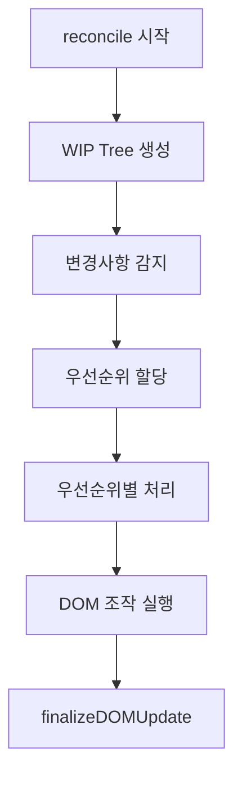

# Barocss Reconcile Algorithm - Children Reconciliation

## 개요

Barocss의 DOM reconciliation은 React-style의 효율적인 DOM 업데이트 알고리즘을 사용합니다. 특히 **Work In Progress (WIP)** 패턴을 통해 단계별로 DOM 변경을 관리합니다.

## 핵심 원칙

### 1. VNode는 동적으로 판단하지 않음

**중요**: reconcile 단계에서는 VNode의 내용을 동적으로 해석하지 않습니다. VNode는 이미 `VNodeBuilder`에서 완전히 평가되고 확장된 상태입니다.

```typescript
// Build Phase (VNodeBuilder)
const vnode = builder.build(template, data);
// vnode는 이미 완전한 상태

// Reconcile Phase
// vnode를 변경하지 않고, prev vnode와 next vnode를 비교
reconcile(prevVNode, nextVNode, container, context);
```

### 2. Key 우선, 없으면 위치 기반

- **Key가 있는 경우**: `key`로 형제 범위에서 1:1 매칭하고, DOM 노드를 재사용/이동한다.
- **Key가 없는 경우**: 부모-자식 관계의 동일 인덱스(위치)로 매칭한다.
- **혼합된 목록**: keyed를 우선 배치한 후 남은 슬롯에 unkeyed를 인덱스 기준으로 맞춘다. 키는 절대 중복되면 안 된다.

### 3. 특수 속성/DOM id는 매칭에 사용하지 않음

`data-bc-sid`, `data-bc-stype` 등 내부 식별용 속성은 더 이상 사용하지 않는다. 또한 `attrs.sid` 같은 일반 DOM 속성도 매칭 기준에 포함하지 않는다. 매칭은 오직 key 또는 위치로만 수행한다.

### 4. 데코레이터 포함

데코레이터는 빌드 단계에서 완전히 포함된 상태로 VNode 트리에 포함됩니다:

- 데코레이터는 VNode 빌드 단계에서 처리되어 일반 VNode children의 일부가 됩니다
- 모든 데코레이터(inline, block, layer)는 VNode 트리에 포함되며 다른 VNode와 동일하게 reconcile됩니다
- Reconciliation 단계에서 특별한 필터링이나 제외가 필요 없습니다
- 데코레이터 VNode는 `attrs['data-decorator-sid']`로 식별되지만 reconcile에서 정상적으로 처리됩니다

## WIP (Work In Progress) 개념

### WIP 구조

```typescript
interface DOMWorkInProgress {
  id: string;                    // WIP 노드 ID
  type: 'text' | 'element' | 'component' | 'portal' | 'canvas';
  vnode: VNode;                   // 현재 VNode
  domNode?: Node;                 // 실제 DOM 노드
  parent?: DOMWorkInProgress;      // 부모 WIP
  children: DOMWorkInProgress[];   // 자식 WIP들
  
  // 변경 추적
  needsUpdate: boolean;
  isNew: boolean;
  isDeleted: boolean;
  changes: string[];              // ['insert', 'text', 'attrs', 'style', 'children']
  
  previousVNode?: VNode;          // 이전 VNode (비교용)
  
  // 렌더링 우선순위
  renderPriority: DOMRenderPriority;
  isRendered: boolean;
}
```

### WIP의 역할

1. **상태 추적**: VNode와 DOM 노드의 매핑 상태를 추적
2. **변경 감지**: 이전 VNode와 현재 VNode를 비교하여 변경사항 감지
3. **우선순위 관리**: 변경의 중요도에 따라 렌더링 우선순위 결정
4. **DOM 조작 계획**: 실제 DOM 조작 전에 계획 수립

### WIP Tree 생성

```typescript
createWorkInProgressTree(nextVNode, container, prevVNode): DOMWorkInProgress[] {
  // 1. 각 VNode에 대해 WIP 노드 생성
  // 2. parent-child 관계 유지
  // 3. 이전 VNode 정보 저장 (previousVNode)
  // 4. 기본 변경사항 감지 (insert, delete 등)
}
```

## Children Reconciliation 알고리즘

### 전체 흐름



### 1. WIP Tree 생성 단계

```typescript
private createWorkInProgressNode(
  vnode: VNode, 
  container: HTMLElement, 
  parent?: DOMWorkInProgress, 
  prevVNode?: VNode | null
): DOMWorkInProgress {
  const isNew = !prevVNode;
  const changes = isNew ? ['insert'] : this.calculateChanges(prevVNode, vnode);
  
  // 기존 DOM 노드 찾기
  let domNode: Node | undefined;
  if (isNew) {
    domNode = this.findDOMNode(vnode, container);
  } else {
    domNode = this.findDOMNode(prevVNode, container);
  }
  
  const workInProgress: DOMWorkInProgress = {
    id: this.generateId(vnode),
    type: this.detectVNodeType(vnode),
    vnode,
    domNode,
    parent,
    children: [],
    needsUpdate: false,
    isNew,
    isDeleted: false,
    changes,
    previousVNode: prevVNode,
    renderPriority: DOMRenderPriority.NORMAL,
    isRendered: false
  };
  
  // 자식 노드들 재귀적으로 처리
  if (vnode.children) {
    const prevChildren = prevVNode?.children || [];
    // ... children WIP 생성
  }
  
  return workInProgress;
}
```

### 2. Children Reconcile 단계

children reconcile은 **동시 순회 알고리즘**을 사용합니다:

```typescript
private reconcileChildren(wip: DOMWorkInProgress, prevChildren: VNode[], nextChildren: VNode[]): void {
  let domIndex = 0;  // 현재 DOM 인덱스
  let prevIndex = 0; // 이전 VNode 인덱스
  let nextIndex = 0; // 새 VNode 인덱스
  
  // 양쪽을 동시에 순회하면서 비교
  while (prevIndex < prevChildren.length || nextIndex < nextChildren.length) {
    const prevChild = prevChildren[prevIndex];
    const nextChild = nextChildren[nextIndex];
    
    // Case 1: 새 자식이 없음 → 제거
    if (!nextChild) {
      const nodeToRemove = domNode.childNodes[domIndex];
      domNode.removeChild(nodeToRemove);
      prevIndex++;
      // domIndex는 유지 (다음 비교에서 사용)
    }
    
    // Case 2: 기존 자식이 없음 → 추가
    else if (!prevChild) {
      // Check if decorator should be excluded
      if (wip.context?.excludeDecorators && nextChild.attrs?.['data-decorator'] === 'true') {
        nextIndex++;
        continue; // Skip decorator nodes
      }
      
      const newNode = this.createNewDOMNode(nextChild);
      const referenceNode = domIndex < domNode.childNodes.length 
        ? domNode.childNodes[domIndex] 
        : null;
      domNode.insertBefore(newNode, referenceNode);
      
      // child WIP의 domNode 설정
      const childWip = wip.children[nextIndex];
      if (childWip) {
        childWip.domNode = newNode;
      }
      
      domIndex++;
      nextIndex++;
    }
    
    // Case 3: 같은 노드 → 보존 (DOM 노드 재사용)
    else if (this.isSameNode(prevChild, nextChild)) {
      domIndex++;
      prevIndex++;
      nextIndex++;
    }
    
    // Case 4: 다른 노드 → 교체
    else {
      // Check if decorator should be excluded
      if (wip.context?.excludeDecorators && nextChild.attrs?.['data-decorator'] === 'true') {
        nextIndex++;
        continue; // Skip decorator nodes
      }
      
      const newNode = this.createNewDOMNode(nextChild);
      
      if (domIndex < domNode.childNodes.length) {
        const oldNode = domNode.childNodes[domIndex];
        domNode.replaceChild(newNode, oldNode);
      } else {
        domNode.appendChild(newNode);
      }
      
      // child WIP의 domNode 설정
      const childWip = wip.children[nextIndex];
      if (childWip) {
        childWip.domNode = newNode;
      }
      
      domIndex++;
      prevIndex++;
      nextIndex++;
    }
  }
}
```

### 3. 동시 순회 알고리즘의 장점

#### 예시: 삽입/삭제/재배치

**이전 상태**:
```html
<div>
  <span>A</span>  <!-- index 0 -->
  <span>B</span>  <!-- index 1 -->
  <span>C</span>  <!-- index 2 -->
</div>
```

**새로운 상태**:
```html
<div>
  <span>B</span>  <!-- index 0 -->
  <span>D</span>  <!-- index 1 -->
  <span>C</span>  <!-- index 2 -->
</div>
```

**알고리즘 동작**:

| 단계 | prevChild | nextChild | 동작 |
|------|-----------|-----------|------|
| 1 | `<span>A</span>` | `<span>B</span>` | 다름 → 교체: A → B |
| 2 | `<span>B</span>` | `<span>D</span>` | 다름 → 교체: B → D |
| 3 | `<span>C</span>` | `<span>C</span>` | 같음 → 보존 |

**최종 결과**: A만 제거되고 B는 보존됨

### 4. isSameNode 판단

```typescript
private isSameNode(prevChild: VNode, nextChild: VNode): boolean {
  // 1. tag 비교
  if (prevChild.tag !== nextChild.tag) return false;
  
  // 2. text 비교
  if (prevChild.text !== nextChild.text) return false;
  
  // 3. component 이름 비교
  if (prevChild.component?.name !== nextChild.component?.name) return false;
  
  // 4. key 비교 (있는 경우)
  if (prevChild.attrs?.key || nextChild.attrs?.key) {
    return prevChild.attrs?.key === nextChild.attrs?.key;
  }
  
  return true;
}
```

## Key 기반 매칭

### Key가 있는 경우

Key는 children을 효율적으로 매칭하기 위해 사용됩니다:

```typescript
// Key 기반 매칭
const prevItem = { tag: 'li', attrs: { key: 'item-1' }, text: 'Item 1' };
const nextItem = { tag: 'li', attrs: { key: 'item-1' }, text: 'Item 1 (updated)' };

// key가 같으면 같은 노드로 판단
// → text만 업데이트하고 DOM 노드는 보존
```

### Key 없이 위치 기반 매칭

Key가 없는 경우, 인덱스와 구조로 매칭:

```typescript
// 위치 기반 매칭
// 1. 같은 부모
// 2. 같은 인덱스
// 3. 같은 tag
```

## Children WIP와 DOM 노드 동기화

### 중요: child WIP의 domNode 설정

children reconcile 중 DOM을 조작할 때, **해당 child WIP의 domNode를 업데이트**해야 합니다:

```typescript
if (!prevChild) {
  // 새 노드 삽입
  const newNode = this.createNewDOMNode(nextChild);
  domNode.insertBefore(newNode, referenceNode);
  
  // child WIP의 domNode 설정
  const childWip = wip.children[nextIndex];
  if (childWip) {
    childWip.domNode = newNode;  // ⭐ 중요!
  }
}
```

이렇게 해야 `finalizeDOMUpdate`에서 중복 append를 방지합니다.

### 중복 append 방지

children reconcile에서 이미 `insertBefore`를 했는데, `finalizeDOMUpdate`에서 다시 append하면 중복됩니다:

```typescript
// ❌ 잘못된 예: children reconcile 후 finalizeDOMUpdate에서 append
reconcileChildren(wip, prevChildren, nextChildren);  // insertBefore 실행
finalizeDOMUpdate(wip);  // 또 append 실행 → 중복!

// ✅ 올바른 예: child WIP의 domNode를 설정하여 재사용
reconcileChildren(wip, prevChildren, nextChildren);  // insertBefore 실행 + childWip.domNode 설정
finalizeDOMUpdate(wip);  // domNode가 이미 있으므로 append 안 함
```

## Text Node 업데이트

### Text Node는 특수 처리

```typescript
public processTextNode(wip: DOMWorkInProgress): void {
  if (changes.includes('insert')) {
    // 새 텍스트 노드 생성
    const textNode = document.createTextNode(String(vnode.text));
    wip.domNode = textNode;
    this.domOperations.insertDOMNode(textNode, wip, this.currentContainer);
  } 
  else if (changes.includes('text')) {
    // 기존 텍스트 노드 업데이트
    let targetNode = domNode;
    
    if (!targetNode && wip.previousVNode) {
      // 부모의 자식 또는 컨테이너의 직접 자식에서 찾기
      if (wip.parent?.domNode) {
        const parentDomNode = wip.parent.domNode;
        const childNodes = Array.from(parentDomNode.childNodes);
        for (const node of childNodes) {
          if (node.nodeType === Node.TEXT_NODE && 
              node.textContent === String(wip.previousVNode.text)) {
            targetNode = node;
            break;
          }
        }
      }
    }
    
    if (targetNode) {
      targetNode.textContent = String(vnode.text);
      wip.domNode = targetNode;
    }
  }
}
```

### Text Node 매칭 원칙

1. **부모-자식 관계 기반**: 부모의 childNodes에서 같은 위치의 텍스트 노드 찾기
2. **내용 기반**: 이전 텍스트 내용으로 매칭 (태그 기반 매칭 불가)
3. **특수 속성 사용 안 함**: `data-bc-sid` 등 특수 속성 사용 안 함

## DOM 노드 찾기 전략

### 1. Key 기반 (우선)

```typescript
// 주: 현재 구현은 DOM 속성에 key를 저장하지 않는다.
// Key 매칭은 VNode 레벨에서만 수행하며,
// 실제 DOM 노드 탐색은 이전 VNode의 특성(텍스트 등)과 현재 부모의 자식 순서를 이용한다.
```

### 2. 위치 기반 (key 없음)

```typescript
// 부모의 해당 위치 child 찾기
if (wip.parent?.domNode && wip.parent.domNode instanceof HTMLElement) {
  const parentDomNode = wip.parent.domNode;
  const tagName = wip.previousVNode?.tag || wip.vnode.tag;
  
  if (tagName) {
    const childNodes = Array.from(parentDomNode.childNodes);
    const elementNodes = childNodes.filter(node => 
      node.nodeType === Node.ELEMENT_NODE
    ) as HTMLElement[];
    
    for (const element of elementNodes) {
      if (element.tagName.toLowerCase() === tagName) {
        return element;
      }
    }
  }
}
```

## 예시: 실제 동작

### 예시 1: 리스트 재정렬

**이전**:
```html
<ul>
  <li>Item 1</li>
  <li>Item 2</li>
  <li>Item 3</li>
</ul>
```

**이후**:
```html
<ul>
  <li>Item 3</li>
  <li>Item 1</li>
  <li>Item 2</li>
</ul>
```

**Key 없음**:
- Item 1 (0) → Item 3 (0): 다름 → 교체 (내용 변경)
- Item 2 (1) → Item 1 (1): 다름 → 교체 (내용 변경)
- Item 3 (2) → Item 2 (2): 다름 → 교체 (내용 변경)

**Key 있음** (key='item-1', key='item-2', key='item-3'):
- Item 1 (key='item-1') → Item 3 (key='item-3'): 다른 key → 교체
- Item 2 (key='item-2') → Item 1 (key='item-1'): 다른 key → 교체
- Item 3 (key='item-3') → Item 2 (key='item-2'): 다른 key → 교체

**최적화**: key 기반 매칭으로 재사용 가능하지만, key가 없으면 순서대로 비교하므로 재사용할 수 없음

### 예시 2: Text Node 업데이트

```typescript
// VNode 1
const vnode1 = { attrs: {}, text: 'Hello' };

// VNode 2
const vnode2 = { attrs: {}, text: 'World' };

// reconcile(prevVNode, nextVNode, container, context)
// 1. prevVNode.text !== nextVNode.text 감지
// 2. changes = ['text'] 추가
// 3. processTextNode() 호출
// 4. 부모의 childNodes에서 텍스트 'Hello' 찾기
// 5. 찾은 텍스트 노드의 textContent를 'World'로 업데이트
```

## 우선순위 처리

### 우선순위 레벨

```typescript
enum DOMRenderPriority {
  IMMEDIATE = 1,    // 즉시 처리 (애니메이션, 사용자 입력)
  HIGH = 2,         // 높은 우선순위 (레이아웃 변경)
  NORMAL = 3,       // 일반 우선순위 (일반 업데이트)
  LOW = 4,          // 낮은 우선순위 (백그라운드 작업)
  IDLE = 5          // 유휴 시간 (통계, 로깅)
}
```

### 우선순위 할당 규칙

```typescript
calculatePriority(changes: string[], wip: DOMWorkInProgress): DOMRenderPriority {
  if (changes.includes('insert') || changes.includes('delete')) {
    return DOMRenderPriority.HIGH;
  }
  if (changes.includes('text') || changes.includes('attrs')) {
    return DOMRenderPriority.NORMAL;
  }
  return DOMRenderPriority.LOW;
}
```

## 정리

### 핵심 포인트

1. **VNode는 reconcile에서 동적으로 판단하지 않음** - 이미 build 단계에서 완성됨
2. **Key 우선, 없으면 위치 기반 매칭** - 특수 속성 사용 안 함
3. **동시 순회 알고리즘** - prev와 next를 동시에 순회하며 비교
4. **Child WIP의 domNode 동기화** - DOM 조작 시 child WIP의 domNode 업데이트 필수
5. **Fallback 없음** - 명확한 매칭 전략만 사용

---

## 개선된 구현 디테일

최근 `renderer-dom` 개선 사항을 반영한 구현 요약이다.

### A. Key-based Reconciler 동작

- 파일: `packages/renderer-dom/src/key-based-reconciler.ts`
- 요점:
  - `excludeDecorators` 옵션에 따라 prev/next 자식에서 데코레이터를 필터링하고 key 맵 생성
  - next 순회 시 key 없는 노드는 인덱스 기반, key 있는 노드는 기존 DOM 재사용 + 필요 시 `insertBefore`로 이동
  - DOM 이동 시 remove() 호출 없이 `insertBefore`만 사용
  - 이동/삽입 처리된 child WIP에 `__barocss_inserted=true`와 `isRendered=true`를 세팅해 최종화에서 중복 삽입 방지

### B. finalizeDOMUpdate 가드

- 파일: `packages/renderer-dom/src/dom-operations.ts`
- 개선:
  - 부모가 있는 경우 이미 부모에 있거나(marker 포함) 동일 노드가 있으면 append 생략
  - 부모가 없는 경우에도 `node.parentNode`나 marker가 있으면 루트 삽입 생략

### C. 데코레이터 제외 처리

- 파일: `packages/renderer-dom/src/dom-reconcile.ts`
- `excludeDecorators`가 true이고 `attrs['data-decorator']==='true'`이면 해당 노드는 reconcile에서 제외

### D. 포털 처리

- 포털 수명주기는 `PortalManager`가 담당하며 제거 시 정확히 해당 포털만 청소
- 포털 ID는 DOM 속성에 노출하지 않고 내부 매핑(WeakMap/Map)으로 유지

### E. 네임스페이스 처리

- 요소 생성/속성 갱신은 `namespace-utils`를 통해 SVG/MathML 등 NS를 정확히 사용

### F. 책임 분리

- `VNodeBuilder`: when/flatten/템플릿 평가 → 완전한 VNode 생성
- `DOMReconcile`: prev/next 비교 + 최소 DOM 변경, 동적 해석 없음
- `ComponentManager`: 컴포넌트 마운트/업데이트/언마운트

### G. 로깅

- `DOMReconcile`: WIP 생성/우선순위/최종화 + 통계/최종 HTML
- `KeyBasedReconciler`: 입력 요약, DOM 스냅샷, 이동/삽입, 이동 후 children 상태
- `DOMOperations.finalizeDOMUpdate`: 부모/루트 분기별 가드 판단

### 설계 철학

- **예측 가능성**: 항상 같은 입력에 대해 같은 출력
- **순수성**: DOM 조작 외부 상태 의존 최소화
- **효율성**: 최소한의 DOM 조작으로 업데이트
- **간단함**: 복잡한 fallback 로직 없이 명확한 전략만 사용

