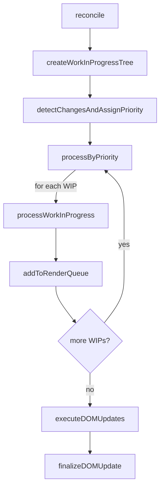
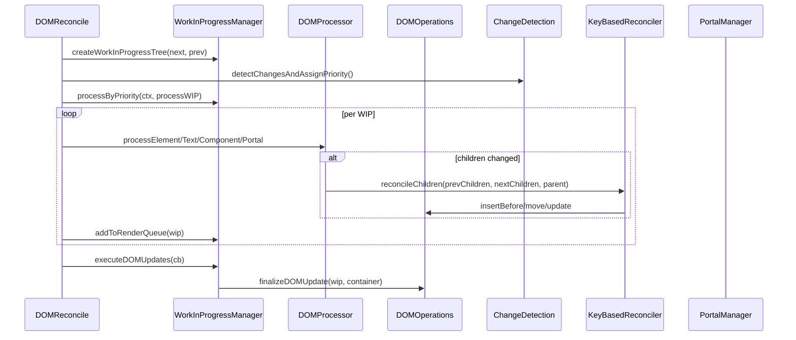
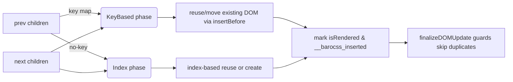
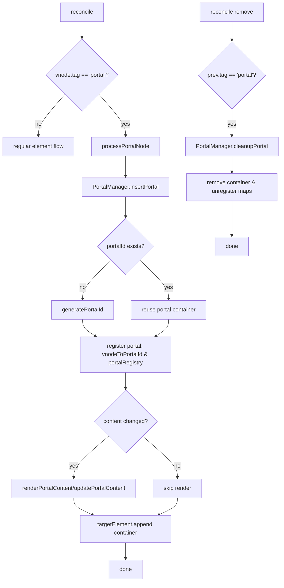

# Barocss Reconcile Architecture Overview

> **참고**: 이 문서는 기본 개요입니다. 더 자세한 내용은 다음 문서들을 참고하세요:
> - [`architecture-design-principles.md`](./architecture-design-principles.md) - 핵심 설계 원칙 ⭐
> - [`architecture-practical-examples.md`](./architecture-practical-examples.md) - 실전 예제
> - [`architecture-mathematical-model.md`](./architecture-mathematical-model.md) - 수학적 모델
> - [`architecture-flow-diagram.md`](./architecture-flow-diagram.md) - 플로우 다이어그램
> - [`architecture-summary.md`](./architecture-summary.md) - 빠른 참조

## 전체 아키텍처

Barocss는 **DSL → VNode → Reconcile → DOM** 구조로 동작합니다.

```
Model Data
    ↓
VNodeBuilder (DSL templates → VNodes)
    ↓
VNode Tree
    ↓
DOMReconcile (VNode changes → DOM updates)
    ↓
DOM
```

## 1. DSL → VNode

### 1.1 DSL (Domain Specific Language)

DSL은 renderer에 등록된 템플릿 정의입니다:

```typescript
interface ElementTemplate {
  tag: string | ((data: ModelData) => string);
  attributes?: Record<string, any>;
  children?: (string | number | DataTemplate | ElementTemplate | ComponentTemplate)[];
}

interface ComponentTemplate {
  type: string;
  props?: Record<string, any>;
  slots?: Record<string, SlotTemplate>;
}

interface DataTemplate {
  path?: string;
  getter?: (data: ModelData) => any;
}
```

### 1.2 VNodeBuilder의 역할

`VNodeBuilder`는 DSL 템플릿을 VNode로 변환합니다:

```typescript
class VNodeBuilder {
  build(nodeType: string, data: ModelData): VNode {
    // 1. Registry에서 템플릿 조회
    const template = this.registry.getTemplate(nodeType);
    
    // 2. 템플릿 타입에 따라 VNode 생성
    if (template.type === 'element') {
      return this._buildElement(template, data);
    } else if (template.type === 'component') {
      return this._buildComponent(template, data);
    }
    // ...
  }
  
  private _buildElement(template: ElementTemplate, data: ModelData): VNode {
    // Dynamic tag resolution
    const tag = typeof template.tag === 'function' 
      ? template.tag(data) 
      : template.tag;
    
    // Attribute binding
    const attrs = this._setAttributes(template.attributes, data);
    
    // Children processing
    const children = this._processChildren(template.children, data);
    
    return { tag, attrs, children, ... };
  }
}
```

**핵심 동작**:
- `data('text')` → 텍스트 노드
- `component({ ... })` → 컴포넌트 VNode
- `each(data('items'))` → 반복 VNode 생성
- `when(data('show'))` → 조건부 평가 (build time)

### 1.3 VNode 구조

```typescript
interface VNode {
  tag?: string;
  text?: string | number;
  attrs?: Record<string, any>;
  style?: Record<string, any>;
  children?: VNode[];
  component?: {
    name: string;
    props?: Record<string, any>;
    state?: Record<string, any>;
    template?: ComponentTemplate;
  };
  portal?: {
    target: string | HTMLElement;
    portalId?: string;
  };
}
```

## 2. VNode → DOM (Reconcile)

### 2.1 Reconcile의 목적

**Reconcile**은 두 VNode 트리(`prevVNode`, `nextVNode`)를 비교하여 실제 DOM에 최소한의 변경만 적용하는 과정입니다.

```typescript
reconcile(prevVNode: VNode | null, nextVNode: VNode | null, 
          container: HTMLElement, context: ReconcileContext): void
```

### 2.2 Reconcile 단계

```
1. WIP Tree 생성
   └─ nextVNode와 prevVNode를 기반으로 WIP 트리 생성

2. 변경사항 감지
   └─ ChangeDetection: tag, attrs, children 등 변경 여부 판단
   └─ 우선순위 할당: IMMEDIATE, HIGH, NORMAL, LOW, IDLE

3. 우선순위별 처리
   └─ processByPriority(): 우선순위 큐에서 WIP를 순차 처리
   └─ processWorkInProgress(): WIP 타입에 따라 처리
      ├─ text: processTextNode
      ├─ element: processElementNode
      ├─ component: ComponentManager
      └─ portal: PortalManager

4. DOM 업데이트 실행
   └─ finalizeDOMUpdate(): DOM에 실제 변경 적용
   └─ 중복 방지: isAlreadyInDOM 체크
```

#### Reconcile High-level Flow (Mermaid)



> Note: 렌더 큐는 "WIP 처리 직후" 적재되고 마지막에 일괄 finalize 됩니다.

### 2.3 Work In Progress (WIP) 패턴

```typescript
interface DOMWorkInProgress {
  id: string;
  type: 'text' | 'element' | 'component' | 'portal';
  vnode: VNode;
  previousVNode?: VNode;
  
  domNode?: Node;           // 실제 DOM 노드
  parent?: DOMWorkInProgress;
  children: DOMWorkInProgress[];
  
  changes: string[];        // ['insert', 'attrs', 'children', ...]
  needsUpdate: boolean;
  isRendered: boolean;
  renderPriority: DOMRenderPriority;
}
```

### 2.4 주요 클래스 구조

```
DOMReconcile (메인 orchestrator)
├─ WorkInProgressManager: WIP 트리 생성 및 관리
├─ ChangeDetection: 변경사항 감지
├─ DOMProcessor: DOM 조작 (insert/update/remove)
├─ ComponentManager: 컴포넌트 라이프사이클
├─ PortalManager: Portal 렌더링
└─ DOMOperations: DOM 생성/수정 유틸리티
```

#### Module Interaction (Mermaid)



## 3. 처리 흐름 상세

### 3.1 VNodeBuilder → DOM 흐름

```
Model: { stype: 'paragraph', text: 'Hello' }
    ↓
VNodeBuilder.build('paragraph', model)
    ↓
Registry에서 템플릿 조회
    ↓
_buildElement(template, model)
    ↓
VNode: { tag: 'p', text: 'Hello', attrs: {...} }
    ↓
DOMReconcile.reconcile(null, vnode, container, context)
    ↓
WIP Tree 생성
    ↓
processElementNode(wip)
    ↓
DOMOperations.createElement()
    ↓
finalizeDOMUpdate()
    ↓
DOM: <p>Hello</p>
```

### 3.2 Update 흐름 (Reconcile)

```
1. prevVNode: { tag: 'p', text: 'Old' }
2. nextVNode: { tag: 'p', text: 'New' }
    ↓
DOMReconcile.reconcile(prevVNode, nextVNode, container, context)
    ↓
WIP Tree 생성
  - wip: { vnode: nextVNode, previousVNode: prevVNode, ... }
    ↓
ChangeDetection.detectVNodeChanges()
  - changes: ['text']
    ↓
processElementNode(wip)
  - if (changes.includes('text')):
      targetDomNode.textContent = 'New'
    ↓
finalizeDOMUpdate(wip)
  - isAlreadyInDOM: true → skip append
    ↓
DOM: <p>New</p>
```

### 3.3 Children Reconcile 흐름

```
prevChildren: [{tag: 'p', text: 'First'}]
nextChildren: [{tag: 'p', text: 'First'}, {tag: 'p', text: 'Second'}]
    ↓
updateChildren(wip)
  - buildVNodesFromDOM(domNode.childNodes)
    → prevChildrenFromDOM: [{tag: 'p', text: 'First'}]
  - nextChildren: [{tag: 'p', text: 'First'}, {tag: 'p', text: 'Second'}]
    ↓
reconcileChildren(wip, prevChildren, nextChildren)
    ↓
React-style reconciliation loop:
  1. prevChild={tag:'p', text:'First'}, nextChild={tag:'p', text:'First'}
     → isSameNode() === true → skip (domIndex++, prevIndex++, nextIndex++)
  2. prevChild=null, nextChild={tag:'p', text:'Second'}
     → createNewDOMNode() → insertBefore()
     → childWip.domNode = newNode
     → nextIndex++
    ↓
Final DOM: <div><p>First</p><p>Second</p></div>
    ↓
finalizeDOMUpdate(childWip)
  - isAlreadyInDOM: true → skip append
```

#### Keyed vs Unkeyed Children (Mermaid)



> 규칙: key는 형제 범위에서 유일해야 하며, 혼합 목록에서는 keyed를 우선 재배치한 후 unkeyed를 인덱스로 맞춥니다.

## 4. 컴포넌트 처리

### 4.1 컴포넌트 VNode 생성

```typescript
// VNodeBuilder에서
private _buildComponent(template: ComponentTemplate, data: ModelData): VNode {
  const componentInstance = this.getOrCreateInstance(template.type, data);
  
  return {
    tag: null,
    component: {
      name: template.type,
      props: template.props,
      state: componentInstance.state,
      template: template
    },
    children: componentInstance.vnode.children
  };
}
```

### 4.2 컴포넌트 Reconcile

```
VNode with component
    ↓
processComponentNode(wip)
    ↓
ComponentManager.mountComponent() or updateComponent()
    ↓
Component instance 생성/업데이트
    ↓
Component의 자체 reconcile 호출
    ↓
DOM 업데이트
```

## 5. Portal 처리

### 5.1 Portal VNode

```typescript
{
  tag: 'div',
  portal: {
    target: '#modal',
    portalId: 'unique-id'
  },
  children: [...]
}
```

### 5.2 Portal Reconcile

```
Portal VNode
    ↓
processPortalNode(wip)
    ↓
PortalManager.insertPortal()
    ↓
generatePortalId() → stable ID 생성
    ↓
renderPortalContent() or updatePortalContent()
    ↓
DOM target에 content 렌더링
```

#### Portal Flow (Mermaid)



## 6. 핵심 개념

### 6.1 Change Detection

```typescript
class ChangeDetection {
  detectVNodeChanges(prev: VNode, next: VNode): string[] {
    const changes = [];
    
    if (prev.tag !== next.tag) changes.push('tag');
    if (prev.text !== next.text) changes.push('text');
    if (hasAttributeChanges(prev.attrs, next.attrs)) changes.push('attrs');
    if (hasStyleChanges(prev.style, next.style)) changes.push('style');
    if (hasChildrenChanges(prev.children, next.children)) changes.push('children');
    
    return changes;
  }
}
```

### 6.2 Priority System

```typescript
enum DOMRenderPriority {
  IMMEDIATE = 1,  // 사용자 입력, 애니메이션
  HIGH = 2,       // 레이아웃 변경
  NORMAL = 3,     // 일반 업데이트
  LOW = 4,        // 배경 작업
  IDLE = 5        // 유휴 시간
}
```

### 6.3 Children Reconcile 로직

**핵심**: reconcilChildren에서 생성/교체된 DOM 노드를 child WIP의 domNode에 설정해야 함.

```typescript
private reconcileChildren(wip: DOMWorkInProgress, 
                          prevChildren: VNode[], 
                          nextChildren: VNode[]): void {
  // ... loop through prevChildren and nextChildren
  
  if (!prevChild) {
    // 새 자식 추가
    const newNode = this.createNewDOMNode(nextChild);
    domNode.insertBefore(newNode, referenceNode);
    
    // 중요: child WIP의 domNode 설정
    const childWip = wip.children[nextIndex];
    if (childWip) {
      childWip.domNode = newNode;
    }
  }
}
```

## 7. 파일 구조 (패키지 분리 업데이트)

```
packages/
├─ schema/            # DSL/Schema 정의 및 등록소(Registry)
├─ model/             # VNode 타입, 모델 타입, 데이터 구조
├─ renderer-dom/      # DOM 대상 Reconcile & Renderer
│  ├─ dom-renderer.ts            # High-level renderer (DSL→VNode→reconcile 진입점)
│  ├─ dom-reconcile.ts           # WIP 기반 메인 Reconcile orchestrator
│  ├─ work-in-progress.ts        # WIP 인터페이스/우선순위
│  ├─ work-in-progress-manager.ts# WIP 트리/큐/통계
│  ├─ change-detection.ts        # 변경 감지
│  ├─ dom-processor.ts           # DOM 조작(텍스트/엘리먼트/children 디스패치)
│  ├─ key-based-reconciler.ts    # keyed children 재사용/이동
│  ├─ component-manager.ts       # 컴포넌트 라이프사이클(컨텍스트/외부)
│  ├─ portal-manager.ts          # 포털 처리(생성/업데이트/정리)
│  └─ dom-operations.ts          # DOM 생성/속성/스타일 유틸리티
└─ datastore/          # 데이터 스토어
```

> 분리 원칙: DSL/Schema(모델→템플릿 해석), Model(VNode 타입), Renderer(Reconcile 구현)를 명확히 분리하여 교체 가능성을 높입니다.

## 8. 사용 예제

### 8.1 기본 렌더링

```typescript
const renderer = new DOMRenderer(registry);
const model = { stype: 'paragraph', text: 'Hello' };

renderer.render(container, model);
```

### 8.2 수동 Reconcile

```typescript
const prevVNode = { tag: 'p', text: 'Old' };
const nextVNode = { tag: 'p', text: 'New' };

const context = createReconcileContext({ ... });
domReconcile.reconcile(prevVNode, nextVNode, container, context);
```

### 8.3 업데이트

```typescript
// First render
renderer.render(container, { stype: 'div', children: [...] });

// Update data
model.items.push(newItem);
renderer.render(container, model);  // reconcile happens
```

## 9. 성능 최적화

1. **WIP 패턴**: 변경사항을 일괄 처리하여 불필요한 DOM 조작 최소화
2. **Priority Queue**: 우선순위 기반 처리로 중요한 업데이트 우선 수행
3. **Change Detection**: 변경된 부분만 업데이트
4. **Children Reconcile**: React-style reconciliation으로 효율적인 DOM 업데이트

## 10. 핵심 규칙

1. **VNodeBuilder**는 데이터를 VNode로 변환만 담당
2. **DOMReconcile**은 VNode 차이를 DOM 변경으로 변환
3. **WIP 패턴**으로 실제 변경을 일괄 처리
4. **children reconcile**에서 생성된 DOM 노드는 child WIP의 domNode에 설정
5. **finalizeDOMUpdate**에서 중복 append 방지 (`isAlreadyInDOM` 체크)

## 11. 확장 가능한 Reconcile 레이어 (Canvas/Three 등)

### 11.1 목표
- DOM 이외 대상(WebCanvas, WebGL/Three 등)을 동일한 WIP 기반 파이프라인으로 처리할 수 있도록 Reconcile 레이어를 플러그형으로 확장.

### 11.2 공통 인터페이스(개념)
```typescript
interface ReconcileAdapter<TContainer, TNode> {
  createContext(args: any): ReconcileContext;
  reconcile(prev: VNode | null, next: VNode | null, container: TContainer, ctx: ReconcileContext): void;
  // 선택: adapter 전용 Operations (예: draw, material update 등)
}
```

### 11.3 구조 개요 (Mermaid)
```mermaid
graph TD
    A[DSL/Schema] --> B[VNodeBuilder]
    B --> C[VNode Tree]
    C --> D{Adapter 선택}
    D -- DOM --> E[DOMReconcile]
    D -- Canvas --> F[CanvasReconcile (계획)]
    D -- Three --> G[ThreeReconcile (계획)]
    E --> H[DOM]
    F --> I[Canvas 2D API]
    G --> J[WebGL/Three Scene]
```

### 11.4 DOMReconcile와의 공통점/차이
- 공통점: WIP 트리 생성, 변경 감지, 우선순위 큐, 렌더 큐/최종 커밋 흐름은 동일.
- 차이: Operations 계층이 대상별로 상이함
  - DOM: `createElementNS`, `setAttributeNS`, `insertBefore` 등
  - Canvas: path/state 스택 관리, draw 커맨드 배치, 레이어 합성
  - Three: Scene/Material/Geometry 생성/폐기, Object3D attach/detach

### 11.5 마이그레이션 시 지침
- WIP/ChangeDetection/우선순위 큐는 최대한 공통화하고, 실제 커밋(Operations)만 대상별로 구현
- key/unkeyed children 처리 철학 유지(재사용 우선, 필요 시 이동)
- 포털 유사 개념은 대상별 컨테이너/레이어로 매핑(예: Canvas 레이어, Three Scene 노드)

### 11.6 현재 DOMReconcile 주요 결정 요약(문서 반영됨)
- 혼합 keyed/unkeyed: keyed 우선 재배치 → unkeyed 인덱스 정합
- excludeDecorators: `data-decorator='true'`는 옵션 활성 시 스킵 (root reconcile과 reconcileChildren 모두 적용)
- 네임스페이스: SVG/MathML cross-nesting 지원(createElementNS/setAttributeNS)
- 중복 삽입 방지: `__barocss_inserted`/`isAlreadyInDOM` 가드

