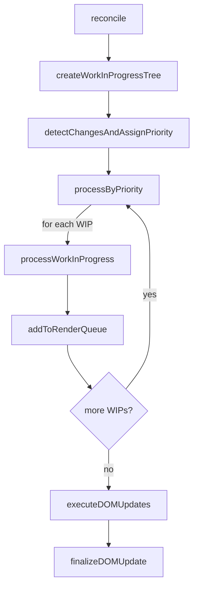
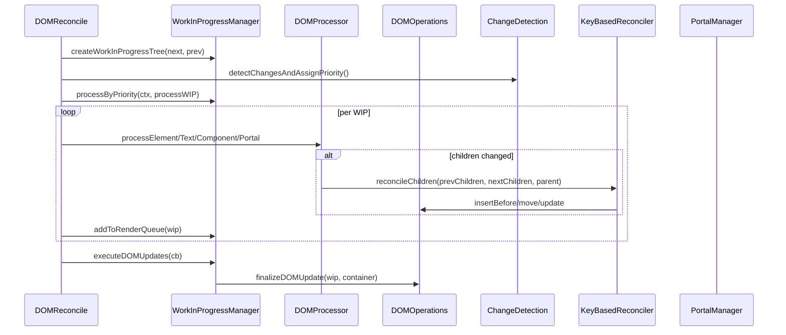
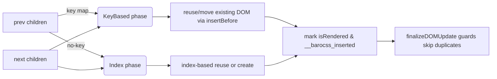
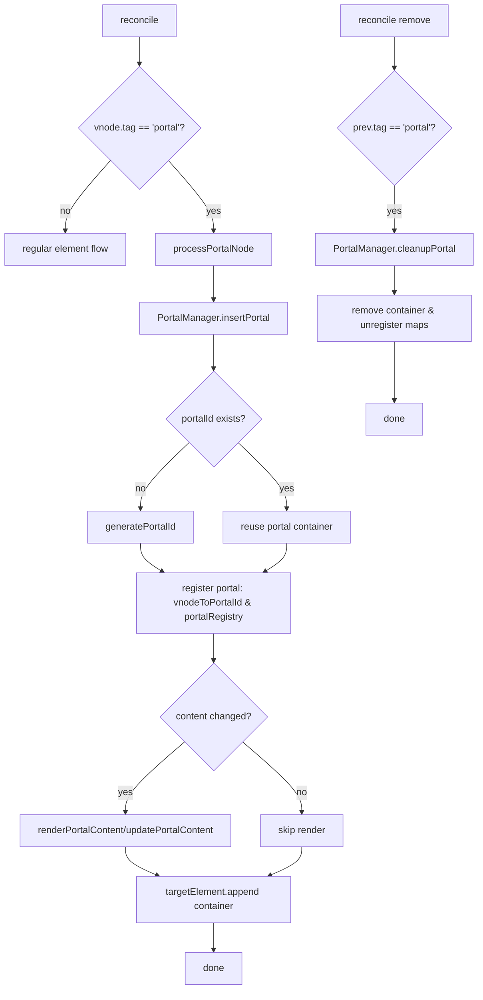

# Barocss Reconcile Architecture Overview

> **Note**: This document is a basic overview. For more details, see:
> - [`architecture-design-principles.md`](./architecture-design-principles.md) - Core design principles ⭐
> - [`architecture-practical-examples.md`](./architecture-practical-examples.md) - Practical examples
> - [`architecture-mathematical-model.md`](./architecture-mathematical-model.md) - Mathematical model
> - [`architecture-flow-diagram.md`](./architecture-flow-diagram.md) - Flow diagram
> - [`architecture-summary.md`](./architecture-summary.md) - Quick reference

## Overall Architecture

Barocss operates with the **DSL → VNode → Reconcile → DOM** structure.

```
Model Data
    ↓
VNodeBuilder (DSL templates → VNodes)
    ↓
VNode Tree
    ↓
DOMReconcile (VNode changes → DOM updates)
    ↓
DOM
```

## 1. DSL → VNode

### 1.1 DSL (Domain Specific Language)

DSL is template definitions registered in the renderer:

```typescript
interface ElementTemplate {
  tag: string | ((data: ModelData) => string);
  attributes?: Record<string, any>;
  children?: (string | number | DataTemplate | ElementTemplate | ComponentTemplate)[];
}

interface ComponentTemplate {
  type: string;
  props?: Record<string, any>;
  slots?: Record<string, SlotTemplate>;
}

interface DataTemplate {
  path?: string;
  getter?: (data: ModelData) => any;
}
```

### 1.2 VNodeBuilder's Role

`VNodeBuilder` converts DSL templates to VNode:

```typescript
class VNodeBuilder {
  build(nodeType: string, data: ModelData): VNode {
    // 1. Look up template from Registry
    const template = this.registry.getTemplate(nodeType);
    
    // 2. Create VNode based on template type
    if (template.type === 'element') {
      return this._buildElement(template, data);
    } else if (template.type === 'component') {
      return this._buildComponent(template, data);
    }
    // ...
  }
  
  private _buildElement(template: ElementTemplate, data: ModelData): VNode {
    // Dynamic tag resolution
    const tag = typeof template.tag === 'function' 
      ? template.tag(data) 
      : template.tag;
    
    // Attribute binding
    const attrs = this._setAttributes(template.attributes, data);
    
    // Children processing
    const children = this._processChildren(template.children, data);
    
    return { tag, attrs, children, ... };
  }
}
```

**Core operations**:
- `data('text')` → text node
- `component({ ... })` → component VNode
- `each(data('items'))` → repeated VNode creation
- `when(data('show'))` → conditional evaluation (build time)

### 1.3 VNode Structure

```typescript
interface VNode {
  tag?: string;
  text?: string | number;
  attrs?: Record<string, any>;
  style?: Record<string, any>;
  children?: VNode[];
  component?: {
    name: string;
    props?: Record<string, any>;
    state?: Record<string, any>;
    template?: ComponentTemplate;
  };
  portal?: {
    target: string | HTMLElement;
    portalId?: string;
  };
}
```

## 2. VNode → DOM (Reconcile)

### 2.1 Purpose of Reconcile

**Reconcile** is the process of comparing two VNode trees (`prevVNode`, `nextVNode`) and applying only minimal changes to the actual DOM.

```typescript
reconcile(prevVNode: VNode | null, nextVNode: VNode | null, 
          container: HTMLElement, context: ReconcileContext): void
```

### 2.2 Reconcile Steps

```
1. Create WIP Tree
   └─ Create WIP tree based on nextVNode and prevVNode

2. Detect Changes
   └─ ChangeDetection: determine if tag, attrs, children, etc. changed
   └─ Assign priority: IMMEDIATE, HIGH, NORMAL, LOW, IDLE

3. Process by Priority
   └─ processByPriority(): process WIPs sequentially from priority queue
   └─ processWorkInProgress(): process based on WIP type
      ├─ text: processTextNode
      ├─ element: processElementNode
      ├─ component: ComponentManager
      └─ portal: PortalManager

4. Execute DOM Updates
   └─ finalizeDOMUpdate(): apply actual changes to DOM
   └─ Prevent duplicates: isAlreadyInDOM check
```

#### Reconcile High-level Flow (Mermaid)



> Note: Render queue is loaded "immediately after WIP processing" and batch-finalized at the end.

### 2.3 Work In Progress (WIP) Pattern

```typescript
interface DOMWorkInProgress {
  id: string;
  type: 'text' | 'element' | 'component' | 'portal';
  vnode: VNode;
  previousVNode?: VNode;
  
  domNode?: Node;           // Actual DOM node
  parent?: DOMWorkInProgress;
  children: DOMWorkInProgress[];
  
  changes: string[];        // ['insert', 'attrs', 'children', ...]
  needsUpdate: boolean;
  isRendered: boolean;
  renderPriority: DOMRenderPriority;
}
```

### 2.4 Main Class Structure

```
DOMReconcile (main orchestrator)
├─ WorkInProgressManager: WIP tree creation and management
├─ ChangeDetection: change detection
├─ DOMProcessor: DOM manipulation (insert/update/remove)
├─ ComponentManager: component lifecycle
├─ PortalManager: portal rendering
└─ DOMOperations: DOM creation/modification utilities
```

#### Module Interaction (Mermaid)



## 3. Detailed Processing Flow

### 3.1 VNodeBuilder → DOM Flow

```
Model: { stype: 'paragraph', text: 'Hello' }
    ↓
VNodeBuilder.build('paragraph', model)
    ↓
Look up template from Registry
    ↓
_buildElement(template, model)
    ↓
VNode: { tag: 'p', text: 'Hello', attrs: {...} }
    ↓
DOMReconcile.reconcile(null, vnode, container, context)
    ↓
Create WIP Tree
    ↓
processElementNode(wip)
    ↓
DOMOperations.createElement()
    ↓
finalizeDOMUpdate()
    ↓
DOM: <p>Hello</p>
```

### 3.2 Update Flow (Reconcile)

```
1. prevVNode: { tag: 'p', text: 'Old' }
2. nextVNode: { tag: 'p', text: 'New' }
    ↓
DOMReconcile.reconcile(prevVNode, nextVNode, container, context)
    ↓
Create WIP Tree
  - wip: { vnode: nextVNode, previousVNode: prevVNode, ... }
    ↓
ChangeDetection.detectVNodeChanges()
  - changes: ['text']
    ↓
processElementNode(wip)
  - if (changes.includes('text')):
      targetDomNode.textContent = 'New'
    ↓
finalizeDOMUpdate(wip)
  - isAlreadyInDOM: true → skip append
    ↓
DOM: <p>New</p>
```

### 3.3 Children Reconcile Flow

```
prevChildren: [{tag: 'p', text: 'First'}]
nextChildren: [{tag: 'p', text: 'First'}, {tag: 'p', text: 'Second'}]
    ↓
updateChildren(wip)
  - buildVNodesFromDOM(domNode.childNodes)
    → prevChildrenFromDOM: [{tag: 'p', text: 'First'}]
  - nextChildren: [{tag: 'p', text: 'First'}, {tag: 'p', text: 'Second'}]
    ↓
reconcileChildren(wip, prevChildren, nextChildren)
    ↓
React-style reconciliation loop:
  1. prevChild={tag:'p', text:'First'}, nextChild={tag:'p', text:'First'}
     → isSameNode() === true → skip (domIndex++, prevIndex++, nextIndex++)
  2. prevChild=null, nextChild={tag:'p', text:'Second'}
     → createNewDOMNode() → insertBefore()
     → childWip.domNode = newNode
     → nextIndex++
    ↓
Final DOM: <div><p>First</p><p>Second</p></div>
    ↓
finalizeDOMUpdate(childWip)
  - isAlreadyInDOM: true → skip append
```

#### Keyed vs Unkeyed Children (Mermaid)



> Rule: Keys must be unique within sibling scope, and in mixed lists, keyed items are reordered first, then unkeyed items are aligned by index.

## 4. Component Processing

### 4.1 Component VNode Creation

```typescript
// In VNodeBuilder
private _buildComponent(template: ComponentTemplate, data: ModelData): VNode {
  const componentInstance = this.getOrCreateInstance(template.type, data);
  
  return {
    tag: null,
    component: {
      name: template.type,
      props: template.props,
      state: componentInstance.state,
      template: template
    },
    children: componentInstance.vnode.children
  };
}
```

### 4.2 Component Reconcile

```
VNode with component
    ↓
processComponentNode(wip)
    ↓
ComponentManager.mountComponent() or updateComponent()
    ↓
Create/update component instance
    ↓
Call component's own reconcile
    ↓
DOM update
```

## 5. Portal Processing

### 5.1 Portal VNode

```typescript
{
  tag: 'div',
  portal: {
    target: '#modal',
    portalId: 'unique-id'
  },
  children: [...]
}
```

### 5.2 Portal Reconcile

```
Portal VNode
    ↓
processPortalNode(wip)
    ↓
PortalManager.insertPortal()
    ↓
generatePortalId() → create stable ID
    ↓
renderPortalContent() or updatePortalContent()
    ↓
Render content to DOM target
```

#### Portal Flow (Mermaid)



## 6. Core Concepts

### 6.1 Change Detection

```typescript
class ChangeDetection {
  detectVNodeChanges(prev: VNode, next: VNode): string[] {
    const changes = [];
    
    if (prev.tag !== next.tag) changes.push('tag');
    if (prev.text !== next.text) changes.push('text');
    if (hasAttributeChanges(prev.attrs, next.attrs)) changes.push('attrs');
    if (hasStyleChanges(prev.style, next.style)) changes.push('style');
    if (hasChildrenChanges(prev.children, next.children)) changes.push('children');
    
    return changes;
  }
}
```

### 6.2 Priority System

```typescript
enum DOMRenderPriority {
  IMMEDIATE = 1,  // User input, animations
  HIGH = 2,       // Layout changes
  NORMAL = 3,     // General updates
  LOW = 4,        // Background work
  IDLE = 5        // Idle time
}
```

### 6.3 Children Reconcile Logic

**Core**: DOM nodes created/replaced in reconcilChildren must be set to child WIP's domNode.

```typescript
private reconcileChildren(wip: DOMWorkInProgress, 
                          prevChildren: VNode[], 
                          nextChildren: VNode[]): void {
  // ... loop through prevChildren and nextChildren
  
  if (!prevChild) {
    // Add new child
    const newNode = this.createNewDOMNode(nextChild);
    domNode.insertBefore(newNode, referenceNode);
    
    // Important: set child WIP's domNode
    const childWip = wip.children[nextIndex];
    if (childWip) {
      childWip.domNode = newNode;
    }
  }
}
```

## 7. File Structure (Package Separation Update)

```
packages/
├─ schema/            # DSL/Schema definitions and registry
├─ model/             # VNode types, model types, data structures
├─ renderer-dom/      # DOM target Reconcile & Renderer
│  ├─ dom-renderer.ts            # High-level renderer (DSL→VNode→reconcile entry point)
│  ├─ dom-reconcile.ts           # WIP-based main Reconcile orchestrator
│  ├─ work-in-progress.ts        # WIP interface/priority
│  ├─ work-in-progress-manager.ts# WIP tree/queue/statistics
│  ├─ change-detection.ts        # Change detection
│  ├─ dom-processor.ts           # DOM manipulation (text/element/children dispatch)
│  ├─ key-based-reconciler.ts    # keyed children reuse/move
│  ├─ component-manager.ts       # Component lifecycle (contextual/external)
│  ├─ portal-manager.ts          # Portal handling (create/update/cleanup)
│  └─ dom-operations.ts          # DOM creation/attribute/style utilities
└─ datastore/          # Data store
```

> Separation principle: Clearly separate DSL/Schema (model→template interpretation), Model (VNode types), and Renderer (Reconcile implementation) to increase replaceability.

## 8. Usage Examples

### 8.1 Basic Rendering

```typescript
const renderer = new DOMRenderer(registry);
const model = { stype: 'paragraph', text: 'Hello' };

renderer.render(container, model);
```

### 8.2 Manual Reconcile

```typescript
const prevVNode = { tag: 'p', text: 'Old' };
const nextVNode = { tag: 'p', text: 'New' };

const context = createReconcileContext({ ... });
domReconcile.reconcile(prevVNode, nextVNode, container, context);
```

### 8.3 Update

```typescript
// First render
renderer.render(container, { stype: 'div', children: [...] });

// Update data
model.items.push(newItem);
renderer.render(container, model);  // reconcile happens
```

## 9. Performance Optimization

1. **WIP Pattern**: Batch process changes to minimize unnecessary DOM manipulation
2. **Priority Queue**: Process important updates first based on priority
3. **Change Detection**: Only update changed parts
4. **Children Reconcile**: Efficient DOM updates with React-style reconciliation

## 10. Core Rules

1. **VNodeBuilder** only converts data to VNode
2. **DOMReconcile** converts VNode differences to DOM changes
3. **WIP Pattern** batches actual changes
4. DOM nodes created in **children reconcile** are set to child WIP's domNode
5. **finalizeDOMUpdate** prevents duplicate append (`isAlreadyInDOM` check)

## 11. Extensible Reconcile Layer (Canvas/Three, etc.)

### 11.1 Goal
- Extend Reconcile layer as pluggable to handle non-DOM targets (WebCanvas, WebGL/Three, etc.) with the same WIP-based pipeline.

### 11.2 Common Interface (Concept)
```typescript
interface ReconcileAdapter<TContainer, TNode> {
  createContext(args: any): ReconcileContext;
  reconcile(prev: VNode | null, next: VNode | null, container: TContainer, ctx: ReconcileContext): void;
  // Optional: adapter-specific Operations (e.g., draw, material update, etc.)
}
```

### 11.3 Structure Overview (Mermaid)
```mermaid
graph TD
    A[DSL/Schema] --> B[VNodeBuilder]
    B --> C[VNode Tree]
    C --> D{Adapter Selection}
    D -- DOM --> E[DOMReconcile]
    D -- Canvas --> F[CanvasReconcile (planned)]
    D -- Three --> G[ThreeReconcile (planned)]
    E --> H[DOM]
    F --> I[Canvas 2D API]
    G --> J[WebGL/Three Scene]
```

### 11.4 Commonalities/Differences with DOMReconcile
- Common: WIP tree creation, change detection, priority queue, render queue/final commit flow are the same.
- Differences: Operations layer differs by target
  - DOM: `createElementNS`, `setAttributeNS`, `insertBefore`, etc.
  - Canvas: path/state stack management, batch draw commands, layer composition
  - Three: Scene/Material/Geometry creation/disposal, Object3D attach/detach

### 11.5 Migration Guidelines
- Maximize commonality in WIP/ChangeDetection/priority queue, only implement actual commit (Operations) per target
- Maintain key/unkeyed children handling philosophy (reuse first, move if needed)
- Map portal-like concepts to target-specific containers/layers (e.g., Canvas layers, Three Scene nodes)

### 11.6 Current DOMReconcile Key Decisions Summary (Documented)
- Mixed keyed/unkeyed: keyed items reordered first → unkeyed index alignment
- excludeDecorators: `data-decorator='true'` is skipped when option is active (applies to both root reconcile and reconcileChildren)
- Namespace: SVG/MathML cross-nesting support (createElementNS/setAttributeNS)
- Duplicate insertion prevention: `__barocss_inserted`/`isAlreadyInDOM` guards
