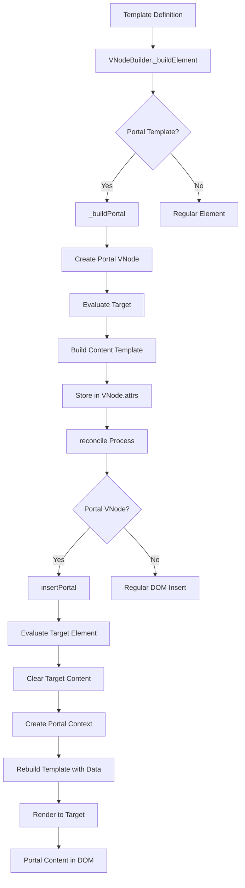
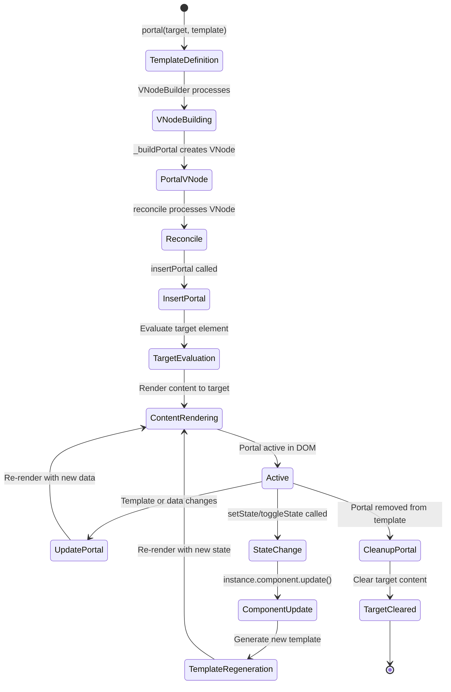
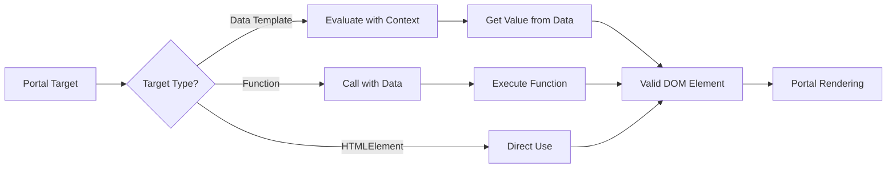
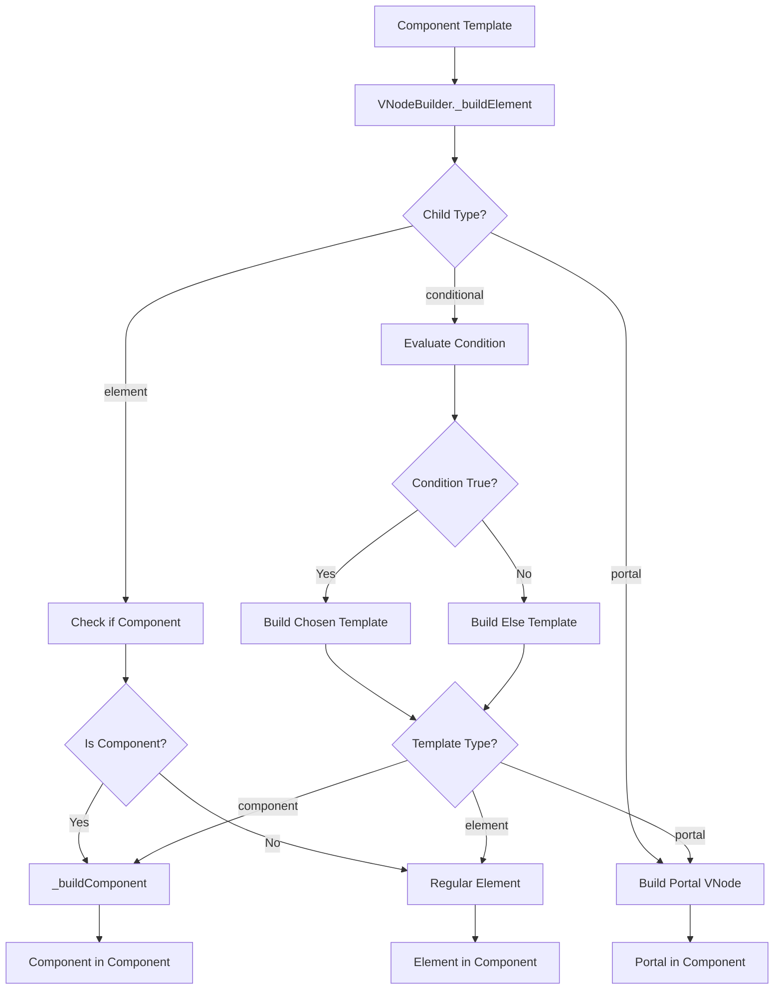
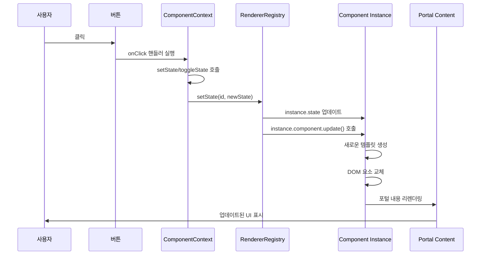

# Portal System Specification

## 개요

Portal 시스템은 `renderer-dom`의 선언형 템플릿 시스템을 확장하여, 컴포넌트나 데코레이터에서 다른 DOM 컨테이너(예: `document.body`)에 UI를 렌더링할 수 있게 해주는 기능입니다.

## 목표

- **선언형**: Portal을 템플릿 내에서 선언적으로 정의
- **상태 통합**: Portal의 표시/숨김을 컴포넌트 상태와 연동
- **범용성**: `define`과 `defineDecorator` 모두에서 사용 가능
- **일관성**: 기존 `renderer-dom` 철학과 일치
- **단순성**: Portal은 렌더링 위치만 결정, 스타일은 `element`에서 처리
- **독립성**: 같은 target을 공유하는 여러 Portal이 서로 간섭하지 않음
- **상태 보존**: Portal 업데이트 시 기존 DOM 상태(포커스, 스크롤 등) 보존
- **성능 최적화**: reconcile 기반 업데이트로 불필요한 DOM 조작 최소화

## 설계 원칙

### 1. 단일 책임 원칙
- **Portal**: 렌더링 위치만 결정
- **Element**: 스타일과 레이아웃 처리

### 2. 선언형 우선
- 모든 UI 요소를 템플릿 내에서 선언
- 상태와 렌더링이 한 곳에서 관리

### 3. 일관성 유지
- 기존 `element` 스타일 시스템과 동일한 방식
- Portal도 일반 템플릿과 동일한 렌더링 과정

### 4. Portal 컨테이너 독립성
- 각 Portal은 고유한 컨테이너를 가짐
- Portal ID 기반으로 독립적 관리
- 같은 target을 공유해도 서로 간섭하지 않음

### 5. 기존 DOM 보호
- Portal target의 기존 내용을 건드리지 않음
- Portal 컨테이너만 추가하여 기존 DOM 구조 보존

## API 설계

### Portal DSL 함수

```typescript
portal(target: HTMLElement, template: RenderTemplate): PortalTemplate
```

**매개변수:**
- `target: HTMLElement` - Portal이 렌더링될 DOM 컨테이너
- `template: RenderTemplate` - Portal에 렌더링할 템플릿

**반환값:**
- `PortalTemplate` - Portal 템플릿 객체

### Portal 템플릿 타입

```typescript
interface PortalTemplate {
  type: 'portal';
  target: HTMLElement;
  template: RenderTemplate;
  portalId?: string; // 고유 Portal 식별자
}
```

### Portal 컨테이너 구조

Portal 시스템은 각 Portal에 대해 독립적인 컨테이너를 생성합니다:

```html
<!-- Target element with existing content -->
<div id="target">
  <div id="existing-content">Existing content</div>
  
  <!-- Portal containers (added by portal system) -->
  <div data-portal="portal-a" data-portal-container="true" style="position: relative;">
    <div>Portal A content</div>
  </div>
  
  <div data-portal="portal-b" data-portal-container="true" style="position: relative;">
    <div>Portal B content</div>
  </div>
</div>
```

**Portal 컨테이너 속성:**
- `data-portal`: Portal의 고유 식별자
- `data-portal-container="true"`: Portal 컨테이너임을 나타내는 마커
- `style="position: relative"`: Portal 콘텐츠의 위치 기준점

### 상태 관리 Context 확장

```typescript
interface ComponentContext {
  // 기존...
  initState: (key: string, value: any) => void;
  getState: (key: string) => any;
  setState: (key: string, value: any) => void;
  toggleState: (key: string) => void;
}
```

#### 상태 관리 메서드 동작

- **`initState(key, value)`**: 컴포넌트 마운트 시에만 호출 가능. 초기 상태를 설정합니다.
- **`getState(key)`**: 현재 상태 값을 반환합니다.
- **`setState(key, value)`**: 상태를 업데이트하고 **자동으로 컴포넌트를 리렌더링**합니다.
- **`toggleState(key)`**: boolean 상태를 토글하고 **자동으로 컴포넌트를 리렌더링**합니다.

#### 리렌더링 메커니즘

`setState`와 `toggleState` 호출 시:
1. 컴포넌트 인스턴스의 상태가 업데이트됩니다
2. `instance.component.update()` 메서드가 자동으로 호출됩니다
3. 새로운 템플릿이 생성되고 DOM이 업데이트됩니다
4. 포털 내용도 함께 리렌더링됩니다

## 사용 예시

### 1. 기본 Portal 사용

```typescript
define('my-component', (ctx) => {
  ctx.initState('showModal', false);
  
  return element('div', {
    onClick: () => ctx.toggleState('showModal')
  }, [
    text('Click me'),
    portal(document.body, element('div', {
      className: 'modal',
      style: {
        position: 'fixed',
        top: '50%',
        left: '50%',
        transform: 'translate(-50%, -50%)',
        zIndex: 1000,
        display: ctx.getState('showModal') ? 'block' : 'none'
      }
    }, [text('Modal content')]))
  ]);
});
```

### 1-1. 상태 기반 Portal 제어

```typescript
define('interactive-portal-component', (props, ctx) => {
  ctx.initState('showTooltip', false);
  ctx.initState('tooltipMessage', 'Default message');
  ctx.initState('counter', 0);
  
  return element('div', {}, [
    text('Interactive Portal Demo'),
    
    // 버튼들
    element('div', { style: { margin: '10px 0' } }, [
      element('button', {
        onClick: () => ctx.toggleState('showTooltip')
      }, [text('Toggle Tooltip')]),
      
      element('button', {
        onClick: () => ctx.setState('tooltipMessage', `Updated at ${new Date().toLocaleTimeString()}`)
      }, [text('Update Message')]),
      
      element('button', {
        onClick: () => ctx.setState('counter', ctx.getState('counter') + 1)
      }, [text('Increment Counter')])
    ]),
    
    // 상태 기반 Portal
    when(
      (data) => !!data.showTooltip,
      portal(
        document.body,
        element('div', {
          'data-testid': 'interactive-tooltip',
          style: {
            position: 'fixed',
            top: '20px',
            right: '20px',
            backgroundColor: 'rgba(0,0,0,0.8)',
            color: 'white',
            padding: '10px',
            borderRadius: '4px',
            zIndex: 1000
          }
        }, [
          text(`Message: ${data('tooltipMessage')}`),
          element('br'),
          text(`Counter: ${data('counter')}`)
        ])
      )
    )
  ]);
});
```

### 1-1. 조건부 Portal 사용

```typescript
define('conditional-portal-component', (props, ctx) => {
  return element('div', {}, [
    text('Main content'),
    when(
      (data) => !!data.showPortal,
      portal(
        document.body,
        element('div', { 
          'data-testid': 'conditional-portal',
          style: { position: 'fixed', top: '0', right: '0' }
        }, [text('Conditional portal content')])
      )
    )
  ]);
});
```

### 1-2. 데이터 바인딩 Portal 사용

```typescript
define('data-bound-portal-component', (props, ctx) => {
  return element('div', {}, [
    portal(
      document.body,
      element('div', { 
        'data-testid': 'data-bound-portal',
        style: { 
          backgroundColor: data('backgroundColor'),
          color: data('textColor')
        }
      }, [
        data('message')
      ])
    )
  ]);
});
```

### 1-3. 중첩 컴포넌트 Portal 사용

```typescript
// Define child component
define('portal-child', (props, ctx) => {
  return element('div', { 
    'data-testid': 'portal-child',
    style: { border: '1px solid red' }
  }, [
    text(`Child content: ${props.message}`)
  ]);
});

// Define parent component with portal containing child
define('portal-parent', (props, ctx) => {
  return element('div', {}, [
    portal(
      document.body,
      element('div', { 'data-testid': 'portal-parent' }, [
        element('portal-child', { message: props.childMessage })
      ])
    )
  ]);
});
```

### 2. 데코레이터에서 Portal 사용

```typescript
defineDecorator('comment', (ctx) => {
  ctx.initState('showTooltip', false);
  ctx.initState('showPopup', false);
  
  return element('div', {
    className: 'comment-indicator',
    onMouseEnter: () => ctx.setState('showTooltip', true),
    onMouseLeave: () => ctx.setState('showTooltip', false),
    onClick: () => ctx.toggleState('showPopup')
  }, [
    text('💬'),
    
    // Tooltip Portal
    portal(document.body, element('div', {
      className: 'comment-tooltip',
      style: {
        position: 'fixed',
        zIndex: 1001,
        opacity: ctx.getState('showTooltip') ? 1 : 0,
        transform: 'translateY(-5px)',
        transition: 'all 0.2s ease',
        backgroundColor: 'rgba(0,0,0,0.9)',
        color: 'white',
        padding: '8px 12px',
        borderRadius: '6px',
        fontSize: '12px',
        maxWidth: '250px',
        wordWrap: 'break-word',
        boxShadow: '0 4px 12px rgba(0,0,0,0.3)'
      }
    }, [text('Tooltip content')])),
    
    // Popup Portal
    portal(document.body, element('div', {
      className: 'comment-popup',
      style: {
        position: 'fixed',
        top: '50%',
        left: '50%',
        transform: 'translate(-50%, -50%)',
        zIndex: 1002,
        opacity: ctx.getState('showPopup') ? 1 : 0,
        transition: 'all 0.2s ease',
        backgroundColor: 'white',
        border: '1px solid #e0e0e0',
        borderRadius: '8px',
        padding: '16px',
        fontSize: '14px',
        maxWidth: '400px',
        maxHeight: '300px',
        wordWrap: 'break-word',
        boxShadow: '0 8px 24px rgba(0,0,0,0.15)',
        overflow: 'auto'
      }
    }, [text('Popup content')]))
  ]);
});
```

### 3. 동적 Portal 생성

```typescript
define('dynamic-portal', (ctx) => {
  ctx.initState('portals', []);
  
  const addPortal = () => {
    const id = `portal-${Date.now()}`;
    ctx.setState('portals', [...ctx.getState('portals'), { id, show: true }]);
  };
  
  return element('div', [
    element('button', { onClick: addPortal }, [text('Add Portal')]),
    ...ctx.getState('portals').map(portal => 
      portal(document.body, element('div', {
        id: portal.sid,
        style: {
          position: 'fixed',
          top: '20px',
          left: '20px',
          zIndex: 1000,
          display: portal.show ? 'block' : 'none',
          backgroundColor: 'lightblue',
          padding: '10px',
          borderRadius: '4px'
        }
      }, [text(`Portal ${portal.sid}`)]))
    )
  ]);
});
```

### 4. 복잡한 Portal 조합

```typescript
defineDecorator('rich-comment', (ctx) => {
  ctx.initState('showTooltip', false);
  ctx.initState('showPopup', false);
  ctx.initState('showReactions', false);
  
  return element('div', {
    className: 'rich-comment-indicator',
    onMouseEnter: () => ctx.setState('showTooltip', true),
    onMouseLeave: () => ctx.setState('showTooltip', false),
    onClick: () => ctx.toggleState('showPopup')
  }, [
    text('💬'),
    
    // Tooltip Portal
    portal(document.body, element('div', {
      className: 'comment-tooltip',
      style: {
        position: 'fixed',
        zIndex: 1001,
        opacity: ctx.getState('showTooltip') ? 1 : 0,
        transform: 'translateY(-5px)',
        transition: 'all 0.2s ease'
      }
    }, [
      element('div', { style: { fontWeight: 'bold' } }, [text('Author')]),
      element('div', { style: { fontSize: '12px' } }, [text('Comment preview')])
    ])),
    
    // Popup Portal
    portal(document.body, element('div', {
      className: 'comment-popup',
      style: {
        position: 'fixed',
        top: '50%',
        left: '50%',
        transform: 'translate(-50%, -50%)',
        zIndex: 1002,
        opacity: ctx.getState('showPopup') ? 1 : 0,
        transition: 'all 0.2s ease'
      }
    }, [
      element('div', { className: 'popup-header' }, [text('Comment Details')]),
      element('div', { className: 'popup-content' }, [text('Full comment content')]),
      element('div', { className: 'popup-actions' }, [
        element('button', { onClick: () => ctx.setState('showReactions', true) }, [text('Reactions')])
      ])
    ])),
    
    // Reactions Portal
    portal(document.body, element('div', {
      className: 'reactions-panel',
      style: {
        position: 'fixed',
        zIndex: 1003,
        opacity: ctx.getState('showReactions') ? 1 : 0,
        transition: 'all 0.2s ease'
      }
    }, [
      element('div', { className: 'reaction-item' }, [text('👍')]),
      element('div', { className: 'reaction-item' }, [text('❤️')]),
      element('div', { className: 'reaction-item' }, [text('😀')])
    ]))
  ]);
});
```

### 5. 같은 Target을 공유하는 여러 Portal

```typescript
define('multi-portal-component', (props, ctx) => {
  return element('div', {}, [
    text('Main App'),
    
    // Portal 1: Header notification
    when(props.showNotification, 
      portal(
        document.body,
        element('div', { 
          id: 'notification',
          'data-testid': 'notification',
          style: { 
            position: 'fixed',
            top: '10px',
            right: '10px',
            backgroundColor: props.notificationColor || 'red',
            color: 'white',
            padding: '10px'
          }
        }, [props.notificationMessage || 'Notification']),
        'notification'
      )
    ),
    
    // Portal 2: Modal overlay
    when(props.showModal,
      portal(
        document.body,
        element('div', { 
          id: 'modal-overlay',
          'data-testid': 'modal-overlay',
          style: { 
            position: 'fixed',
            top: '0',
            left: '0',
            width: '100%',
            height: '100%',
            backgroundColor: 'rgba(0,0,0,0.5)',
            display: 'flex',
            alignItems: 'center',
            justifyContent: 'center'
          }
        }, [
          element('div', { 
            style: { 
              backgroundColor: 'white',
              padding: '20px',
              borderRadius: '5px'
            }
          }, [props.modalContent || 'Modal Content'])
        ]),
        'modal'
      )
    ),
    
    // Portal 3: Sidebar
    when(props.showSidebar,
      portal(
        document.body,
        element('div', { 
          id: 'sidebar',
          'data-testid': 'sidebar',
          style: { 
            position: 'fixed',
            top: '0',
            left: '0',
            width: '200px',
            height: '100%',
            backgroundColor: props.sidebarColor || 'blue',
            color: 'white',
            padding: '20px'
          }
        }, [props.sidebarContent || 'Sidebar Content']),
        'sidebar'
      )
    ),
    
    // Portal 4: Footer message
    portal(
      document.body,
      element('div', { 
        id: 'footer-message',
        'data-testid': 'footer-message',
        style: { 
          position: 'fixed',
          bottom: '10px',
          left: '10px',
          backgroundColor: 'green',
          color: 'white',
          padding: '5px 10px'
        }
      }, [props.footerMessage || 'Footer Message']),
      'footer'
    )
  ]);
});
```

**특징:**
- 모든 Portal이 `document.body`를 target으로 사용
- 각 Portal은 고유한 ID로 독립적으로 관리
- Portal 간 서로 간섭하지 않음
- 기존 DOM 내용을 보존

## 아키텍처 및 흐름

### Portal 렌더링 흐름



### Portal 생명주기



### Portal 타겟 평가



### 컴포넌트와 Portal 통합



### 상태 관리와 Portal 리렌더링



## 성능 고려사항

### 1. Portal 인스턴스 관리
- Portal 컨테이너 재사용
- 불필요한 DOM 조작 최소화
- 메모리 누수 방지
- **Portal ID 기반 관리**: 고유 ID로 Portal 컨테이너 식별 및 재사용

### 2. 렌더링 최적화
- Portal 내용 변경 시에만 재렌더링
- 상태 변경 시 효율적인 업데이트
- **상태 기반 리렌더링**: `setState`/`toggleState` 호출 시에만 컴포넌트 업데이트
- **reconcile 기반 업데이트**: Portal 업데이트 시 전체를 다시 그리지 않고 필요한 부분만 업데이트

### 3. 상태 관리 최적화
- **자동 리렌더링**: 상태 변경 시 자동으로 컴포넌트와 포털이 업데이트
- **상태 격리**: 각 컴포넌트 인스턴스의 상태가 독립적으로 관리
- **효율적인 업데이트**: 변경된 상태만 업데이트하고 DOM은 최소한으로 조작
- **UI 상태 보존**: Portal 업데이트 시 입력 포커스, 스크롤 위치 등 기존 DOM 상태 보존

### 4. Portal 컨테이너 최적화
- **독립적 관리**: 각 Portal이 고유한 컨테이너를 가져 서로 간섭하지 않음
- **기존 DOM 보호**: Portal target의 기존 내용을 건드리지 않음
- **컨테이너 재사용**: Portal ID 기반으로 기존 컨테이너 재사용

### 5. 이벤트 처리
- Portal 내부 이벤트 버블링 처리
- 외부 클릭 감지 및 처리
- **상태 변경 이벤트**: 사용자 상호작용에 따른 상태 변경과 자동 리렌더링

## 마이그레이션 가이드

### 기존 수동 Portal 관리에서 선언형 Portal로

**Before (수동 관리):**
```typescript
class CommentManager {
  showTooltip(commentId: string, event: MouseEvent) {
    const tooltip = document.createElement('div');
    tooltip.className = 'comment-tooltip';
    tooltip.style.position = 'fixed';
    // ... 스타일 설정
    document.body.appendChild(tooltip);
  }
}
```

**After (선언형 Portal):**
```typescript
defineDecorator('comment', (ctx) => {
  ctx.initState('showTooltip', false);
  
  return element('div', {
    onMouseEnter: () => ctx.setState('showTooltip', true)
  }, [
    text('💬'),
    portal(document.body, element('div', {
      className: 'comment-tooltip',
      style: {
        position: 'fixed',
        opacity: ctx.getState('showTooltip') ? 1 : 0
      }
    }, [text('Tooltip content')]))
  ]);
});
```

## 구현 상태

### ✅ 완료된 기능
- **기본 Portal 렌더링**
- **Portal reconcile**
- **에러 케이스 처리**
- **조건부 렌더링 & 데이터 바인딩**
- **간단한 Portal**
- **중첩 컴포넌트 지원**
- **Portal 업데이트 및 제거**
- **Portal 타겟 변경**
- **동적 템플릿 재평가**
- **다중 조건부 Portal 관리**
- **동적 타겟 선택**
- **복잡한 중첩 구조 업데이트**
- **같은 target을 공유하는 여러 Portal 지원**
- **Portal 간섭 방지 및 독립적 관리**
- **기존 DOM 내용 보존**
- **reconcile 기반 Portal 업데이트**
- **UI 상태 보존 (포커스, 스크롤 등)**
- **Portal 컨테이너 특별 처리**
- **복잡한 Portal 상호작용**
- **빠른 Portal 업데이트 안정성**

## 관련 문서

- [Renderer DOM Specification](renderer-dom-spec.md)
- [Decorator Implementation Guide](decorator-implementation-guide.md)
- [Component System Specification](component-system-spec.md)
