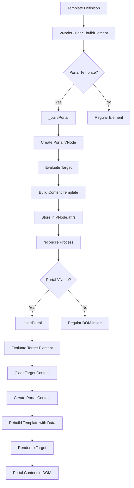
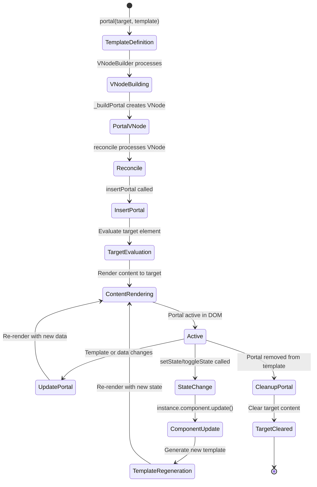
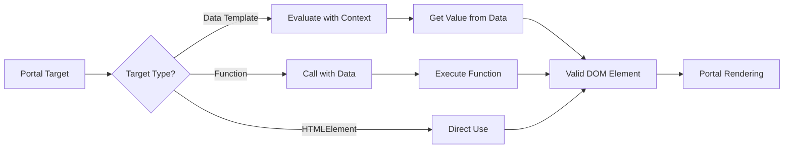
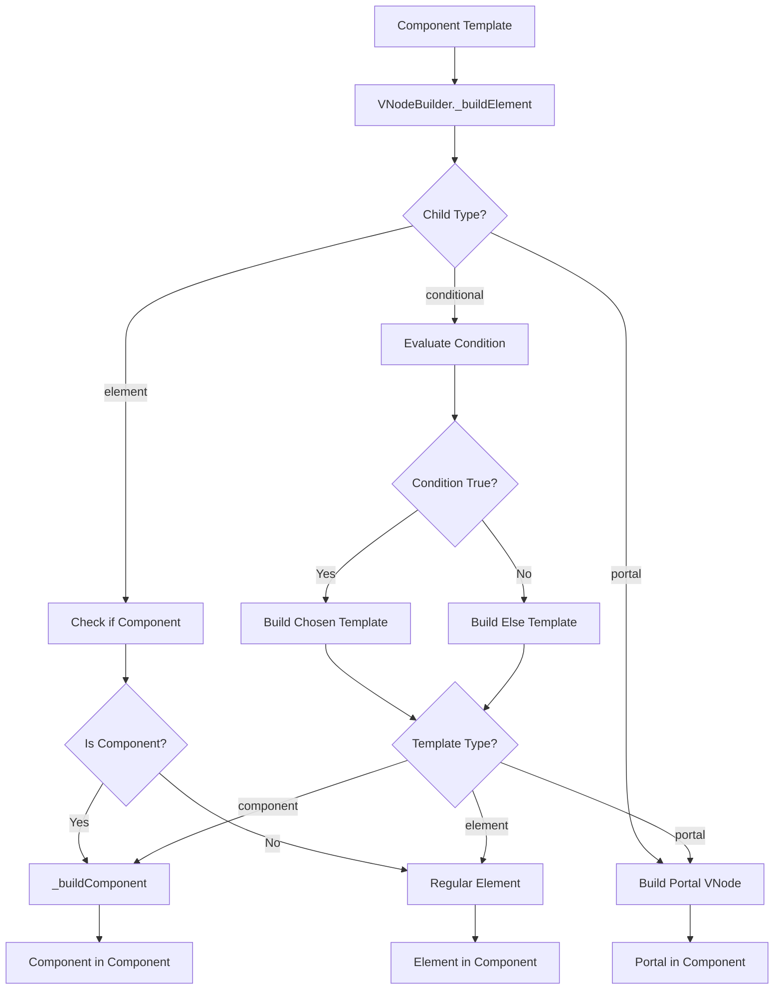
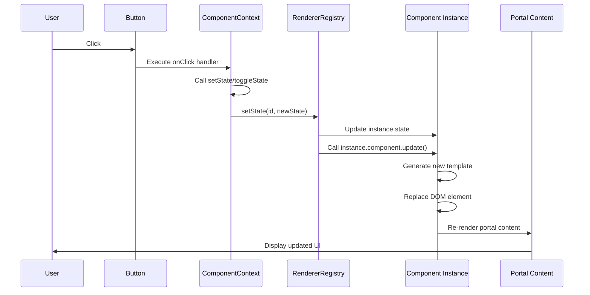

# Portal System Specification

## Overview

The Portal system extends `renderer-dom`'s declarative template system, allowing components or decorators to render UI to other DOM containers (e.g., `document.body`).

## Goals

- **Declarative**: define Portal declaratively within templates
- **State integration**: link Portal show/hide with component state
- **Versatility**: usable in both `define` and `defineDecorator`
- **Consistency**: aligns with existing `renderer-dom` philosophy
- **Simplicity**: Portal only determines rendering location, styles handled by `element`
- **Independence**: multiple Portals sharing the same target do not interfere
- **State preservation**: preserve existing DOM state (focus, scroll, etc.) on Portal update
- **Performance optimization**: minimize unnecessary DOM manipulation via reconcile-based updates

## Design Principles

### 1. Single Responsibility Principle
- **Portal**: only determines rendering location
- **Element**: handles styles and layout

### 2. Declarative First
- Declare all UI elements within templates
- Manage state and rendering in one place

### 3. Maintain Consistency
- Same approach as existing `element` style system
- Portal follows the same rendering process as regular templates

### 4. Portal Container Independence
- Each Portal has its own container
- Independent management based on Portal ID
- No interference even when sharing the same target

### 5. Preserve Existing DOM
- Do not touch existing content of Portal target
- Preserve existing DOM structure by only adding Portal containers

## API Design

### Portal DSL Function

```typescript
portal(target: HTMLElement, template: RenderTemplate): PortalTemplate
```

**Parameters:**
- `target: HTMLElement` - DOM container where Portal will be rendered
- `template: RenderTemplate` - template to render in Portal

**Return value:**
- `PortalTemplate` - Portal template object

### Portal Template Type

```typescript
interface PortalTemplate {
  type: 'portal';
  target: HTMLElement;
  template: RenderTemplate;
  portalId?: string; // unique Portal identifier
}
```

### Portal Container Structure

The Portal system creates independent containers for each Portal:

```html
<!-- Target element with existing content -->
<div id="target">
  <div id="existing-content">Existing content</div>
  
  <!-- Portal containers (added by portal system) -->
  <div data-portal="portal-a" data-portal-container="true" style="position: relative;">
    <div>Portal A content</div>
  </div>
  
  <div data-portal="portal-b" data-portal-container="true" style="position: relative;">
    <div>Portal B content</div>
  </div>
</div>
```

**Portal container attributes:**
- `data-portal`: unique identifier for Portal
- `data-portal-container="true"`: marker indicating Portal container
- `style="position: relative"`: positioning reference point for Portal content

### State Management Context Extension

```typescript
interface ComponentContext {
  // existing...
  initState: (key: string, value: any) => void;
  getState: (key: string) => any;
  setState: (key: string, value: any) => void;
  toggleState: (key: string) => void;
}
```

#### State Management Method Behavior

- **`initState(key, value)`**: callable only on component mount. Sets initial state.
- **`getState(key)`**: returns current state value.
- **`setState(key, value)`**: updates state and **automatically re-renders component**.
- **`toggleState(key)`**: toggles boolean state and **automatically re-renders component**.

#### Re-rendering Mechanism

When `setState` and `toggleState` are called:
1. Component instance state is updated
2. `instance.component.update()` is automatically called
3. New template is generated and DOM is updated
4. Portal content is also re-rendered

## Usage Examples

### 1. Basic Portal Usage

```typescript
define('my-component', (ctx) => {
  ctx.initState('showModal', false);
  
  return element('div', {
    onClick: () => ctx.toggleState('showModal')
  }, [
    text('Click me'),
    portal(document.body, element('div', {
      className: 'modal',
      style: {
        position: 'fixed',
        top: '50%',
        left: '50%',
        transform: 'translate(-50%, -50%)',
        zIndex: 1000,
        display: ctx.getState('showModal') ? 'block' : 'none'
      }
    }, [text('Modal content')]))
  ]);
});
```

### 1-1. State-based Portal Control

```typescript
define('interactive-portal-component', (props, ctx) => {
  ctx.initState('showTooltip', false);
  ctx.initState('tooltipMessage', 'Default message');
  ctx.initState('counter', 0);
  
  return element('div', {}, [
    text('Interactive Portal Demo'),
    
    // Buttons
    element('div', { style: { margin: '10px 0' } }, [
      element('button', {
        onClick: () => ctx.toggleState('showTooltip')
      }, [text('Toggle Tooltip')]),
      
      element('button', {
        onClick: () => ctx.setState('tooltipMessage', `Updated at ${new Date().toLocaleTimeString()}`)
      }, [text('Update Message')]),
      
      element('button', {
        onClick: () => ctx.setState('counter', ctx.getState('counter') + 1)
      }, [text('Increment Counter')])
    ]),
    
    // State-based Portal
    when(
      (data) => !!data.showTooltip,
      portal(
        document.body,
        element('div', {
          'data-testid': 'interactive-tooltip',
          style: {
            position: 'fixed',
            top: '20px',
            right: '20px',
            backgroundColor: 'rgba(0,0,0,0.8)',
            color: 'white',
            padding: '10px',
            borderRadius: '4px',
            zIndex: 1000
          }
        }, [
          text(`Message: ${data('tooltipMessage')}`),
          element('br'),
          text(`Counter: ${data('counter')}`)
        ])
      )
    )
  ]);
});
```

### 1-1. Conditional Portal Usage

```typescript
define('conditional-portal-component', (props, ctx) => {
  return element('div', {}, [
    text('Main content'),
    when(
      (data) => !!data.showPortal,
      portal(
        document.body,
        element('div', { 
          'data-testid': 'conditional-portal',
          style: { position: 'fixed', top: '0', right: '0' }
        }, [text('Conditional portal content')])
      )
    )
  ]);
});
```

### 1-2. Data Binding Portal Usage

```typescript
define('data-bound-portal-component', (props, ctx) => {
  return element('div', {}, [
    portal(
      document.body,
      element('div', { 
        'data-testid': 'data-bound-portal',
        style: { 
          backgroundColor: data('backgroundColor'),
          color: data('textColor')
        }
      }, [
        data('message')
      ])
    )
  ]);
});
```

### 1-3. Nested Component Portal Usage

```typescript
// Define child component
define('portal-child', (props, ctx) => {
  return element('div', { 
    'data-testid': 'portal-child',
    style: { border: '1px solid red' }
  }, [
    text(`Child content: ${props.message}`)
  ]);
});

// Define parent component with portal containing child
define('portal-parent', (props, ctx) => {
  return element('div', {}, [
    portal(
      document.body,
      element('div', { 'data-testid': 'portal-parent' }, [
        element('portal-child', { message: props.childMessage })
      ])
    )
  ]);
});
```

### 2. Using Portal in Decorator

```typescript
defineDecorator('comment', (ctx) => {
  ctx.initState('showTooltip', false);
  ctx.initState('showPopup', false);
  
  return element('div', {
    className: 'comment-indicator',
    onMouseEnter: () => ctx.setState('showTooltip', true),
    onMouseLeave: () => ctx.setState('showTooltip', false),
    onClick: () => ctx.toggleState('showPopup')
  }, [
    text('💬'),
    
    // Tooltip Portal
    portal(document.body, element('div', {
      className: 'comment-tooltip',
      style: {
        position: 'fixed',
        zIndex: 1001,
        opacity: ctx.getState('showTooltip') ? 1 : 0,
        transform: 'translateY(-5px)',
        transition: 'all 0.2s ease',
        backgroundColor: 'rgba(0,0,0,0.9)',
        color: 'white',
        padding: '8px 12px',
        borderRadius: '6px',
        fontSize: '12px',
        maxWidth: '250px',
        wordWrap: 'break-word',
        boxShadow: '0 4px 12px rgba(0,0,0,0.3)'
      }
    }, [text('Tooltip content')])),
    
    // Popup Portal
    portal(document.body, element('div', {
      className: 'comment-popup',
      style: {
        position: 'fixed',
        top: '50%',
        left: '50%',
        transform: 'translate(-50%, -50%)',
        zIndex: 1002,
        opacity: ctx.getState('showPopup') ? 1 : 0,
        transition: 'all 0.2s ease',
        backgroundColor: 'white',
        border: '1px solid #e0e0e0',
        borderRadius: '8px',
        padding: '16px',
        fontSize: '14px',
        maxWidth: '400px',
        maxHeight: '300px',
        wordWrap: 'break-word',
        boxShadow: '0 8px 24px rgba(0,0,0,0.15)',
        overflow: 'auto'
      }
    }, [text('Popup content')]))
  ]);
});
```

### 3. Dynamic Portal Creation

```typescript
define('dynamic-portal', (ctx) => {
  ctx.initState('portals', []);
  
  const addPortal = () => {
    const id = `portal-${Date.now()}`;
    ctx.setState('portals', [...ctx.getState('portals'), { id, show: true }]);
  };
  
  return element('div', [
    element('button', { onClick: addPortal }, [text('Add Portal')]),
    ...ctx.getState('portals').map(portal => 
      portal(document.body, element('div', {
        id: portal.sid,
        style: {
          position: 'fixed',
          top: '20px',
          left: '20px',
          zIndex: 1000,
          display: portal.show ? 'block' : 'none',
          backgroundColor: 'lightblue',
          padding: '10px',
          borderRadius: '4px'
        }
      }, [text(`Portal ${portal.sid}`)]))
    )
  ]);
});
```

### 4. Complex Portal Combinations

```typescript
defineDecorator('rich-comment', (ctx) => {
  ctx.initState('showTooltip', false);
  ctx.initState('showPopup', false);
  ctx.initState('showReactions', false);
  
  return element('div', {
    className: 'rich-comment-indicator',
    onMouseEnter: () => ctx.setState('showTooltip', true),
    onMouseLeave: () => ctx.setState('showTooltip', false),
    onClick: () => ctx.toggleState('showPopup')
  }, [
    text('💬'),
    
    // Tooltip Portal
    portal(document.body, element('div', {
      className: 'comment-tooltip',
      style: {
        position: 'fixed',
        zIndex: 1001,
        opacity: ctx.getState('showTooltip') ? 1 : 0,
        transform: 'translateY(-5px)',
        transition: 'all 0.2s ease'
      }
    }, [
      element('div', { style: { fontWeight: 'bold' } }, [text('Author')]),
      element('div', { style: { fontSize: '12px' } }, [text('Comment preview')])
    ])),
    
    // Popup Portal
    portal(document.body, element('div', {
      className: 'comment-popup',
      style: {
        position: 'fixed',
        top: '50%',
        left: '50%',
        transform: 'translate(-50%, -50%)',
        zIndex: 1002,
        opacity: ctx.getState('showPopup') ? 1 : 0,
        transition: 'all 0.2s ease'
      }
    }, [
      element('div', { className: 'popup-header' }, [text('Comment Details')]),
      element('div', { className: 'popup-content' }, [text('Full comment content')]),
      element('div', { className: 'popup-actions' }, [
        element('button', { onClick: () => ctx.setState('showReactions', true) }, [text('Reactions')])
      ])
    ])),
    
    // Reactions Portal
    portal(document.body, element('div', {
      className: 'reactions-panel',
      style: {
        position: 'fixed',
        zIndex: 1003,
        opacity: ctx.getState('showReactions') ? 1 : 0,
        transition: 'all 0.2s ease'
      }
    }, [
      element('div', { className: 'reaction-item' }, [text('👍')]),
      element('div', { className: 'reaction-item' }, [text('❤️')]),
      element('div', { className: 'reaction-item' }, [text('😀')])
    ]))
  ]);
});
```

### 5. Multiple Portals Sharing the Same Target

```typescript
define('multi-portal-component', (props, ctx) => {
  return element('div', {}, [
    text('Main App'),
    
    // Portal 1: Header notification
    when(props.showNotification, 
      portal(
        document.body,
        element('div', { 
          id: 'notification',
          'data-testid': 'notification',
          style: { 
            position: 'fixed',
            top: '10px',
            right: '10px',
            backgroundColor: props.notificationColor || 'red',
            color: 'white',
            padding: '10px'
          }
        }, [props.notificationMessage || 'Notification']),
        'notification'
      )
    ),
    
    // Portal 2: Modal overlay
    when(props.showModal,
      portal(
        document.body,
        element('div', { 
          id: 'modal-overlay',
          'data-testid': 'modal-overlay',
          style: { 
            position: 'fixed',
            top: '0',
            left: '0',
            width: '100%',
            height: '100%',
            backgroundColor: 'rgba(0,0,0,0.5)',
            display: 'flex',
            alignItems: 'center',
            justifyContent: 'center'
          }
        }, [
          element('div', { 
            style: { 
              backgroundColor: 'white',
              padding: '20px',
              borderRadius: '5px'
            }
          }, [props.modalContent || 'Modal Content'])
        ]),
        'modal'
      )
    ),
    
    // Portal 3: Sidebar
    when(props.showSidebar,
      portal(
        document.body,
        element('div', { 
          id: 'sidebar',
          'data-testid': 'sidebar',
          style: { 
            position: 'fixed',
            top: '0',
            left: '0',
            width: '200px',
            height: '100%',
            backgroundColor: props.sidebarColor || 'blue',
            color: 'white',
            padding: '20px'
          }
        }, [props.sidebarContent || 'Sidebar Content']),
        'sidebar'
      )
    ),
    
    // Portal 4: Footer message
    portal(
      document.body,
      element('div', { 
        id: 'footer-message',
        'data-testid': 'footer-message',
        style: { 
          position: 'fixed',
          bottom: '10px',
          left: '10px',
          backgroundColor: 'green',
          color: 'white',
          padding: '5px 10px'
        }
      }, [props.footerMessage || 'Footer Message']),
      'footer'
    )
  ]);
});
```

**Features:**
- All Portals use `document.body` as target
- Each Portal is independently managed with a unique ID
- Portals do not interfere with each other
- Preserve existing DOM content

## Architecture and Flow

### Portal Rendering Flow



### Portal Lifecycle



### Portal Target Evaluation



### Component and Portal Integration



### State Management and Portal Re-rendering



## Performance Considerations

### 1. Portal Instance Management
- Reuse Portal containers
- Minimize unnecessary DOM manipulation
- Prevent memory leaks
- **Portal ID-based management**: identify and reuse Portal containers via unique ID

### 2. Rendering Optimization
- Re-render only when Portal content changes
- Efficient updates on state changes
- **State-based re-rendering**: update component only when `setState`/`toggleState` is called
- **reconcile-based updates**: update only necessary parts on Portal update, not full redraw

### 3. State Management Optimization
- **Automatic re-rendering**: component and portal update automatically on state change
- **State isolation**: each component instance's state is managed independently
- **Efficient updates**: update only changed state and minimize DOM manipulation
- **UI state preservation**: preserve existing DOM state (input focus, scroll position, etc.) on Portal update

### 4. Portal Container Optimization
- **Independent management**: each Portal has its own container, no interference
- **Preserve existing DOM**: do not touch existing content of Portal target
- **Container reuse**: reuse existing containers based on Portal ID

### 5. Event Handling
- Handle event bubbling within Portal
- Detect and handle external clicks
- **State change events**: state changes from user interaction and automatic re-rendering

## Migration Guide

### From Manual Portal Management to Declarative Portal

**Before (Manual Management):**
```typescript
class CommentManager {
  showTooltip(commentId: string, event: MouseEvent) {
    const tooltip = document.createElement('div');
    tooltip.className = 'comment-tooltip';
    tooltip.style.position = 'fixed';
    // ... set styles
    document.body.appendChild(tooltip);
  }
}
```

**After (Declarative Portal):**
```typescript
defineDecorator('comment', (ctx) => {
  ctx.initState('showTooltip', false);
  
  return element('div', {
    onMouseEnter: () => ctx.setState('showTooltip', true)
  }, [
    text('💬'),
    portal(document.body, element('div', {
      className: 'comment-tooltip',
      style: {
        position: 'fixed',
        opacity: ctx.getState('showTooltip') ? 1 : 0
      }
    }, [text('Tooltip content')]))
  ]);
});
```

## Implementation Status

### ✅ Completed Features
- **Basic Portal rendering**
- **Portal reconcile**
- **Error case handling**
- **Conditional rendering & data binding**
- **Simple Portal**
- **Nested component support**
- **Portal update and removal**
- **Portal target change**
- **Dynamic template re-evaluation**
- **Multiple conditional Portal management**
- **Dynamic target selection**
- **Complex nested structure updates**
- **Multiple Portals sharing same target support**
- **Portal interference prevention and independent management**
- **Preserve existing DOM content**
- **reconcile-based Portal updates**
- **UI state preservation (focus, scroll, etc.)**
- **Portal container special handling**
- **Complex Portal interactions**
- **Fast Portal update stability**

## Related Documentation

- [Renderer DOM Specification](renderer-dom-spec.md)
- [Decorator Implementation Guide](decorator-implementation-guide.md)
- [Component System Specification](component-system-spec.md)
