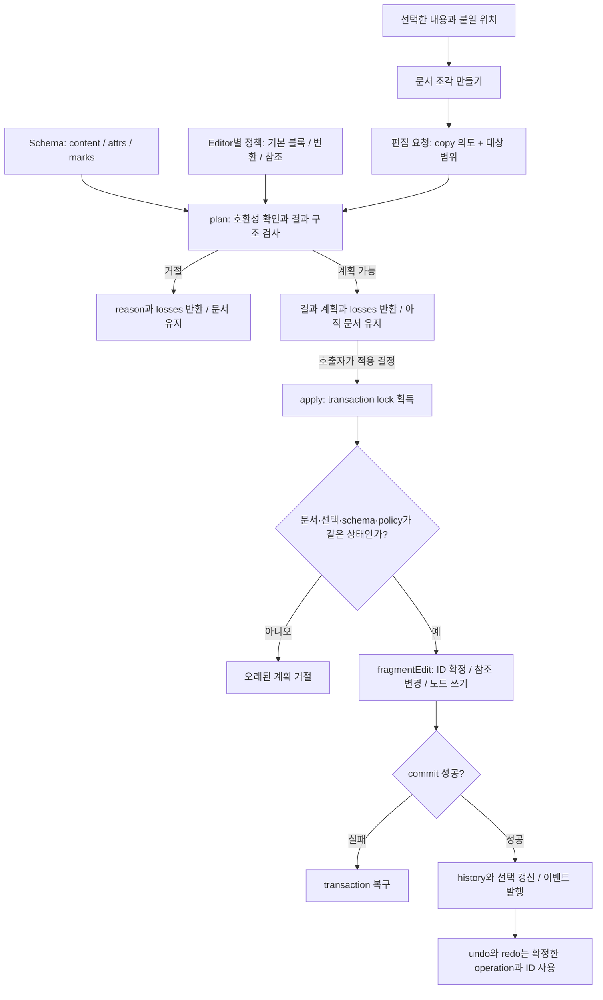
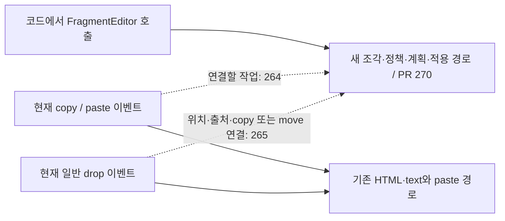

# Schema 편집 흐름과 커스텀 스키마 사용법

이 문서는 **어떤 규칙을 어디에 등록하고, 문서가 언제 바뀌는지** 설명한다.
세부 계약은 [Schema 편집 정책과 문서 조각](specs/schema-editing-policy.md)을 참고한다.

기준: [PR #270 / SE-01](https://github.com/barocss/barocss-editor/pull/270). 이 PR의 코드는 아직 main에 병합되지 않았다. 아래 예제는 이 PR 브랜치에서 실행한다. 기존 배포 패키지에서 새 API를 사용할 수 있다고 가정하지 않는다.

## 1. 먼저 볼 전체 흐름



`plan()`은 실제로 넣을 결과를 계산한다. 문서, 선택, history, 이벤트와 ID 할당기는 바꾸지 않는다.
`apply()`가 문서를 바꾼다. 계획 이후 문서가 바뀌면 그 계획을 그대로 적용하지 않는다.

`decision.ok === true`는 계획이 가능하다는 뜻이다. `plan.losses`가 비어 있다는 뜻은 아니다. 호출자는 손실을 보여주거나, 제품 규칙에 따라 적용을 거절할 수 있다. 새 API가 확인 대화상자를 자동 생성하지는 않는다.

commit 후 알림이나 history 기록에서 오류가 나면 `postCommitErrors`로 구분한다. `committed: true`인 작업을 다시 적용하면 중복 편집이 된다. [transaction 결과 계약](specs/transaction-recovery.md)을 따른다.

## 2. 어디까지 연결됐나

현재 키보드 붙여넣기와 새 API는 서로 다른 진입 경로다. 이 구분이 없으면 새 정책을 등록하자마자 모든 paste와 DND가 바뀐다고 오해하기 쉽다.



| 상태 | 범위 |
| --- | --- |
| #266 main 반영 | transaction 실패 복구, commit 결과 구분 |
| #270 PR 구현 | 작은 본문 조각의 생산, 정책 검사, 계획, 실제 적용, undo/redo |
| #264 남음 | 실제 clipboard 전달, 여러 노드 범위, 기존 paste의 고정 이름 분기 전환 |
| #265 남음 | 실제 drop 위치, 내부 drag 출처, 복사/이동, 이동 위치 보정 |

아래 예제는 새 API를 직접 호출한다. `Cmd+V`나 drag 이벤트를 연결하는 예제는 아니다.

## 3. 커스텀 스키마에서 무엇을 제어하나

스키마 작성자가 구조와 의미를 선언하고, 공통 편집기가 그 선언을 읽는다. 새 타입의 의미를 타입 이름만 보고 추측하지 않는다.

| 원하는 규칙 | 설정할 곳 | 실제 의미 |
| --- | --- | --- |
| 제목 다음에 본문이 하나 이상 있어야 함 | `Schema.nodes.section.content = 'caption body+'` | 최종 구조가 이 순서를 지키지 않으면 거절 |
| 본문에 어떤 자식을 넣을지 | `content`, 자식의 `group` | 허용한 타입/그룹만 배치 |
| 속성의 타입·필수값·기본값 | 노드의 `attrs` | 조각과 최종 결과를 검사. 기본 블록을 만들 때 선언한 기본값 사용 |
| 허용할 서식 | schema의 `marks`, 노드의 `marks` | 알 수 없는 mark와 금지한 mark를 거절 |
| 어떤 블록으로 본문을 감쌀지 | `EditingPolicy.defaultBlock` | 선언만으로 후보가 하나면 생략 가능. 후보가 여러 개면 명시 |
| 열린 경계를 넘겨 합치지 않을지 | 노드의 `isolating: true` | 같은 경계 내부의 텍스트 편집은 가능. 그 밖으로 열린 내용을 합치는 것은 거절 |
| 원자 노드 경계를 유지할지 | 노드의 `atom: true` | 새 경로에서 열린 경계 제거와 대상 블록 분할을 제한 |
| 링크 필드가 노드 ID인지 외부 값인지 | `EditingPolicy.references` | 내부 ID 재매핑과 조각 밖 참조 정책을 결정 |
| 다른 schema의 내용을 어떻게 바꿀지 | `EditingPolicy.adapters` | 알고 있는 출처만 명시적으로 변환. 이후에도 대상 schema 검사 |
| 화면에 어떻게 그릴지 | 제품의 renderer/kit | 편집 정책과 별도로 구현. schema 등록만으로 UI가 생기지 않음 |
| 읽기 전용 mode에서 명령을 허용할지 | 제품의 command/context 진입점 | 현재 FragmentEditor에 범용 mode/권한 정책이 추가된 것은 아님 |

`defaultBlock`이나 adapter로 schema의 구조 제약을 끌 수 없다. 현재 임의의 split/join callback이나 모든 타입 조합별 callback은 제공하지 않는다. 지원하는 본문 알고리즘으로 표현할 수 없는 구조는 별도 영역 알고리즘이 필요하다.

## 4. 실행 예제: 커스텀 구조 등록부터 적용까지

예제 구조는 `document → section(caption, body+)`다. `body`와 `quote`가 모두 inline 내용을 받을 수 있으므로 기본 본문을 `body`로 명시한다. `glyph`라는 커스텀 이름의 텍스트를 사용한다.

```ts
import { Editor } from '@barocss/editor-core';
import { Schema } from '@barocss/schema';
import { FragmentEditor, type EditingPolicy } from '@barocss/model';

export async function runCustomSchemaExample() {
  const schema = new Schema('article', {
    topNode: 'document',
    nodes: {
      document: { name: 'document', content: 'block+' },
      section: { name: 'section', group: 'block', content: 'caption body+' },
      caption: { name: 'caption', content: 'inline*' },
      body: { name: 'body', group: 'block', content: 'inline*' },
      quote: { name: 'quote', group: 'block', content: 'inline*', isolating: true },
      glyph: { name: 'glyph', group: 'inline' },
      pointer: {
        name: 'pointer', group: 'inline', atom: true,
        attrs: { targetId: { type: 'string', required: true } },
      },
    },
    marks: { strong: { name: 'strong' } },
  });
  const policy: EditingPolicy = {
    schemaId: 'article',
    defaultBlock: 'body',
    references: {
      pointer: { targetId: { kind: 'node', outside: 'same-document' } },
    },
  };
  const editor = new Editor({ schema });
  editor.loadDocument({
    stype: 'document',
    content: [
      { sid: 'section', stype: 'section', content: [
        { sid: 'title', stype: 'caption', content: [
          { sid: 'titleText', stype: 'glyph', text: '제목' },
        ] },
        { sid: 'sourceBody', stype: 'body', content: [
          { sid: 'sourceText', stype: 'glyph', text: 'ABCD' },
          { sid: 'sourceLink', stype: 'pointer', attributes: { targetId: 'sourceText' } },
        ] },
      ] },
      { sid: 'targetBody', stype: 'body', content: [
        { sid: 'targetText', stype: 'glyph', text: 'xy' },
      ] },
    ],
  });
  editor.updateSelection({
    type: 'range', collapsed: true,
    startNodeId: 'targetText', endNodeId: 'targetText',
    startOffset: 1, endOffset: 1,
  });
  const editing = new FragmentEditor(editor, policy);
  const target = { kind: 'text' as const, nodeId: 'targetText', from: 1, to: 1 };
  const readText = (id: string): string => {
    const node = editor.dataStore.getNode(id)!;
    return node.text ?? (node.content ?? []).map(child => readText(String(child))).join('');
  };
  try {
    // 1. 텍스트 선택: 열린 조상 경계를 가진 조각을 만든다.
    const partial = editing.captureText('sourceText', 0, 4);
    const decision = editing.plan({ intent: 'copy', fragment: partial, target });
    if (!decision.ok) throw new Error(decision.reason);
    // 예제에서는 손실이 있는 계획을 적용하지 않는다.
    if (decision.plan.losses.length) throw new Error('손실 정책 확인 필요');
    const applied = await editing.apply(decision.plan);
    if (!applied.committed) throw new Error(applied.errors.join('; '));
    if (applied.postCommitErrors?.length) throw new Error(applied.postCommitErrors.join('; '));
    const partialText = readText('targetBody'); // xABCDy

    // 2. 원래 문서로 되돌린 뒤 블록 전체를 복사한다.
    if (!await editor.undo()) throw new Error('Undo 실패');
    const whole = editing.captureNodes(['sourceBody']);
    const next = editing.plan({ intent: 'copy', fragment: whole, target });
    if (!next.ok) throw new Error(next.reason);
    if (next.plan.losses.length) throw new Error('손실 정책 확인 필요');
    const inserted = await editing.apply(next.plan);
    if (!inserted.committed) throw new Error(inserted.errors.join('; '));
    if (inserted.postCommitErrors?.length) throw new Error(inserted.postCommitErrors.join('; '));

    const root = editor.dataStore.getNode(editor.dataStore.getRootNodeId()!)!;
    const bodyIds = (root.content as string[]).slice(1);
    const wholeTexts = bodyIds.map(readText); // ['x', 'ABCD', 'y']
    const copiedBody = editor.dataStore.getNode(bodyIds[1])!;
    const [copiedTextId, copiedPointerId] = copiedBody.content as string[];
    const copiedPointer = editor.dataStore.getNode(copiedPointerId)!;
    return {
      partialText,
      wholeTexts,
      referenceRemapped: copiedPointer.attributes!.targetId === copiedTextId,
      copiedIdIsNew: copiedTextId !== 'sourceText',
    };
  } finally {
    editor.destroy();
  }
}
```

`await runCustomSchemaExample()`의 결과는 다음과 같다.

```json
{
  "partialText": "xABCDy",
  "wholeTexts": ["x", "ABCD", "y"],
  "referenceRemapped": true,
  "copiedIdIsNew": true
}
```

부분 복사는 블록 하나 안에 글자를 넣는다. 블록 전체 복사는 `x`와 `y`를 서로 다른 블록으로 나누고 그 사이에 복사한 블록을 둔다. 이때 원본 pointer가 가리키던 ID도 복사된 텍스트 ID로 바꾼다.

`captureText()`와 `captureNodes()`는 유효하지 않은 선택에서 예외를 낼 수 있다. 제품의 입력 경계에서는 이 예외를 거절 결과로 처리한다. 현재 전체 블록을 텍스트 위치에 넣는 소비자는 대상이 단일 텍스트 런인 경우만 지원한다.

## 5. 같은 스키마를 제품마다 다르게 제어하기

Schema 객체를 여러 editor가 공유해도 `new FragmentEditor(editor, policy)`의 정책은 editor마다 다르다. editor 하나에는 FragmentEditor 하나를 만들고 보관한다. 명령마다 새 인스턴스를 만들면 이전 계획의 정책 소유자가 달라져 그 계획은 거절된다.

정책 변경은 보관한 인스턴스의 `configure(nextPolicy)`로 한다. **configure는 부분 병합이 아니라 전체 정책 교체다.** 다른 필드를 유지할 때는 애플리케이션이 보관한 전체 정책에 변경값을 합쳐 전달한다.

```ts
// 위 예제의 policy와 editing을 보관한 제품 코드 안에서 실행한다.
const nextPolicy: EditingPolicy = { ...policy, defaultBlock: 'quote' };
editing.configure(nextPolicy);
```

이 설정은 기본 감싸기 후보를 quote로 바꾼다. `section`의 `caption body+` 규칙을 바꾸지는 않는다. section 안에 quote를 넣어 구조가 맞지 않으면 여전히 거절된다.

| 참조 설정 | 조각 안의 node 참조 | 조각 밖의 참조 |
| --- | --- | --- |
| `kind: 'node', outside: 'same-document'` | 복사한 ID로 재매핑 | 같은 문서이고 대상이 존재해야 유지 |
| `kind: 'node', outside: 'reject'` | 복사한 ID로 재매핑 | 거절 |
| `kind: 'external', outside: 'preserve'` | node ID 재매핑 대상이 아님 | 원래 문자열 유지 |

참조는 현재 노드의 최상위 문자열 속성으로 선언한다. 배열 안 ID, 중첩 객체 안 ID, 부속 파일의 연결을 자동으로 발견하지 않는다. 이런 데이터의 지원은 명시적으로 확장해야 한다.

## 6. 다른 schema 또는 모르는 schema가 들어오면

| 원본과 대상의 관계 | 현재 처리 |
| --- | --- |
| 같은 형식·schemaId·schemaRevision | 직접 수용 후보. 그래도 구조와 참조 검사 필요 |
| 타입 이름만 같음 | 직접 호환으로 간주하지 않음 |
| 별개 Schema 객체이거나 다른 실행 세션 | 이름이 같아도 등록 adapter 필요 |
| 알려진 출처이고 adapter가 있음 | adapter 변환 후 대상 schema와 참조 규칙 검사 |
| 지원하는 opaque 타입에 원본을 보관하는 adapter가 있음 | `preserved`로 구분하고 해당 타입을 검사 |
| 모르는 의미이며 adapter가 없음 | 거절 |

`schemaId: 'article'`은 호환성 검사를 끄는 옵션이 아니다. 현재 schemaRevision에는 실행 중 Schema 객체와 선언·함수의 상태가 포함된다. 이름만 복사하거나 revision을 대상 값으로 덮어써 호환성을 꾸미지 않는다.

대상 editor의 `policy.adapters`에 `{ format, schemaId, convert }`를 등록한다. convert는 입력 DocumentFragment를 받아 다음을 반환한다.

```ts
// 반환 형태 설명. convert 안에서 변환한 값들을 반환한다.
return {
  content: convertedFragment,
  outcome: 'converted', // 원본을 지원 타입에 실제 보관했다면 'preserved'
  losses: [{ kind: 'mark', reason: '원본 서식을 대상이 지원하지 않음' }],
};
```

adapter 작성자는 다음을 결정한다.

1. 받아들일 원본 revision과 노드 의미. adapter 선택 키에는 format과 schemaId만 있으므로 revision은 convert 안에서 확인한다.
2. 대상 타입·속성·marks로 바꾸는 규칙. sourceId는 참조 관계를 추적할 수 있게 유지한다.
3. 바뀐 타입/속성에 맞춘 references 목록. 대상 정책의 선언과 일치해야 한다.
4. 제거하거나 바꾼 의미를 losses에 기록하는 규칙. 처리하지 못하는 입력은 예외로 거절한다.

convert는 문서나 선택을 수정하지 않는 순수 함수여야 한다. HTML 문자열을 이 callback에 바로 넣는 구조는 아니다. HTML/text 해석과 실제 clipboard 전달은 #264의 연결 작업이다.

## 7. schema를 다시 정의할 때

정책 설정을 바꾸는 일과 저장 문서의 구조를 바꾸는 일은 다르다.

| 변경 | 해야 할 일 |
| --- | --- |
| 기본 본문이나 외부 참조 처리만 변경 | 전체 정책을 configure로 다시 등록. 대기 계획은 다시 생성 |
| attrs/content/marks 등 schema 의미 변경 | 새 선언에서 기존 문서가 유효한지 먼저 검사. 유효하지 않으면 제품이 문서 변환 방안을 준비 |
| 이전 schema에서 복사한 조각 수용 | 이전 형식과 의미를 확인하는 adapter 등록 |
| 편집 도중 문서 교체 | 기존 계획 폐기. 새 문서/선택에서 계획 생성 |
| 정책 변경 후 기존 undo/redo | 성공한 편집 기록의 operation과 ID 재사용. 새 정책으로 다시 변환하지 않음 |

현재 저장 문서 전체 migration이나 schema 변경 후 history 변환 기능은 없다. 이 API가 기존 저장 문서를 자동으로 바꾼다고 가정하지 않는다. `schema.nodes`를 직접 수정하거나 callback의 숨은 상태를 바꾸는 방식으로 운영 정책을 전환하지 말고, 선언·정책·기존 문서 검증을 함께 관리한다.

## 8. 검증 결과와 소스 연결

| 확인할 흐름 | 소스 / 검사 |
| --- | --- |
| 조각 생산과 정책 등록 | [FragmentEditor](../packages/model/src/editing/fragment-editor.ts), [공개 타입](../packages/model/src/editing/types.ts) |
| 열린 조각과 최종 구조 검사 | [schema 검사](../packages/schema/src/editing-validation.ts), [경계 사례](../packages/schema/test/editing-validation.test.ts) |
| 비표준 이름·필수 자식·격리 경계·참조·stale plan·실패 복구 | [model 사례](../packages/model/test/transaction/fragment-editing.test.ts) |
| 실제 Editor의 문서 교체와 undo/redo | [editor-core 사례](../packages/editor-core/test/fragment-editing.test.ts) |

새 커스텀 스키마를 추가할 때는 정상 삽입 결과, 필수 구조 위반 거절, 참조의 복사 결과, 실패 전후 문서, undo/redo 결과를 확인한다. 이름만 바꾼 테스트로 서로 다른 구조와 의미까지 검증했다고 보지 않는다.
