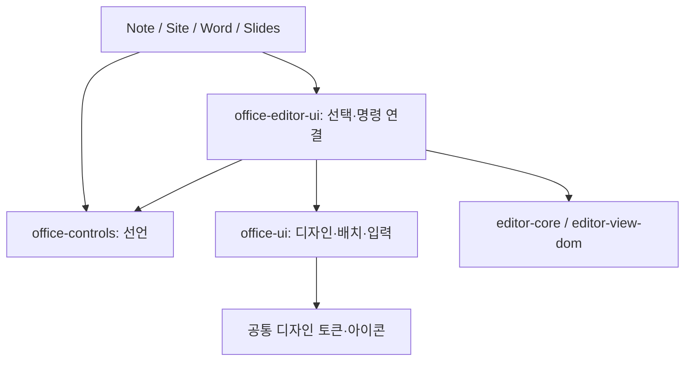

# Office 문맥 UI

문맥 UI는 제품마다 별도로 만들지 않는다. Note와 Site의 텍스트 툴바는 같은
`ContextToolbar`를 사용하며, 제품은 보여줄 명령과 활성 조건을 전달한다.

| 모듈 | 책임 | 현재 사용하는 구성 요소 |
|---|---|---|
| `office-icons` | 아이콘 원본과 이름 | `Icon` (`office-ui`의 export도 같은 컴포넌트) |
| `office-controls` | 기능·메뉴·속성·단축키 선언과 순수한 상태 해석 | `Control`, `PanelRow`, `controlId`, `markState` |
| `office-ui` | 에디터를 모르는 디자인, 위치, 닫기, 기본 입력 | `FloatingSurface`, `FloatingPanelHeader`, `IconButton`, `MenuAction`, `Field`, `TextField`, `Choice` |
| `office-editor-ui` | 선언을 편집기 선택과 명령에 연결 | `Controls`, `ContextToolbar`, `useEditorTextSelection`, `useNodeRect`, `SelectionLinkControl`, `SlashMenu` |
| 제품 패키지·앱 | 제공할 기능, 삽입 위치, 선택 블록과 속성의 의미 | Note의 명령 목록·블록 속성, Site의 텍스트 모드 조건 |

`office-ui`에는 editor나 제품 타입을 추가하지 않는다. `office-controls`에는 React나 DOM을
추가하지 않는다. `office-editor-ui`는 제품 패키지를 런타임에 참조하지 않는다. 기존 `Control[]`가
충분하므로 문맥 툴바 전용 선언 체계를 새로 만들지 않았다.

## 표면의 규칙

- 서식은 한 줄 툴바로 제공한다. 버튼은 공통 높이·여백·포커스·활성 상태를 따른다.
- 본문 클릭은 글쓰기를 계속한다. 블록 핸들을 클릭하면 작업 메뉴를 열고, 그 안의 블록 설정을 눌렀을 때만 상세 속성을 연다.
- 상세 속성은 상단 제목과 오른쪽 닫기, 이름과 입력값의 정렬된 행, 하단 작업으로 구성한다.
  제목과 닫기는 `FloatingPanelHeader`의 한 행에 속하며 제품이 따로 배치하지 않는다.
- `+`와 `/` 메뉴는 `MenuAction`을 사용한다. 클릭한 행의 명령을 실행한다.
- 팝업은 `FloatingSurface`가 `placeNear`로 배치한다. 선택 위를 우선하고 공간이 부족하면
  아래로 바꾸며, 내용 크기와 창 크기가 바뀌면 다시 측정한다.
- 표면의 테두리·배경·모서리·그림자는 `office-ui` 토큰을 따른다. Note의 별도 팝업 CSS는 제거했다.
- 로컬 테마가 있는 호스트는 편집 영역 밖의 `portalRoot`를 제공한다. 편집 가능한 본문 안에는
  팝업을 넣지 않는다. 호스트는 공통 스타일과 사용 중인 패키지의 Tailwind source를 포함한다.
- 표의 문맥 도구는 표 바깥 위쪽에 배치하고 행·열·셀 작업을 각각 작은 메뉴로 연다.
  마지막 본문 행·열 삭제와 기존 병합 셀을 일부만 포함하는 병합은 비활성화한다.
- 콜아웃 제목은 `calloutTitle`의 실제 inline 텍스트로 편집한다. 본문과 같은 선택·서식·링크·
  실행 취소·IME 경로를 사용한다. Enter는 제목 뒤쪽 내용을 본문으로 옮기거나 기존 본문으로
  이동한다. 별도의 확정/취소 입력 모드는 없다. 빈 제목은 편집 화면에서만 '제목 추가'로 안내한다.
- 표 아래의 넓은 추가 영역은 클릭으로 한 행, 드래그로 미리 본 수만큼 행을 추가한다.
  행·열 경계의 +는 해당 위치에 삽입하고 열 경계 드래그/방향키는 열 너비를 바꾼다.
  드래그는 놓을 때 한 번 저장하며 Escape/포인터 취소는 문서를 바꾸지 않는다.
- 표 테마는 공유 표 속성으로 저장하고 이후 추가 행에도 적용한다. 셀 배경색은 테마 위에
  적용하며 색상 초기화는 테마로 돌아간다. 명령은 `office-text`가 소유한다.
- 툴팁은 `--ou-z-tooltip`으로 팝업보다 위에 표시한다. Note의 본문 레이어는 stacking context를
  분리하여 내부 selection/context 순서가 호스트의 메뉴·툴팁보다 앞서지 않게 한다.
- 객체 선택선은 본문 경계 안에 그린다. 표 선택 손잡이는 공통 `installCellSelection`의
  `chromeContainer`로 clipping 컨테이너 밖에 두고, 포인터와 좌표 갱신도 같은 호스트를 따른다.

## 선택과 키보드

선택의 양끝이 해당 편집기의 노드인지 확인한다. 별도의 scope를 전달하면 DOM 경계도 확인한다.
캐럿만 있거나 다른 편집기에 선택이 있으면 서식 툴바를 숨긴다. 링크 입력 중에는 선택 스냅샷을
보존하고 명령 실행 시 복원한다. 블록 위치는 `useNodeRect`로 측정하여 중첩 블록에도 적용한다.

Escape와 외부 클릭은 공통 표면이 처리한다. 겹친 표면은 최상단부터 닫힌다. 속성 입력의
Enter·Backspace는 본문 편집으로 전달하지 않는다. 공유 `TextField`가 입력 확정 동작을 담당한다.
IME 조합 중 Enter는 후보 확정으로 남겨 둔다. 명시적 작업 메뉴는 `focusOnOpen`을 사용할 수 있고
공통 표면이 방향키·Home·End로 비활성 항목을 건너뛰며 이동한다.

## 기본 UI와 모션의 공통 경계 — 2026-09-07

Note의 새 기본 UI는 `office-ui`의 구성 요소를 사용한다. 필요한 범용 입력·동작이 없으면
공통 패키지에 추가하고 제품에서 사용한다. 현재 Button/Choice/TextField/메뉴/툴팁/Dialog/
SidePeek를 공유하며, Note의 검색·제목·템플릿·상위 페이지 입력도 공통 컴포넌트로 연결했다.
Note의 직접 작성 SVG와 메뉴·추가·삭제·정렬 문자 아이콘은 `office-icons`로 정리했다.
문서 렌더링 요소와 파일 선택용 숨긴 input은 기본 도구 UI와 구분한다.

모든 기존 UI가 전환된 것은 아니다. 페이지 목록·뷰 탭·일부 체크박스·수식/제목 textarea와
포커스 anchor가 필요한 제품별 버튼에는 native 구현이 남아 있다. 필요한 의미와 이벤트를
보존하며 공통 부품을 확장해 옮긴다. 단순한 태그 감싸기나 기능 회귀로 개수를 줄이지 않는다.

`office-ui/tokens.css`가 모션도 소유한다. 기본 등장 160ms, 사라짐 100ms와 공통 easing을
사용한다. 메뉴/툴팁은 작은 이동과 페이드, SidePeek는 짧은 수평 이동, 중앙 Dialog는 위치를
유지하는 페이드를 적용한다. FloatingSurface는 위치 계산 완료 후 등장만 적용하며 닫힘은 즉시다.
Radix 표면의 닫힘은 data-state를 따른다. 문서 내용·선택 도구의 위치를 모션으로 바꾸지 않는다.
`prefers-reduced-motion: reduce`에서는 해당 애니메이션과 공통 버튼의 색상 전환 시간을 없앤다.

## 회귀 검증

- `office-ui/test/floating.test.ts`: 표면의 크기·경계·테마·닫기·메뉴와 헤더 구조.
- `office-editor-ui/test/context-toolbar.test.ts`: 실제 독립 편집기 두 개의 선택 격리,
  입력 중 선택 보존, Escape와 재선택.
- `apps/note/tests/meeting-note.spec.ts`: 제목/닫기 정렬, 중첩 속성 위치, 서식·링크·상태 변경과 저장.
- `apps/note/tests/product-editing.spec.ts`: 직접 제목 편집·실행 취소·저장, hover 삽입 대상,
  행·열 추가/드래그/취소/실행 취소, 열 너비, 테마·셀 색상·저장, 툴팁 레이어, 선택 손잡이
  네 모서리 hit-test, 좁은 창에서 속성창 경계.
- Site의 기존 텍스트 툴바·슬래시 메뉴 및 embedded Note 흐름을 유지한다.

공통화는 모든 제품의 리본을 문맥 툴바로 바꾸는 작업이 아니다. Word와 Slides는 기존 편집 방식을
유지하며, 문맥 UI를 추가할 때 같은 구성 요소를 사용한다. 줄 시작/끝 선택의 브라우저 검증은
macOS에서는 Cmd+방향키, 다른 플랫폼에서는 Home/End를 사용한다. macOS의 네이티브
Shift+Home은 문서 시작까지 선택하므로 줄 선택 회귀 검증의 키로 사용하지 않는다.

## Notion과의 관계

Notion의 공식 [편집 안내](https://www.notion.com/help/writing-and-editing-basics)는 텍스트 선택의
서식 메뉴와 블록 핸들의 작업 메뉴를 구분한다. [콜아웃 스타일 안내](https://www.notion.com/help/customize-and-style-your-content)
역시 블록 핸들에서 색상을 조정하도록 설명한다(2026-09-07 확인). 초기의 자동 속성 카드는 이
상호작용과 달랐으므로 자동 노출을 제거했다. 현재 Note는 이 구분을 따른다. 아직 없는 댓글·색상·
블록 전환 기능을 빈 버튼으로 표시하지 않으며, Notion의 화면이나 기능 전체를 복제했다고 주장하지 않는다.
