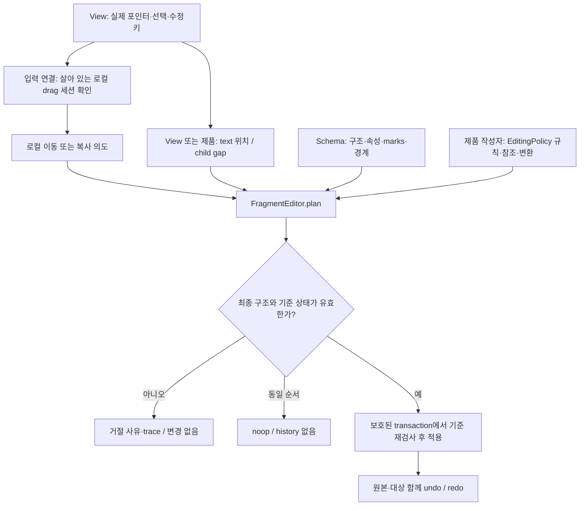

# DND의 출처, 위치, 정책, 실행

이 문서는 #265 구현의 계약이다. 패키지 배포 상태는 별도다. 앞선 clipboard 구현은 #284다.
[편집 정책 가이드](../schema-editing-guide.md)와 같은 Schema·EditingPolicy·FragmentEditor를 사용한다.
JEV는 필요하지 않다. 실행 전에 실제 결과 구조를 계산하고 검사한다.

## 1. 누가 무엇을 결정하는가



- **스키마 작성자**는 허용 자식, 필수 순서, 속성, marks, atom, isolating을 정한다.
- **제품/스키마 작성자**는 `defineEditingPolicy`와 `defineEditingRule`로 연결·보존·거절, 참조, 변환을 정한다. `FragmentEditor.forEditor(editor, policy)`로 최초 등록한다. 변경할 때는 기존 owner의 `configure(fullPolicy)`를 쓴다.
- **view**는 좌표와 수정키를 해석한다. 드래그 정책을 타입 이름으로 추측하지 않는다.
- **입력 연결부**는 원본 삭제 권한과 schema의 `draggable`/`droppable`을 검사한다.
- **planner**는 선언을 읽고 결과를 만든다. `plan` 자체가 정책은 아니다.
- **transaction**은 계획이 여전히 유효한지 확인하고 쓰기·실패 복구·history를 담당한다.

`defineDropBehavior`와 전역 registry, 호환 API는 없다. 이름이 비슷하다는 이유만으로 노드를 합치지 않는다. 기존 규칙의 우선순위·충돌 판정을 그대로 사용한다.

## 2. 원본 삭제 권한

`CopyPasteExtension`이 editor마다 독립적인 drag 세션을 설치한다. `createCoreExtensions()`에도 포함된다.

`dragstart`는 조각과 원본 범위/노드, editor의 문서·schema·policy 기준을 메모리에 저장한다. 전송하는 MIME token은 그 세션을 찾기 위한 값이다. 조각의 `sourceId`나 `documentId`만으로 원본을 삭제하지 않는다.

- 같은 editor의 현재 세션이면 기본 의도는 move다.
- Alt 또는 Ctrl을 누르면 copy다. Meta 단독은 copy 수정키로 사용하지 않는다.
- 다른 editor·탭·외부 앱의 입력은 copy다. 문서 간 원자적 이동은 제공하지 않는다.
- 같은 owner의 만료 token, 바뀐 문서·schema·policy는 거절한다. 조용히 copy로 바꾸지 않는다.
- 커서만 바뀌어도 원본 세션이 만료되지는 않는다. 최종 plan은 적용 시점의 selection까지 포함한다.
- drop, dragend, Escape, view/extension 해제 시 세션을 정리한다.
- 원본 view는 자신이 시작한 native drag의 `deleteByDrag`를 차단한다. 브라우저가 원본을 한 번 더 삭제할 수 없다.

프로그램에서 호출하는 `transferNodes(editor, payload)`는 신뢰된 제품 코드의 진입점이다. 외부 JSON의 node ID를 여기에 바로 넣으면 안 된다.

## 3. 실제 drop 위치와 preview

DOM/React는 같은 `attachFragmentDrag`를 사용한다.

- 텍스트는 `clientX/clientY`의 DOM caret을 읽고 모델 위치로 바꾼다. 이전 커서를 대체값으로 쓰지 않는다.
- node drag는 포인터 아래 블록의 위/아래 절반을 형제 사이 gap으로 바꾼다.
- preview를 위해 실제 selection이나 history를 수정하지 않는다. editor content 밖의 별도 선을 사용한다.
- 로컬 preview는 실제 planner의 판단을 표시한다. 거절 시 `dropEffect=none`이며 선을 숨긴다.
- 브라우저가 외부 payload를 dragover에서 숨기면 연한 **위치 후보선**만 표시한다. 외부 내용의 허용 판정은 drop 때 한다.
- 파일, 전용 MIME, input/textarea, 다른 content root, 조합 입력 중 이벤트, 이미 처리된 이벤트를 본문 경로가 소비하지 않는다.

공통 view는 제품용 drag handle을 자동으로 만들지 않는다. 제품은 블록 선택과 native draggable 요소 또는 자신의 pointer overlay를 제공한다. 선택한 draggable의 pointer-down이 커서를 바꾸더라도 그 제스처의 원래 node 선택을 보관한다. 텍스트 드래그는 실제 DOM 선택을 사용한다.

## 4. 위치 기준을 하나로 맞추기

공통 `EditingTarget`의 children index는 **원본 제거 전** content 기준이다.
같은 부모에서 원본 위치 집합이 S, 원래 gap이 j이면 실제 삽입 위치는 다음과 같다.

`j - count(s ∈ S where s < j)`

예: `[a,b,c,d]`에서 `[a,c]`를 gap 4에 옮기면 제거 후 index는 2다. 결과는 `[b,d,a,c]`다. 원본의 문서 순서는 유지한다.

Note·Site overlay는 원본을 제외한 표시 목록을 사용한다. 제품에서 표시 위치를 실제 content 위치로 바꾼 뒤 `gapBeforeRemoval(content, movedIds, postRemovalIndex)`를 호출한다. 남은 이웃 ID를 기준으로 원래 gap을 찾는다. planner가 다시 한 번만 제거 위치를 보정한다. Note의 `resources`와 Site의 비표시 자식도 content 계산에 포함한다.

```ts
import { gapBeforeRemoval } from '@barocss/model';
import { transferNodes } from '@barocss/extensions';
import type { Editor } from '@barocss/editor-core';

async function moveToSlot(editor: Editor, parentId: string, nodeIds: string[], slot: number) {
  const content = editor.dataStore.getNode(parentId)!.content as string[];
  return transferNodes(editor, {
    nodeIds,
    intent: 'move',
    target: { kind: 'children', parentId, index: gapBeforeRemoval(content, nodeIds, slot) },
  });
}
```

## 5. 지원 범위와 ID

| 입력 | 지원·판정 | ID와 history |
| --- | --- | --- |
| 같은 부모의 전체 노드들 | 비연속 형제도 가능. 대상은 child gap | 이동 subtree ID·참조·local metadata 유지 |
| 서로 다른 부모의 전체 노드 | 순환, 격리 경계, 원본 필수 자식과 대상 구조 검사 | 한 transaction, 같은 ID |
| 한 text leaf 안의 부분 선택 | 같은 leaf의 앞/뒤 또는 다른 leaf로 lossless inline join | 남는 원본 run은 원래 ID. 분할/이동 run은 새 ID |
| 여러 source run에 걸친 text move | 현재 거절. Alt/Ctrl copy는 기존 range planner 지원 범위에서 가능 | 이동을 복사로 자동 대체하지 않음 |
| 순서가 같은 node move, 원본 text 범위 내부와 양 끝 drop | noop | 문서·적용 시점 selection·history 변경 없음 |
| copy | 기존 adapter·규칙·참조 검사. copy + transform + join 조합 가능 | 새 ID, 선언된 내부 참조 재매핑 |
| code 영역으로 copy | paste와 같은 literal 변환. 구조·서식·참조 손실 보고 | code 정책이 literal 입력을 허용. 원본은 보존 |
| 손실이 필요한 move | 거절 | 원본 삭제 없음 |
| 참조 속성을 가진 text의 부분 move | 거절. 부분 참조 변환 계약은 미제공 | 전체 node move는 가능 |
| 외부 HTML/text | 명시적 text 위치에서 기존 paste parser와 정책 사용 | 복사이며 외부 원본 삭제 없음 |

이동의 `EditingRequest.source`는 trusted caller가 제공한다. planner는 현재 문서에서 원본을 다시 캡처하고 전달된 fragment와 비교한다. 변조되거나 오래된 조각은 거절한다. `captureNodes(ids, false)`는 비연속 형제 캡처를 명시적으로 허용한다. 기본값은 기존 연속 선택 계약이다.

`draggable: false`는 선택한 원본 노드(텍스트 선택이면 양 끝 leaf)의 native drag를 막는다. `droppable: false`는 목적지 컨테이너의 drop을 막는다. 일반 paste의 허용 여부를 이 플래그로 바꾸지는 않는다. 제품 `transferNodes`도 이 검사를 사용한다. 이 플래그는 `content`나 정책 검사를 우회하지 않는다. 입력 연결부는 기존 `lockContent`와 `lockDelete` 규약도 검사한다. 잠긴 원본 텍스트나 삭제 금지 노드의 move, 잠긴 목적지의 drop은 거절한다.

## 6. 하나의 복구 가능한 실행

이번 구현은 **원본·대상의 최소 공통 조상 아래 content를 한 번 교체**하는 계획을 사용한다. 처음 검토한 다중 patch API를 추가하지 않았다. 기존 `fragmentEdit`의 basis 검사·snapshot·inverse·실패 복구를 재사용한다.

계획 안의 `retainIds`가 기존 노드를 가리킨다. 적용 때 기존 metadata, version, createdAt, updatedAt도 보존한다. copy에서 전달받은 metadata를 신뢰하여 복원하는 계약은 아니다. 계획 생성은 ID를 할당하지 않는다.

대가도 있다. 멀리 떨어진 두 위치의 이동은 공통 조상 아래의 큰 subtree를 다시 쓴다. 현재 정확성·복구 검사를 완료 기준으로 삼는다. 대형 문서에서 preview 비용을 줄이는 부분 patch/캐시 최적화는 별도 측정 후 진행한다.

기존 `moveChildren`의 비연속 inverse는 최초 위치만 사용해 `[a,b,c] → move[a,c] → undo[a,c,b]`가 될 수 있다. 새 경로는 그 primitive를 사용하지 않는다. `[a,c]` 이동의 정확한 undo 순서를 회귀 검사한다. 기존 primitive 전체를 이번 PR에서 고친 것으로 주장하지 않는다.

## 7. 제품 연결과 전용 경로

| 경로 | 이번 연결·회귀 범위 |
| --- | --- |
| DOM/React native text/node DND | 실제 좌표 → editor drag 세션 → FragmentEditor |
| `ReorderExtension.moveBlockToPosition` | post-removal sibling slot → 공통 transfer. pointer UI는 제품 소유 |
| Note `moveNoteBlockTo`, `batchNoteBlocks:move` | 표시 위치/resources 계산 → 공통 transfer |
| Site `moveBlockInto` | content 위치·서로 다른 부모 이동 → 공통 transfer |
| Note calendar (`database-layouts.tsx`) | 날짜/record 전용 MIME와 명령 유지. 본문이 이벤트를 소비하지 않음 |
| Site 파일 (`apps/site/src/canvas.tsx`) | Files → 업로드/캔버스 좌표 경로 유지 |
| Slides/Word drawing, office-canvas | 좌표·shape·slide/page 이동 유지. flow fragment로 변환하지 않음 |
| 표 셀 범위·파일 형식 import | 전용 영역 알고리즘 유지 |

모든 편집 명령이 이 정책을 쓰는 것은 아니다. indent/outdent, 버튼형 up/down, delete/split/join 전체로 확대하는 후속 범위는 별도다. 상태를 전체 editing policy 완성으로 표시하지 않는다.

## 8. 검증 연결

- `packages/model/test/transaction/fragment-move.test.ts`: 비표준 schema 이름, 필수 순서, 격리·순환·규칙 거절, marks, identity, 실패 복구, 정확한 undo/redo, stale/noop.
- `fragment-position.test.ts`: 1–8개 형제의 모든 원본 부분집합과 제거 후 위치를 원래 gap으로 변환.
- `packages/extensions/test/fragment-drag.test.ts`: 세션 권한, 두 editor, 문서/schema/policy 변경, preview, 외부 변환, code copy, 플래그와 readonly.
- Note·Site·Reorder 기존 동작 검사: resources·표시 위치, 같은 부모 앞/뒤, 다른 부모, undo.
- `apps/editor-react/tests/fragment-drag.spec.ts`: DOM/React 실제 native drag의 위치, 이동, Alt 복사, node ID, stale/noop. 파일/전용 MIME은 합성 이벤트로 소비 여부를 검사한다.
- 기존 clipboard 브라우저 검사와 각 패키지 설정의 회귀 검사, preflight를 함께 실행한다.

파일 drop은 브라우저의 파일 열기를 막되 이벤트 전파는 유지한다. 제품의 상위 업로드 handler가 원래 File을 받는다.
