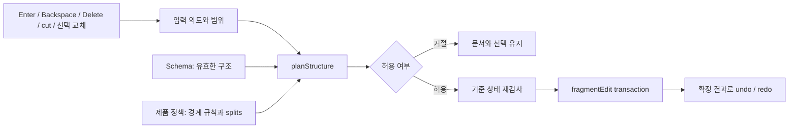

# 삭제·분할·결합의 편집 정책

## 책임과 흐름

Schema는 문서에 허용되는 타입·속성·자식 순서·marks를 정의한다. 제품은 `EditingPolicy`로 경계를 결합할지, 보존할지, 거절할지 정한다. 입력 확장은 키보드나 명령을 `StructuralRequest`로 바꾼다. `FragmentEditor.planStructure()`는 결과를 계산하고 검사한다. `apply()`는 기준 상태를 다시 확인하고 한 transaction으로 적용한다.



이 경로에는 JEV가 필요하지 않다. JEV는 입출력 사례나 불변 조건을 추가로 검증할 수 있다. 실행 중 구조 검사와 실패 복구는 편집기 자체의 책임이다.

## 누가 무엇을 정의하는가

- 스키마 작성자: `caption body+` 같은 유효 구조, 타입별 속성과 marks, `isolating`/`atom`을 정의한다.
- 제품 또는 확장 작성자: editor별 정책을 등록한다. 결합의 의미, 분할을 거절할 타입, 블록 끝에서 생성할 타입을 선택한다.
- 입력 확장: 실제 범위·방향과 Enter의 제품 동작을 해석한다. 정책 검사를 건너뛰고 문서를 직접 변경하지 않는다.
- 모델: 정책 우선순위, 최종 변경 구간과 부모 구조, 잠금, 참조, ID와 선택을 검사한다. 화면 좌표나 키 이름을 판단하지 않는다.

정책은 전역 등록이 아니다. `FragmentEditor.forEditor()`는 해당 editor에 먼저 등록한 소유자를 재사용한다. 표준 clipboard/입력 확장이 기존 제품 정책을 덮어쓰지 않는다. `configure()`는 정책 전체를 교체하고 이전 plan을 무효화한다.

## 커스텀 스키마 예시

타입 이름을 `paragraph`나 `inline-text`로 맞출 필요는 없다. 여기서 `body`, `caption`, `glyph`는 제품이 정의한 이름이다.

```ts
const editing = new FragmentEditor(editor, defineEditingPolicy({
  rangeReplacement: 'preserve-boundaries',
  defaultText: 'glyph',
  removeEmptyBefore: { body: ['caption'] },
  splits: {
    body: { mode: 'same' },
    caption: { mode: 'same', atEnd: 'body' },
    fixedCaption: { mode: 'reject' },
  },
  rules: [defineEditingRule({
    id: 'keep-caption-role',
    priority: 20,
    match: {
      sourceType: 'body', targetType: 'caption',
      boundary: 'open', attributes: 'any', targetKind: 'text',
    },
    effect: 'preserve',
    reason: '제목과 본문은 서로 다른 역할이다',
  })],
  references: {
    pointer: { target: { kind: 'node', outside: 'same-document' } },
  },
}));

const decision = await editing.planStructure({
  intent: 'split',
  range: editor.selection!,
});
if (decision.ok) await editing.apply(decision.plan);
```

`atEnd`는 생성할 다음 블록의 타입이다. 그 타입이 스키마에 없거나 부모의 자식 규칙에 맞지 않으면 거절한다. `same`은 원래 타입과 속성을 유지하는 기본 분할이다. 새 텍스트 런은 원래 런의 타입을 사용한다. 타입이 바뀌면 새 타입에 선언된 속성만 전달한다.

기존 제목·목록·체크리스트·접기·콜아웃의 Enter는 입력 확장이 구체적 동작을 제안한다. 모델은 제안 결과를 같은 정책과 스키마로 검사한다. 분할은 이름이 비슷하다는 이유로 허용되지 않는다.

## 경계 결합과 범위 삭제

`join`은 붙어 있는 두 형제 텍스트 컨테이너를 결합한다. 오른쪽을 source, 왼쪽을 target으로 하여 paste와 같은 open-boundary 규칙을 조회한다. 같은 타입과 같은 유효 속성은 기본 결합 후보다. 다른 타입 또는 다른 속성은 기본적으로 경계를 보존한다. 명시적 `join-inline` 규칙은 제품이 역할 변환을 선택한 경우에만 등록한다. 이 경우 오른쪽 컨테이너의 역할·속성은 왼쪽에 전달되지 않는다.

규칙의 우선순위가 같고 효과가 다르면 거절한다. 등록 순서로 결과가 달라지지 않는다. 선택된 규칙 ID와 판단 이유는 `trace`에 남는다.

범위 삭제는 텍스트와 선택에 포함된 인라인 객체를 처리한다. 역할이 다른 경계는 `rangeReplacement: 'preserve-boundaries'`가 있을 때 보존한다. 필수 자식은 기존 컨테이너의 빈 구조로 유지하며 새로운 타입을 추측하지 않는다. 여러 부모를 가로지르는 범위도 결합을 강제하지 않는다. 격리·원자적 경계를 넘거나 최종 구조가 유효하지 않으면 거절한다.

인라인 객체의 전체 삭제도 계획할 수 있다. 같은 부모의 인라인 노드 집합만 받으며 살아 있는 텍스트 커서가 필요하다. 마지막 객체를 지워 텍스트가 없으면 정책의 `defaultText` 타입으로 빈 런을 만든다. 그 선언이 없거나 부모 구조에 맞지 않으면 거절한다. 단일 객체가 만든 양옆 텍스트 이음새만 정리한다. 그 과정에서 등록 참조가 끊어지면 거절한다. 블록·표·캔버스 전체 선택 삭제는 이 API의 범위가 아니다.

빈 왼쪽 컨테이너를 제거하고 오른쪽 역할을 유지하는 동작은 `remove-gap`이다. `removeEmptyBefore`에 타입 쌍을 명시해야 한다. 표준 정책은 제목 앞의 빈 문단만 허용한다. 명시적 `preserve`·`reject` 경계 규칙, 필수 자식, 잠금과 참조 검사는 이 동작도 거절할 수 있다. 오른쪽 제목의 ID·속성·marks는 그대로 둔다.

## Enter 결과는 어떻게 계산하는가

일반 `split`은 원래 범위를 먼저 삭제하고 이어서 분할한다. 둘을 별도 transaction으로 실행하지 않는다. 기존 제품의 Enter 후보는 제한된 내장 operation 목록으로 표현한다. 목록 분할, 노드 변환·이동·추가·제거, 속성 변경과 선택 이동을 private DataStore에서 계산한다. 실제 editor나 view, history, 외부 저장 콜백을 그 문서 복사본에 전달하지 않는다.

콜아웃 제목처럼 원래 선택의 뒷부분을 본문으로 옮기는 후보는 `handlesRange`를 명시한다. 이 경우 후보가 원래 범위를 소비하며 모델은 중복 삭제하지 않는다. 경계 정책·최종 구조·참조 검사는 그대로 적용된다. 이 후보 목록은 신뢰하는 제품 입력 코드용이다. clipboard나 AI가 임의 operation을 보내는 공개 입력 형식이 아니다.

새 ID는 계획 중 실제 저장소에서 할당하지 않는다. 확정 plan은 기존 노드의 ID를 유지하고 새 노드의 위치를 기록한다. 적용할 때 새 ID와 등록 참조를 연결한다. 다시 실행하는 undo/redo는 확정된 결과를 사용하므로 ID를 새로 만들거나 최신 정책을 다시 실행하지 않는다.

## 입력별 차이

- Backspace/Delete: 방향과 문자·단어 범위를 입력 확장이 정하고 모델이 삭제 또는 결합을 계획한다.
- 선택 후 타이핑: 삭제와 텍스트 삽입을 한 결과로 계획한다. 선택 없는 일반 타이핑은 기존 경로를 유지한다.
- cut: 브라우저의 native clipboard 쓰기는 첫 await 전에 수행한다. 삭제 계획이 거절되거나 이후 문서·선택이 바뀌면 원본은 지우지 않는다. 이때 clipboard에는 사본이 남을 수 있다.
- 제품이 블록을 선택한 채 텍스트를 프로그램으로 교체하는 경우에는 그 블록 선택을 유지할 수 있다. 직접 텍스트 선택을 교체하면 결과 텍스트에 커서를 둔다.

`editor:structure.plan` 이벤트는 허용·거절과 판단 경로를 관찰하는 접점이다. 관찰자가 문서·선택·정책을 바꾸면 이전 plan은 적용 시 거절된다.

## 검증·복구·비용

계획과 적용 사이의 문서 revision/snapshot, 스키마, 정책, editor 소유자와 선택을 검사한다. 읽기 전용 상태와 활성 transaction도 확인한다. `lockContent` 영역의 변경과 `lockDelete` 노드의 제거를 거절한다. 등록한 노드 참조의 대상이 사라지는 결과를 거절하며 외부 참조 문자열은 유지한다.

한 텍스트 런 안의 삭제는 그 런만 계획한다. 복합 삭제·분할은 현재 문서에 연결된 노드의 복사본으로 계산한다. 저장소의 별도 스키마 정의용 보조 문서는 포함하지 않는다. 적용 범위는 변경한 형제 구간으로 좁힌다. 계획의 snapshot 검사와 복합 계산은 문서 크기에 비례할 수 있다. 대형 문서의 입력 지연을 최적화했다고 주장하지 않는다.

스키마 검사는 변경 구간과 그 부모의 최종 자식 규칙에 적용한다. 문서의 다른 곳에 이미 있던 데이터 오류를 이번 편집에서 수정했다고 간주하지 않는다.

최종 적용은 기존 fragmentEdit의 transaction 보호 구간에서 수행한다. 중간 실패 시 문서·선택·history를 복구한다. 지원하지 않는 후보, 유효하지 않은 결과, 등록 참조가 있는 컨테이너의 분할은 추측 대신 거절한다.

관련 문서: [편집 정책](schema-editing-policy.md), [DND](fragment-drag-and-drop.md), [정책 사용 안내](../schema-editing-guide.md).
