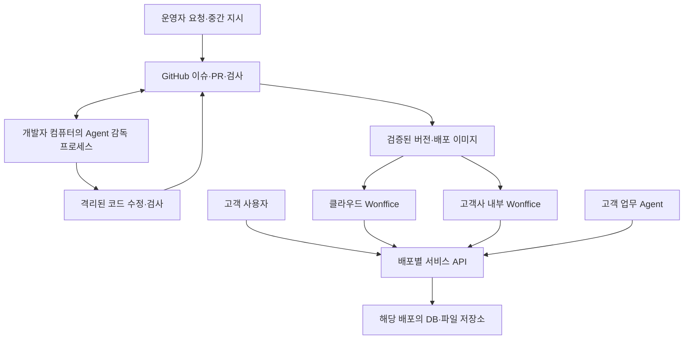

# Wonffice 플랫폼 설계 기준

이 문서는 **구현할 구조**다. 현재 기능의 완료 목록이 아니다. 사용자 요구와 검증 기준은 [기준 문서](../../.dev/plans/wonffice-platform/brief.md)에 둔다.

## 1. 세 실행 영역



그림의 서비스 API와 저장소는 배포마다 별개다. 내부 설치가 클라우드 DB를 공유하지 않는다.

| 영역 | 책임 | 허용하지 않는 경계 통과 |
| --- | --- | --- |
| 제품 서비스 | Note·Word·Slides·Site, 계정, 저장, 공유, 업무 실행 | 개발자 컴퓨터의 가동 상태에 의존하지 않음 |
| 고객 업무 Agent | 허용된 문서 작성·조회·업무 흐름 실행 | GitHub 병합 권한, 서버 코드 변경, DB 직접 접근 |
| 제품 개발 Agent | GitHub 요구를 코드·검사·PR·미리보기로 전환 | 고객 운영 데이터와 배포 비밀정보를 작업자에게 전달 |

처음에는 Codex가 GitHub 이슈를 먼저 확인하는 개발 흐름과 서비스 기반을 만든다. 별도 상주 개발 실행기는 후속 선택이다. 고객 업무 Agent는 안정된 서비스 API 위에 추가한다. JEV 또는 특정 Agent 프레임워크는 필수 의존성으로 두지 않는다.

## 2. 현재 구조의 유지 부분과 결함

| 현재 근거 | 판단 | 조치 |
| --- | --- | --- |
| [model transaction](../../packages/model/src/transaction.ts), [operation 정의](../../packages/model/src/operations/define-operation.ts) | 의미 단위 연산과 역연산 기반은 유지할 가치가 있음 | 내부 편집 엔진으로 유지 |
| transaction의 `ok:false` 조기 반환은 `end()`만 호출 | `end()`는 overlay를 닫지 않는다. 변경 잔류와 다음 실행 오염 가능 | 실패 주입 검사 후 모든 사전 commit 실패의 rollback·수명 정리 |
| transaction commit 이후 이벤트·extension hook에서 예외 발생 가능 | 이미 반영된 변경도 실패로 반환할 수 있음 | commit 여부와 후처리 실패를 별도 결과로 반환 |
| [executeCommand / CommandChain](../../packages/editor-core/src/editor.ts) | 문자열·임의 payload, 선택적 canExecute, 연속 명령은 전체 원자적 변경이 아님 | 외부 실행 계약을 별도 정의. chain을 transaction으로 간주하지 않음 |
| [transaction DSL](../../packages/model/src/transaction-dsl.ts) | 함수 실행과 DataStore 접근은 신뢰된 내부 코드용 | 함수·Editor 인스턴스를 원격 API에 노출하지 않음 |
| [office-workspace](../../packages/office-workspace/README.md) | 로컬 자료함·제품 codec·문서 정체성은 재사용 가능 | 저장 인터페이스에 서버 adapter 추가 |
| [협업 adapter](../../packages/collaboration/src/base-adapter.ts) | 저수준 변경 전달 경로가 있음 | transaction 단위 전달·재접속·실행 취소 보장 확인 전 운영 협업으로 표시하지 않음 |
| [.github CI](../../.github/workflows/ci.yml) | 현재 E2E job은 editor-react 대상 | 네 제품의 데스크톱 핵심 흐름과 서비스 격리 검사를 출시 gate에 추가 |

위 결함은 소스 경로를 확인한 결과다. 이번 설계 작업에서는 재현 테스트나 수정 완료를 주장하지 않는다. 가장 먼저 WP-01에서 실패 경로를 재현한다.

서버 착수의 구체적인 데이터·외부 연동·고객 도메인·공동 편집 기준은 [백엔드 구축 기준](wonffice-backend-foundation.md)에 둔다. #330은 실행 기반의 첫 부분이며 WP-05 전체 완료가 아니다.

## 3. 서버 구성과 패키지 경계

처음에는 TypeScript 기반 **모듈형 단일 서버**와 별도 worker 프로세스를 사용한다. API와 worker는 같은 도메인 코드를 사용한다. PostgreSQL이 메타데이터·문서 버전·작업 상태를 보관한다. 파일은 S3 호환 인터페이스로 분리한다. 인증은 OIDC를 기준으로 한다.

| 위치 — 신규는 계획 경로 | 책임 |
| --- | --- |
| 기존 `model`, `datastore`, `editor-core` | 문서 구조·연산·트랜잭션. HTTP·GitHub를 알지 않음 |
| 기존 `office-*`, `office-workspace` | 제품 편집·codec·로컬 캐시·서버 저장 연결 |
| 기존 `office-ui`, `office-controls`, `office-editor-ui` | 표시·입력·편집 상태 연결. 서버 권한 판정의 근거가 아님 |
| 신규 `packages/office-contracts` | 직렬화 가능한 API DTO, 런타임 schema, 오류·버전 계약. DOM 의존 없음 |
| 신규 `packages/office-service` | 계정·회사·자료·기능·공유 도메인과 저장소 인터페이스 |
| 신규 `apps/office-api` | 인증된 HTTP 경계, 입력 검사, 도메인 호출 |
| 신규 `apps/office-worker` | 출력·게시·정리·후속 작업. 같은 회사·권한 검사 |
| 신규 `apps/agent-runner` | GitHub 개발 감독·복구·실행기 adapter. 제품 번들에 포함하지 않음 |

API 프레임워크·ORM·OIDC 제품은 WP-05의 작은 실행 예제로 고정한다. PostgreSQL 작업 테이블과 outbox로 시작한다. Redis, Kafka, Kubernetes, 별도 검색 서버는 측정된 필요가 생긴 뒤 추가한다. 모든 제품을 하나의 새 모델로 재작성하지 않는다.

## 4. 회사와 권한

`tenant`는 고객 회사의 보안 경계다. `workspace`는 회사 안의 작업 공간이다. 사용자는 여러 회사에 속할 수 있다. 서버는 인증 사용자와 membership을 확인하여 요청의 tenant를 결정한다. URL·payload의 tenant ID만 신뢰하지 않는다.

| 데이터 | 필수 관계·규칙 |
| --- | --- |
| tenant, identity, membership | 외부 identity의 issuer·subject 조합, 회사별 역할·정지 상태 |
| workspace, document | tenant 소속, 전역 문서 ID, 제품 종류, 현재 revision, 삭제 상태 |
| document_revision | 문서별 증가 revision, 제품 schemaVersion, snapshot, 작성 actor |
| asset | tenant 소속, 저장 key, 크기·형식·hash, 업로드 상태·참조 |
| capability_installation | tenant, 기능 ID·버전, 설정 revision, 활성 상태 |
| share, publication | 권한/만료/회수 또는 공개 snapshot, 문서와 asset 참조 |
| job, outbox, audit_event | tenant·actor·request ID, 상태, 재시도·변경 근거 |

회사 범위의 외래 키에는 tenant를 포함한다. API, worker, 검색, cache key, 파일 URL, 추후 실시간 채널 모두 같은 경계를 사용한다. PostgreSQL RLS는 추가 방어선이다. 앱 접속 역할에는 테이블 소유자·BYPASSRLS 권한을 주지 않는다. 풀 연결의 tenant context는 트랜잭션 범위에 한정한다. 소유자는 통상 RLS를 우회하므로 적용 역할과 `FORCE ROW LEVEL SECURITY` 사용을 명시적으로 검증한다. [PostgreSQL RLS 문서](https://www.postgresql.org/docs/current/ddl-rowsecurity.html)

역할은 owner/admin/editor/viewer로 시작한다. 문서 ACL과 기능별 permission으로 세분화한다. **기능 활성화는 실행 권한이 아니다.** 권한은 실행 시 다시 확인한다. 내부 설치도 tenant 계약을 유지하되 기본적으로 회사 하나를 구성한다.

## 5. 문서 저장과 실행 계약

첫 서버 저장은 snapshot + revision 비교로 구현한다. 로컬 IndexedDB는 초안·캐시·이전 원본을 보관한다. 서버로 이전한 문서의 확정 revision은 서버가 소유한다. 같은 문서를 로컬 자료함과 서버가 독립적으로 확정하지 않는다.

```ts
// 제안 계약. 현재 공개 API가 아니다.
type DocumentMutation = {
  requestId: string;
  workspaceId: string;
  documentId: string;
  expectedRevision: number;
  idempotencyKey: string;
  capability: { id: string; version: string };
  input: unknown; // 등록된 capability의 runtime schema로 검사
};
type MutationResult =
  | { status: 'rejected'; code: string }
  | { status: 'conflict'; currentRevision: number }
  | { status: 'noop'; revision: number }
  | { status: 'committed'; revision: number; effects: 'complete' | 'pending' };
```

tenant·actor·권한은 서버의 신뢰된 실행 context에서 제공한다. 요청자가 actor를 지정하지 않는다. 다음 순서를 고정한다.

1. 인증·회사·대상·기능 설치·권한·입력 schema·크기 제한을 확인한다.
2. `(tenant, actor, action, idempotencyKey)`를 조회한다. 같은 key와 다른 요청 hash는 거부한다. 재전송도 현재 접근 권한을 확인한다.
3. 현재 revision과 비교한다. 불일치하면 409와 충돌 정보를 반환한다. 입력 초안을 버리거나 자동 덮어쓰지 않는다.
4. 하나의 논리 편집은 하나의 model transaction으로 준비한다. 문서 snapshot·revision·idempotency 결과·outbox를 하나의 DB transaction으로 확정한다.
5. DB 저장이 실패하면 준비된 편집 인스턴스를 폐기한다. 성공 응답을 받기 전의 화면 변경은 로컬 초안이다. 서버 기준 snapshot으로 재조정할 수 있어야 한다.
6. commit 후 출력·알림 등은 outbox에서 실행한다. 후처리 실패는 `committed / pending`이다. 본문 변경 전체를 다시 실행하지 않는다.

중복 key의 동시 요청은 DB 유일 제약으로 하나만 확정한다. 결과 보관 기간은 클라이언트 재시도 기간 이상이어야 한다. 만료된 요청을 새 변경으로 재실행하지 않도록 요청 조회·만료 응답을 정의한다. 여러 문서·외부 서비스 작업은 하나의 편집 transaction에 넣지 않는다. 각 단계의 결과와 보상 작업을 기록한다.

원격 capability는 `describe / validate / preview / apply`로 좁힌다. preview는 대상 revision과 변경 요약을 반환한다. apply는 같은 revision·요청 hash·권한을 재확인한다. 사용자 커서에 의존하는 UI command 대신 명시한 node ID·범위를 쓴다. headless 실행은 DOM 없이 검사한다. 기존의 모든 command가 headless라고 가정하지 않는다.

실시간 협업은 별도 완료 항목이다. 공동 세션이 소유한 문서에는 독립 snapshot 덮어쓰기를 허용하지 않는다. 세션 epoch, update 저장·중복 제거, checkpoint, 권한 회수, 재접속, 사용자별 undo를 검증한 뒤 활성화한다. snapshot 충돌 처리를 실시간 협업 완료로 표시하지 않는다.

## 6. 고객사별 기능과 새 기능 요청

변경은 네 단계로 처리한다. 가능한 가장 작은 단계를 먼저 선택한다.

| 수준 | 예 | 적용 방식 |
| --- | --- | --- |
| 설정 | 회사별 필드·템플릿·메뉴 | 버전 있는 tenant 설정 |
| 업무 조합 | 견적서 생성→검토→공유 | 기존 capability의 선언형 workflow |
| 승인된 기능 모듈 | 고객사 전용 승인 도구 | 하나의 저장소에서 개발한 버전 고정 모듈을 tenant에 설치 |
| 플랫폼 변경 | 새 operation, 새 제품 | GitHub 개발 흐름과 공통 회귀 검사 |

기능 manifest는 ID·버전·호환 서비스/문서 schema 범위·입력/출력 schema·권한·설정 schema·migration·검사 항목을 갖는다. 설치와 해제는 감사 기록을 남긴다. 해제해도 기존 고객 데이터를 삭제하지 않는다. 모르는 기능 데이터는 보존하고 읽기 전용 대체 표시를 제공한다.

첫 출시는 빌드 시 등록한 신뢰된 모듈만 지원한다. 임의 고객 JavaScript를 서버나 편집기에 직접 로드하지 않는다. 별도 격리 확장 실행은 후속이다. 기존 extension의 전체 Editor 접근권을 원격 기능 권한으로 취급하지 않는다.

예: “A사에 견적 승인 기능을 만들어 줘” → 요구·필드·완료 기준 작성 → 기존 조합 가능 여부 검사 → 필요하면 전용 기능 PR → 테스트 tenant의 비공개 미리보기 → 검증된 버전 설치. 고객사별 장기 branch를 유지하지 않는다.

## 7. 공유·게시·파일

공통 viewer route는 문서 종류에 맞는 읽기 전용 renderer를 선택한다. 팀 공유는 로그인·권한을 검사한다. 링크 공유는 별도 회수 가능 token을 사용하고 DB에는 token hash를 저장한다. 만료와 회수는 문서뿐 아니라 파일 접근에도 적용한다. 즉시 회수가 필요하면 파일을 인증 proxy로 전달하며 긴 수명의 서명 URL을 발급하지 않는다.

공개 게시는 지정 revision의 별도 snapshot이다. 편집 중인 초안을 자동 공개하지 않는다. Site HTML/ZIP 다운로드는 호스팅 게시와 구분한다. 게시 job이 파일 업로드·접속 검사를 마친 뒤 publication을 활성화한다. 실패 시 이전 게시 버전을 유지한다.

파일 업로드는 회사·크기·형식·quota 검사를 거친 임시 영역을 사용한다. 처리 완료 후 참조한다. 사용하지 않는 파일은 보관 유예 후 정리한다. 공개 Site와 사용자 HTML은 인증 쿠키가 없는 별도 origin에서 제공한다. iframe·스크립트·업로드 형식 정책은 게시 계약에 포함한다.

## 8. 두 형태 동시 출시

| 항목 | 클라우드 SaaS | 고객사 내부 설치 |
| --- | --- | --- |
| 실행 코드 | 같은 API·worker·웹 이미지 digest | 같은 digest와 버전 manifest |
| 배포 | 운영자가 관리하는 서버 | 기준 Linux 서버용 Compose·설치/진단 도구 |
| 인증 | 선택한 OIDC 제공자 | 고객 OIDC 또는 배포 묶음의 기준 IdP |
| 데이터 | 클라우드 DB·객체 저장소 | 고객 내부 DB·S3 호환 저장소 |
| 업데이트 | staging 검증 후 배포 정책 | 버전 고정, 관리자 지정 시간에 적용 |
| 외부 연결 | 모델·통합 서비스를 정책에 따라 사용 | 기본 편집·저장에 외부 연결 불필요. AI는 허용한 공급자만 사용 |
| 관측 | 운영자 관측 시스템 | 로컬 로그·지표, 관리자 선택 시 익명화 진단 묶음 |

기준 설치 묶음은 DB·파일 저장소·IdP·TLS 설정 경로까지 포함한다. 외부 관리형 서비스로 교체할 수 있다. 공급자별 SDK는 adapter에 둔다. 유료 공급자와 지원 버전은 실제 설치 검증 후 고정한다. 내부 설치에서 클라우드 요금제 조회 실패가 문서 열기를 막지 않게 한다.

배포 manifest는 이미지 digest, DB migration 범위, 문서 schema 범위, 기능 버전, 필요한 환경 설정을 기록한다. CI가 만든 동일 산출물을 두 환경에 전달한다. 내부 설치에는 오프라인 반입용 이미지·체크섬·migration·설명서를 제공한다. AI 외부 호출과 원격 지원은 별도 명시적 설정이다.

DB migration은 이전 앱과 공존할 수 있는 추가 변경부터 배포한다. 삭제·형식 축소는 호환 기간 뒤 별도 작업으로 한다. 앱 이미지를 되돌린다고 DB를 자동으로 되돌리지 않는다. 복구는 검증된 backup과 migration 호환표를 따른다. DB·파일·설정·필요한 복호화 키를 같은 복원 지점 기준으로 검증한다.

## 9. 운영과 출시 완료 기준

관측 항목은 저장 실패·충돌, API 오류·지연, 작업 지연·재시도, 용량, 백업 시각·복원 결과다. 문서 본문·token·비밀정보는 기본 로그에 남기지 않는다. request/job/revision ID로 추적한다. 고객 오류는 동의된 진단 정보와 재현 자료로 개발 이슈에 연결한다.

첫 내부 운영 목표는 RPO 24시간, RTO 4시간으로 제안한다. 복원 실험으로 검증하기 전에는 고객 SLA로 약속하지 않는다. 별도 고가용성 약속은 하지 않는다. 운영자 컴퓨터를 끈 상태에서도 두 제품 서버가 저장·열기·공유를 계속 수행해야 한다.

첫 출시에는 네 제품의 저장·재열기·권한·공유, 두 회사 격리, 제한된 공동 편집 범위, 두 배포의 설치·업데이트·복원 검증이 필요하다. 공동 편집의 제품별 지원 범위는 실험 결과로 명시하며 미지원 범위를 숨기지 않는다. [구현 순서](wonffice-platform-delivery.md)의 출시 gate를 모두 통과해야 한다.
