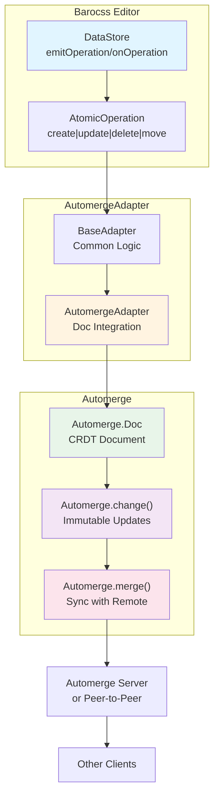

# @barocss/collaboration-automerge

Automerge adapter for Barocss Editor collaborative editing. Integrates Barocss DataStore with Automerge CRDT for conflict-free collaborative editing.

## Architecture



## Installation

```bash
pnpm add @barocss/collaboration-automerge automerge
```

## Quick Start

```typescript
import { DataStore } from '@barocss/datastore';
import { AutomergeAdapter } from '@barocss/collaboration-automerge';
import * as A from 'automerge';

let doc = A.init();

// Create adapter
const adapter = new AutomergeAdapter({
  getDoc: () => doc,
  setDoc: (newDoc) => { doc = newDoc; },
  onChange: (newDoc) => {
    // Handle remote changes
    console.log('Document updated:', newDoc);
  },
  config: {
    clientId: 'user-1',
    debug: true
  }
});

// Connect to DataStore
const dataStore = new DataStore();
await adapter.connect(dataStore);
```

## Usage

### Basic Setup

```typescript
import { DataStore } from '@barocss/datastore';
import { AutomergeAdapter } from '@barocss/collaboration-automerge';
import * as A from 'automerge';

// 1. Initialize Automerge document
let doc = A.init<{ operations: any[]; root: any }>();

// 2. Create adapter with getter/setter pattern
const adapter = new AutomergeAdapter({
  getDoc: () => doc,
  setDoc: (newDoc) => {
    doc = newDoc;
    // Optionally notify other parts of your app
    notifyDocumentChanged(newDoc);
  },
  onChange: (newDoc) => {
    // Called when document changes (local or remote)
    console.log('Document changed:', newDoc);
  },
  config: {
    clientId: 'user-1',
    debug: true
  }
});

// 3. Connect to DataStore
const dataStore = new DataStore();
await adapter.connect(dataStore);
```

### Syncing with Remote Peers

```typescript
import * as A from 'automerge';

let doc = A.init();

// Create adapter
const adapter = new AutomergeAdapter({
  getDoc: () => doc,
  setDoc: (newDoc) => { doc = newDoc; },
  config: { clientId: 'user-1' }
});

await adapter.connect(dataStore);

// Sync with remote peer
function syncWithPeer(remoteDoc: A.Doc<any>) {
  const [newLocalDoc, newRemoteDoc] = A.merge(doc, remoteDoc);
  doc = newLocalDoc;
  
  // Notify adapter of change
  adapter.receiveOperation(/* operation from remote */);
}
```

### Using with Automerge Repo

```typescript
import { Repo } from '@automerge/automerge-repo';
import { BrowserWebSocketClientAdapter } from '@automerge/automerge-repo-network-websocket';

// Create repo
const repo = new Repo({
  network: [
    new BrowserWebSocketClientAdapter('ws://localhost:8080')
  ]
});

// Create or get document handle
const handle = repo.find('document-id');

// Get document
handle.doc().then((doc) => {
  let currentDoc = doc;

  // Create adapter
  const adapter = new AutomergeAdapter({
    getDoc: () => currentDoc,
    setDoc: (newDoc) => { currentDoc = newDoc; },
    config: { clientId: 'user-1' }
  });

  // Watch for changes
  handle.on('change', ({ doc }) => {
    currentDoc = doc;
    // Adapter will handle applying changes
  });

  adapter.connect(dataStore);
});
```

## API Reference

### AutomergeAdapterOptions

```typescript
interface AutomergeAdapterOptions {
  /**
   * Function to get current Automerge document
   * Required: Returns the current Automerge doc state
   */
  getDoc: () => A.Doc<any>;

  /**
   * Function to update Automerge document
   * Required: Updates the Automerge doc state
   * This is called when local operations are applied
   */
  setDoc: (doc: A.Doc<any>) => void;

  /**
   * Callback for document changes
   * Optional: Called when document changes (local or remote)
   * Useful for triggering UI updates or sync operations
   */
  onChange?: (doc: A.Doc<any>) => void;

  /**
   * Adapter configuration
   * See AdapterConfig in @barocss/collaboration
   */
  config?: AdapterConfig;
}
```

### AutomergeAdapter Methods

```typescript
class AutomergeAdapter extends BaseAdapter {
  /**
   * Connect adapter to DataStore
   * Loads initial state from Automerge doc
   */
  connect(dataStore: DataStore): Promise<void>;

  /**
   * Disconnect adapter from DataStore
   */
  disconnect(): Promise<void>;

  /**
   * Check if adapter is connected
   */
  isConnected(): boolean;
}
```

## Advanced Usage

### Custom Document Schema

Define a typed Automerge document:

```typescript
import * as A from 'automerge';

interface DocumentSchema {
  operations: Array<{
    type: string;
    nodeId: string;
    data?: any;
    timestamp: number;
  }>;
  root?: {
    sid?: string;
    stype: string;
    text?: string;
    attributes?: Record<string, any>;
    content?: string[];
  };
}

let doc = A.init<DocumentSchema>({
  operations: [],
  root: undefined
});

const adapter = new AutomergeAdapter({
  getDoc: () => doc,
  setDoc: (newDoc) => { doc = newDoc; },
  config: { clientId: 'user-1' }
});
```

### Manual Sync

```typescript
// Get changes to send to remote
const changes = A.getChanges(doc, lastSyncedState);

// Apply remote changes
const [newDoc, patch] = A.applyChanges(doc, remoteChanges);
doc = newDoc;

// Notify adapter
adapter.receiveOperation(/* convert patch to AtomicOperation */);
```

### Conflict Resolution

Automerge handles conflicts automatically, but you can customize behavior:

```typescript
const adapter = new AutomergeAdapter({
  getDoc: () => doc,
  setDoc: (newDoc) => {
    // Check for conflicts
    const conflicts = A.getConflicts(newDoc);
    if (conflicts.length > 0) {
      console.warn('Conflicts detected:', conflicts);
      // Apply custom resolution
    }
    doc = newDoc;
  },
  config: {
    clientId: 'user-1',
    transformOperation: (op) => {
      // Add conflict resolution metadata
      return {
        ...op,
        conflictResolution: 'last-write-wins'
      };
    }
  }
});
```

### History and Undo

Automerge provides built-in history:

```typescript
import * as A from 'automerge';

// Get document history
const history = A.getHistory(doc);

// Get document at specific point in time
const pastDoc = A.getHistoryAt(doc, timestamp);

// Undo last change
const undoDoc = A.undo(doc);
```

## Configuration Options

### AdapterConfig

```typescript
interface AdapterConfig {
  /**
   * Unique client identifier
   */
  clientId?: string;

  /**
   * User information
   */
  user?: {
    id: string;
    name?: string;
    color?: string;
    avatar?: string;
  };

  /**
   * Enable debug logging
   */
  debug?: boolean;

  /**
   * Transform operations before applying
   */
  transformOperation?: (op: AtomicOperation) => AtomicOperation;
}
```

## Troubleshooting

### Document Not Updating

1. **Check getDoc/setDoc**: Ensure functions are working correctly
   ```typescript
   console.log('Current doc:', adapter.getDoc());
   adapter.setDoc(newDoc);
   console.log('Updated doc:', adapter.getDoc());
   ```

2. **Verify onChange callback**: Ensure it's being called
   ```typescript
   const adapter = new AutomergeAdapter({
     getDoc: () => doc,
     setDoc: (newDoc) => {
       console.log('Setting doc:', newDoc);
       doc = newDoc;
     },
     onChange: (newDoc) => {
       console.log('Doc changed:', newDoc);
     }
   });
   ```

### Sync Issues

1. **Check merge operations**: Ensure remote changes are properly merged
   ```typescript
   const [newLocal, newRemote] = A.merge(localDoc, remoteDoc);
   ```

2. **Verify change application**: Check that changes are being applied
   ```typescript
   const changes = A.getChanges(doc, lastState);
   console.log('Changes:', changes);
   ```

### Performance

For large documents, consider:

1. **Lazy loading**: Load document parts on demand
2. **Change batching**: Batch multiple operations
3. **Compression**: Use Automerge's compression features

## Best Practices

1. **Immutable Updates**: Always use `A.change()` for updates
2. **Sync Regularly**: Sync with remote peers frequently
3. **Handle Conflicts**: Implement conflict resolution strategy
4. **Monitor Changes**: Use `onChange` callback for UI updates
5. **Clean Up**: Destroy documents when done

## Example: Full Integration

```typescript
import { Editor } from '@barocss/editor-core';
import { DataStore } from '@barocss/datastore';
import { AutomergeAdapter } from '@barocss/collaboration-automerge';
import * as A from 'automerge';
import { Repo } from '@automerge/automerge-repo';

class CollaborativeEditor {
  private repo: Repo;
  private handle: any;
  private adapter: AutomergeAdapter;
  private dataStore: DataStore;
  private editor: Editor;

  constructor(documentId: string, userId: string) {
    // Initialize Automerge repo
    this.repo = new Repo({
      network: [
        new BrowserWebSocketClientAdapter('ws://localhost:8080')
      ]
    });

    // Get document handle
    this.handle = this.repo.find(documentId);

    // Initialize DataStore
    this.dataStore = new DataStore();

    // Set up document
    this.handle.doc().then((doc) => {
      let currentDoc = doc;

      // Create adapter
      this.adapter = new AutomergeAdapter({
        getDoc: () => currentDoc,
        setDoc: (newDoc) => { currentDoc = newDoc; },
        onChange: (newDoc) => {
          // Document changed, update UI if needed
        },
        config: {
          clientId: userId,
          debug: true
        }
      });

      // Watch for changes
      this.handle.on('change', ({ doc }) => {
        currentDoc = doc;
      });

      // Connect
      this.adapter.connect(this.dataStore);

      // Initialize editor
      this.editor = new Editor({
        dataStore: this.dataStore
      });
    });
  }

  async disconnect() {
    await this.adapter.disconnect();
    this.repo.close();
  }
}
```

## License

MIT
