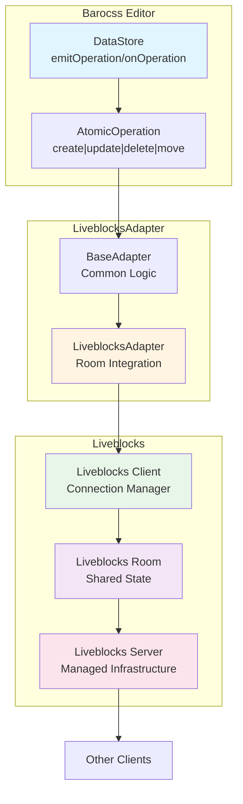

# @barocss/collaboration-liveblocks

Liveblocks adapter for Barocss Editor collaborative editing. Integrates Barocss DataStore with Liveblocks for managed collaborative editing infrastructure.

## Architecture



## Installation

```bash
pnpm add @barocss/collaboration-liveblocks @liveblocks/client
```

## Quick Start

```typescript
import { DataStore } from '@barocss/datastore';
import { LiveblocksAdapter } from '@barocss/collaboration-liveblocks';
import { createClient } from '@liveblocks/client';

// Create Liveblocks client
const client = createClient({
  publicApiKey: 'your-api-key'
});

// Enter room
const room = client.enter('my-room');

// Create adapter
const adapter = new LiveblocksAdapter({
  room,
  config: {
    clientId: 'user-1',
    user: {
      id: 'user-1',
      name: 'John Doe'
    },
    debug: true
  }
});

// Connect to DataStore
const dataStore = new DataStore();
await adapter.connect(dataStore);
```

## Usage

### Basic Setup

```typescript
import { DataStore } from '@barocss/datastore';
import { LiveblocksAdapter } from '@barocss/collaboration-liveblocks';
import { createClient } from '@liveblocks/client';

// 1. Create Liveblocks client
const client = createClient({
  publicApiKey: 'pk_live_...',  // Public API key from Liveblocks dashboard
  // For authentication, use:
  // authEndpoint: '/api/liveblocks-auth'
});

// 2. Enter a room
const room = client.enter('document-id');

// 3. Create adapter
const adapter = new LiveblocksAdapter({
  room,
  config: {
    clientId: 'user-1',
    user: {
      id: 'user-1',
      name: 'John Doe',
      color: '#ff0000',
      avatar: 'https://avatar.url'
    },
    debug: true
  }
});

// 4. Connect to DataStore
const dataStore = new DataStore();
await adapter.connect(dataStore);
```

### Authentication

```typescript
import { createClient } from '@liveblocks/client';

// With authentication endpoint
const client = createClient({
  authEndpoint: '/api/liveblocks-auth',
  // The auth endpoint should return:
  // { token: '...' }
});

const room = client.enter('document-id');
```

### Room Events

```typescript
// Listen to room connection status
room.subscribe('connection', (status) => {
  console.log('Connection status:', status);
  // 'open' | 'closed' | 'unavailable'
});

// Listen to room errors
room.subscribe('error', (error) => {
  console.error('Room error:', error);
});

// Listen to other users
room.subscribe('others', (others) => {
  console.log('Other users in room:', others);
});
```

### Presence

Liveblocks provides built-in presence for cursor positions and user information:

```typescript
// Update local presence
room.updatePresence({
  cursor: { x: 100, y: 200 },
  selection: { start: 0, end: 10 }
});

// Listen to other users' presence
room.subscribe('others', (others) => {
  others.forEach((other) => {
    console.log('User:', other.presence);
    console.log('Cursor:', other.presence?.cursor);
  });
});
```

## API Reference

### LiveblocksAdapterOptions

```typescript
interface LiveblocksAdapterOptions {
  /**
   * Liveblocks Room instance
   * Required: The room that manages shared state
   * Created via client.enter(roomId)
   */
  room: Room;

  /**
   * Adapter configuration
   * See AdapterConfig in @barocss/collaboration
   */
  config?: AdapterConfig;
}
```

### LiveblocksAdapter Methods

```typescript
class LiveblocksAdapter extends BaseAdapter {
  /**
   * Connect adapter to DataStore
   * Sets up room subscriptions and loads initial state
   */
  connect(dataStore: DataStore): Promise<void>;

  /**
   * Disconnect adapter from DataStore
   * Removes room subscriptions
   */
  disconnect(): Promise<void>;

  /**
   * Check if adapter is connected
   */
  isConnected(): boolean;
}
```

## Advanced Usage

### Custom Storage Structure

Liveblocks uses a storage structure. Customize how operations are stored:

```typescript
// Operations are stored in room storage
room.update((root) => {
  if (!root.operations) {
    root.operations = [];
  }
  
  root.operations.push({
    type: 'create',
    nodeId: 'node-1',
    data: { /* ... */ }
  });
});
```

### Storage Events

```typescript
// Listen to storage changes
room.subscribe('storage', (storage) => {
  console.log('Storage updated:', storage);
  
  // Access operations
  const operations = storage.root.get('operations');
  console.log('Operations:', operations);
});
```

### Broadcast Events

Use Liveblocks broadcast for custom events:

```typescript
// Broadcast custom event
room.broadcastEvent({
  type: 'custom-event',
  data: { message: 'Hello' }
});

// Listen to broadcast events
room.subscribe('event', (event) => {
  if (event.type === 'custom-event') {
    console.log('Received:', event.data);
  }
});
```

### History and Undo

Liveblocks provides history for undo/redo:

```typescript
// Get history
const history = room.getHistory();

// Undo last operation
room.history.undo();

// Redo last operation
room.history.redo();
```

### Error Handling

```typescript
// Handle connection errors
room.subscribe('error', (error) => {
  console.error('Room error:', error);
  
  if (error.type === 'CONNECTION_ERROR') {
    // Handle reconnection
    setTimeout(() => {
      room.reconnect();
    }, 1000);
  }
});

// Handle storage errors
try {
  room.update((root) => {
    root.operations.push(operation);
  });
} catch (error) {
  console.error('Storage error:', error);
}
```

## Configuration Options

### AdapterConfig

```typescript
interface AdapterConfig {
  /**
   * Unique client identifier
   */
  clientId?: string;

  /**
   * User information for presence
   */
  user?: {
    id: string;
    name?: string;
    color?: string;
    avatar?: string;
  };

  /**
   * Enable debug logging
   */
  debug?: boolean;

  /**
   * Transform operations before applying
   */
  transformOperation?: (op: AtomicOperation) => AtomicOperation;
}
```

## Troubleshooting

### Connection Issues

1. **Check API key**: Ensure public API key is correct
   ```typescript
   const client = createClient({
     publicApiKey: 'pk_live_...'
   });
   ```

2. **Verify authentication**: If using auth, check auth endpoint
   ```typescript
   const client = createClient({
     authEndpoint: '/api/liveblocks-auth'
   });
   ```

3. **Check room ID**: Ensure room ID is valid
   ```typescript
   const room = client.enter('valid-room-id');
   ```

### Storage Not Updating

1. **Check room connection**: Ensure room is connected
   ```typescript
   room.subscribe('connection', (status) => {
     console.log('Connection:', status); // Should be 'open'
   });
   ```

2. **Verify storage structure**: Check storage structure
   ```typescript
   room.subscribe('storage', (storage) => {
     console.log('Storage:', storage.root.toJSON());
   });
   ```

3. **Check adapter connection**: Verify adapter is connected
   ```typescript
   console.log('Adapter connected:', adapter.isConnected());
   ```

### Operations Not Syncing

1. **Check room subscriptions**: Ensure subscriptions are active
   ```typescript
   room.subscribe('storage', (storage) => {
     // This should be called when storage changes
   });
   ```

2. **Verify operation format**: Ensure operations match expected format
   ```typescript
   room.update((root) => {
     const operations = root.get('operations');
     console.log('Operations:', operations.toJSON());
   });
   ```

## Best Practices

1. **Use Authentication**: Always use authentication for production
2. **Handle Disconnections**: Implement reconnection logic
3. **Use Presence**: Leverage Liveblocks presence for cursors
4. **Monitor Connection**: Track connection status
5. **Error Handling**: Implement comprehensive error handling
6. **Clean Up**: Leave rooms when done

## Example: Full Integration

```typescript
import { Editor } from '@barocss/editor-core';
import { DataStore } from '@barocss/datastore';
import { LiveblocksAdapter } from '@barocss/collaboration-liveblocks';
import { createClient } from '@liveblocks/client';

class CollaborativeEditor {
  private client: ReturnType<typeof createClient>;
  private room: any;
  private adapter: LiveblocksAdapter;
  private dataStore: DataStore;
  private editor: Editor;

  constructor(roomId: string, userId: string, apiKey: string) {
    // Initialize Liveblocks client
    this.client = createClient({
      publicApiKey: apiKey,
      authEndpoint: '/api/liveblocks-auth'
    });

    // Enter room
    this.room = this.client.enter(roomId);

    // Initialize DataStore
    this.dataStore = new DataStore();

    // Create adapter
    this.adapter = new LiveblocksAdapter({
      room: this.room,
      config: {
        clientId: userId,
        user: {
          id: userId,
          name: `User ${userId}`
        },
        debug: true
      }
    });

    // Initialize editor
    this.editor = new Editor({
      dataStore: this.dataStore
    });
  }

  async connect() {
    // Connect adapter
    await this.adapter.connect(this.dataStore);

    // Set up event handlers
    this.room.subscribe('connection', (status) => {
      console.log('Connection status:', status);
    });

    this.room.subscribe('others', (others) => {
      console.log('Other users:', others);
    });

    // Update presence
    this.room.updatePresence({
      cursor: { x: 0, y: 0 }
    });
  }

  async disconnect() {
    await this.adapter.disconnect();
    this.client.leave(this.room.id);
  }
}
```

## Liveblocks Setup

### Getting API Key

1. Sign up at [liveblocks.io](https://liveblocks.io)
2. Create a project
3. Get your public API key from dashboard

### Authentication Setup

Create an auth endpoint:

```typescript
// /api/liveblocks-auth
export default async function handler(req, res) {
  // Verify user authentication
  const user = await verifyUser(req);
  
  // Generate Liveblocks token
  const token = await generateToken(user.id);
  
  res.json({ token });
}
```

## License

MIT
