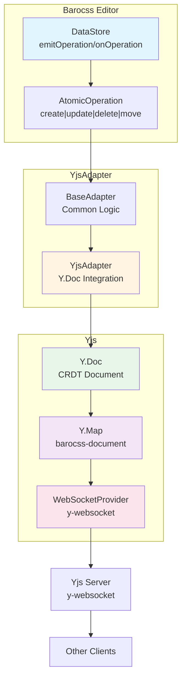

# @barocss/collaboration-yjs

Yjs adapter for Barocss Editor collaborative editing. Integrates Barocss DataStore with Yjs CRDT for real-time collaborative editing.

## Architecture



## Installation

```bash
pnpm add @barocss/collaboration-yjs yjs
```

For WebSocket support, also install:

```bash
pnpm add y-websocket
```

## Quick Start

```typescript
import { DataStore } from '@barocss/datastore';
import { YjsAdapter } from '@barocss/collaboration-yjs';
import * as Y from 'yjs';
import { WebsocketProvider } from 'y-websocket';

// Create Yjs document
const ydoc = new Y.Doc();
const ymap = ydoc.getMap('barocss-document');

// Connect to WebSocket provider
const provider = new WebsocketProvider('ws://localhost:1234', 'my-room', ydoc);

// Create adapter
const adapter = new YjsAdapter({
  ydoc,
  ymap,
  config: {
    clientId: 'user-1',
    user: {
      id: 'user-1',
      name: 'John Doe',
      color: '#ff0000'
    },
    debug: true
  }
});

// Connect to DataStore
const dataStore = new DataStore();
await adapter.connect(dataStore);

// Disconnect when done
await adapter.disconnect();
```

## Usage

### Basic Setup

```typescript
import { DataStore } from '@barocss/datastore';
import { YjsAdapter } from '@barocss/collaboration-yjs';
import * as Y from 'yjs';
import { WebsocketProvider } from 'y-websocket';

// 1. Create Yjs document
const ydoc = new Y.Doc();

// 2. Create or get Y.Map for storing document data
// You can use a custom map name or default to 'barocss-document'
const ymap = ydoc.getMap('barocss-document');

// 3. Set up WebSocket provider (or other sync mechanism)
const provider = new WebsocketProvider(
  'ws://localhost:1234',  // WebSocket server URL
  'my-room',               // Room/document ID
  ydoc                     // Y.Doc instance
);

// 4. Create adapter
const adapter = new YjsAdapter({
  ydoc,
  ymap,  // Optional: defaults to ydoc.getMap('barocss-document')
  config: {
    clientId: 'user-1',
    debug: true
  }
});

// 5. Connect to DataStore
const dataStore = new DataStore();
await adapter.connect(dataStore);
```

### Using with y-websocket Server

```typescript
import { WebsocketProvider } from 'y-websocket';

// Connect to y-websocket server
const provider = new WebsocketProvider(
  'ws://localhost:1234',
  'document-id',
  ydoc
);

provider.on('status', (event: { status: string }) => {
  console.log('Connection status:', event.status);
});

provider.on('sync', (isSynced: boolean) => {
  console.log('Document synced:', isSynced);
});
```

### Using with Custom Provider

```typescript
import { YjsAdapter } from '@barocss/collaboration-yjs';
import * as Y from 'yjs';

// Create Yjs document
const ydoc = new Y.Doc();
const ymap = ydoc.getMap('barocss-document');

// Set up custom sync mechanism
class CustomProvider {
  constructor(ydoc: Y.Doc) {
    // Implement your sync logic
    this.syncWithServer(ydoc);
  }

  syncWithServer(ydoc: Y.Doc) {
    // Your custom sync implementation
  }
}

const provider = new CustomProvider(ydoc);

// Create adapter
const adapter = new YjsAdapter({
  ydoc,
  ymap,
  config: { clientId: 'user-1' }
});
```

## API Reference

### YjsAdapterOptions

```typescript
interface YjsAdapterOptions {
  /**
   * Y.Doc instance
   * Required: The Yjs document that will store the collaborative state
   */
  ydoc: Y.Doc;

  /**
   * Y.Map instance
   * Optional: The Y.Map where document data is stored
   * Defaults to ydoc.getMap('barocss-document')
   */
  ymap?: Y.Map<any>;

  /**
   * Adapter configuration
   * See AdapterConfig in @barocss/collaboration
   */
  config?: AdapterConfig;
}
```

### YjsAdapter Methods

```typescript
class YjsAdapter extends BaseAdapter {
  /**
   * Connect adapter to DataStore
   * Sets up Yjs observers and loads initial state
   */
  connect(dataStore: DataStore): Promise<void>;

  /**
   * Disconnect adapter from DataStore
   * Removes Yjs observers and cleans up
   */
  disconnect(): Promise<void>;

  /**
   * Check if adapter is connected
   */
  isConnected(): boolean;
}
```

## Advanced Usage

### Custom Y.Map Structure

You can use a custom Y.Map structure:

```typescript
const ydoc = new Y.Doc();
const root = ydoc.getMap('root');
const operations = root.getMap('operations');
const document = root.getMap('document');

// Use operations map for adapter
const adapter = new YjsAdapter({
  ydoc,
  ymap: operations,
  config: { clientId: 'user-1' }
});
```

### Operation Transformation

Transform operations before storing in Yjs:

```typescript
const adapter = new YjsAdapter({
  ydoc,
  ymap,
  config: {
    clientId: 'user-1',
    transformOperation: (op) => {
      // Add Yjs-specific metadata
      return {
        ...op,
        yjsClientId: ydoc.clientID,
        yjsClock: ydoc.getStateVector()
      };
    }
  }
});
```

### Handling Yjs Events

```typescript
// Listen to Yjs document updates
ydoc.on('update', (update: Uint8Array, origin: any) => {
  console.log('Yjs document updated:', update);
});

// Listen to Y.Map changes
ymap.observe((event: Y.YMapEvent<any>) => {
  console.log('Y.Map changed:', event);
});
```

### Presence/Awareness

Yjs provides awareness for cursor positions and user presence:

```typescript
import * as awarenessProtocol from 'y-protocols/awareness';

const awareness = new awarenessProtocol.Awareness(ydoc);

// Set local user state
awareness.setLocalStateField('user', {
  name: 'John Doe',
  color: '#ff0000',
  cursor: { x: 100, y: 200 }
});

// Listen to other users' presence
awareness.on('change', (changes: any) => {
  console.log('Awareness changed:', changes);
});
```

## Configuration Options

### AdapterConfig

```typescript
interface AdapterConfig {
  /**
   * Unique client identifier
   * Used for operation attribution
   */
  clientId?: string;

  /**
   * User information for presence
   */
  user?: {
    id: string;
    name?: string;
    color?: string;
    avatar?: string;
  };

  /**
   * Enable debug logging
   * Logs all operations to console
   */
  debug?: boolean;

  /**
   * Transform operations before sending
   */
  transformOperation?: (op: AtomicOperation) => AtomicOperation;
}
```

## Troubleshooting

### Operations Not Syncing

1. **Check WebSocket connection**: Ensure provider is connected
   ```typescript
   provider.on('status', (event) => {
     console.log('Status:', event.status); // Should be 'connected'
   });
   ```

2. **Verify Y.Map structure**: Ensure operations are being stored correctly
   ```typescript
   ymap.forEach((value, key) => {
     console.log('Y.Map entry:', key, value);
   });
   ```

3. **Check adapter connection**: Verify adapter is connected
   ```typescript
   console.log('Adapter connected:', adapter.isConnected());
   ```

### Circular Updates

If operations are being sent repeatedly, ensure remote operations are properly detected:

```typescript
// The adapter automatically handles this, but if you see issues:
// Check that Yjs update origin is not the adapter itself
```

### State Not Loading

Ensure initial state is properly loaded:

```typescript
// Check if root node exists in Yjs
const rootData = ymap.get('root');
console.log('Root data:', rootData);

// Manually trigger state load
await adapter.getDocumentState();
```

## Best Practices

1. **Use WebSocket Provider**: For production, use `y-websocket` or similar for reliable sync
2. **Handle Connection Errors**: Implement reconnection logic for WebSocket providers
3. **Monitor Sync Status**: Use provider events to track sync state
4. **Use Awareness**: Leverage Yjs awareness for cursor positions and user presence
5. **Clean Up**: Always disconnect adapter when component unmounts

## Example: Full Integration

```typescript
import { Editor } from '@barocss/editor-core';
import { DataStore } from '@barocss/datastore';
import { YjsAdapter } from '@barocss/collaboration-yjs';
import * as Y from 'yjs';
import { WebsocketProvider } from 'y-websocket';

class CollaborativeEditor {
  private ydoc: Y.Doc;
  private provider: WebsocketProvider;
  private adapter: YjsAdapter;
  private dataStore: DataStore;
  private editor: Editor;

  constructor(roomId: string, userId: string) {
    // Initialize Yjs
    this.ydoc = new Y.Doc();
    this.provider = new WebsocketProvider('ws://localhost:1234', roomId, this.ydoc);

    // Initialize DataStore
    this.dataStore = new DataStore();

    // Create adapter
    this.adapter = new YjsAdapter({
      ydoc: this.ydoc,
      config: {
        clientId: userId,
        user: {
          id: userId,
          name: `User ${userId}`
        },
        debug: true
      }
    });

    // Initialize editor
    this.editor = new Editor({
      dataStore: this.dataStore
    });
  }

  async connect() {
    await this.adapter.connect(this.dataStore);
    
    // Set up provider event handlers
    this.provider.on('status', (event) => {
      console.log('Connection status:', event.status);
    });

    this.provider.on('sync', (isSynced) => {
      if (isSynced) {
        console.log('Document synced with server');
      }
    });
  }

  async disconnect() {
    await this.adapter.disconnect();
    this.provider.destroy();
    this.ydoc.destroy();
  }
}
```

## License

MIT
