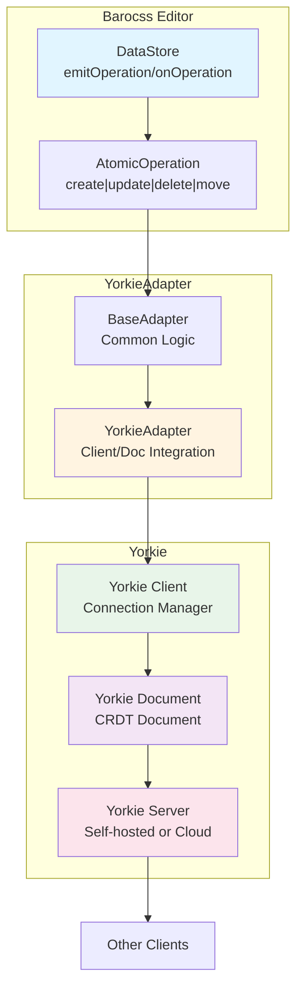

# @barocss/collaboration-yorkie

Yorkie adapter for Barocss Editor collaborative editing. Integrates Barocss DataStore with Yorkie SDK for self-hosted or cloud-based collaborative editing.

## Architecture



## Installation

```bash
pnpm add @barocss/collaboration-yorkie @yorkie-js/yorkie-js-sdk
```

## Quick Start

```typescript
import { DataStore } from '@barocss/datastore';
import { YorkieAdapter } from '@barocss/collaboration-yorkie';
import { Client, Document } from '@yorkie-js/yorkie-js-sdk';

// Create Yorkie client
const client = new Client('http://localhost:8080', {
  apiKey: 'your-api-key'
});
await client.activate();

// Create document
const doc = new Document('my-doc');
await client.attach(doc);

// Create adapter
const adapter = new YorkieAdapter({
  client,
  doc,
  config: {
    clientId: 'user-1',
    debug: true
  }
});

// Connect to DataStore
const dataStore = new DataStore();
await adapter.connect(dataStore);
```

## Usage

### Basic Setup

```typescript
import { DataStore } from '@barocss/datastore';
import { YorkieAdapter } from '@barocss/collaboration-yorkie';
import { Client, Document } from '@yorkie-js/yorkie-js-sdk';

// 1. Create and activate Yorkie client
const client = new Client('http://localhost:8080', {
  apiKey: 'your-api-key',
  // Optional: Add authentication token
  token: 'your-auth-token'
});

await client.activate();

// 2. Create or get document
const doc = new Document('document-id');

// 3. Attach document to client
await client.attach(doc);

// 4. Create adapter
const adapter = new YorkieAdapter({
  client,
  doc,
  config: {
    clientId: 'user-1',
    user: {
      id: 'user-1',
      name: 'John Doe',
      color: '#ff0000'
    },
    debug: true
  }
});

// 5. Connect to DataStore
const dataStore = new DataStore();
await adapter.connect(dataStore);
```

### Using with Yorkie Cloud

```typescript
import { Client, Document } from '@yorkie-js/yorkie-js-sdk';

// Connect to Yorkie Cloud
const client = new Client('https://api.yorkie.dev', {
  apiKey: 'your-cloud-api-key',
  token: 'your-auth-token'
});

await client.activate();

const doc = new Document('document-id');
await client.attach(doc);

const adapter = new YorkieAdapter({
  client,
  doc,
  config: { clientId: 'user-1' }
});
```

### Self-Hosted Yorkie Server

```typescript
// Connect to self-hosted Yorkie server
const client = new Client('http://your-yorkie-server:8080', {
  apiKey: 'your-api-key'
});

await client.activate();
```

### Document Events

```typescript
// Listen to document events
doc.subscribe((event) => {
  switch (event.type) {
    case 'snapshot':
      console.log('Document snapshot received');
      break;
    case 'remote-change':
      console.log('Remote change received');
      break;
    case 'local-change':
      console.log('Local change made');
      break;
  }
});
```

## API Reference

### YorkieAdapterOptions

```typescript
interface YorkieAdapterOptions {
  /**
   * Yorkie Client instance
   * Required: The client that manages the connection to Yorkie server
   */
  client: Client;

  /**
   * Yorkie Document instance
   * Required: The document that stores the collaborative state
   */
  doc: Document;

  /**
   * Adapter configuration
   * See AdapterConfig in @barocss/collaboration
   */
  config?: AdapterConfig;
}
```

### YorkieAdapter Methods

```typescript
class YorkieAdapter extends BaseAdapter {
  /**
   * Connect adapter to DataStore
   * Sets up document subscriptions and loads initial state
   */
  connect(dataStore: DataStore): Promise<void>;

  /**
   * Disconnect adapter from DataStore
   * Removes document subscriptions
   */
  disconnect(): Promise<void>;

  /**
   * Check if adapter is connected
   */
  isConnected(): boolean;
}
```

## Advanced Usage

### Custom Document Structure

Yorkie uses JSON-like structure. You can customize how operations are stored:

```typescript
// Document structure in Yorkie
doc.update((root) => {
  if (!root.operations) {
    root.operations = [];
  }
  
  // Operations are stored as array
  root.operations.push({
    type: 'create',
    nodeId: 'node-1',
    data: { /* ... */ }
  });
});
```

### Presence and Awareness

Yorkie supports presence for cursor positions and user information:

```typescript
// Set local presence
doc.update((root, presence) => {
  presence.set({
    cursor: { x: 100, y: 200 },
    user: {
      id: 'user-1',
      name: 'John Doe',
      color: '#ff0000'
    }
  });
});

// Listen to other users' presence
doc.subscribe('presence', (event) => {
  console.log('Presence changed:', event);
});
```

### Document Sync Status

```typescript
// Check if document is synced
const isSynced = doc.getStatus() === DocumentStatus.Synced;

// Listen to status changes
doc.subscribe('status', (event) => {
  console.log('Document status:', event.status);
});
```

### Error Handling

```typescript
try {
  await client.activate();
  await client.attach(doc);
  await adapter.connect(dataStore);
} catch (error) {
  console.error('Failed to connect:', error);
  
  // Handle connection errors
  if (error.code === 'CONNECTION_ERROR') {
    // Retry connection
    setTimeout(() => {
      client.activate();
    }, 1000);
  }
}
```

### Reconnection

```typescript
// Handle disconnection
client.on('disconnect', () => {
  console.log('Disconnected from Yorkie server');
  
  // Attempt reconnection
  setTimeout(async () => {
    try {
      await client.activate();
      console.log('Reconnected to Yorkie server');
    } catch (error) {
      console.error('Reconnection failed:', error);
    }
  }, 1000);
});
```

## Configuration Options

### AdapterConfig

```typescript
interface AdapterConfig {
  /**
   * Unique client identifier
   */
  clientId?: string;

  /**
   * User information for presence
   */
  user?: {
    id: string;
    name?: string;
    color?: string;
    avatar?: string;
  };

  /**
   * Enable debug logging
   */
  debug?: boolean;

  /**
   * Transform operations before applying
   */
  transformOperation?: (op: AtomicOperation) => AtomicOperation;
}
```

## Troubleshooting

### Connection Issues

1. **Check server URL**: Ensure Yorkie server is accessible
   ```typescript
   const client = new Client('http://localhost:8080');
   await client.activate();
   ```

2. **Verify API key**: Ensure API key is correct
   ```typescript
   const client = new Client('http://localhost:8080', {
     apiKey: 'your-api-key'
   });
   ```

3. **Check network**: Verify network connectivity
   ```typescript
   client.on('error', (error) => {
     console.error('Client error:', error);
   });
   ```

### Document Not Syncing

1. **Check document attachment**: Ensure document is attached
   ```typescript
   await client.attach(doc);
   console.log('Document attached:', doc.getKey());
   ```

2. **Verify document status**: Check if document is synced
   ```typescript
   const status = doc.getStatus();
   console.log('Document status:', status);
   ```

3. **Check adapter connection**: Verify adapter is connected
   ```typescript
   console.log('Adapter connected:', adapter.isConnected());
   ```

### Operations Not Applying

1. **Check document structure**: Verify operations are stored correctly
   ```typescript
   doc.update((root) => {
     console.log('Document root:', root);
   });
   ```

2. **Verify event handlers**: Ensure document events are being received
   ```typescript
   doc.subscribe((event) => {
     console.log('Document event:', event);
   });
   ```

## Best Practices

1. **Activate Client First**: Always activate client before creating documents
2. **Handle Disconnections**: Implement reconnection logic
3. **Use Presence**: Leverage Yorkie presence for cursor positions
4. **Monitor Status**: Track document sync status
5. **Error Handling**: Implement comprehensive error handling
6. **Clean Up**: Detach documents and deactivate client when done

## Example: Full Integration

```typescript
import { Editor } from '@barocss/editor-core';
import { DataStore } from '@barocss/datastore';
import { YorkieAdapter } from '@barocss/collaboration-yorkie';
import { Client, Document } from '@yorkie-js/yorkie-js-sdk';

class CollaborativeEditor {
  private client: Client;
  private doc: Document;
  private adapter: YorkieAdapter;
  private dataStore: DataStore;
  private editor: Editor;

  constructor(documentId: string, userId: string, apiKey: string) {
    // Initialize Yorkie client
    this.client = new Client('http://localhost:8080', {
      apiKey
    });

    // Initialize document
    this.doc = new Document(documentId);

    // Initialize DataStore
    this.dataStore = new DataStore();

    // Create adapter
    this.adapter = new YorkieAdapter({
      client: this.client,
      doc: this.doc,
      config: {
        clientId: userId,
        user: {
          id: userId,
          name: `User ${userId}`
        },
        debug: true
      }
    });

    // Initialize editor
    this.editor = new Editor({
      dataStore: this.dataStore
    });
  }

  async connect() {
    // Activate client
    await this.client.activate();

    // Attach document
    await this.client.attach(this.doc);

    // Connect adapter
    await this.adapter.connect(this.dataStore);

    // Set up event handlers
    this.client.on('disconnect', () => {
      console.log('Disconnected from Yorkie server');
      // Implement reconnection logic
    });

    this.doc.subscribe((event) => {
      console.log('Document event:', event.type);
    });
  }

  async disconnect() {
    await this.adapter.disconnect();
    await this.client.detach(this.doc);
    await this.client.deactivate();
  }
}
```

## Yorkie Server Setup

### Self-Hosted Server

```bash
# Using Docker
docker run -d \
  -p 8080:8080 \
  -e YORKIE_API_KEY=your-api-key \
  yorkie/yorkie:latest
```

### Configuration

```yaml
# yorkie.yaml
server:
  rpc:
    port: 8080
  backend:
    admin_user: admin
    admin_password: admin
    secret_key: your-secret-key
```

## License

MIT
