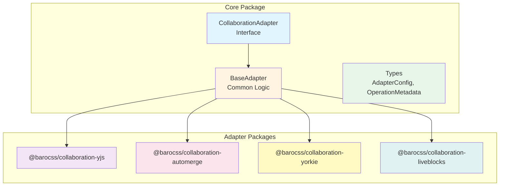
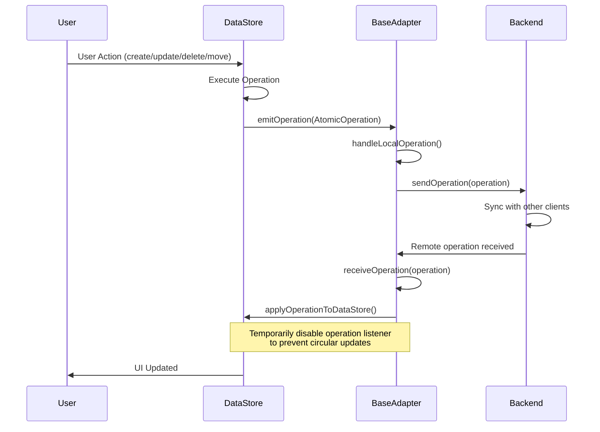

# @barocss/collaboration

Core collaboration interfaces and base adapter for Barocss Editor. Provides the foundation for integrating with CRDT/OT libraries.

## Architecture



## Operation Flow



## Installation

```bash
pnpm add @barocss/collaboration
```

## Overview

This package provides the core interfaces and base adapter that all collaboration adapters extend. It handles:

- **Operation Event Management**: Listens to DataStore operation events and forwards them to collaboration backends
- **Circular Update Prevention**: Prevents local operations from being triggered when applying remote operations
- **Common Adapter Logic**: Provides shared functionality for connection management, operation transformation, and state synchronization

## Usage

This package provides the core interfaces and base adapter. For specific CRDT/OT library integrations, use the corresponding adapter package:

- [`@barocss/collaboration-yjs`](../collaboration-yjs/README.md) - Yjs integration
- [`@barocss/collaboration-automerge`](../collaboration-automerge/README.md) - Automerge integration
- [`@barocss/collaboration-yorkie`](../collaboration-yorkie/README.md) - Yorkie integration
- [`@barocss/collaboration-liveblocks`](../collaboration-liveblocks/README.md) - Liveblocks integration

## Creating Custom Adapters

You can create custom adapters by extending `BaseAdapter`:

```typescript
import { BaseAdapter } from '@barocss/collaboration';
import type { DataStore, AtomicOperation } from '@barocss/datastore';
import type { INode } from '@barocss/datastore';
import type { AdapterConfig } from '@barocss/collaboration';

class CustomAdapter extends BaseAdapter {
  private backend: YourBackend;

  constructor(backend: YourBackend, config?: AdapterConfig) {
    super(config);
    this.backend = backend;
  }

  protected async doConnect(): Promise<void> {
    // Initialize your backend connection
    await this.backend.connect();
    
    // Subscribe to remote changes
    this.backend.on('change', (operation) => {
      this.receiveOperation(operation);
    });
  }

  protected async doDisconnect(): Promise<void> {
    // Cleanup
    await this.backend.disconnect();
  }

  protected async doSendOperation(operation: AtomicOperation): Promise<void> {
    // Send operation to your backend
    await this.backend.send(operation);
  }

  protected async doReceiveOperation(operation: AtomicOperation): Promise<void> {
    // Apply remote operation (BaseAdapter handles this)
    await this.applyOperationToDataStore(operation);
  }

  protected async doGetDocumentState(): Promise<INode | null> {
    // Get document from your backend
    const state = await this.backend.getState();
    return state ? this.convertToINode(state) : null;
  }

  protected async doSetDocumentState(rootNode: INode): Promise<void> {
    // Set document in your backend
    const state = this.convertFromINode(rootNode);
    await this.backend.setState(state);
  }

  protected isRemoteOperation(operation: AtomicOperation): boolean {
    // Implement custom detection logic if needed
    // For example, check operation metadata
    return operation.metadata?.source === 'remote';
  }

  private convertToINode(state: any): INode {
    // Convert your backend format to INode
    // Implementation depends on your backend
  }

  private convertFromINode(node: INode): any {
    // Convert INode to your backend format
    // Implementation depends on your backend
  }
}
```

## API Reference

### CollaborationAdapter Interface

```typescript
interface CollaborationAdapter {
  /**
   * Initialize the adapter with a DataStore instance
   * Sets up operation listeners and connects to backend
   */
  connect(dataStore: DataStore): Promise<void>;

  /**
   * Disconnect the adapter and cleanup resources
   * Removes operation listeners and closes backend connections
   */
  disconnect(): Promise<void>;

  /**
   * Check if the adapter is currently connected
   */
  isConnected(): boolean;

  /**
   * Send a local operation to the collaboration backend
   * Called automatically when DataStore emits operations
   */
  sendOperation(operation: AtomicOperation): Promise<void>;

  /**
   * Receive a remote operation from the collaboration backend
   * and apply it to the DataStore
   */
  receiveOperation(operation: AtomicOperation): Promise<void>;

  /**
   * Get the current document state from the collaboration backend
   */
  getDocumentState(): Promise<INode | null>;

  /**
   * Set the document state in the collaboration backend
   */
  setDocumentState(rootNode: INode): Promise<void>;
}
```

### AdapterConfig

```typescript
interface AdapterConfig {
  /**
   * Unique identifier for this client/session
   * Used for conflict resolution and operation attribution
   */
  clientId?: string;

  /**
   * User information for presence/awareness features
   */
  user?: {
    id: string;
    name?: string;
    color?: string;  // Color for cursor/selection highlighting
    avatar?: string; // Avatar URL
  };

  /**
   * Enable/disable operation logging
   * When true, logs all operations to console
   */
  debug?: boolean;

  /**
   * Custom operation transformation function
   * Allows modifying operations before sending to backend
   * Useful for adding metadata, filtering, or transforming
   */
  transformOperation?: (op: AtomicOperation) => AtomicOperation;
}
```

### BaseAdapter Methods

#### Protected Methods (for subclass implementation)

```typescript
abstract class BaseAdapter {
  /**
   * Initialize backend connection
   * Called during connect()
   */
  protected abstract doConnect(): Promise<void>;

  /**
   * Cleanup backend connection
   * Called during disconnect()
   */
  protected abstract doDisconnect(): Promise<void>;

  /**
   * Send operation to backend
   * Called when local operation is detected
   */
  protected abstract doSendOperation(operation: AtomicOperation): Promise<void>;

  /**
   * Receive operation from backend
   * Called when remote operation arrives
   */
  protected abstract doReceiveOperation(operation: AtomicOperation): Promise<void>;

  /**
   * Get document state from backend
   */
  protected abstract doGetDocumentState(): Promise<INode | null>;

  /**
   * Set document state in backend
   */
  protected abstract doSetDocumentState(rootNode: INode): Promise<void>;
}
```

#### Protected Helper Methods

```typescript
abstract class BaseAdapter {
  /**
   * Apply operation to DataStore without triggering operation events
   * Temporarily removes operation listener to prevent circular updates
   * 
   * @param operation - Operation to apply
   */
  protected async applyOperationToDataStore(
    operation: AtomicOperation
  ): Promise<void>;

  /**
   * Check if an operation is from remote sync
   * Override this to implement custom detection logic
   * 
   * @param operation - Operation to check
   * @returns true if operation is from remote source
   */
  protected isRemoteOperation(operation: AtomicOperation): boolean;

  /**
   * Handle local operation from DataStore
   * Override this to customize behavior
   * 
   * @param operation - Local operation from DataStore
   */
  protected async handleLocalOperation(
    operation: AtomicOperation
  ): Promise<void>;
}
```

## Advanced Usage

### Operation Transformation

Transform operations before sending to backend:

```typescript
const adapter = new CustomAdapter({
  config: {
    transformOperation: (op) => {
      // Add metadata
      return {
        ...op,
        metadata: {
          clientId: 'user-1',
          timestamp: Date.now()
        }
      };
    }
  }
});
```

### Custom Remote Operation Detection

Override `isRemoteOperation` to implement custom detection:

```typescript
class CustomAdapter extends BaseAdapter {
  private isApplyingRemote = false;

  protected isRemoteOperation(operation: AtomicOperation): boolean {
    return this.isApplyingRemote;
  }

  protected async doReceiveOperation(operation: AtomicOperation): Promise<void> {
    this.isApplyingRemote = true;
    try {
      await this.applyOperationToDataStore(operation);
    } finally {
      this.isApplyingRemote = false;
    }
  }
}
```

### Error Handling

```typescript
class CustomAdapter extends BaseAdapter {
  protected async handleLocalOperation(operation: AtomicOperation): Promise<void> {
    try {
      await super.handleLocalOperation(operation);
    } catch (error) {
      console.error('Failed to send operation:', error);
      // Implement retry logic or error reporting
    }
  }
}
```

## Troubleshooting

### Circular Updates

If you see operations being sent repeatedly, ensure `isRemoteOperation` correctly identifies remote operations:

```typescript
protected isRemoteOperation(operation: AtomicOperation): boolean {
  // Implement proper detection
  return this.isApplyingRemote || operation.metadata?.source === 'remote';
}
```

### Operation Not Being Sent

Check that:
1. Adapter is connected: `adapter.isConnected()`
2. DataStore is emitting operations: Check DataStore's `onOperation` listener
3. Operation is not being filtered: Check `isRemoteOperation` implementation

### State Synchronization Issues

Ensure `getDocumentState` and `setDocumentState` properly convert between INode and backend format:

```typescript
protected async doGetDocumentState(): Promise<INode | null> {
  const backendState = await this.backend.getState();
  if (!backendState) return null;
  
  // Properly convert backend format to INode
  return this.convertToINode(backendState);
}
```

## License

MIT
