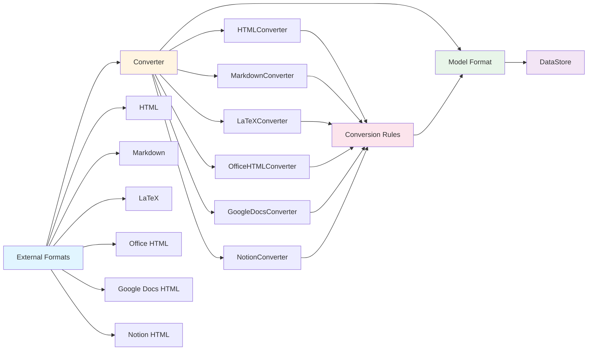

# @barocss/converter

Pluggable document format converter for converting between external formats (HTML, Markdown, LaTeX, Office HTML, Google Docs HTML, Notion HTML) and the BaroCSS Editor model format.

## Architecture



## Overview

`@barocss/converter` provides a flexible converter system that supports:

- **HTML Conversion**: Convert HTML to/from model format
- **Markdown Conversion**: Convert Markdown to/from model format
- **LaTeX Conversion**: Convert LaTeX to/from model format
- **Office HTML**: Clean and convert Office HTML (Word, Excel, PowerPoint)
- **Google Docs HTML**: Clean and convert Google Docs HTML
- **Notion HTML**: Clean and convert Notion HTML

## Installation

```bash
pnpm add @barocss/converter
```

## Basic Usage

### HTML Conversion

```typescript
import { HTMLConverter, registerDefaultHTMLRules } from '@barocss/converter';

// Register default rules
registerDefaultHTMLRules();

// Create converter
const converter = new HTMLConverter();

// Convert HTML to model
const html = '<p>Hello <strong>World</strong></p>';
const model = converter.toModel(html);

// Convert model to HTML
const htmlOutput = converter.toHTML(model);
```

### Markdown Conversion

```typescript
import { MarkdownConverter, registerDefaultMarkdownRules } from '@barocss/converter';

registerDefaultMarkdownRules();

const converter = new MarkdownConverter();

// Convert Markdown to model
const markdown = '# Heading\n\n**Bold** text';
const model = converter.toModel(markdown);

// Convert model to Markdown
const markdownOutput = converter.toMarkdown(model);
```

### LaTeX Conversion

```typescript
import { LatexConverter, registerDefaultLatexRules } from '@barocss/converter';

registerDefaultLatexRules();

const converter = new LatexConverter();

// Convert LaTeX to model
const latex = '\\section{Heading}\n\\textbf{Bold} text';
const model = converter.toModel(latex);

// Convert model to LaTeX
const latexOutput = converter.toLatex(model);
```

### Office HTML Cleaning

```typescript
import { OfficeHTMLCleaner, registerOfficeHTMLRules } from '@barocss/converter';

registerOfficeHTMLRules();

const cleaner = new OfficeHTMLCleaner();
const cleaned = cleaner.clean(officeHTML);

// Or use the converter
const converter = new HTMLConverter();
const model = converter.toModel(officeHTML);
```

### Google Docs HTML

```typescript
import { GoogleDocsHTMLCleaner, registerGoogleDocsHTMLRules } from '@barocss/converter';

registerGoogleDocsHTMLRules();

const cleaner = new GoogleDocsHTMLCleaner();
const cleaned = cleaner.clean(googleDocsHTML);
```

### Notion HTML

```typescript
import { NotionHTMLCleaner, registerNotionHTMLRules } from '@barocss/converter';

registerNotionHTMLRules();

const cleaner = new NotionHTMLCleaner();
const cleaned = cleaner.clean(notionHTML);
```

## Custom Rules

### Define Parser Rule

```typescript
import { defineParser } from '@barocss/converter';

defineParser('custom-element', {
  match: (node) => node.tagName === 'custom-element',
  parse: (node) => {
    return {
      stype: 'custom',
      attributes: {
        attr: node.getAttribute('attr')
      }
    };
  }
});
```

### Define Converter Rule

```typescript
import { defineConverter } from '@barocss/converter';

defineConverter('custom', {
  toHTML: (node) => {
    return `<custom-element attr="${node.attributes.attr}">${node.content}</custom-element>`;
  },
  toMarkdown: (node) => {
    return `[Custom: ${node.attributes.attr}]`;
  }
});
```

### Define AST Converter

```typescript
import { defineASTConverter } from '@barocss/converter';

defineASTConverter('heading', {
  fromAST: (astNode) => {
    return {
      stype: 'heading',
      attributes: { level: astNode.level }
    };
  },
  toAST: (node) => {
    return {
      type: 'heading',
      level: node.attributes.level
    };
  }
});
```

## API Reference

### HTMLConverter

```typescript
class HTMLConverter {
  toModel(html: string): INode[];
  toHTML(nodes: INode[]): string;
}
```

### MarkdownConverter

```typescript
class MarkdownConverter {
  toModel(markdown: string): INode[];
  toMarkdown(nodes: INode[]): string;
}
```

### LatexConverter

```typescript
class LatexConverter {
  toModel(latex: string): INode[];
  toLatex(nodes: INode[]): string;
}
```

### HTML Cleaners

```typescript
class OfficeHTMLCleaner {
  clean(html: string): string;
}

class GoogleDocsHTMLCleaner {
  clean(html: string): string;
}

class NotionHTMLCleaner {
  clean(html: string): string;
}
```

### Registry Functions

```typescript
// Register default rules
registerDefaultHTMLRules();
registerDefaultMarkdownRules();
registerDefaultLatexRules();
registerOfficeHTMLRules();
registerGoogleDocsHTMLRules();
registerNotionHTMLRules();

// Define custom rules
defineParser(name: string, rule: ParserRule): void;
defineConverter(name: string, rule: ConverterRule): void;
defineASTConverter(name: string, rule: ASTToModelRule): void;
```

## Testing

```bash
cd packages/converter
pnpm test:run
```

## License

MIT

