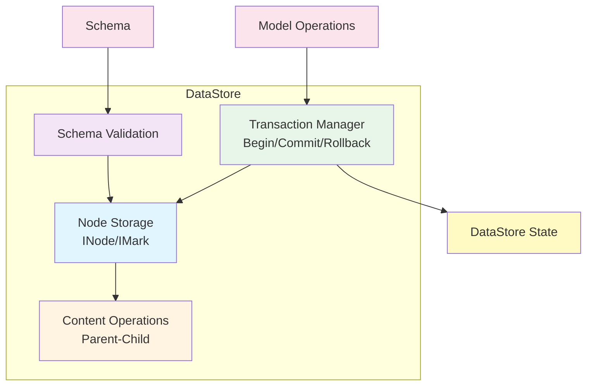

# @barocss/datastore

Transactional, schema-aware node store for managing document structure with normalized `INode` and `IMark` using `sid` (stable ID) and `stype` (schema type).

## Architecture



## Overview

`@barocss/datastore` provides a normalized, transactional data store for document nodes. It manages:

- **Node Storage**: Normalized node storage with `sid` (stable ID) and `stype` (schema type)
- **Schema Validation**: Schema-aware operations with validation
- **Transactions**: Atomic operations with rollback support
- **Content Management**: Parent-child relationships and content ordering
- **Mark Management**: Text marks (bold, italic, etc.) with range tracking

## Installation

```bash
pnpm add @barocss/datastore
```

## Basic Usage

### Creating a DataStore

```typescript
import { DataStore } from '@barocss/datastore';
import { createSchema } from '@barocss/schema';
import type { INode } from '@barocss/datastore';

// Create schema
const schema = createSchema('basic-doc', {
  topNode: 'document',
  nodes: {
    document: { name: 'document', group: 'document', content: 'block+' },
    paragraph: { name: 'paragraph', group: 'block', content: 'inline*' },
    'inline-text': { name: 'inline-text', group: 'inline' }
  }
});

// Create DataStore with schema
const dataStore = new DataStore();
dataStore.registerSchema(schema);

// Create document tree
const root = dataStore.createNodeWithChildren({
  stype: 'document',
  content: [
    {
      stype: 'paragraph',
      content: [
        { stype: 'inline-text', text: 'Hello, World!' }
      ]
    }
  ]
} as INode);

dataStore.setRootNodeId(root.sid!);
```

### Node Operations

```typescript
// Get node
const node = dataStore.getNode('text-1');

// Update node
dataStore.updateNode('text-1', { text: 'Updated text' });

// Create node
const newNode = dataStore.createNode({
  stype: 'paragraph',
  content: []
});

// Delete node
dataStore.deleteNode('node-id');
```

### Content Operations

```typescript
// Add child
dataStore.content.addChild('parent-id', childNode, 0);

// Remove child
dataStore.content.removeChild('parent-id', 'child-id');

// Move node
dataStore.content.moveNode('node-id', 'new-parent-id', 0);

// Reorder children
dataStore.content.reorderChildren('parent-id', ['child-1', 'child-2', 'child-3']);
```

### Block Operations

```typescript
// Move block up/down
dataStore.moveBlockUp('block-id');
dataStore.moveBlockDown('block-id');

// Transform node type
dataStore.transformNode('node-id', 'heading', { level: 1 });
```

### Transactions

```typescript
// Begin transaction
dataStore.begin();

try {
  // Perform operations
  dataStore.updateNode('text-1', { text: 'New text' });
  dataStore.content.addChild('parent-id', newNode, 0);
  
  // Commit
  dataStore.end();
} catch (error) {
  // Rollback on error
  dataStore.rollback();
}
```

## API Reference

### DataStore Class

#### Constructor
```typescript
new DataStore(rootNodeId?: string, schema?: Schema)
```

#### Methods

**Node Management**
- `getNode(nodeId: string): INode | null` - Get node by ID
- `setNode(node: INode, validate?: boolean): void` - Set/update node
- `createNode(node: INode): INode` - Create new node (assigns sid)
- `createNodeWithChildren(node: INode): INode` - Create node with children
- `updateNode(nodeId: string, updates: Partial<INode>, validate?: boolean): void` - Update node
- `deleteNode(nodeId: string): void` - Delete node
- `transformNode(nodeId: string, newType: string, newAttrs?: Record<string, any>): ValidationResult` - Transform node type

**Content Management**
- `content.addChild(parentId: string, child: INode, position?: number): void` - Add child
- `content.removeChild(parentId: string, childId: string): boolean` - Remove child
- `content.moveNode(nodeId: string, newParentId: string, position?: number): void` - Move node
- `content.reorderChildren(parentId: string, childIds: string[]): void` - Reorder children
- `content.moveBlockUp(nodeId: string): boolean` - Move block up
- `content.moveBlockDown(nodeId: string): boolean` - Move block down

**Schema Management**
- `registerSchema(schema: Schema): void` - Register schema
- `getActiveSchema(): Schema | null` - Get active schema
- `setSchema(schema: Schema): void` - Set active schema

**Transaction Management**
- `begin(): void` - Begin transaction
- `end(): void` - End transaction
- `rollback(): void` - Rollback transaction

**Document Management**
- `setRootNodeId(nodeId: string): void` - Set root node
- `getRootNodeId(): string | null` - Get root node ID
- `getRootNode(): INode | null` - Get root node

**Serialization**
- `serializeRange(startNodeId: string, startOffset: number, endNodeId: string, endOffset: number): SerializedRange` - Serialize range
- `deserializeNodes(serialized: SerializedRange): INode[]` - Deserialize nodes

## Types

### INode
```typescript
interface INode {
  sid?: string;           // Stable ID (assigned by DataStore)
  stype: string;          // Schema type
  text?: string;          // Text content (for text nodes)
  attributes?: Record<string, any>;  // Node attributes
  content?: string[];     // Child node IDs
  parentId?: string;      // Parent node ID
  marks?: IMark[];        // Text marks
}
```

### IMark
```typescript
interface IMark {
  type: string;           // Mark type (bold, italic, etc.)
  range: [number, number]; // Text range [start, end]
  attrs?: Record<string, any>;  // Mark attributes
}
```

## Advanced Features

### Drop Behavior

Define custom drop behavior for draggable nodes:

```typescript
import { defineDropBehavior } from '@barocss/datastore';

defineDropBehavior('image', {
  canDrop: (source, target) => {
    return target.stype === 'paragraph';
  },
  onDrop: (source, target, position) => {
    // Custom drop logic
  }
});
```

### Performance Optimization

```typescript
// Batch operations
dataStore.begin();
// ... multiple operations
dataStore.end(); // All operations committed atomically
```

## Testing

```bash
cd packages/datastore
pnpm test:run
```

## License

MIT

