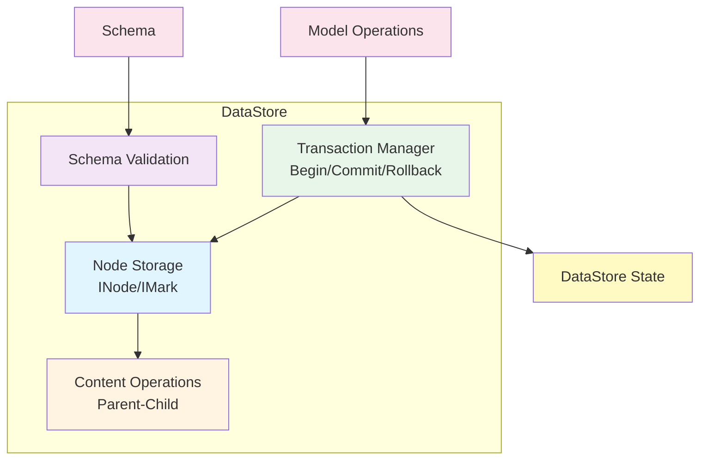
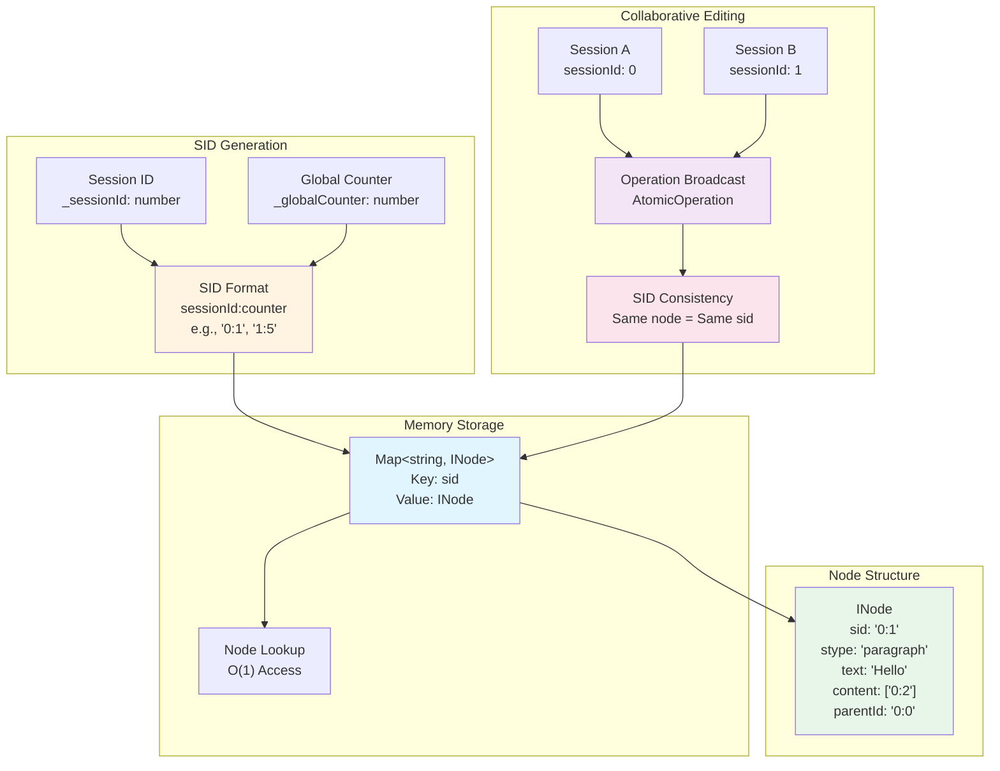
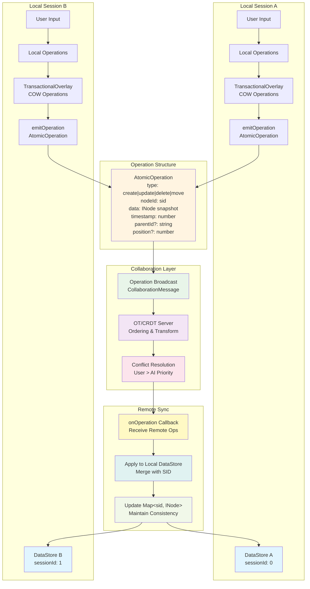

# @barocss/datastore

Transactional, schema-aware node store for managing document structure with normalized `INode` and `IMark` using `sid` (stable ID) and `stype` (schema type).

## Architecture



## Memory Storage Structure & SID System



### Key Concepts

- **Memory Storage**: Nodes are stored in a `Map<string, INode>` where the key is the `sid` (stable ID), providing O(1) lookup performance
- **SID Format**: `sessionId:globalCounter` (e.g., `"0:1"`, `"1:5"`)
  - `sessionId`: Unique identifier for each DataStore instance/session
  - `globalCounter`: Static counter that increments for each new node
- **Collaborative Editing**: SID ensures nodes can be consistently referenced across multiple sessions
  - Same node always has the same SID across all sessions
  - Operations are broadcast with SID references
  - Conflict resolution uses SID to identify target nodes

## Collaborative Editing Integration



### Collaborative Editing Flow

1. **Local Operations**
   - User input triggers local operations in DataStore
   - Operations are collected in `TransactionalOverlay` (Copy-on-Write)
   - Each operation emits `AtomicOperation` event via `emitOperation()`

2. **AtomicOperation Structure**
   ```typescript
   interface AtomicOperation {
     type: 'create' | 'update' | 'delete' | 'move';
     nodeId: string;        // SID reference
     data?: any;            // Node snapshot
     timestamp: number;
     parentId?: string;     // SID reference
     position?: number;
   }
   ```

3. **Operation Broadcast**
   - Operations are wrapped in `CollaborationMessage` and sent to server
   - Server applies OT/CRDT transformations for ordering
   - Conflict resolution follows priority: User > AI

4. **Remote Synchronization**
   - Remote operations received via `onOperation()` callback
   - Operations are applied to local DataStore using SID references
   - `Map<sid, INode>` is updated maintaining consistency across sessions

### Key Integration Points

- **SID Consistency**: All sessions reference the same node using the same SID
- **Operation Events**: `emitOperation()` / `onOperation()` for operation lifecycle
- **Transactional Overlay**: COW mechanism ensures atomic operations
- **Conflict Resolution**: Operation-level conflict resolution, not node-level

### Collaboration Adapters

For production use, consider using collaboration adapter packages which provide ready-to-use adapters for popular CRDT/OT libraries:

- **[@barocss/collaboration-yjs](../collaboration-yjs/README.md)**: Yjs WebSocket-based real-time collaboration
- **[@barocss/collaboration-automerge](../collaboration-automerge/README.md)**: Automerge conflict-free replicated data types
- **[@barocss/collaboration-yorkie](../collaboration-yorkie/README.md)**: Yorkie self-hosted or cloud-based collaboration
- **[@barocss/collaboration-liveblocks](../collaboration-liveblocks/README.md)**: Liveblocks managed collaboration infrastructure

All adapters are built on top of [`@barocss/collaboration`](../collaboration/README.md) which provides the core interfaces and base adapter.

#### Quick Integration Example

All adapters follow the same pattern: create the adapter, connect it to DataStore, and operations will automatically sync:

```typescript
import { DataStore } from '@barocss/datastore';
import { YjsAdapter } from '@barocss/collaboration-yjs';
import * as Y from 'yjs';
import { WebsocketProvider } from 'y-websocket';

// 1. Create DataStore
const dataStore = new DataStore();

// 2. Set up collaboration backend (example: Yjs)
const ydoc = new Y.Doc();
const provider = new WebsocketProvider('ws://localhost:1234', 'room-id', ydoc);

// 3. Create and connect adapter
const adapter = new YjsAdapter({
  ydoc,
  config: { clientId: 'user-1' }
});

await adapter.connect(dataStore);

// 4. Operations are now automatically synced!
// - Local operations → sent to backend via adapter
// - Remote operations → applied to DataStore via adapter
```

#### How It Works

1. **Local Operations**: When DataStore emits operations via `emitOperation()`, the adapter captures them and sends to the collaboration backend
2. **Remote Operations**: When the backend receives operations from other clients, the adapter applies them to DataStore using `applyOperationToDataStore()` (which temporarily disables operation listeners to prevent circular updates)
3. **SID Consistency**: All clients use the same SID for the same node, ensuring consistent references across sessions

#### Choosing an Adapter

- **Yjs**: Best for WebSocket-based real-time collaboration with self-hosted or cloud servers
- **Automerge**: Best for peer-to-peer collaboration or when you need immutable document history
- **Yorkie**: Best for self-hosted or cloud-based collaboration with built-in presence features
- **Liveblocks**: Best for managed infrastructure with built-in authentication and presence

See individual adapter READMEs for detailed setup instructions and examples.

## Overview

`@barocss/datastore` provides a normalized, transactional data store for document nodes. It manages:

- **Node Storage**: Normalized node storage with `sid` (stable ID) and `stype` (schema type)
- **Schema Validation**: Schema-aware operations with validation
- **Transactions**: Atomic operations with rollback support
- **Content Management**: Parent-child relationships and content ordering
- **Mark Management**: Text marks (bold, italic, etc.) with range tracking

## Installation

```bash
pnpm add @barocss/datastore
```

## Basic Usage

### Creating a DataStore

```typescript
import { DataStore } from '@barocss/datastore';
import { createSchema } from '@barocss/schema';
import type { INode } from '@barocss/datastore';

// Create schema
const schema = createSchema('basic-doc', {
  topNode: 'document',
  nodes: {
    document: { name: 'document', group: 'document', content: 'block+' },
    paragraph: { name: 'paragraph', group: 'block', content: 'inline*' },
    'inline-text': { name: 'inline-text', group: 'inline' }
  }
});

// Create DataStore with schema
const dataStore = new DataStore();
dataStore.registerSchema(schema);

// Create document tree
const root = dataStore.createNodeWithChildren({
  stype: 'document',
  content: [
    {
      stype: 'paragraph',
      content: [
        { stype: 'inline-text', text: 'Hello, World!' }
      ]
    }
  ]
} as INode);

dataStore.setRootNodeId(root.sid!);
```

### Node Operations

```typescript
// Get node
const node = dataStore.getNode('text-1');

// Update node
dataStore.updateNode('text-1', { text: 'Updated text' });

// Create node
const newNode = dataStore.createNode({
  stype: 'paragraph',
  content: []
});

// Delete node
dataStore.deleteNode('node-id');
```

### Content Operations

```typescript
// Add child
dataStore.content.addChild('parent-id', childNode, 0);

// Remove child
dataStore.content.removeChild('parent-id', 'child-id');

// Move node
dataStore.content.moveNode('node-id', 'new-parent-id', 0);

// Reorder children
dataStore.content.reorderChildren('parent-id', ['child-1', 'child-2', 'child-3']);
```

### Block Operations

```typescript
// Move block up/down
dataStore.moveBlockUp('block-id');
dataStore.moveBlockDown('block-id');

// Transform node type
dataStore.transformNode('node-id', 'heading', { level: 1 });
```

### Transactions

```typescript
// Begin transaction
dataStore.begin();

try {
  // Perform operations
  dataStore.updateNode('text-1', { text: 'New text' });
  dataStore.content.addChild('parent-id', newNode, 0);
  
  // Commit
  dataStore.end();
} catch (error) {
  // Rollback on error
  dataStore.rollback();
}
```

## API Reference

### DataStore Class

#### Constructor
```typescript
new DataStore(rootNodeId?: string, schema?: Schema)
```

#### Methods

**Node Management**
- `getNode(nodeId: string): INode | null` - Get node by ID
- `setNode(node: INode, validate?: boolean): void` - Set/update node
- `createNode(node: INode): INode` - Create new node (assigns sid)
- `createNodeWithChildren(node: INode): INode` - Create node with children
- `updateNode(nodeId: string, updates: Partial<INode>, validate?: boolean): void` - Update node
- `deleteNode(nodeId: string): void` - Delete node
- `transformNode(nodeId: string, newType: string, newAttrs?: Record<string, any>): ValidationResult` - Transform node type

**Content Management**
- `content.addChild(parentId: string, child: INode, position?: number): void` - Add child
- `content.removeChild(parentId: string, childId: string): boolean` - Remove child
- `content.moveNode(nodeId: string, newParentId: string, position?: number): void` - Move node
- `content.reorderChildren(parentId: string, childIds: string[]): void` - Reorder children
- `content.moveBlockUp(nodeId: string): boolean` - Move block up
- `content.moveBlockDown(nodeId: string): boolean` - Move block down

**Schema Management**
- `registerSchema(schema: Schema): void` - Register schema
- `getActiveSchema(): Schema | null` - Get active schema
- `setSchema(schema: Schema): void` - Set active schema

**Transaction Management**
- `begin(): void` - Begin transaction
- `end(): void` - End transaction
- `rollback(): void` - Rollback transaction

**Document Management**
- `setRootNodeId(nodeId: string): void` - Set root node
- `getRootNodeId(): string | null` - Get root node ID
- `getRootNode(): INode | null` - Get root node

**Serialization**
- `serializeRange(startNodeId: string, startOffset: number, endNodeId: string, endOffset: number): SerializedRange` - Serialize range
- `deserializeNodes(serialized: SerializedRange): INode[]` - Deserialize nodes

## Types

### INode
```typescript
interface INode {
  sid?: string;           // Stable ID (assigned by DataStore)
  stype: string;          // Schema type
  text?: string;          // Text content (for text nodes)
  attributes?: Record<string, any>;  // Node attributes
  content?: string[];     // Child node IDs
  parentId?: string;      // Parent node ID
  marks?: IMark[];        // Text marks
}
```

### IMark
```typescript
interface IMark {
  type: string;           // Mark type (bold, italic, etc.)
  range: [number, number]; // Text range [start, end]
  attrs?: Record<string, any>;  // Mark attributes
}
```

## Advanced Features

### Drop Behavior

Define custom drop behavior for draggable nodes:

```typescript
import { defineDropBehavior } from '@barocss/datastore';

defineDropBehavior('image', {
  canDrop: (source, target) => {
    return target.stype === 'paragraph';
  },
  onDrop: (source, target, position) => {
    // Custom drop logic
  }
});
```

### Performance Optimization

```typescript
// Batch operations
dataStore.begin();
// ... multiple operations
dataStore.end(); // All operations committed atomically
```

## Testing

```bash
cd packages/datastore
pnpm test:run
```

## License

MIT

