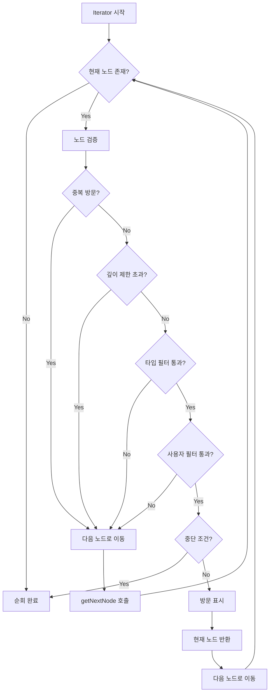
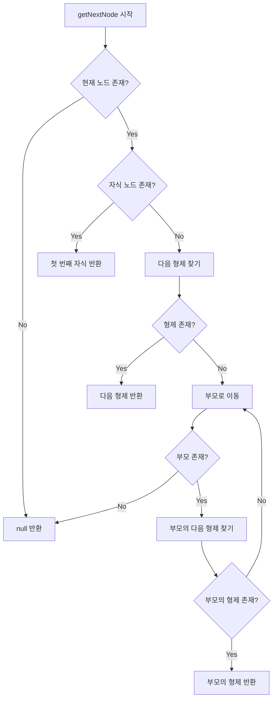
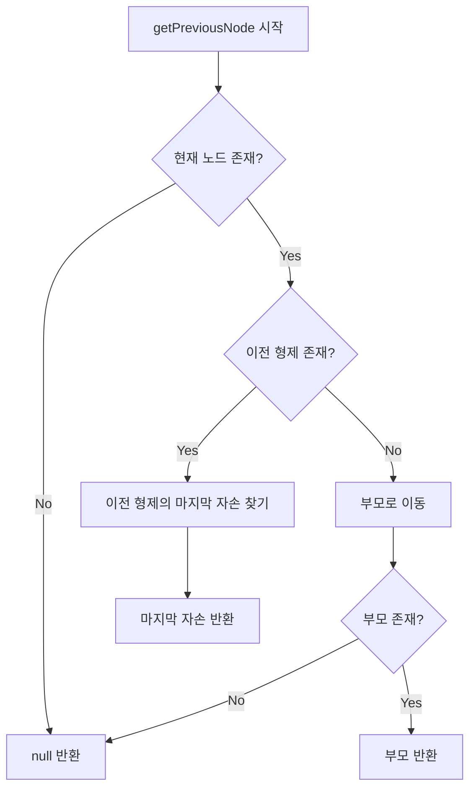
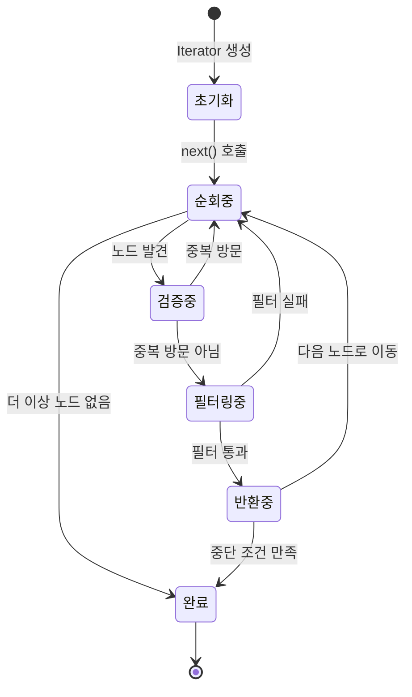
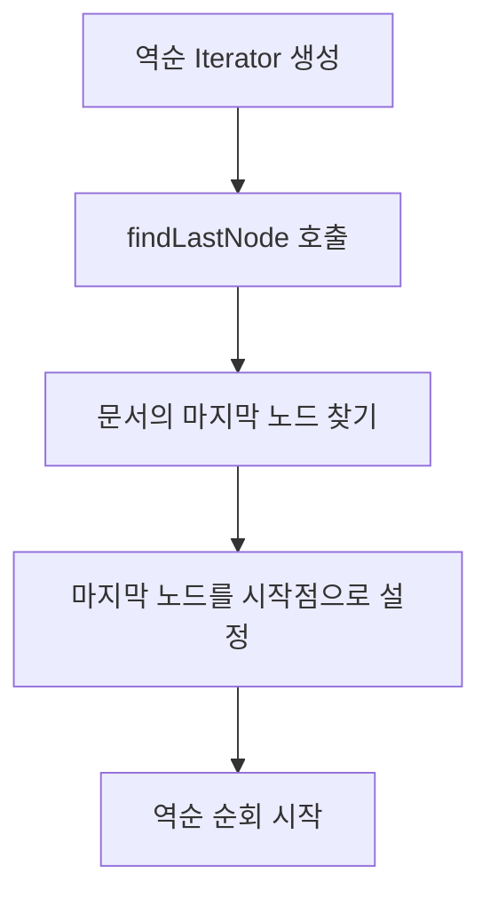
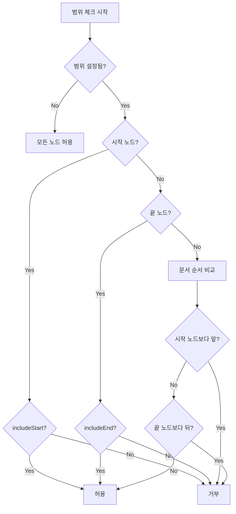

# DocumentIterator 순환 로직 명세서

## 개요

`DocumentIterator`는 문서 구조를 순회하기 위한 반복자(iterator) 클래스입니다. 이 문서는 `DocumentIterator`의 내부 동작 원리와 순환 로직에 대해 상세히 설명합니다.

### 성능 vs 완전성 정책

QueryOperations에서 DocumentIterator와 전체 순회 방식을 적절히 조합하여 사용하는 정책:

#### DocumentIterator 사용 (성능 우선)
- **findNodesByType**: 타입 필터링으로 효율적
- **findChildrenByParentId**: 직접 접근으로 효율적  
- **findNodesByDepth**: 깊이 제한으로 효율적

#### 전체 순회 사용 (완전성 우선)
- **findNodes**: 고아 노드 포함 모든 노드 검색
- **findRootNodes**: 고아 노드도 루트로 간주
- **findNodesByAttribute**: 속성 검색 (고아 노드 포함)
- **findNodesByText**: 텍스트 검색 (고아 노드 포함)
- **searchText**: 텍스트 검색 (고아 노드 포함)

이 정책은 데이터 무결성 검사, 정리 작업, 디버깅 시 고아 노드까지 찾아야 하는 요구사항과 일반적인 성능 최적화 요구사항을 모두 만족합니다.

## 목차

1. [기본 개념](#기본-개념)
2. [순환 알고리즘](#순환-알고리즘)
3. [상태 관리](#상태-관리)
4. [필터링 시스템](#필터링-시스템)
5. [역순 순회](#역순-순회)
6. [범위 기반 순회](#범위-기반-순회)
7. [Visitor 패턴](#visitor-패턴)
8. [성능 최적화](#성능-최적화)
9. [사용 예제](#사용-예제)

## 기본 개념

### 문서 순서 (Document Order)

문서 순서는 **깊이 우선 순회(Depth-First Traversal)**를 기반으로 합니다:

```
Document
├── Heading 1
│   └── InlineText "제목"
├── Paragraph 1
│   ├── InlineText "첫 번째"
│   ├── InlineText "두 번째"
│   └── InlineText "세 번째"
└── List
    ├── ListItem 1
    │   └── Paragraph
    │       └── InlineText "항목 1"
    └── ListItem 2
        └── Paragraph
            └── InlineText "항목 2"
```

**순회 순서**: Document → Heading 1 → InlineText "제목" → Paragraph 1 → InlineText "첫 번째" → InlineText "두 번째" → InlineText "세 번째" → List → ListItem 1 → Paragraph → InlineText "항목 1" → ListItem 2 → Paragraph → InlineText "항목 2"

### Iterator 인터페이스

`DocumentIterator`는 JavaScript의 표준 `IterableIterator<string>` 인터페이스를 구현합니다:

```typescript
interface IterableIterator<T> {
  [Symbol.iterator](): IterableIterator<T>;
  next(): IteratorResult<T>;
}
```

## 순환 알고리즘

### 1. 기본 순회 알고리즘 (정방향)



### 2. getNextNode 알고리즘



### 3. getPreviousNode 알고리즘



## 상태 관리

### Iterator 상태

```typescript
class DocumentIterator {
  private currentId: string | null;        // 현재 순회 중인 노드 ID
  private visited = new Set<string>();     // 방문한 노드 ID 집합
  private options: Required<DocumentIteratorOptions>; // 순회 옵션
}
```

### 상태 전환



## 필터링 시스템

### 1. 타입 필터

```typescript
interface TypeFilter {
  type?: string;           // 단일 타입
  types?: string[];        // 여러 타입
  excludeTypes?: string[]; // 제외할 타입들
}
```

**필터링 로직**:
```typescript
private matchesTypeFilter(node: any): boolean {
  const { filter } = this.options;
  
  if (filter.type && node.type !== filter.type) {
    return false;
  }
  
  if (filter.types && !filter.types.includes(node.type)) {
    return false;
  }
  
  if (filter.excludeTypes && filter.excludeTypes.includes(node.type)) {
    return false;
  }
  
  return true;
}
```

### 2. 사용자 정의 필터

```typescript
customFilter?: (nodeId: string, node: any) => boolean;
```

### 3. 중단 조건

```typescript
shouldStop?: (nodeId: string, node: any) => boolean;
```

## 역순 순회

### 역순 순회 초기화



### findLastNode 알고리즘

```typescript
private findLastNode(): string | null {
  let currentId = this.options.startNodeId;
  let lastNodeId = currentId;

  while (currentId) {
    lastNodeId = currentId;
    currentId = this.dataStore.getNextNode(currentId);
  }

  return lastNodeId;
}
```

### 역순 순회 로직


## 범위 기반 순회

### 개요

범위 기반 순회는 문서의 특정 부분만을 효율적으로 순회하는 기능입니다. 전체 문서를 순회하지 않고 지정된 시작 노드와 끝 노드 사이의 노드들만 순회합니다.

### DocumentRange 인터페이스

```typescript
interface DocumentRange {
  /** 시작 노드 ID */
  startNodeId: string;
  /** 끝 노드 ID */
  endNodeId: string;
  /** 시작 노드 포함 여부 (기본값: true) */
  includeStart?: boolean;
  /** 끝 노드 포함 여부 (기본값: true) */
  includeEnd?: boolean;
}
```

### 범위 체크 알고리즘



### 범위 체크 구현

```typescript
private isInRange(nodeId: string): boolean {
  // 범위가 설정되지 않은 경우 모든 노드 허용
  if (!this.options.range || !this.rangeStartId || !this.rangeEndId) {
    return true;
  }

  const { includeStart = true, includeEnd = true } = this.options.range;

  // 시작 노드 체크
  if (nodeId === this.rangeStartId) {
    return includeStart;
  }

  // 끝 노드 체크
  if (nodeId === this.rangeEndId) {
    return includeEnd;
  }

  // 범위 내 노드인지 확인
  const comparison = this.dataStore.utility.compareDocumentOrder(nodeId, this.rangeStartId);
  const endComparison = this.dataStore.utility.compareDocumentOrder(nodeId, this.rangeEndId);

  // 시작 노드보다 앞에 있으면 범위 밖
  if (comparison < 0) {
    return false;
  }

  // 끝 노드보다 뒤에 있으면 범위 밖
  if (endComparison > 0) {
    return false;
  }

  // 범위 내에 있음
  return true;
}
```

### 범위 기반 순회의 장점

1. **메모리 효율성**: 필요한 범위만 순회하여 메모리 사용량 최적화
2. **성능 최적화**: 전체 문서를 스캔하지 않고 지정된 범위만 처리
3. **정확한 제어**: 특정 섹션이나 구간만 정확히 처리 가능
4. **유연한 경계 설정**: 시작/끝 노드 포함/제외 옵션 제공

### 범위 기반 순회 vs 전체 순회

| 특징 | 범위 기반 순회 | 전체 순회 |
|------|----------------|-----------|
| 순회 범위 | 지정된 범위만 | 전체 문서 |
| 메모리 사용량 | 낮음 | 높음 |
| 성능 | 빠름 | 상대적으로 느림 |
| 제어 정확도 | 높음 | 낮음 |
| 사용 사례 | 특정 섹션 처리 | 전체 문서 분석 |

## 성능 최적화

### 1. 방문 추적 최적화

- `Set<string>`을 사용하여 O(1) 방문 확인
- 중복 방문 방지로 무한 루프 방지

### 2. 조기 종료 최적화

- 깊이 제한 초과 시 즉시 다음 노드로 이동
- 필터 실패 시 즉시 다음 노드로 이동
- 중단 조건 만족 시 즉시 순회 종료

### 3. 메모리 최적화

- 노드 객체를 직접 저장하지 않고 ID만 저장
- 필요할 때만 `dataStore.getNode()`로 노드 조회

## 사용 예제

### 1. 기본 순회

```typescript
const iterator = dataStore.createDocumentIterator();

for (const nodeId of iterator) {
  const node = dataStore.getNode(nodeId);
  console.log(`${nodeId}: ${node.type}`);
}
```

### 2. 타입 필터링

```typescript
const textIterator = dataStore.createDocumentIterator({
  filter: { type: 'inline-text' }
});

for (const nodeId of textIterator) {
  const node = dataStore.getNode(nodeId);
  console.log(node.text);
}
```

### 3. 깊이 제한

```typescript
const shallowIterator = dataStore.createDocumentIterator({
  maxDepth: 2
});

for (const nodeId of shallowIterator) {
  const node = dataStore.getNode(nodeId);
  console.log(`${nodeId}: ${node.type} (깊이: ${dataStore.getNodePath(nodeId).length})`);
}
```

### 4. 역순 순회

```typescript
const reverseIterator = dataStore.createDocumentIterator({
  reverse: true
});

for (const nodeId of reverseIterator) {
  const node = dataStore.getNode(nodeId);
  console.log(`${nodeId}: ${node.type}`);
}
```

### 5. 조건부 순회

```typescript
const conditionalIterator = dataStore.createDocumentIterator({
  shouldStop: (nodeId, node) => {
    return node.type === 'heading' && nodeId !== startNodeId;
  }
});

for (const nodeId of conditionalIterator) {
  const node = dataStore.getNode(nodeId);
  console.log(`${nodeId}: ${node.type}`);
}
```

### 6. 범위 기반 순회

```typescript
// 기본 범위 순회
const rangeIterator = dataStore.createRangeIterator('0:2', '0:6');
for (const nodeId of rangeIterator) {
  const node = dataStore.getNode(nodeId);
  console.log(`${nodeId}: ${node.type}`);
}

// 경계 제외 옵션
const excludeBoundsIterator = dataStore.createRangeIterator('0:2', '0:6', {
  includeStart: false,
  includeEnd: false
});

// 필터링과 함께 사용
const filteredRangeIterator = dataStore.createRangeIterator('0:2', '0:6', {
  filter: { type: 'inline-text' }
});

// 편의 메서드 사용
const nodesInRange = dataStore.getNodesInRange('0:2', '0:6');
const count = dataStore.getRangeNodeCount('0:2', '0:6');
```

### 7. 유틸리티 메서드 사용

```typescript
const iterator = dataStore.createDocumentIterator();

// 모든 노드를 배열로 수집
const allNodes = iterator.toArray();

// 조건에 맞는 첫 번째 노드 찾기
const firstHeading = iterator.find((nodeId, node) => node.type === 'heading');

// 조건에 맞는 모든 노드 찾기
const allHeadings = iterator.findAll((nodeId, node) => node.type === 'heading');

// 조건이 만족되는 동안만 수집
const firstSection = iterator.takeWhile((nodeId, node) => node.type !== 'heading');

// 통계 정보 수집
const stats = iterator.getStats();
console.log(`총 노드 수: ${stats.total}`);
console.log(`타입별 분포:`, stats.byType);
console.log(`깊이별 분포:`, stats.byDepth);
```

### 8. 범위 기반 유틸리티 메서드

```typescript
const rangeIterator = dataStore.createRangeIterator('0:2', '0:6');

// 범위 내의 모든 노드를 배열로 수집
const rangeNodes = rangeIterator.getNodesInRange();

// 범위 내의 노드 개수 확인
const rangeCount = rangeIterator.getRangeNodeCount();

// 범위 정보 확인
const rangeInfo = rangeIterator.getRangeInfo();
console.log(`시작: ${rangeInfo.start}, 끝: ${rangeInfo.end}`);
console.log(`시작 포함: ${rangeInfo.includeStart}, 끝 포함: ${rangeInfo.includeEnd}`);
```

## 복잡도 분석

### 시간 복잡도

- **전체 순회**: O(n) - n은 문서의 총 노드 수
- **범위 기반 순회**: O(r) - r은 범위 내 노드 수 (r ≤ n)
- **노드 검색**: O(1) - DataStore의 Map 기반 조회
- **방문 확인**: O(1) - Set 기반 조회
- **필터링**: O(1) - 단순 조건 확인
- **범위 체크**: O(1) - 문서 순서 비교

### 공간 복잡도

- **전체 순회 방문 추적**: O(n) - 최악의 경우 모든 노드 방문
- **범위 기반 순회 방문 추적**: O(r) - 범위 내 노드만 방문 (r ≤ n)
- **옵션 저장**: O(1) - 고정 크기
- **현재 상태**: O(1) - 단일 노드 ID만 저장
- **범위 정보**: O(1) - 시작/끝 노드 ID만 저장

## 에러 처리

### 1. 존재하지 않는 노드

```typescript
const node = this.dataStore.getNode(this.currentId);
if (!node) {
  this.currentId = this.getNextNode();
  continue;
}
```

### 2. 순환 참조 방지

```typescript
if (this.visited.has(this.currentId)) {
  this.currentId = this.getNextNode();
  continue;
}
```

### 3. 무한 루프 방지

- 방문 추적으로 중복 방문 방지
- 깊이 제한으로 과도한 깊이 방지
- 중단 조건으로 조기 종료 지원

## 확장성

### 1. 새로운 필터 타입 추가

```typescript
interface ExtendedFilter {
  // 기존 필터들...
  attributeFilter?: {
    key: string;
    value: any;
  };
  textContentFilter?: string;
}
```

### 2. 새로운 순회 전략 추가

```typescript
interface TraversalStrategy {
  breadthFirst?: boolean;
  customOrder?: (nodeId: string) => number;
}
```

### 3. 성능 모니터링

```typescript
interface PerformanceMetrics {
  nodesVisited: number;
  timeElapsed: number;
  memoryUsed: number;
}
```

## 결론

`DocumentIterator`는 문서 구조를 효율적이고 유연하게 순회할 수 있는 강력한 도구입니다. 깊이 우선 순회를 기반으로 하면서도 다양한 필터링과 최적화 기법을 통해 실용적인 문서 순회 기능을 제공합니다.

주요 특징:
- **표준 Iterator 인터페이스** 구현
- **다양한 필터링 옵션** 제공
- **역순 순회** 지원
- **범위 기반 순회** 지원 (메모리 효율적)
- **성능 최적화** 적용
- **유틸리티 메서드** 제공
- **확장 가능한 구조** 설계

### 범위 기반 순회의 실용성

범위 기반 순회는 다음과 같은 실제 사용 사례에서 매우 유용합니다:

1. **섹션별 편집**: 특정 섹션(예: 제목부터 다음 제목까지)만 편집
2. **선택 영역 처리**: 사용자가 선택한 텍스트 범위만 처리
3. **성능 최적화**: 대용량 문서에서 필요한 부분만 처리
4. **협업 기능**: 특정 사용자의 편집 범위만 동기화
5. **검색 및 교체**: 특정 범위 내에서만 검색/교체 수행

이러한 기능들을 통해 `DocumentIterator`는 단순한 문서 순회를 넘어서 실용적이고 효율적인 문서 처리 도구로 발전했습니다.

## 7. Visitor 패턴

### 7.1 Visitor 패턴 개요

Visitor 패턴은 문서 구조의 각 요소에 대해 수행할 연산을 정의하는 디자인 패턴입니다. Iterator로는 순회만 가능하지만, Visitor 패턴을 사용하면 순회하면서 다양한 연산을 수행할 수 있습니다.

### 7.2 Visitor 인터페이스

```typescript
interface DocumentVisitor {
  /** 노드 방문 시 호출 (필수) */
  visit(nodeId: string, node: any, context?: any): void | boolean;
  
  /** 노드 진입 시 호출 (선택) */
  enter?(nodeId: string, node: any, context?: any): void;
  
  /** 노드 종료 시 호출 (선택) */
  exit?(nodeId: string, node: any, context?: any): void;
  
  /** 하위 트리 방문 여부 결정 (선택) */
  shouldVisitChildren?(nodeId: string, node: any): boolean;
}
```

### 7.3 Visitor 순회 옵션

```typescript
interface VisitorTraversalOptions {
  /** 시작 노드 ID (기본값: 루트 노드) */
  startNodeId?: string;
  /** 역순 순회 여부 */
  reverse?: boolean;
  /** 최대 깊이 제한 */
  maxDepth?: number;
  /** 노드 타입 필터 */
  filter?: {
    type?: string;
    types?: string[];
    excludeTypes?: string[];
  };
  /** 사용자 정의 필터 함수 */
  customFilter?: (nodeId: string, node: any) => boolean;
  /** 순회 중단 조건 */
  shouldStop?: (nodeId: string, node: any) => boolean;
  /** 순회 범위 제한 */
  range?: DocumentRange;
  /** 컨텍스트 객체 */
  context?: any;
}
```

### 7.4 Visitor 패턴 사용법

#### 기본 사용법

```typescript
const visitor: DocumentVisitor = {
  visit(nodeId, node) {
    console.log(`Visiting: ${nodeId} (${node.type})`);
  },
  enter(nodeId, node) {
    console.log(`Entering: ${nodeId}`);
  },
  exit(nodeId, node) {
    console.log(`Exiting: ${nodeId}`);
  }
};

const result = dataStore.traverse(visitor);
console.log(result); // { visitedCount: 5, skippedCount: 0, stopped: false }
```

#### 텍스트 추출 Visitor

```typescript
class TextExtractor implements DocumentVisitor {
  private texts: string[] = [];

  visit(nodeId: string, node: any) {
    if (node.type === 'inline-text' && node.text) {
      this.texts.push(node.text);
    }
  }

  getTexts(): string[] {
    return this.texts;
  }
}

const textExtractor = new TextExtractor();
dataStore.traverse(textExtractor);
const allTexts = textExtractor.getTexts();
```

#### 링크 수집 Visitor

```typescript
class LinkCollector implements DocumentVisitor {
  private links: Array<{nodeId: string, text: string, href: string}> = [];

  visit(nodeId: string, node: any) {
    if (node.type === 'inline-text' && node.marks) {
      const linkMark = node.marks.find((m: any) => m.type === 'link');
      if (linkMark) {
        this.links.push({
          nodeId,
          text: node.text,
          href: linkMark.attributes?.href || ''
        });
      }
    }
  }

  getLinks() {
    return this.links;
  }
}
```

#### 구조 분석 Visitor

```typescript
class StructureAnalyzer implements DocumentVisitor {
  private structure: any = {};
  private nodeDepths: Record<string, number> = {};

  visit(nodeId: string, node: any) {
    // 노드의 실제 깊이 계산
    let depth = 1;
    let currentId = node.parentId;
    while (currentId) {
      depth++;
      const parentNode = dataStore.getNode(currentId);
      currentId = parentNode?.parentId;
    }

    this.nodeDepths[nodeId] = depth;
    
    this.structure[nodeId] = {
      type: node.type,
      depth: depth,
      parent: node.parentId,
      children: node.content || [],
      hasChildren: node.content && node.content.length > 0
    };
  }

  getMaxDepth(): number {
    return Math.max(...Object.values(this.nodeDepths));
  }
}
```

### 7.5 여러 Visitor 순차 실행 및 오버로드 시그니처

```typescript
const textExtractor = new TextExtractor();
const linkCollector = new LinkCollector();
const nodeCounter = new NodeCounter();

// 가변 인자로 여러 visitor 실행
// traverse 오버로드
// - traverse(visitor, options?) -> 단일 결과
// - traverse([v1, v2], options?) -> 각 visitor 결과 배열
// - traverse(v1, v2, ...) -> 각 visitor 결과 배열

const results = dataStore.traverse(textExtractor, linkCollector, nodeCounter);

console.log('텍스트:', textExtractor.getTexts());
console.log('링크:', linkCollector.getLinks());
console.log('노드 수:', nodeCounter.getCount());

// 배열로도 가능
const results2 = dataStore.traverse([textExtractor, linkCollector]);

// 옵션 제공 예시
const singleResult = dataStore.traverse(textExtractor, { maxDepth: 2 });
const multiResults = dataStore.traverse([textExtractor, linkCollector], { reverse: true });
```

#### 사용 예제

```typescript
// 단일 visitor
const result = dataStore.traverse(visitor);

// 단일 visitor + 옵션
const result2 = dataStore.traverse(visitor, { maxDepth: 3 });

// 다중 visitor (가변 인자)
const results = dataStore.traverse(visitor1, visitor2, visitor3);

// 다중 visitor + 옵션
const results2 = dataStore.traverse(visitor1, visitor2, { maxDepth: 3 });

// 배열로 다중 visitor
const results3 = dataStore.traverse([visitor1, visitor2]);

// 배열 + 옵션
const results4 = dataStore.traverse([visitor1, visitor2], { maxDepth: 3 });
```

### 7.6 Visitor 패턴의 장점

1. **확장성**: 새로운 연산을 추가할 때 기존 코드를 수정하지 않음
2. **분리**: 데이터 구조와 연산 로직을 분리
3. **재사용성**: Visitor를 다른 문서에서도 재사용 가능
4. **조합성**: 여러 Visitor를 조합하여 복잡한 연산 수행
5. **유연성**: 조건부 방문, 중단, 스킵 등 다양한 제어 가능

### 7.7 복잡도 분석

- **시간 복잡도**: O(n) - 각 노드를 한 번씩 방문
- **공간 복잡도**: O(1) - Visitor 상태만 저장
- **메모리 사용량**: 최소화 - 이터레이터 패턴 사용

### 7.8 Visitor 패턴의 실용성

Visitor 패턴은 다음과 같은 실용적인 사용 사례에서 매우 유용합니다:

1. **텍스트 추출**: 문서에서 모든 텍스트 내용 추출
2. **링크 수집**: 문서 내 모든 링크 정보 수집
3. **마크 분석**: 텍스트 포맷팅 정보 분석
4. **구조 분석**: 문서의 계층 구조 분석
5. **통계 수집**: 노드 타입별 통계, 텍스트 통계 등
6. **조건부 검색**: 특정 조건을 만족하는 노드 검색

이러한 기능들을 통해 `DocumentIterator`와 `Visitor` 패턴은 현대적인 에디터 시스템에서 필수적인 문서 순회 및 처리 도구로 활용될 수 있습니다.
