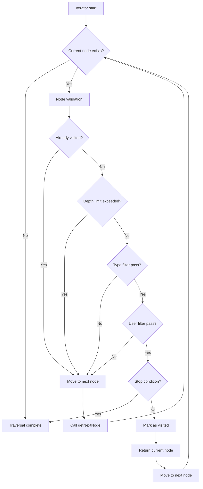
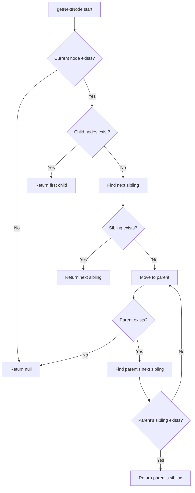
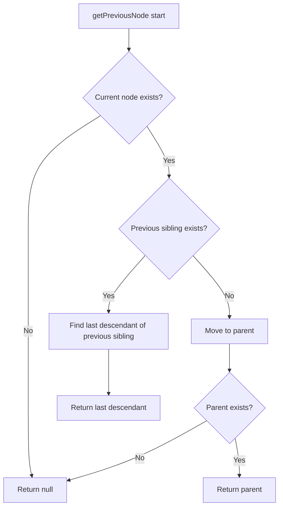
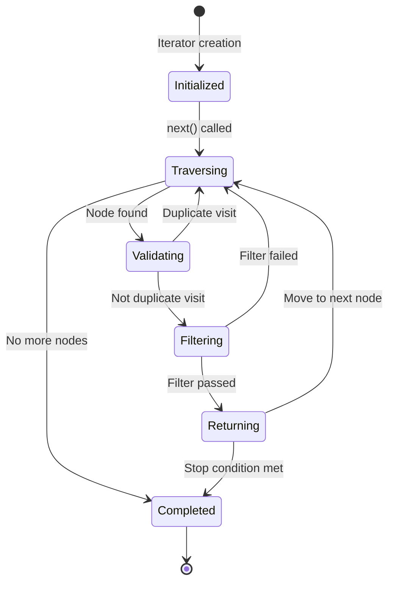
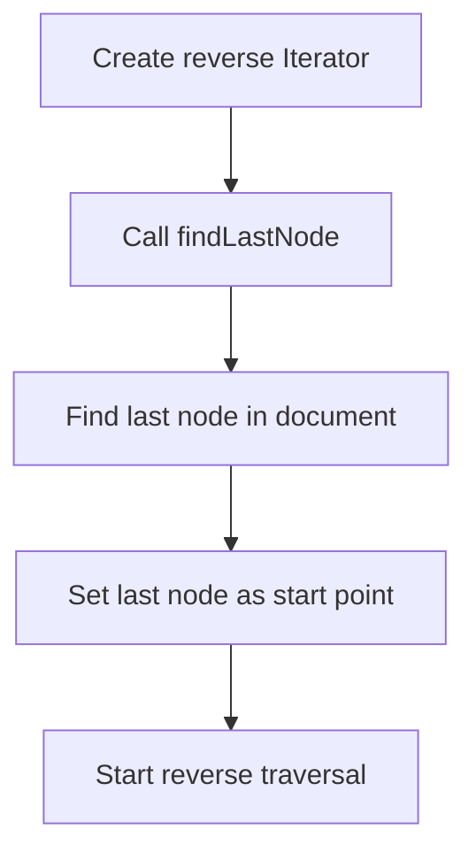
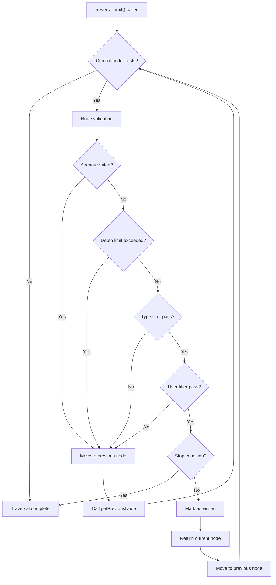
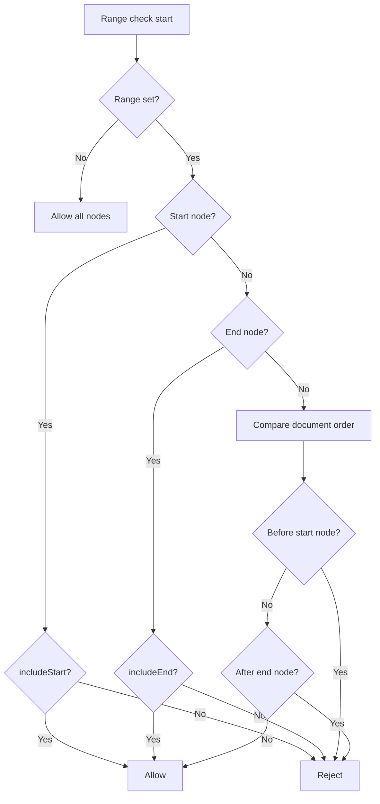

# DocumentIterator Traversal Logic Specification

## Overview

`DocumentIterator` is an iterator class for traversing document structures. This document provides detailed explanations of the internal operation principles and traversal logic of `DocumentIterator`.

### Performance vs Completeness Policy

Policy for appropriately combining DocumentIterator and full traversal in QueryOperations:

#### Using DocumentIterator (Performance Priority)
- **findNodesByType**: Efficient with type filtering
- **findChildrenByParentId**: Efficient with direct access
- **findNodesByDepth**: Efficient with depth limiting

#### Using Full Traversal (Completeness Priority)
- **findNodes**: Search all nodes including orphan nodes
- **findRootNodes**: Consider orphan nodes as roots too
- **findNodesByAttribute**: Attribute search (including orphan nodes)
- **findNodesByText**: Text search (including orphan nodes)
- **searchText**: Text search (including orphan nodes)

This policy satisfies both requirements: finding orphan nodes for data integrity checks, cleanup tasks, and debugging, and general performance optimization requirements.

## Table of Contents

1. [Basic Concepts](#basic-concepts)
2. [Traversal Algorithm](#traversal-algorithm)
3. [State Management](#state-management)
4. [Filtering System](#filtering-system)
5. [Reverse Traversal](#reverse-traversal)
6. [Range-Based Traversal](#range-based-traversal)
7. [Visitor Pattern](#visitor-pattern)
8. [Performance Optimization](#performance-optimization)
9. [Usage Examples](#usage-examples)

## Basic Concepts

### Document Order

Document order is based on **Depth-First Traversal**:

```
Document
├── Heading 1
│   └── InlineText "Title"
├── Paragraph 1
│   ├── InlineText "First"
│   ├── InlineText "Second"
│   └── InlineText "Third"
└── List
    ├── ListItem 1
    │   └── Paragraph
    │       └── InlineText "Item 1"
    └── ListItem 2
        └── Paragraph
            └── InlineText "Item 2"
```

**Traversal order**: Document → Heading 1 → InlineText "Title" → Paragraph 1 → InlineText "First" → InlineText "Second" → InlineText "Third" → List → ListItem 1 → Paragraph → InlineText "Item 1" → ListItem 2 → Paragraph → InlineText "Item 2"

### Iterator Interface

`DocumentIterator` implements JavaScript's standard `IterableIterator<string>` interface:

```typescript
interface IterableIterator<T> {
  [Symbol.iterator](): IterableIterator<T>;
  next(): IteratorResult<T>;
}
```

## Traversal Algorithm

### 1. Basic Traversal Algorithm (Forward)



### 2. getNextNode Algorithm



### 3. getPreviousNode Algorithm



## State Management

### Iterator State

```typescript
class DocumentIterator {
  private currentId: string | null;        // Currently traversing node ID
  private visited = new Set<string>();     // Set of visited node IDs
  private options: Required<DocumentIteratorOptions>; // Traversal options
}
```

### State Transitions



## Filtering System

### 1. Type Filter

```typescript
interface TypeFilter {
  type?: string;           // Single type
  types?: string[];        // Multiple types
  excludeTypes?: string[]; // Types to exclude
}
```

**Filtering logic**:
```typescript
private matchesTypeFilter(node: any): boolean {
  const { filter } = this.options;
  
  if (filter.type && node.type !== filter.type) {
    return false;
  }
  
  if (filter.types && !filter.types.includes(node.type)) {
    return false;
  }
  
  if (filter.excludeTypes && filter.excludeTypes.includes(node.type)) {
    return false;
  }
  
  return true;
}
```

### 2. Custom Filter

```typescript
customFilter?: (nodeId: string, node: any) => boolean;
```

### 3. Stop Condition

```typescript
shouldStop?: (nodeId: string, node: any) => boolean;
```

## Reverse Traversal

### Reverse Traversal Initialization



### findLastNode Algorithm

```typescript
private findLastNode(): string | null {
  let currentId = this.options.startNodeId;
  let lastNodeId = currentId;

  while (currentId) {
    lastNodeId = currentId;
    currentId = this.dataStore.getNextNode(currentId);
  }

  return lastNodeId;
}
```

### Reverse Traversal Logic



## Range-Based Traversal

### Overview

Range-based traversal is a feature for efficiently traversing only specific parts of a document. It traverses only nodes between a specified start node and end node without traversing the entire document.

### DocumentRange Interface

```typescript
interface DocumentRange {
  /** Start node ID */
  startNodeId: string;
  /** End node ID */
  endNodeId: string;
  /** Whether to include start node (default: true) */
  includeStart?: boolean;
  /** Whether to include end node (default: true) */
  includeEnd?: boolean;
}
```

### Range Check Algorithm



### Range Check Implementation

```typescript
private isInRange(nodeId: string): boolean {
  // Allow all nodes if range is not set
  if (!this.options.range || !this.rangeStartId || !this.rangeEndId) {
    return true;
  }

  const { includeStart = true, includeEnd = true } = this.options.range;

  // Check start node
  if (nodeId === this.rangeStartId) {
    return includeStart;
  }

  // Check end node
  if (nodeId === this.rangeEndId) {
    return includeEnd;
  }

  // Check if node is within range
  const comparison = this.dataStore.utility.compareDocumentOrder(nodeId, this.rangeStartId);
  const endComparison = this.dataStore.utility.compareDocumentOrder(nodeId, this.rangeEndId);

  // Outside range if before start node
  if (comparison < 0) {
    return false;
  }

  // Outside range if after end node
  if (endComparison > 0) {
    return false;
  }

  // Within range
  return true;
}
```

### Advantages of Range-Based Traversal

1. **Memory Efficiency**: Optimize memory usage by traversing only the needed range
2. **Performance Optimization**: Process only the specified range without scanning the entire document
3. **Precise Control**: Process only specific sections or intervals accurately
4. **Flexible Boundary Settings**: Provide options to include/exclude start/end nodes

### Range-Based Traversal vs Full Traversal

| Feature | Range-Based Traversal | Full Traversal |
|---------|----------------------|----------------|
| Traversal Range | Only specified range | Entire document |
| Memory Usage | Low | High |
| Performance | Fast | Relatively slow |
| Control Precision | High | Low |
| Use Cases | Process specific sections | Analyze entire document |

## Performance Optimization

### 1. Visit Tracking Optimization

- Use `Set<string>` for O(1) visit confirmation
- Prevent infinite loops by preventing duplicate visits

### 2. Early Exit Optimization

- Immediately move to next node when depth limit exceeded
- Immediately move to next node when filter fails
- Immediately end traversal when stop condition met

### 3. Memory Optimization

- Store only IDs, not node objects directly
- Look up nodes with `dataStore.getNode()` only when needed

## Usage Examples

### 1. Basic Traversal

```typescript
const iterator = dataStore.createDocumentIterator();

for (const nodeId of iterator) {
  const node = dataStore.getNode(nodeId);
  console.log(`${nodeId}: ${node.type}`);
}
```

### 2. Type Filtering

```typescript
const textIterator = dataStore.createDocumentIterator({
  filter: { type: 'inline-text' }
});

for (const nodeId of textIterator) {
  const node = dataStore.getNode(nodeId);
  console.log(node.text);
}
```

### 3. Depth Limiting

```typescript
const shallowIterator = dataStore.createDocumentIterator({
  maxDepth: 2
});

for (const nodeId of shallowIterator) {
  const node = dataStore.getNode(nodeId);
  console.log(`${nodeId}: ${node.type} (depth: ${dataStore.getNodePath(nodeId).length})`);
}
```

### 4. Reverse Traversal

```typescript
const reverseIterator = dataStore.createDocumentIterator({
  reverse: true
});

for (const nodeId of reverseIterator) {
  const node = dataStore.getNode(nodeId);
  console.log(`${nodeId}: ${node.type}`);
}
```

### 5. Conditional Traversal

```typescript
const conditionalIterator = dataStore.createDocumentIterator({
  shouldStop: (nodeId, node) => {
    return node.type === 'heading' && nodeId !== startNodeId;
  }
});

for (const nodeId of conditionalIterator) {
  const node = dataStore.getNode(nodeId);
  console.log(`${nodeId}: ${node.type}`);
}
```

### 6. Range-Based Traversal

```typescript
// Basic range traversal
const rangeIterator = dataStore.createRangeIterator('0:2', '0:6');
for (const nodeId of rangeIterator) {
  const node = dataStore.getNode(nodeId);
  console.log(`${nodeId}: ${node.type}`);
}

// Boundary exclusion options
const excludeBoundsIterator = dataStore.createRangeIterator('0:2', '0:6', {
  includeStart: false,
  includeEnd: false
});

// Use with filtering
const filteredRangeIterator = dataStore.createRangeIterator('0:2', '0:6', {
  filter: { type: 'inline-text' }
});

// Use convenience methods
const nodesInRange = dataStore.getNodesInRange('0:2', '0:6');
const count = dataStore.getRangeNodeCount('0:2', '0:6');
```

### 7. Utility Method Usage

```typescript
const iterator = dataStore.createDocumentIterator();

// Collect all nodes into array
const allNodes = iterator.toArray();

// Find first node matching condition
const firstHeading = iterator.find((nodeId, node) => node.type === 'heading');

// Find all nodes matching condition
const allHeadings = iterator.findAll((nodeId, node) => node.type === 'heading');

// Collect only while condition is met
const firstSection = iterator.takeWhile((nodeId, node) => node.type !== 'heading');

// Collect statistics
const stats = iterator.getStats();
console.log(`Total nodes: ${stats.total}`);
console.log(`Distribution by type:`, stats.byType);
console.log(`Distribution by depth:`, stats.byDepth);
```

### 8. Range-Based Utility Methods

```typescript
const rangeIterator = dataStore.createRangeIterator('0:2', '0:6');

// Collect all nodes in range into array
const rangeNodes = rangeIterator.getNodesInRange();

// Check node count in range
const rangeCount = rangeIterator.getRangeNodeCount();

// Check range information
const rangeInfo = rangeIterator.getRangeInfo();
console.log(`Start: ${rangeInfo.start}, End: ${rangeInfo.end}`);
console.log(`Include start: ${rangeInfo.includeStart}, Include end: ${rangeInfo.includeEnd}`);
```

## Complexity Analysis

### Time Complexity

- **Full traversal**: O(n) - n is total number of nodes in document
- **Range-based traversal**: O(r) - r is number of nodes in range (r ≤ n)
- **Node lookup**: O(1) - Map-based lookup in DataStore
- **Visit confirmation**: O(1) - Set-based lookup
- **Filtering**: O(1) - Simple condition check
- **Range check**: O(1) - Document order comparison

### Space Complexity

- **Full traversal visit tracking**: O(n) - Worst case visits all nodes
- **Range-based traversal visit tracking**: O(r) - Only visits nodes in range (r ≤ n)
- **Option storage**: O(1) - Fixed size
- **Current state**: O(1) - Only stores single node ID
- **Range information**: O(1) - Only stores start/end node IDs

## Error Handling

### 1. Non-existent Node

```typescript
const node = this.dataStore.getNode(this.currentId);
if (!node) {
  this.currentId = this.getNextNode();
  continue;
}
```

### 2. Circular Reference Prevention

```typescript
if (this.visited.has(this.currentId)) {
  this.currentId = this.getNextNode();
  continue;
}
```

### 3. Infinite Loop Prevention

- Prevent duplicate visits with visit tracking
- Prevent excessive depth with depth limiting
- Support early exit with stop conditions

## Extensibility

### 1. Adding New Filter Types

```typescript
interface ExtendedFilter {
  // Existing filters...
  attributeFilter?: {
    key: string;
    value: any;
  };
  textContentFilter?: string;
}
```

### 2. Adding New Traversal Strategies

```typescript
interface TraversalStrategy {
  breadthFirst?: boolean;
  customOrder?: (nodeId: string) => number;
}
```

### 3. Performance Monitoring

```typescript
interface PerformanceMetrics {
  nodesVisited: number;
  timeElapsed: number;
  memoryUsed: number;
}
```

## Conclusion

`DocumentIterator` is a powerful tool for efficiently and flexibly traversing document structures. Based on depth-first traversal, it provides practical document traversal functionality through various filtering and optimization techniques.

Key features:
- Implements **standard Iterator interface**
- Provides **various filtering options**
- Supports **reverse traversal**
- Supports **range-based traversal** (memory efficient)
- Applies **performance optimizations**
- Provides **utility methods**
- Designed with **extensible structure**

### Practicality of Range-Based Traversal

Range-based traversal is very useful in the following real-world use cases:

1. **Section-by-section editing**: Edit only specific sections (e.g., from heading to next heading)
2. **Selection area processing**: Process only text ranges selected by users
3. **Performance optimization**: Process only needed parts in large documents
4. **Collaboration features**: Synchronize only specific users' edit ranges
5. **Search and replace**: Perform search/replace only within specific ranges

Through these features, `DocumentIterator` has evolved beyond simple document traversal into a practical and efficient document processing tool.

## 7. Visitor Pattern

### 7.1 Visitor Pattern Overview

The Visitor pattern is a design pattern for defining operations to perform on each element of a document structure. While Iterator only allows traversal, using the Visitor pattern allows performing various operations while traversing.

### 7.2 Visitor Interface

```typescript
interface DocumentVisitor {
  /** Called when visiting node (required) */
  visit(nodeId: string, node: any, context?: any): void | boolean;
  
  /** Called when entering node (optional) */
  enter?(nodeId: string, node: any, context?: any): void;
  
  /** Called when exiting node (optional) */
  exit?(nodeId: string, node: any, context?: any): void;
  
  /** Determine whether to visit subtree (optional) */
  shouldVisitChildren?(nodeId: string, node: any): boolean;
}
```

### 7.3 Visitor Traversal Options

```typescript
interface VisitorTraversalOptions {
  /** Start node ID (default: root node) */
  startNodeId?: string;
  /** Whether to traverse in reverse */
  reverse?: boolean;
  /** Maximum depth limit */
  maxDepth?: number;
  /** Node type filter */
  filter?: {
    type?: string;
    types?: string[];
    excludeTypes?: string[];
  };
  /** Custom filter function */
  customFilter?: (nodeId: string, node: any) => boolean;
  /** Stop condition during traversal */
  shouldStop?: (nodeId: string, node: any) => boolean;
  /** Range limit for traversal */
  range?: DocumentRange;
  /** Context object */
  context?: any;
}
```

### 7.4 Visitor Pattern Usage

#### Basic Usage

```typescript
const visitor: DocumentVisitor = {
  visit(nodeId, node) {
    console.log(`Visiting: ${nodeId} (${node.type})`);
  },
  enter(nodeId, node) {
    console.log(`Entering: ${nodeId}`);
  },
  exit(nodeId, node) {
    console.log(`Exiting: ${nodeId}`);
  }
};

const result = dataStore.traverse(visitor);
console.log(result); // { visitedCount: 5, skippedCount: 0, stopped: false }
```

#### Text Extraction Visitor

```typescript
class TextExtractor implements DocumentVisitor {
  private texts: string[] = [];

  visit(nodeId: string, node: any) {
    if (node.type === 'inline-text' && node.text) {
      this.texts.push(node.text);
    }
  }

  getTexts(): string[] {
    return this.texts;
  }
}

const textExtractor = new TextExtractor();
dataStore.traverse(textExtractor);
const allTexts = textExtractor.getTexts();
```

#### Link Collection Visitor

```typescript
class LinkCollector implements DocumentVisitor {
  private links: Array<{nodeId: string, text: string, href: string}> = [];

  visit(nodeId: string, node: any) {
    if (node.type === 'inline-text' && node.marks) {
      const linkMark = node.marks.find((m: any) => m.type === 'link');
      if (linkMark) {
        this.links.push({
          nodeId,
          text: node.text,
          href: linkMark.attributes?.href || ''
        });
      }
    }
  }

  getLinks() {
    return this.links;
  }
}
```

#### Structure Analysis Visitor

```typescript
class StructureAnalyzer implements DocumentVisitor {
  private structure: any = {};
  private nodeDepths: Record<string, number> = {};

  visit(nodeId: string, node: any) {
    // Calculate actual depth of node
    let depth = 1;
    let currentId = node.parentId;
    while (currentId) {
      depth++;
      const parentNode = dataStore.getNode(currentId);
      currentId = parentNode?.parentId;
    }

    this.nodeDepths[nodeId] = depth;
    
    this.structure[nodeId] = {
      type: node.type,
      depth: depth,
      parent: node.parentId,
      children: node.content || [],
      hasChildren: node.content && node.content.length > 0
    };
  }

  getMaxDepth(): number {
    return Math.max(...Object.values(this.nodeDepths));
  }
}
```

### 7.5 Sequential Execution of Multiple Visitors and Overload Signatures

```typescript
const textExtractor = new TextExtractor();
const linkCollector = new LinkCollector();
const nodeCounter = new NodeCounter();

// Execute multiple visitors with variadic arguments
// traverse overloads
// - traverse(visitor, options?) -> single result
// - traverse([v1, v2], options?) -> array of each visitor result
// - traverse(v1, v2, ...) -> array of each visitor result

const results = dataStore.traverse(textExtractor, linkCollector, nodeCounter);

console.log('Texts:', textExtractor.getTexts());
console.log('Links:', linkCollector.getLinks());
console.log('Node count:', nodeCounter.getCount());

// Also possible with array
const results2 = dataStore.traverse([textExtractor, linkCollector]);

// Example with options
const singleResult = dataStore.traverse(textExtractor, { maxDepth: 2 });
const multiResults = dataStore.traverse([textExtractor, linkCollector], { reverse: true });
```

#### Usage Examples

```typescript
// Single visitor
const result = dataStore.traverse(visitor);

// Single visitor + options
const result2 = dataStore.traverse(visitor, { maxDepth: 3 });

// Multiple visitors (variadic arguments)
const results = dataStore.traverse(visitor1, visitor2, visitor3);

// Multiple visitors + options
const results2 = dataStore.traverse(visitor1, visitor2, { maxDepth: 3 });

// Multiple visitors with array
const results3 = dataStore.traverse([visitor1, visitor2]);

// Array + options
const results4 = dataStore.traverse([visitor1, visitor2], { maxDepth: 3 });
```

### 7.6 Advantages of Visitor Pattern

1. **Extensibility**: Add new operations without modifying existing code
2. **Separation**: Separate data structure and operation logic
3. **Reusability**: Reuse Visitor in other documents
4. **Composability**: Combine multiple Visitors to perform complex operations
5. **Flexibility**: Various controls like conditional visits, stopping, skipping

### 7.7 Complexity Analysis

- **Time complexity**: O(n) - Visit each node once
- **Space complexity**: O(1) - Only store Visitor state
- **Memory usage**: Minimized - uses iterator pattern

### 7.8 Practicality of Visitor Pattern

The Visitor pattern is very useful in the following practical use cases:

1. **Text extraction**: Extract all text content from document
2. **Link collection**: Collect all link information in document
3. **Mark analysis**: Analyze text formatting information
4. **Structure analysis**: Analyze hierarchical structure of document
5. **Statistics collection**: Statistics by node type, text statistics, etc.
6. **Conditional search**: Search for nodes satisfying specific conditions

Through these features, `DocumentIterator` and the `Visitor` pattern can be utilized as essential document traversal and processing tools in modern editor systems.
