# Model Transaction Integration with DataStore Lock & Overlay

This document explains how `@barocss/model` transactions integrate with DataStore's lock system and transactional overlay.

## Overview

When a model transaction is executed via `transaction(editor, ops).commit()`, it orchestrates DataStore's lock and overlay systems to ensure atomic, concurrent-safe operations.

## Complete Flow

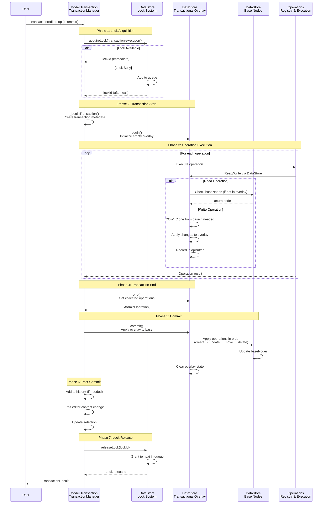

## Architecture Diagram

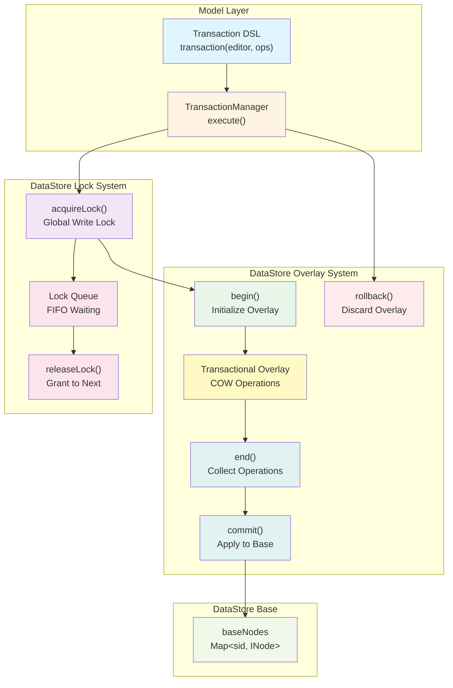

## Detailed Phase Breakdown

### Phase 1: Lock Acquisition

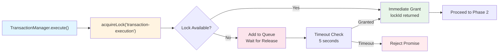

**Purpose**: Ensure exclusive write access to prevent concurrent modification conflicts.

**Key Points**:
- Lock is acquired before any DataStore operations
- If lock is busy, transaction waits in FIFO queue
- Timeout prevents indefinite waiting (5 seconds default)
- Lock ID is stored for later release

### Phase 2: Transaction Start

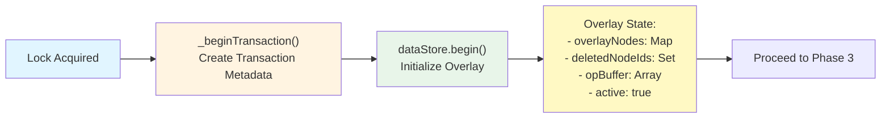

**Purpose**: Initialize transaction metadata and overlay for COW operations.

**Key Points**:
- Transaction metadata created (sid, timestamp, description)
- Overlay initialized as empty (O(1) operation)
- Base nodes remain untouched
- All subsequent operations write to overlay

### Phase 3: Operation Execution

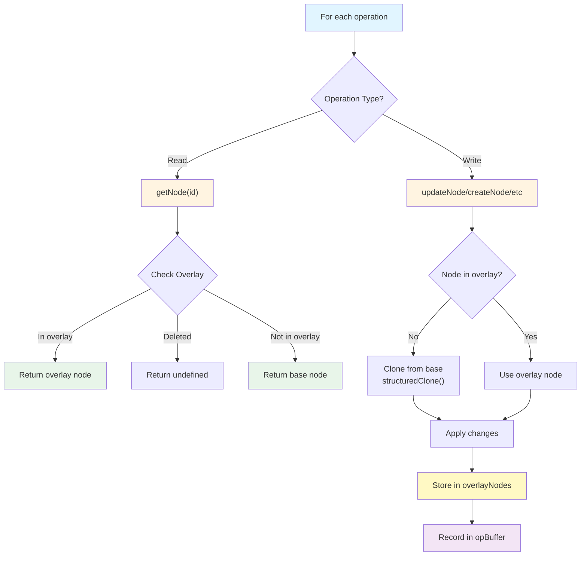

**Purpose**: Execute all operations within the overlay, collecting changes.

**Key Points**:
- Read operations check overlay first, then base
- Write operations use COW: clone from base if needed
- All changes stored in overlay, not base
- Operations recorded in opBuffer for commit
- Base nodes remain unchanged during execution

### Phase 4: Transaction End

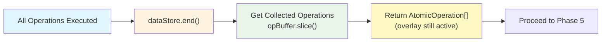

**Purpose**: Collect all operations for commit or rollback.

**Key Points**:
- Returns copy of operations (prevents mutation)
- Overlay remains active until commit/rollback
- Operations can be used for collaboration sync
- No changes applied to base yet

### Phase 5: Commit

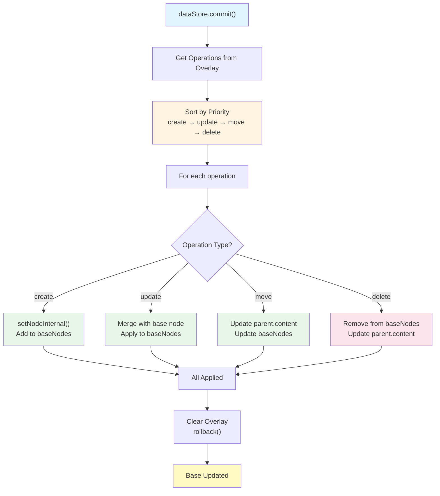

**Purpose**: Atomically apply all overlay changes to base.

**Key Points**:
- Operations applied in deterministic order
- All changes applied together (atomic)
- Overlay cleared after commit
- Base nodes now reflect all changes

### Phase 6: Post-Commit

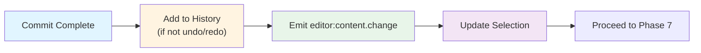

**Purpose**: Notify other systems and update editor state.

**Key Points**:
- History updated for undo/redo
- View layer notified of changes
- Selection updated to reflect new state

### Phase 7: Lock Release

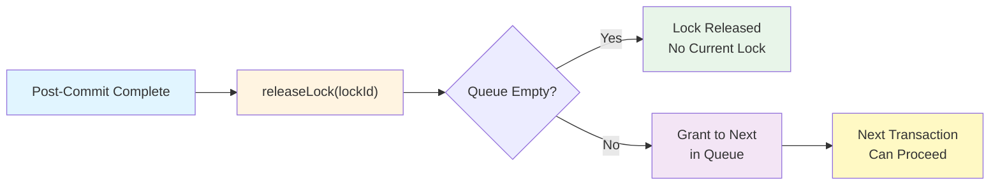

**Purpose**: Release exclusive access, allowing next transaction to proceed.

**Key Points**:
- Lock always released in finally block
- Next transaction in queue automatically granted
- Statistics updated (releases, wait times)

## Error Handling

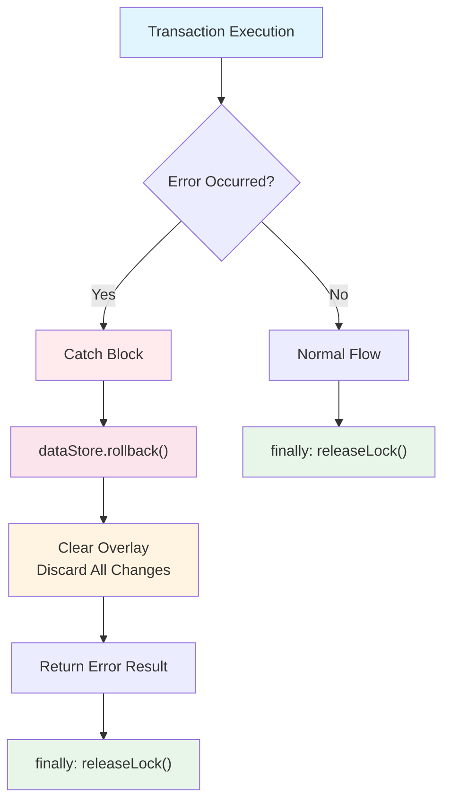

**Error Handling Flow**:
1. Any error during operation execution triggers rollback
2. `rollback()` discards overlay without affecting base
3. Lock is always released in `finally` block
4. Error result returned to caller

## Concurrent Transaction Example

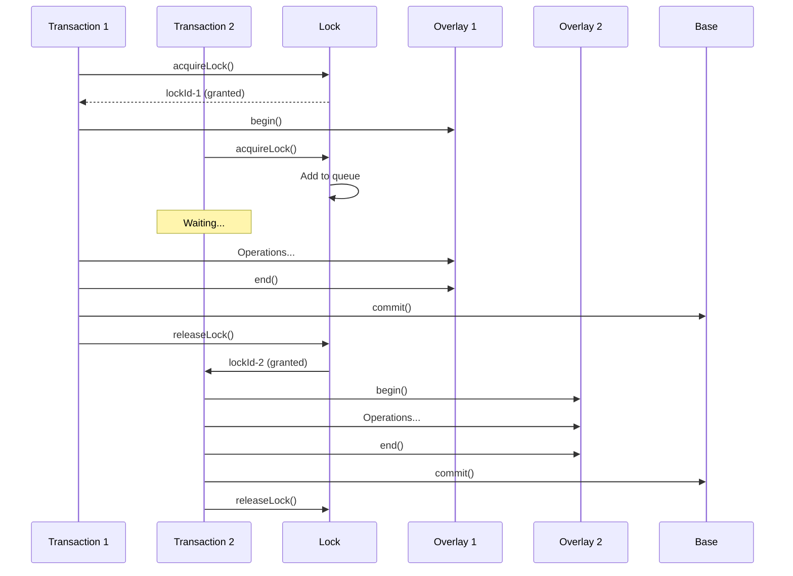

## Key Integration Points

### 1. Lock Before Overlay

Lock is acquired **before** overlay begins:
- Ensures exclusive access during entire transaction
- Prevents concurrent modifications
- Queue ensures fair FIFO ordering

### 2. Overlay During Operations

All operations execute within overlay:
- Reads check overlay → base (in that order)
- Writes go to overlay (COW from base if needed)
- Base remains unchanged until commit

### 3. Commit Applies Atomically

Commit applies all overlay changes at once:
- Operations sorted by priority
- All changes applied together
- Base updated atomically

### 4. Lock Released After Commit

Lock released in `finally` block:
- Always released, even on error
- Next transaction can proceed
- Statistics tracked

## Benefits of This Integration

1. **Atomicity**: All operations in transaction succeed or fail together
2. **Isolation**: Lock prevents concurrent modifications
3. **Efficiency**: COW only duplicates modified nodes
4. **Rollback**: Overlay can be discarded without affecting base
5. **Concurrency**: Queue system ensures fair access

## Code Example

```typescript
// Model transaction
const result = await transaction(editor, [
  create(node('paragraph', {}, [
    textNode('inline-text', 'Hello')
  ])),
  update('text-1', { text: 'Updated' })
]).commit();

// Internal flow:
// 1. TransactionManager.execute() called
// 2. acquireLock() → wait if needed
// 3. begin() → initialize overlay
// 4. Execute operations → write to overlay
// 5. end() → collect operations
// 6. commit() → apply to base
// 7. releaseLock() → grant to next
```

## Summary

The integration between Model transactions and DataStore lock/overlay systems provides:

- **Exclusive Access**: Lock ensures no concurrent writes
- **Efficient Isolation**: Overlay provides transaction isolation without full copy
- **Atomic Operations**: All changes applied together or not at all
- **Error Recovery**: Rollback discards changes without affecting base
- **Fair Concurrency**: Queue system ensures transactions execute in order

This design enables safe, efficient, concurrent document editing with full transaction support.

