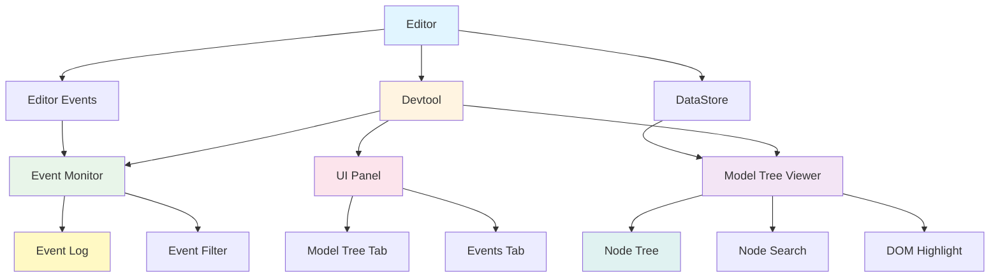

# @barocss/devtool

Development tools for Barocss Editor - visualize editor structure and events in real-time.

## Architecture



## Features

- **Model Tree Visualization**: View the complete document structure as a tree
- **Event Logging**: Monitor all editor events in real-time
- **Event Filtering**: Filter events by type or category
- **Node Selection**: Click on nodes in the tree to highlight them in the DOM
- **Auto-refresh**: Automatically refresh the model tree at configurable intervals

## Usage

```typescript
import { Editor } from '@barocss/editor-core';
import { Devtool } from '@barocss/devtool';

const editor = new Editor({ /* ... */ });

// Initialize devtool
const devtool = new Devtool({
  editor,
  maxEvents: 500,           // Maximum events to keep in log
  refreshInterval: 1000,    // Auto-refresh model tree every 1 second
  debug: true,              // Enable/disable debug mode (event logging)
});
```

## Options

- `editor` (required): The Editor instance to monitor
- `maxEvents` (optional): Maximum number of events to keep in log (default: 1000)
- `refreshInterval` (optional): Auto-refresh interval in milliseconds (default: undefined, no auto-refresh)
- `debug` (optional): Enable/disable debug mode (event logging) (default: true)

## UI Features

The devtool creates a floating panel in the top-right corner with two tabs:

1. **Model Tree**: Shows the document structure as a tree
   - Search nodes by ID, type, or text
   - Click nodes to highlight them in the DOM
   - Refresh button to manually update the tree

2. **Events**: Shows all editor events in real-time
   - Filter events by type or category
   - Color-coded by category (editor, error, extension, plugin, custom)
   - Clear button to reset the log

## Cleanup

```typescript
// Destroy devtool when done
devtool.destroy();
```

