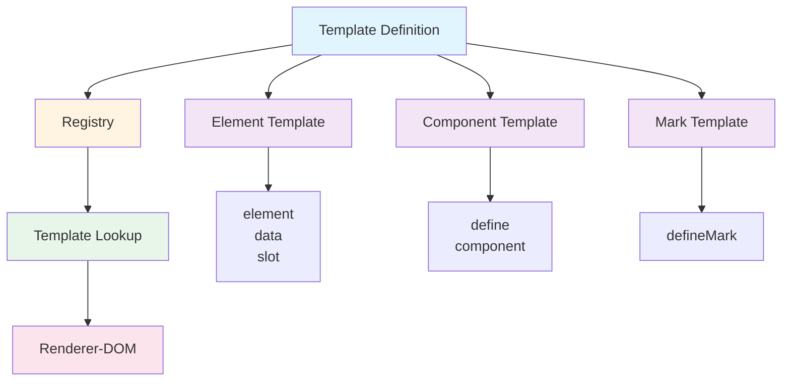

# @barocss/dsl

Declarative DSL (Domain Specific Language) for building templates and renderer definitions. This package provides the template definition layer and is completely independent of rendering logic.

## Architecture



## Overview

`@barocss/dsl` provides a declarative way to define:

- **Element Templates**: HTML/SVG element definitions
- **Component Templates**: Reusable component definitions
- **Data Bindings**: Data-to-DOM bindings
- **Mark Definitions**: Text mark rendering
- **Decorator System**: Pattern-based decorators

## Installation

```bash
pnpm add @barocss/dsl
```

## Basic Usage

### Element Definition

```typescript
import { define, element, data, slot } from '@barocss/dsl';

// Define a paragraph element
define('paragraph', element('p', { className: 'paragraph' }, [
  slot('content')
]));

// Define a text element with data binding
define('inline-text', element('span', { className: 'text' }, [
  data('text', '')
]));

// Define an element with attributes
define('heading', element('h1', { 
  className: 'heading',
  'data-level': (node) => node.attributes?.level || 1
}, [
  slot('content')
]));
```

### Component Definition

There are two ways to define components:

**1. Function Component (Direct Definition)**

```typescript
// Define a function component directly
define('custom-component', (props: any, model: any, ctx: any) => {
  return element('div', { className: 'custom' }, [
    element('h2', {}, [data('text', props.title || model.attributes?.title || '')]),
    slot('content')
  ]);
});
```

**2. Registered Component Reference**

```typescript
// First, define a component
define('my-component', element('div', { className: 'my-component' }, [
  slot('content')
]));

// Then use it with component() function
component('my-component', { title: 'Hello' }, [children])
```

### Mark Definition

```typescript
import { defineMark } from '@barocss/dsl';

// Define bold mark
defineMark('bold', element('strong', { className: 'mark-bold' }, [
  slot('content')
]));

// Define italic mark
defineMark('italic', element('em', { className: 'mark-italic' }, [
  slot('content')
]));

// Define underline mark with style
defineMark('underline', element('span', { 
  className: 'mark-underline',
  style: { textDecoration: 'underline' }
}, [
  slot('content')
]));
```

### Conditional Rendering

```typescript
import { when } from '@barocss/dsl';

define('conditional-node', element('div', {}, [
  when((node) => node.attributes?.visible, [
    element('span', {}, [data('text', 'Visible')])
  ])
]));
```

### Iteration

```typescript
import { each } from '@barocss/dsl';

define('list', element('ul', { className: 'list' }, [
  each('content', (item) => 
    element('li', {}, [slot('item-content')])
  )
]));
```

## API Reference

### Template Builders

#### `element(tag, attributes?, children?)`
Create an element template.

```typescript
element('div', { className: 'container' }, [
  element('p', {}, [data('text', 'Hello')])
])
```

#### `data(key, defaultValue?)`
Create a data binding.

```typescript
data('text', '')  // Bind to node.text
data('attributes.title', '')  // Bind to node.attributes.title
```

#### `slot(name?)`
Create a slot for child content.

```typescript
slot('content')  // Default content slot
slot('header')   // Named slot
```

#### `when(condition, children)`
Conditional rendering.

```typescript
when((node) => node.attributes?.visible, [
  element('span', {}, [data('text', 'Visible')])
])
```

#### `each(key, template)`
Iteration over array.

```typescript
each('content', (item) => 
  element('li', {}, [data('text', item.text)])
)
```

#### `component(name, props?, children?, key?)`
Reference a registered component.

```typescript
// First define the component
define('my-component', element('div', {}, [slot('content')]));

// Then use it
component('my-component', { title: 'Hello' }, [children])

// Or with function props
component('my-component', (data) => ({ title: data.attributes?.title }), [children])
```

**Note**: To define a new component, use `define()` with a function directly:

```typescript
define('custom-component', (props, model, ctx) => {
  return element('div', {}, [
    data('text', props.text || '')
  ]);
});
```

### Registry Functions

#### `define(name, template)`
Register a template.

```typescript
define('paragraph', element('p', {}, [slot('content')]));
```

#### `getGlobalRegistry()`
Get the global template registry.

```typescript
const registry = getGlobalRegistry();
const template = registry.get('paragraph');
```

### Mark Functions

#### `defineMark(name, template)`
Define a mark template.

```typescript
defineMark('bold', element('strong', {}, [slot('content')]));
```

#### `addMarkClassAttribute(template, className)`
Add class attribute to mark template.

```typescript
const boldTemplate = element('strong', {}, [slot('content')]);
addMarkClassAttribute(boldTemplate, 'mark-bold');
```

### Decorator Functions

#### `defineDecorator(name, template)`
Define a decorator template.

```typescript
defineDecorator('highlight', element('span', { 
  className: 'decorator-highlight' 
}, [
  slot('content')
]));
```

## Types

### ElementTemplate
```typescript
interface ElementTemplate {
  tag: string | ((node: any) => string);
  attributes?: Record<string, any>;
  children?: ElementChild[];
}
```

### ComponentTemplate
```typescript
interface ComponentTemplate {
  type: 'component';
  render: (node: any, context: any) => ElementTemplate;
}
```

### DataTemplate
```typescript
interface DataTemplate {
  type: 'data';
  key: string;
  defaultValue?: any;
}
```

## Examples

See `packages/renderer-dom/examples/` for complete examples.

## Testing

```bash
cd packages/dsl
pnpm test:run
```

## License

MIT

