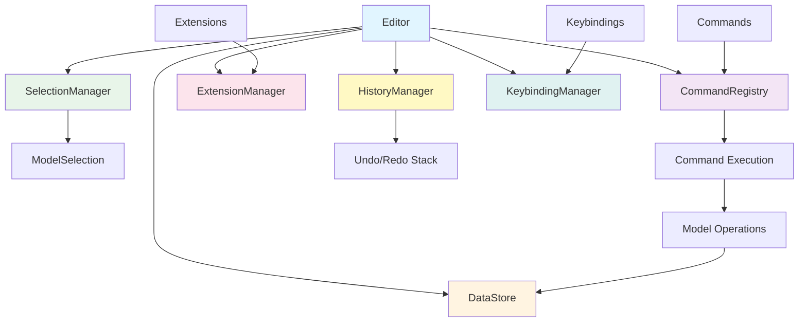

# @barocss/editor-core

Headless editor core that manages document state, selection, commands, and extensions.

## Architecture



## Overview

`@barocss/editor-core` is a platform-independent editor core that provides:

- **Document State Management**: Manages document content and structure
- **Selection Management**: Tracks cursor position and text selection
- **Command System**: Executable commands with chaining support
- **Extension System**: Plugin architecture for extending functionality
- **Event System**: Event-driven architecture for state changes
- **History Management**: Undo/redo functionality

## Installation

```bash
npm install @barocss/editor-core
```

## Basic Usage

```typescript
import { Editor, createBasicExtensions } from '@barocss/editor-core';

// Create editor with basic extensions
const editor = new Editor({
  extensions: createBasicExtensions(),
  editable: true
});

// Listen to events
editor.on('contentChange', ({ content }) => {
  console.log('Content changed:', content);
});

// Execute commands
editor.chain()
  .focus()
  .insertText('Hello ')
  .toggleBold()
  .insertText('World')
  .run();

// Clean up
editor.destroy();
```

## Extension Sets

Pre-configured extension sets for different use cases:

```typescript
import { ExtensionSets } from '@barocss/editor-core';

// Minimal editor (text + paragraph)
const minimalEditor = new Editor({
  extensions: ExtensionSets.minimal()
});

// Basic editor (text + bold + italic)
const basicEditor = new Editor({
  extensions: ExtensionSets.basic()
});

// Rich editor (all features)
const richEditor = new Editor({
  extensions: ExtensionSets.rich()
});
```

## Built-in Extensions

### Text Extension
- `insertText(text: string)`: Insert text at cursor
- `deleteText(from: number, to: number)`: Delete text in range
- `deleteSelection()`: Delete selected text
- `backspace()`: Delete character before cursor
- `delete()`: Delete character after cursor

### Bold Extension
- `toggleBold()`: Toggle bold formatting
- Keyboard shortcut: `Mod+b`

### Italic Extension
- `toggleItalic()`: Toggle italic formatting
- Keyboard shortcut: `Mod+i`

### Heading Extension
- `setHeading(level: number)`: Set heading level (1-6)
- `setHeading1()`, `setHeading2()`, etc.: Set specific heading levels
- `removeHeading()`: Remove heading formatting
- Keyboard shortcuts: `Mod+Alt+1`, `Mod+Alt+2`, etc.

### Paragraph Extension
- `setParagraph()`: Convert to paragraph
- `insertParagraph()`: Insert new paragraph
- Keyboard shortcut: `Mod+Alt+0`

## Custom Extensions

Create custom extensions by implementing the `Extension` interface:

```typescript
import { Extension } from '@barocss/editor-core';

const customExtension: Extension = {
  name: 'custom',
  priority: 100,
  
  onCreate(editor) {
    // Register commands
    editor.registerCommand({
      name: 'customCommand',
      execute: (editor, payload) => {
        console.log('Custom command:', payload);
        return true;
      },
      canExecute: () => true
    });
  },
  
  onDestroy(editor) {
    // Cleanup
  }
};

// Use the extension
const editor = new Editor({
  extensions: [customExtension]
});
```

## Command Chaining

Commands can be chained for atomic execution:

```typescript
const success = editor.chain()
  .focus()
  .insertText('Hello ')
  .toggleBold()
  .insertText('World')
  .toggleItalic()
  .run();

if (success) {
  console.log('All commands executed successfully');
}
```

## Event System

Listen to editor events:

```typescript
// Content changes
editor.on('contentChange', ({ content, transaction }) => {
  console.log('Document updated:', content);
});

// Selection changes
editor.on('selectionChange', ({ selection, oldSelection }) => {
  console.log('Selection changed:', selection);
});

// Command execution
editor.on('commandExecute', ({ command, payload, success }) => {
  console.log(`Command ${command} ${success ? 'succeeded' : 'failed'}`);
});

// History changes
editor.on('historyChange', ({ canUndo, canRedo }) => {
  console.log('History state:', { canUndo, canRedo });
});
```

## History Management

```typescript
// Check if undo/redo is possible
if (editor.canUndo()) {
  editor.undo();
}

if (editor.canRedo()) {
  editor.redo();
}
```

## API Reference

### Editor Class

#### Constructor
```typescript
new Editor(options?: EditorOptions)
```

#### Properties
- `document: DocumentState` - Current document state
- `selection: SelectionState` - Current selection state
- `isFocused: boolean` - Whether editor is focused
- `isEditable: boolean` - Whether editor is editable

#### Methods
- `chain(): CommandChain` - Start command chain
- `executeCommand(name: string, payload?: any): boolean` - Execute single command
- `canExecuteCommand(name: string, payload?: any): boolean` - Check if command can execute
- `registerCommand(command: Command): void` - Register custom command
- `use(extension: Extension): void` - Add extension
- `unuse(extension: Extension): void` - Remove extension
- `on(event: string, callback: Function): void` - Add event listener
- `off(event: string, callback: Function): void` - Remove event listener
- `emit(event: string, data?: any): void` - Emit event
- `undo(): void` - Undo last operation
- `redo(): void` - Redo last undone operation
- `canUndo(): boolean` - Check if undo is possible
- `canRedo(): boolean` - Check if redo is possible
- `destroy(): void` - Clean up editor

### Types

#### EditorOptions
```typescript
interface EditorOptions {
  content?: DocumentState;
  extensions?: Extension[];
  editable?: boolean;
  history?: HistoryOptions;
  model?: ModelOptions;
}
```

#### DocumentState
```typescript
interface DocumentState {
  type: 'document';
  content: Node[];
  version: number;
  createdAt: Date;
  updatedAt: Date;
}
```

#### SelectionState
```typescript
interface SelectionState {
  anchor: number;
  head: number;
  empty: boolean;
  from: number;
  to: number;
  ranges: SelectionRange[];
}
```

#### Extension
```typescript
interface Extension {
  name: string;
  priority?: number;
  dependencies?: string[];
  onCreate?(editor: Editor): void;
  onDestroy?(editor: Editor): void;
  commands?: Command[];
  onTransaction?(editor: Editor, transaction: Transaction): void;
  onSelectionChange?(editor: Editor, selection: SelectionState): void;
  onContentChange?(editor: Editor, content: DocumentState): void;
}
```

## Development

### Building
```bash
pnpm build
```

### Testing
```bash
pnpm test
pnpm test:run
pnpm test:coverage
```

### Type Checking
```bash
pnpm type-check
```

## License

MIT
