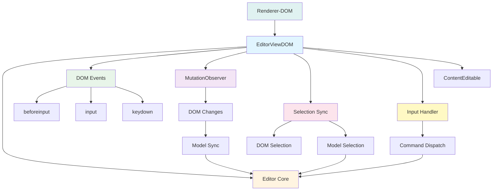
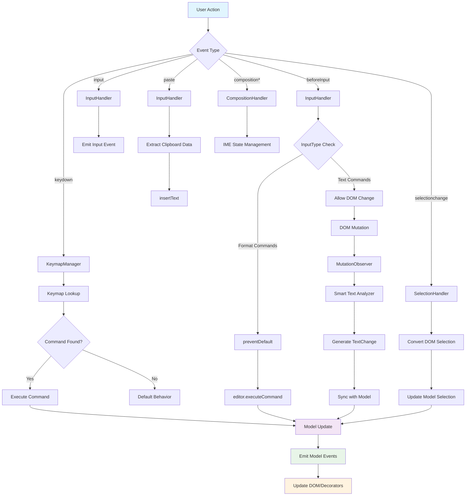
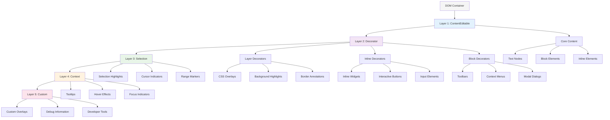
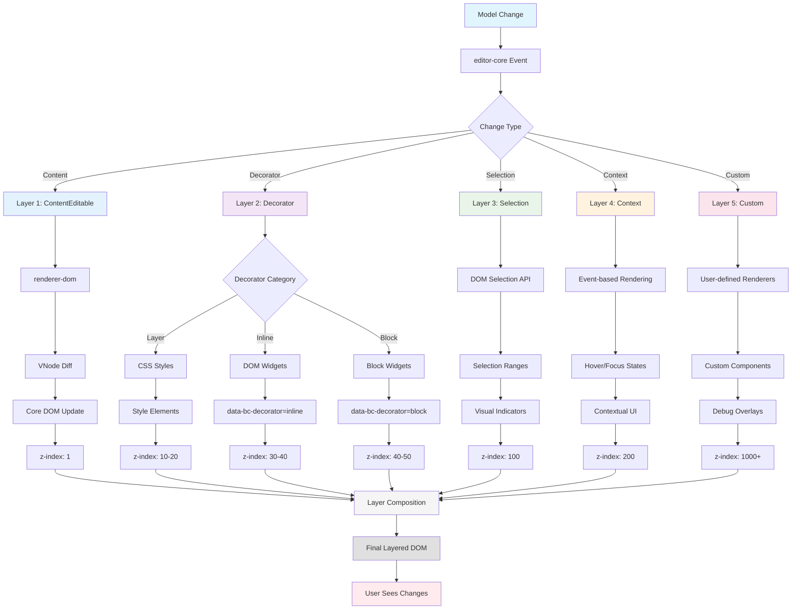
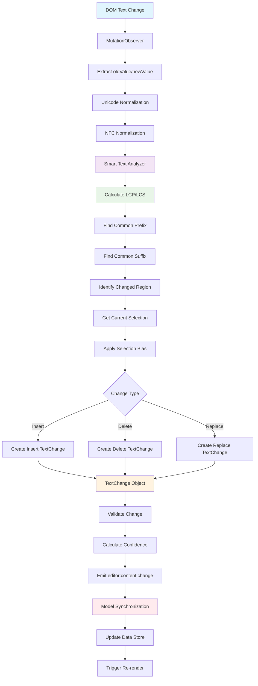
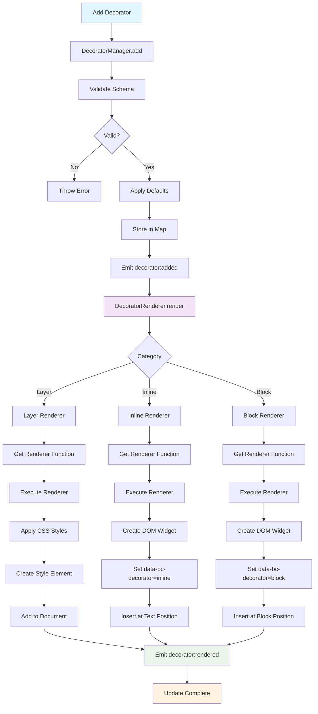

# @barocss/editor-view-dom

DOM view layer for Barocss Editor - bridges `editor-core` with browser DOM functionality.

## Architecture



## Features

### 🎯 Core DOM Integration
- **DOM Event Handling**: Complete browser `contentEditable` event processing
- **MutationObserver**: Real-time DOM change detection and synchronization
- **Smart Text Analysis**: Advanced text change detection with LCP/LCS algorithms
- **Selection Management**: Accurate selection tracking and DOM ↔ Model mapping
- **Keymap System**: Customizable keyboard shortcuts and command binding
- **Native Commands**: Browser-native editing operations (insertText, deleteSelection, etc.)

### 🎨 Advanced Decorator System
- **Layer Decorators**: CSS/overlay-only representation (included in diff)
- **Inline Decorators**: Actual DOM widgets inserted within text (excluded from diff)
- **Block Decorators**: Actual DOM widgets inserted at block level (excluded from diff)
- **Custom Types**: Flexible type system for external developers

### 🔧 Developer Experience
- **DSL Integration**: Re-exports `@barocss/renderer-dom` DSL for unified rendering
- **TypeScript**: Full type safety with comprehensive interfaces
- **Event System**: Rich event handling for all DOM interactions
- **Performance**: Optimized with debouncing and partial updates

## Installation

```bash
pnpm add @barocss/editor-view-dom
```

## Basic Usage

### Current API (Simple)
```typescript
import { Editor } from '@barocss/editor-core';
import { EditorViewDOM } from '@barocss/editor-view-dom';

// Create editor-core instance
const editor = new Editor({
  dataStore: dataStore,
  schema: schema
});

// Simple approach: provide existing contentEditable
const view = new EditorViewDOM(editor, {
  contentEditableElement: document.getElementById('editor')
});
```

### Container-based API
```typescript
import { Editor } from '@barocss/editor-core';
import { EditorViewDOM } from '@barocss/editor-view-dom';

// Create editor-core instance
const editor = new Editor({
  dataStore: dataStore,
  schema: schema
});

// Provide container element - EditorViewDOM creates 5 layers automatically
const view = new EditorViewDOM(editor, {
  container: document.getElementById('editor-container'),  // Required
  // Optional: customize layer configuration
  layers: {
    contentEditable: { 
      className: 'editor-content',
      attributes: { 'data-testid': 'editor' }
    },
    decorator: { className: 'editor-decorators' },
    selection: { className: 'editor-selection' },
    context: { className: 'editor-context' },
    custom: { className: 'editor-custom' }
  }
});

// Now users can type, use keyboard shortcuts, paste, etc.
// All DOM events are automatically handled and synchronized with editor-core

// Access individual layers
view.layers.content      // contentEditable element
view.layers.decorator    // Decorator overlay
view.layers.selection    // Selection UI
view.layers.context      // Context menus, tooltips
view.layers.custom       // User-defined overlays
```

### Generated DOM Structure
```html
<div id="editor-container" style="position: relative; overflow: hidden;">
  <!-- Layer 1: ContentEditable (z-index: 1) -->
  <div class="editor-content" contenteditable="true" 
       style="position: relative; z-index: 1;"
       data-bc-layer="content" data-testid="editor">
    <!-- Core document content rendered by renderer-dom -->
  </div>
  
  <!-- Layer 2: Decorator (z-index: 10) -->
  <div class="editor-decorators" 
       style="position: absolute; top: 0; left: 0; right: 0; bottom: 0; pointer-events: none; z-index: 10;"
       data-bc-layer="decorator">
    <!-- Layer decorators (CSS overlays) -->
    <div class="decorator-layer" data-bc-decorator="layer"></div>
    <!-- Inline decorators (DOM widgets) -->
    <div class="decorator-inline" data-bc-decorator="inline"></div>
    <!-- Block decorators (DOM widgets) -->
    <div class="decorator-block" data-bc-decorator="block"></div>
  </div>
  
  <!-- Layer 3: Selection (z-index: 100) -->
  <div class="editor-selection" 
       style="position: absolute; top: 0; left: 0; right: 0; bottom: 0; pointer-events: none; z-index: 100;"
       data-bc-layer="selection">
    <!-- Selection highlights, cursor, range markers -->
  </div>
  
  <!-- Layer 4: Context (z-index: 200) -->
  <div class="editor-context" 
       style="position: absolute; top: 0; left: 0; right: 0; bottom: 0; pointer-events: none; z-index: 200;"
       data-bc-layer="context">
    <!-- Tooltips, context menus, hover effects -->
  </div>
  
  <!-- Layer 5: Custom (z-index: 1000) -->
  <div class="editor-custom" 
       style="position: absolute; top: 0; left: 0; right: 0; bottom: 0; pointer-events: none; z-index: 1000;"
       data-bc-layer="custom">
    <!-- User-defined overlays, debug info -->
  </div>
</div>
```


## Core DOM Features

### 1. Event Handling

All browser events are automatically processed:

```typescript
// Input events (typing, IME, composition)
view.on('editor:input.detected', (data) => {
  console.log('Input detected:', data.inputType, data.data);
});

// Selection changes
view.on('editor:selection.change', (data) => {
  console.log('Selection changed:', data.selection);
});

// Content changes (via MutationObserver)
editor.on('editor:content.change', (data) => {
  console.log('Content changed:', data.changes);
});
```

### 2. Keyboard Shortcuts

```typescript
// Built-in shortcuts
// Ctrl+B (Bold), Ctrl+I (Italic), Ctrl+Z (Undo), etc.

// Custom shortcuts
view.keymapManager.register('Ctrl+Shift+h', () => {
  editor.executeCommand('heading.insert', { level: 2 });
});

view.keymapManager.register('Ctrl+/', () => {
  editor.executeCommand('comment.toggle');
});
```

### 3. Native Commands

```typescript
// Browser-native operations
view.insertText('Hello world');
view.insertParagraph();
view.deleteSelection();
view.historyUndo();
view.historyRedo();

// Formatting commands
view.toggleBold();
view.toggleItalic();
view.toggleUnderline();
```

### 4. Smart Text Analysis

Accurate text change detection with advanced algorithms:

```typescript
import { analyzeTextChanges } from '@barocss/editor-view-dom';

const changes = analyzeTextChanges({
  oldText: 'Hello world',
  newText: 'Hello beautiful world',
  selectionOffset: 6,
  selectionLength: 0
});

console.log(changes);
// [{
//   type: 'insert',
//   start: 6,
//   end: 6,
//   text: 'beautiful ',
//   confidence: 1.0
// }]
```

### 5. MutationObserver Integration

Real-time DOM change detection:

```typescript
// Automatically detects:
// - Text content changes
// - DOM structure changes
// - Attribute changes
// - IME composition events

// All changes are analyzed and converted to precise TextChange objects
// then synchronized with editor-core model
```

## Decorator System

Model-independent supplementary information display system:

```typescript
import { 
  EditorViewDOM,
  renderer, element, data  // DSL re-export
} from '@barocss/editor-view-dom';

// Layer Decorator (CSS only, included in diff)
view.decoratorManager.add({
  id: 'highlight-1',
  category: 'layer',
  type: 'highlight',
  target: { nodeId: 'text-1', startOffset: 0, endOffset: 5 },
  data: { backgroundColor: 'yellow' }
});

// Inline Decorator (DOM widget, excluded from diff)
view.decoratorRegistry.registerRenderer('action-button',
  renderer('action-button', element('button', {
    className: 'inline-btn',
    'data-bc-decorator': 'inline'
  }, [data('data.text', 'Action')]))
);

view.decoratorManager.add({
  id: 'button-1',
  category: 'inline',
  type: 'action-button',
  target: { nodeId: 'text-1', startOffset: 10, endOffset: 10 },
  data: { text: 'Edit' }
});

// Block Decorator (Block-level widget)
view.decoratorManager.add({
  id: 'toolbar-1',
  category: 'block',
  type: 'toolbar',
  target: { nodeId: 'para-1', position: 'before' },
  data: { items: ['bold', 'italic', 'underline'] }
});
```

## Advanced Features

### 1. Input Type Handling

Different `beforeInput` event types are handled strategically:

```typescript
// Format commands (prevented and converted to editor commands)
// formatBold, formatItalic → editor.executeCommand('bold.toggle')
// insertParagraph → editor.executeCommand('paragraph.insert')

// Text commands (allowed, then synchronized via MutationObserver)
// insertText, deleteContentBackward → DOM change → model sync

// Composition events (IME support)
// compositionstart, compositionupdate, compositionend
```

### 2. Selection Management

Accurate DOM ↔ Model selection mapping:

```typescript
// DOM selection changes are automatically converted to model selection
view.on('editor:selection.change', (data) => {
  console.log('Model selection:', data.selection);
  // { nodeId: 'text-1', startOffset: 5, endOffset: 10 }
});

// Model selection changes update DOM selection
editor.setSelection({ nodeId: 'text-1', startOffset: 0, endOffset: 5 });
```

### 3. Unicode & Complex Text Support

- **NFC Normalization**: All text normalized to NFC form
- **Complex Characters**: Emojis, combining characters, RTL/LTR text
- **IME Support**: Korean, Japanese, Chinese input methods
- **Selection Bias**: Accurate cursor positioning during text analysis

### 4. Performance Optimizations

- **Debounced Events**: Input events are debounced for performance
- **Partial Updates**: Only changed parts are re-rendered
- **Memory Efficient**: Minimal object creation and GC pressure
- **O(min(m,n)) Text Analysis**: Efficient LCP/LCS algorithms

## Event System

```typescript
// Core DOM events
view.on('editor:input.detected', (data) => {
  console.log('Input:', data.inputType, data.data);
});

view.on('editor:selection.change', (data) => {
  console.log('Selection:', data.selection);
});

// Content changes (via MutationObserver)
editor.on('editor:content.change', (data) => {
  console.log('Changes:', data.changes);
});

// Decorator events
view.decoratorManager.on('decorator:added', (decorator) => {
  console.log('Decorator added:', decorator.sid);
});
```

## DSL Integration

Re-exports all `@barocss/renderer-dom` DSL functions:

```typescript
import { 
  EditorViewDOM,
  // All DSL functions available
  renderer, element, data, when, attr,
  layerStyles, inlineWidget, blockWidget
} from '@barocss/editor-view-dom';

// No need to import @barocss/renderer-dom separately
```

## Browser Compatibility

- **Modern Browsers**: Chrome 90+, Firefox 88+, Safari 14+
- **contentEditable**: Full support for contentEditable behavior
- **MutationObserver**: Native MutationObserver API
- **InputEvent**: Modern InputEvent with inputType support
- **Selection API**: Native Selection and Range APIs

## Testing

Comprehensive test coverage with 73+ tests:

```bash
# Run all tests
pnpm test

# Run specific test suites
pnpm test:run smart-text-analyzer.test.ts
pnpm test:run decorator-system.test.ts
pnpm test:run editor-view-dom.test.ts
```

Test categories:
- **Text Analysis**: LCP/LCS algorithms, Unicode handling, Selection bias
- **Event Integration**: Input events, MutationObserver, Selection changes
- **Decorator System**: Registry, Manager, Renderer functionality
- **DOM Integration**: Event handlers, Keymap system, Native commands

## API Reference

### Core Classes

- **`EditorViewDOM`**: Main class bridging editor-core with DOM
- **`DecoratorManager`**: CRUD operations for decorators
- **`DecoratorRegistry`**: Type and renderer registration
- **`KeymapManager`**: Keyboard shortcut management
- **`MutationObserverManager`**: DOM change detection
- **`SmartTextAnalyzer`**: Advanced text change analysis

### Key Interfaces

- **`TextChange`**: Precise text modification description
- **`LayerDecorator`**: CSS-only decoration interface
- **`InlineDecorator`**: Inline widget decoration interface
- **`BlockDecorator`**: Block-level widget decoration interface

## Flow Diagrams

### 1. Event Flow Diagram



### 2. Layered Rendering Architecture

`editor-view-dom` uses a hierarchical rendering system with 5 distinct layers:



#### Layer Characteristics

| Layer | Z-Index | Purpose | Diff Included | Event Handling |
|-------|---------|---------|---------------|----------------|
| **1. ContentEditable** | 1 | Core document content | ✅ Yes | Full interaction |
| **2. Decorator** | 10-50 | Supplementary information | Layer: ✅ / Widget: ❌ | Widget interaction |
| **3. Selection** | 100 | Visual selection indicators | ❌ No | Read-only display |
| **4. Context** | 200 | Contextual UI elements | ❌ No | Event-driven |
| **5. Custom** | 1000+ | User-defined overlays | ❌ No | Custom handling |

### 3. Rendering Flow Diagram



#### Layer Implementation Examples

```typescript
// Layer 1: ContentEditable (Core Content)
const contentLayer = {
  zIndex: 1,
  element: contentEditableElement,
  renderer: 'renderer-dom',
  diffIncluded: true
};

// Layer 2: Decorator (Supplementary Information)
const decoratorLayer = {
  layer: {
    zIndex: 10-20,
    type: 'css-overlay',
    diffIncluded: true,
    example: 'background highlights, underlines'
  },
  inline: {
    zIndex: 30-40,
    type: 'dom-widget',
    diffIncluded: false,
    attribute: 'data-bc-decorator=inline',
    example: 'buttons, inputs, charts'
  },
  block: {
    zIndex: 40-50,
    type: 'dom-widget',
    diffIncluded: false,
    attribute: 'data-bc-decorator=block',
    example: 'toolbars, panels, modals'
  }
};

// Layer 3: Selection (Visual Indicators)
const selectionLayer = {
  zIndex: 100,
  type: 'visual-only',
  diffIncluded: false,
  elements: ['selection-highlight', 'cursor', 'range-markers'],
  eventHandling: 'read-only'
};

// Layer 4: Context (Event-driven UI)
const contextLayer = {
  zIndex: 200,
  type: 'contextual',
  diffIncluded: false,
  triggers: ['hover', 'focus', 'selection'],
  elements: ['tooltips', 'context-menus', 'quick-actions']
};

// Layer 5: Custom (User-defined)
const customLayer = {
  zIndex: 1000,
  type: 'user-defined',
  diffIncluded: false,
  purpose: ['debugging', 'development', 'custom-overlays'],
  control: 'full-user-control'
};
```

#### Layer Interaction Rules

1. **Event Bubbling**: Events bubble up through layers (Custom → Context → Selection → Decorator → ContentEditable)
2. **Z-Index Management**: Each layer has reserved z-index ranges to prevent conflicts
3. **Diff Exclusion**: Layers 3-5 are excluded from `renderer-dom` diffing via `data-bc-*` attributes
4. **Performance**: Higher layers are rendered less frequently (event-driven vs continuous)
5. **Isolation**: Each layer can be independently updated without affecting others

#### Practical Layer Usage

```typescript
import { EditorViewDOM } from '@barocss/editor-view-dom';

const view = new EditorViewDOM(editor, { contentEditableElement });

// Layer 1: ContentEditable (handled automatically)
// Core content is managed by renderer-dom

// Layer 2: Decorator - Add highlights and widgets
view.decoratorManager.add({
  id: 'highlight-1',
  category: 'layer',  // CSS overlay, z-index: 10-20
  type: 'highlight',
  target: { nodeId: 'text-1', startOffset: 0, endOffset: 5 },
  data: { backgroundColor: 'yellow' }
});

view.decoratorManager.add({
  id: 'edit-button',
  category: 'inline',  // DOM widget, z-index: 30-40
  type: 'action-button',
  target: { nodeId: 'text-1', startOffset: 10, endOffset: 10 },
  data: { text: 'Edit', action: 'edit' }
});

// Layer 3: Selection (handled automatically)
// Selection highlights are managed by SelectionHandler

// Layer 4: Context - Add contextual UI
view.contextManager.add({
  id: 'tooltip-1',
  type: 'tooltip',
  trigger: 'hover',
  target: { nodeId: 'text-1' },
  content: 'This is important text',
  zIndex: 200
});

// Layer 5: Custom - Add debug overlay
view.customLayer.add({
  id: 'debug-info',
  type: 'debug-overlay',
  position: 'top-right',
  content: () => ({
    nodeCount: editor.getNodeCount(),
    selectionInfo: editor.getSelection(),
    decoratorCount: view.decoratorManager.size()
  }),
  zIndex: 1000
});
```

#### Layer Rendering Performance

- **Layer 1 (ContentEditable)**: Rendered on every model change (~60fps)
- **Layer 2 (Decorator)**: Rendered on decorator changes (~30fps)
- **Layer 3 (Selection)**: Rendered on selection changes (~120fps)
- **Layer 4 (Context)**: Rendered on events (hover, focus) (~10fps)
- **Layer 5 (Custom)**: Rendered on demand (user-controlled)

### 4. Text Change Analysis Flow



### 5. Decorator Lifecycle Flow



## Layer Management

### Internal Layer System

`EditorViewDOM` automatically creates and manages 5 distinct layers within the provided container:

#### Layer Access

```typescript
const view = new EditorViewDOM(editor, {
  container: document.getElementById('editor-container')
});

// Direct access to each layer
view.layers.content      // HTMLElement - contentEditable layer
view.layers.decorator    // HTMLElement - decorator overlay layer
view.layers.selection    // HTMLElement - selection UI layer
view.layers.context      // HTMLElement - context UI layer (menus, tooltips)
view.layers.custom       // HTMLElement - custom overlay layer
```

#### Layer Properties

| Layer | Z-Index | Position | Pointer Events | Purpose |
|-------|---------|----------|----------------|---------|
| **Content** | 1 | `relative` | ✅ Enabled | Editable content, text input |
| **Decorator** | 10 | `absolute` | ❌ Disabled* | Highlights, annotations, widgets |
| **Selection** | 100 | `absolute` | ❌ Disabled | Selection indicators, cursor |
| **Context** | 200 | `absolute` | ❌ Disabled | Context menus, tooltips |
| **Custom** | 1000 | `absolute` | ❌ Disabled | User-defined overlays |

*Some decorator elements (inline/block widgets) may enable pointer events

#### Layer Coordinate System

All overlay layers use the same coordinate system as the content layer:

```typescript
// Get text position in content layer
const textRect = getTextNodeRect(textNode, offset);

// Create overlay element in decorator layer
const highlight = document.createElement('div');
highlight.style.position = 'absolute';
highlight.style.left = `${textRect.left}px`;
highlight.style.top = `${textRect.top}px`;
highlight.style.width = `${textRect.width}px`;
highlight.style.height = `${textRect.height}px`;
highlight.style.backgroundColor = 'yellow';

// Add to decorator layer
view.layers.decorator.appendChild(highlight);
```

#### Layer Customization

Customize layer appearance and attributes during initialization:

```typescript
const view = new EditorViewDOM(editor, {
  container: document.getElementById('editor-container'),
  layers: {
    contentEditable: {
      className: 'my-editor-content',
      attributes: {
        'data-testid': 'editor-content',
        'aria-label': 'Rich text editor',
        'role': 'textbox'
      }
    },
    decorator: {
      className: 'my-decorators',
      attributes: {
        'data-layer': 'decorations'
      }
    },
    selection: {
      className: 'my-selection-ui'
    },
    context: {
      className: 'my-context-ui'
    },
    custom: {
      className: 'my-custom-overlays'
    }
  }
});
```

#### Layer Lifecycle

```typescript
// Clear specific layer
view.layers.decorator.innerHTML = '';

// Add elements to layers
const tooltip = document.createElement('div');
tooltip.textContent = 'Tooltip content';
view.layers.context.appendChild(tooltip);

// Layer cleanup on destroy
view.destroy(); // Automatically cleans up all layers
```

#### Layer Event Handling

```typescript
// Layer-specific event handling
view.layers.context.addEventListener('click', (event) => {
  if (event.target.classList.contains('context-menu-item')) {
    handleContextMenuClick(event);
  }
});

// Coordinate with content layer events
view.layers.content.addEventListener('selectionchange', () => {
  updateSelectionLayer();
});
```

## Architecture

```
┌─────────────────┐    ┌──────────────────────────┐    ┌─────────────────┐
│   editor-core   │    │    editor-view-dom       │    │  renderer-dom   │
│                 │    │                          │    │                 │
│ • Commands      │◄──►│ • DOM Events             │◄──►│ • DSL System    │
│ • Selection     │    │ • MutationObserver       │    │ • VNode Diff    │
│ • Data Store    │    │ • Keymap System          │    │ • Element API   │
│ • Extensions    │    │ • Native Commands        │    │ • Renderer      │
│ • Events        │    │ • Smart Text Analyzer    │    │   Registry      │
│                 │    │ • Decorator System       │    └─────────────────┘
│                 │    │   - Layer Decorators     │              │
│                 │    │   - Inline Decorators    │              │
│                 │    │   - Block Decorators     │              │
│                 │    │ • DSL Re-export          │              │
└─────────────────┘    └──────────────────────────┘              │
         │                           │                           │
         │                           │                           │
    ┌────▼────┐                 ┌────▼────┐                 ┌────▼────┐
    │ Headless│                 │ DOM UI  │                 │ DSL     │
    │ Logic   │                 │ Layer   │                 │ Render  │
    └─────────┘                 └─────────┘                 └─────────┘
```

## Performance Metrics

- **Text Analysis**: < 5ms for 1000+ character texts
- **Event Processing**: < 1ms for typical input events
- **Memory Usage**: Minimal object allocation, efficient GC
- **Bundle Size**: ~50KB (minified), ~12KB (gzipped)
- **Browser Support**: Modern browsers with contentEditable support

## License

MIT
