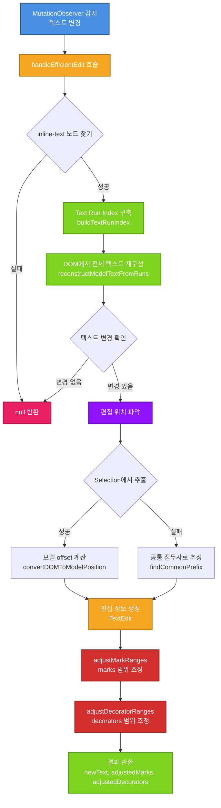
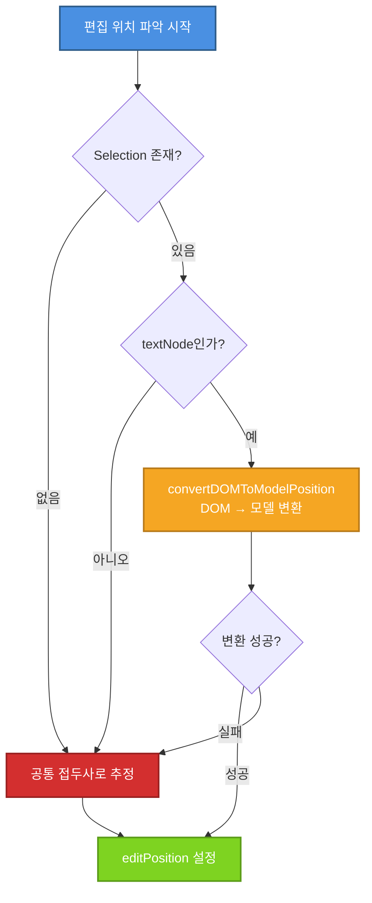
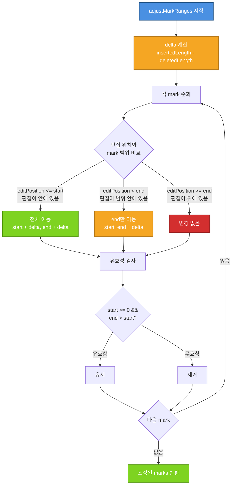
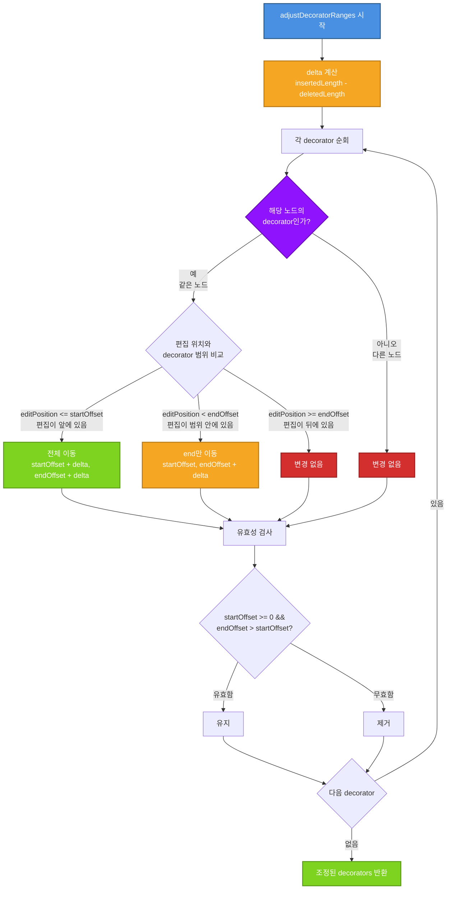

# handleEfficientEdit 구현 세부사항

## 전체 플로우 개요



### 단계별 설명

1. **MutationObserver 감지**: DOM에서 텍스트 변경을 감지
2. **handleEfficientEdit 호출**: 편집 처리 함수 시작
3. **inline-text 노드 찾기**: 변경된 text node가 속한 inline-text 노드 찾기
4. **Text Run Index 구축**: 모든 text node를 순회하여 인덱스 구축
5. **DOM에서 전체 텍스트 재구성**: 모든 text node의 textContent를 합침
6. **편집 위치 파악**: Selection 또는 공통 접두사로 편집 위치 추정
7. **편집 정보 생성**: TextEdit 객체 생성 (editPosition, insertedLength, deletedLength 등)
8. **adjustMarkRanges**: 모든 mark의 range를 편집에 맞게 조정
9. **adjustDecoratorRanges**: 해당 노드의 decorator range를 편집에 맞게 조정

## 단계별 상세 설명

### 1. inline-text 노드 찾기

```typescript
const inlineTextNode = findInlineTextNode(textNode);
```

**동작:**
- `textNode`의 부모를 따라 올라가면서 `data-bc-stype="inline-text"`인 요소를 찾음
- 예: `<span data-bc-sid="text-1" data-bc-stype="inline-text">` 찾기

**예시:**
```html
<span data-bc-sid="text-1" data-bc-stype="inline-text" class="text">
  <span class="custom-bold">Hello</span>
  <!-- textNode가 여기 있다면 -->
  <span> world</span>
</span>
```

### 2. Text Run Index 구축

```typescript
const runs = buildTextRunIndex(inlineTextNode, nodeId, {
  buildReverseMap: true,
  normalizeWhitespace: false
});
```

**Text Run Index란?**
- inline-text 노드 내의 모든 text node를 순서대로 나열한 인덱스
- 각 text node의 모델 offset 범위를 저장

**구조:**
```typescript
interface ContainerRuns {
  runs: TextRun[];  // [ { domTextNode, start: 0, end: 5 }, { domTextNode, start: 5, end: 11 } ]
  total: number;   // 11 (전체 텍스트 길이)
  byNode?: Map<Text, { start, end }>;  // textNode → offset 변환용
}
```

**예시:**
```html
<span data-bc-sid="text-1" data-bc-stype="inline-text">
  <span class="custom-bold">Hello</span>  <!-- textNode1: "Hello" -->
  <span> world</span>                     <!-- textNode2: " world" -->
</span>
```

→ Text Run Index:
```typescript
{
  runs: [
    { domTextNode: textNode1, start: 0, end: 5 },   // "Hello"
    { domTextNode: textNode2, start: 5, end: 11 }   // " world"
  ],
  total: 11,
  byNode: Map {
    textNode1 => { start: 0, end: 5 },
    textNode2 => { start: 5, end: 11 }
  }
}
```

**매번 구축하는 이유:**
- 항상 최신 정보 보장 (캐시 무효화 문제 없음)
- inline-text 노드 내의 text node 개수가 보통 적음 (10개 이하)
- TreeWalker 순회 비용이 낮음 (O(n) where n = text nodes 수)
- 구현 단순화 및 오류 가능성 감소

### 3. DOM에서 전체 텍스트 재구성

```typescript
const newText = reconstructModelTextFromRuns(runs);
```

**동작:**
```typescript
function reconstructModelTextFromRuns(runs: ContainerRuns): string {
  return runs.runs
    .map(run => run.domTextNode.textContent || '')
    .join('');
}
```

**예시:**
- runs: `[{ domTextNode: textNode1, start: 0, end: 5 }, { domTextNode: textNode2, start: 5, end: 11 }]`
- textNode1.textContent = `"Hello"`
- textNode2.textContent = `" world"`
- 결과: `"Hello world"`

**✅ 장점:**
- 매번 최신 Text Run Index를 구축하므로 항상 정확한 정보 보장
- `textNode.textContent`는 항상 최신 값이므로 정확한 텍스트 재구성 가능

### 4. 편집 위치 파악



#### 방법 1: Selection에서 추출

```typescript
const selection = window.getSelection();
if (selection && selection.rangeCount > 0) {
  const range = selection.getRangeAt(0);
  if (range.startContainer.nodeType === Node.TEXT_NODE) {
    const domPosition = {
      textNode: range.startContainer as Text,
      offset: range.startOffset
    };
    const modelPos = convertDOMToModelPosition(domPosition, inlineTextNode);
    if (modelPos) {
      editPosition = modelPos.offset;
    }
  }
}
```

**convertDOMToModelPosition 동작:**


1. `textNode`가 속한 run 찾기 (byNode 맵 사용)
2. `run.start + domOffset` = 모델 offset

**예시:**
- DOM: textNode2의 offset 3 (즉, " world"에서 " wo" 다음)
- byNode 맵: `textNode2 => { start: 5, end: 11 }`
- 모델 offset: `5 + 3 = 8` (즉, "Hello world"에서 8번째 문자)

#### 방법 2: 공통 접두사로 추정 (fallback)

```typescript
if (editPosition === undefined) {
  editPosition = findCommonPrefix(oldModelText, newText);
}
```

**동작:**
```typescript
function findCommonPrefix(oldText: string, newText: string): number {
  let commonPrefix = 0;
  while (
    commonPrefix < oldText.length &&
    commonPrefix < newText.length &&
    oldText[commonPrefix] === newText[commonPrefix]
  ) {
    commonPrefix++;
  }
  return commonPrefix;
}
```

**예시:**
- oldText: `"Hello world"`
- newText: `"Hello beautiful world"`
- 공통 접두사: `"Hello "` (6자)
- editPosition: `6`

**⚠️ 한계:**
- 공통 접두사 방식은 정확하지 않을 수 있음
- 예: `"abc"` → `"xyz"` (완전 교체)의 경우 editPosition = 0이 되지만, 실제로는 전체 교체

### 5. 편집 정보 생성 (TextEdit)

```typescript
const insertedLength = Math.max(0, newText.length - oldText.length);
const deletedLength = Math.max(0, oldText.length - newText.length);
const editType: 'insert' | 'delete' | 'replace' = 
  insertedLength > 0 && deletedLength > 0 ? 'replace' :
  insertedLength > 0 ? 'insert' : 'delete';

const editInfo: TextEdit = {
  nodeId,
  oldText,
  newText,
  editPosition: position,
  editType,
  insertedLength,
  deletedLength
};
```

**예시:**
- oldText: `"Hello world"` (11자)
- newText: `"Hello beautiful world"` (22자)
- editPosition: `6`
- insertedLength: `11` (22 - 11)
- deletedLength: `0`
- editType: `'insert'`

### 6. adjustMarkRanges로 marks 범위 조정



```typescript
const adjustedMarks = adjustMarkRanges(modelMarks, editInfo);
```

**adjustMarkRanges 동작:**

```typescript
export function adjustMarkRanges(
  marks: MarkRange[],
  edit: TextEdit
): MarkRange[] {
  const { editPosition, insertedLength, deletedLength } = edit;
  const delta = insertedLength - deletedLength;  // 순 변화량
  
  return marks.map(mark => {
    const [start, end] = mark.range;
    
    // 케이스 1: 편집 위치가 mark 범위 앞에 있는 경우
    if (editPosition <= start) {
      // mark 범위 전체를 delta만큼 이동
      return {
        ...mark,
        range: [start + delta, end + delta]
      };
    }
    
    // 케이스 2: 편집 위치가 mark 범위 안에 있는 경우
    if (editPosition < end) {
      // end만 이동 (start는 유지)
      return {
        ...mark,
        range: [start, end + delta]
      };
    }
    
    // 케이스 3: 편집 위치가 mark 범위 뒤에 있는 경우
    // mark 범위는 변경 없음
    return mark;
  }).filter(mark => {
    // 유효하지 않은 범위 제거
    const [start, end] = mark.range;
    return start >= 0 && end > start;
  });
}
```

**예시 1: 편집이 mark 앞에 있는 경우**
- 원래 mark: `{ type: 'bold', range: [6, 11] }` ("world")
- 편집: position=0, insertedLength=5, deletedLength=0 (앞에 "Hello " 삽입)
- delta = 5
- 결과: `{ type: 'bold', range: [11, 16] }` (전체가 5만큼 이동)

**예시 2: 편집이 mark 안에 있는 경우**
- 원래 mark: `{ type: 'bold', range: [0, 11] }` ("Hello world")
- 편집: position=6, insertedLength=10, deletedLength=0 ("Hello " 다음에 "beautiful " 삽입)
- delta = 10
- 결과: `{ type: 'bold', range: [0, 21] }` (start는 유지, end만 10 증가)

**예시 3: 편집이 mark 뒤에 있는 경우**
- 원래 mark: `{ type: 'bold', range: [0, 5] }` ("Hello")
- 편집: position=11, insertedLength=5, deletedLength=0 (뒤에 "!" 삽입)
- delta = 5
- 결과: `{ type: 'bold', range: [0, 5] }` (변경 없음)

### 7. adjustDecoratorRanges로 decorators 범위 조정



```typescript
const adjustedDecorators = adjustDecoratorRanges(decorators, nodeId, editInfo);
```

**adjustDecoratorRanges 동작:**

```typescript
export function adjustDecoratorRanges(
  decorators: DecoratorRange[],
  nodeId: string,
  edit: TextEdit
): DecoratorRange[] {
  const { editPosition, insertedLength, deletedLength } = edit;
  const delta = insertedLength - deletedLength;
  
  return decorators.map(decorator => {
    // 해당 노드에 적용된 decorator만 조정
    if (decorator.target.sid !== nodeId) {
      return decorator;  // 다른 노드의 decorator는 변경 없음
    }
    
    const { startOffset, endOffset } = decorator.target;
    
    // adjustMarkRanges와 동일한 로직
    if (editPosition <= startOffset) {
      // 전체 이동
      return {
        ...decorator,
        target: {
          ...decorator.target,
          startOffset: startOffset + delta,
          endOffset: endOffset + delta
        }
      };
    }
    
    if (editPosition < endOffset) {
      // end만 이동
      return {
        ...decorator,
        target: {
          ...decorator.target,
          endOffset: endOffset + delta
        }
      };
    }
    
    // 변경 없음
    return decorator;
  }).filter(decorator => {
    // 유효하지 않은 범위 제거
    const { startOffset, endOffset } = decorator.target;
    return startOffset >= 0 && endOffset > startOffset;
  });
}
```

**예시:**
- decorator: `{ sid: 'd1', stype: 'highlight', target: { sid: 'text-1', startOffset: 6, endOffset: 11 } }`
- 편집: position=6, insertedLength=10, deletedLength=0
- delta = 10
- 결과: `{ sid: 'd1', stype: 'highlight', target: { sid: 'text-1', startOffset: 6, endOffset: 21 } }`

## 전체 예시 시나리오

### 시나리오: "Hello world"에 "beautiful " 삽입

**초기 상태:**
```typescript
oldModelText: "Hello world"
modelMarks: [
  { type: 'bold', range: [0, 5] },      // "Hello"
  { type: 'italic', range: [6, 11] }   // "world"
]
```

**1. DOM에서 텍스트 재구성:**
```typescript
newText = "Hello beautiful world"  // DOM에서 재구성
```

**2. 편집 위치 파악:**
```typescript
editPosition = 6  // Selection에서 추출 또는 공통 접두사
insertedLength = 10  // "beautiful " (10자)
deletedLength = 0
delta = 10
```

**3. Marks 조정:**
```typescript
// mark 1: [0, 5] - 편집 위치(6)가 뒤에 있음 → 변경 없음
// mark 2: [6, 11] - 편집 위치(6)가 범위 안에 있음 → [6, 21]

adjustedMarks: [
  { type: 'bold', range: [0, 5] },        // 변경 없음
  { type: 'italic', range: [6, 21] }      // end만 10 증가
]
```

**4. 결과:**
- 텍스트: `"Hello beautiful world"`
- Bold: `[0, 5]` → `"Hello"`
- Italic: `[6, 21]` → `"beautiful world"`

## 잠재적 문제점 및 개선 방안

### ✅ 해결됨: 캐시된 runs의 오래된 정보

**이전 문제:**
- 캐시된 `runs`가 오래된 정보를 가질 수 있음
- DOM 변경 후 캐시 무효화 필요

**해결:**
- 매번 Text Run Index를 구축하여 항상 최신 정보 보장
- inline-text 노드 내의 text node 개수가 적어 성능 저하 미미

### 문제 2: 편집 위치 추정의 부정확성

**문제:**
- 공통 접두사 방식은 복잡한 편집에서 부정확할 수 있음
- 예: `"abc"` → `"xyz"` (완전 교체)의 경우 editPosition = 0이지만 실제로는 전체 교체

**해결:**
- Selection을 최대한 활용
- `beforeinput` 이벤트에서 편집 위치 미리 캐싱

### 문제 3: 여러 text node 동시 변경

**문제:**
- MutationObserver는 개별 text node의 변경만 감지
- 여러 text node가 동시에 변경되면 여러 번 호출됨

**해결:**
- 현재는 매번 전체 텍스트를 재구성하므로 문제 없음
- 하지만 성능 최적화 여지가 있음

