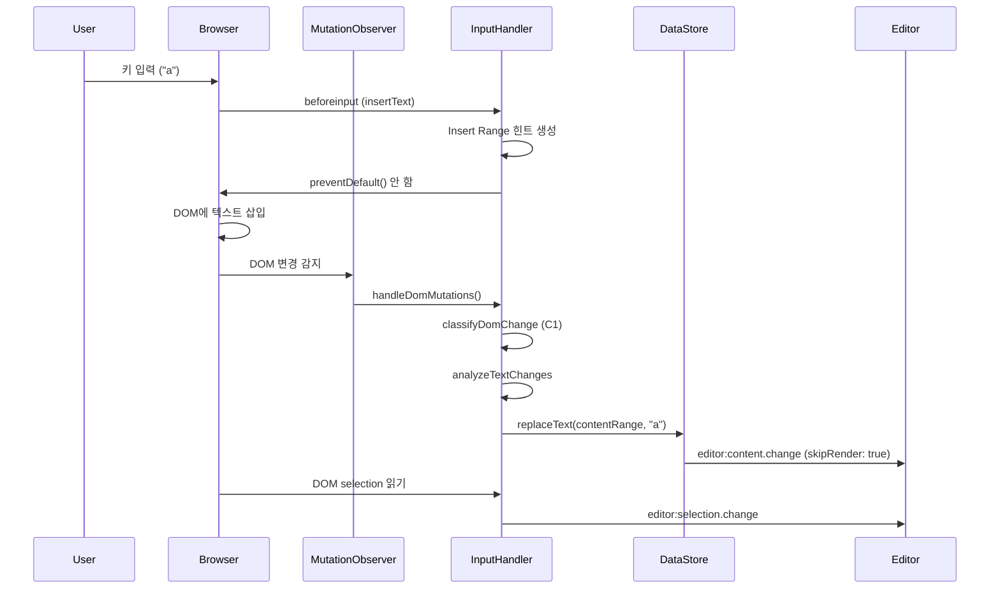
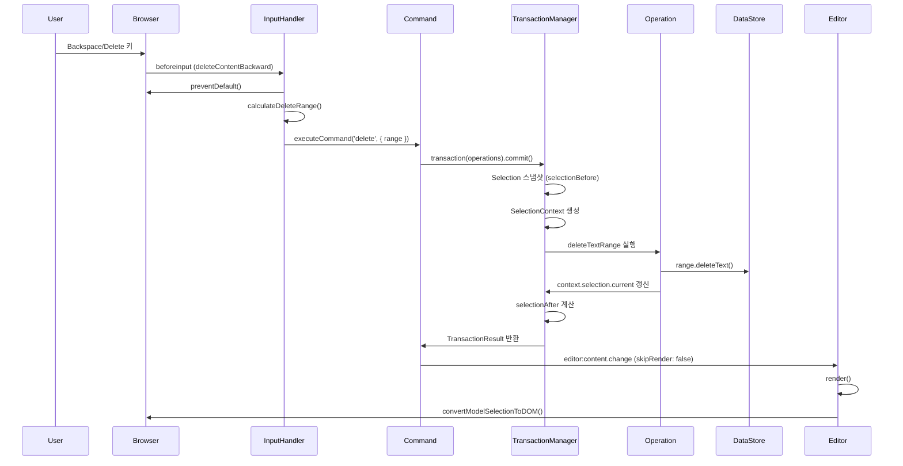

# 키 입력부터 지우기까지 전체 흐름

## 개요

이 문서는 사용자가 키보드로 텍스트를 입력하고 삭제할 때의 전체 처리 흐름을 단계별로 정리합니다.

---

## 1. 텍스트 입력 (키 입력)

### 전체 흐름

```
사용자 키 입력 (예: "a" 입력)
    ↓
1. beforeinput 이벤트 발생
   - inputType: "insertText"
   - preventDefault() 하지 않음
   - Insert Range 힌트 생성 (선택적)
    ↓
2. 브라우저가 자동으로 DOM 변경
   - contenteditable 요소에 텍스트 삽입
   - Selection 자동 업데이트
    ↓
3. MutationObserver가 DOM 변경 감지
   - characterData 또는 childList 변경
    ↓
4. InputHandler.handleDomMutations() 호출
   - mutations 배열 처리
    ↓
5. dom-change-classifier.classifyDomChange()
   - C1 (단일 inline-text) 또는 C2 (여러 inline-text)로 분류
    ↓
6. InputHandler.handleC1() 또는 handleC2()
   - analyzeTextChanges로 텍스트 변경 분석
   - change.type === 'insert' 또는 'replace' 감지
    ↓
7. dataStore.range.replaceText(contentRange, newText)
   - 모델에서 텍스트 업데이트
   - marks/decorators 자동 조정
   - normalize: true로 자동 정규화
    ↓
8. editor:content.change 이벤트 발생
   - skipRender: true (무한루프 방지)
    ↓
9. DOM selection 읽어서 모델 selection 업데이트
   - convertDOMSelectionToModel로 변환
   - editor:selection.change 이벤트 발생
```

### 상세 단계

#### 1-1. beforeinput 이벤트

**위치**: `packages/editor-view-dom/src/event-handlers/input-handler.ts:1002`

```typescript
handleBeforeInput(event: InputEvent): void {
  const inputType = event.inputType;
  
  // 구조 변경만 preventDefault()
  if (this.shouldPreventDefault(inputType)) {
    event.preventDefault();
    this.executeStructuralCommand(inputType);
    return;
  }
  
  // 삭제는 Model-First로 처리 (preventDefault)
  if (this.shouldHandleDelete(inputType) && !event.isComposing) {
    event.preventDefault();
    this.handleDelete(event);
    return;
  }
  
  // 텍스트 입력: Insert Range 힌트 생성 (선택적)
  this.updateInsertHintFromBeforeInput(event);
  
  // 나머지는 브라우저가 자동 처리하도록 둠
  // MutationObserver가 DOM 변경을 감지
}
```

**핵심**:
- 텍스트 입력(`insertText`)은 `preventDefault()` 하지 않음
- 브라우저가 자동으로 DOM 변경
- Insert Range 힌트 생성 (선택적, 향후 사용)

---

#### 1-2. 브라우저 DOM 변경

**동작**:
- 브라우저가 `contenteditable` 요소에 텍스트 삽입
- Selection 자동 업데이트
- `characterData` 또는 `childList` mutation 발생

---

#### 1-3. MutationObserver 감지

**위치**: `packages/editor-view-dom/src/event-handlers/input-handler.ts:146`

```typescript
handleDomMutations(mutations: MutationRecord[]): void {
  // mutations 배열 처리
  // dom-change-classifier로 분류
  const classified = classifyDomChange(mutations, options);
  
  // 분류 결과에 따라 처리
  if (classified.case === 'C1') {
    this.handleC1(classified);
  } else if (classified.case === 'C2') {
    this.handleC2(classified);
  }
  // ...
}
```

---

#### 1-4. 텍스트 변경 분석 및 모델 업데이트

**위치**: `packages/editor-view-dom/src/event-handlers/input-handler.ts:229`

```typescript
private handleC1(classified: ClassifiedChange): void {
  // 텍스트 diff 분석
  const textChanges = analyzeTextChanges({
    oldText: classified.prevText,
    newText: classified.newText,
    selectionOffset,
    selectionLength: 0
  });
  
  const change = textChanges[0];
  
  // 삽입 또는 교체
  if (change.type === 'insert' || change.type === 'replace') {
    const contentRange = classified.contentRange || 
      this.calculateContentRangeFromChange(change);
    
    // 모델 업데이트
    this.editor.dataStore.range.replaceText(contentRange, change.text);
    
    // editor:content.change 이벤트 발생 (skipRender: true)
    this.editor.emit('editor:content.change', {
      skipRender: true,
      from: 'mutation-observer'
    });
  }
  
  // Selection 업데이트
  const domSelection = window.getSelection();
  if (domSelection && domSelection.rangeCount > 0) {
    const modelSelection = convertDOMSelectionToModel(domSelection);
    this.editor.emit('editor:selection.change', {
      selection: modelSelection,
      oldSelection: this.editor.selection || null
    });
  }
}
```

---

## 2. 지우기 (Backspace/Delete)

### 전체 흐름

```
사용자 Backspace/Delete 키 입력
    ↓
1. beforeinput 이벤트 발생
   - inputType: "deleteContentBackward" 또는 "deleteContentForward"
   - preventDefault() 함 (Model-First)
   - IME 조합 중이면 브라우저 기본 동작 허용
    ↓
2. InputHandler.handleDelete() 호출
   - DOM selection → Model selection 변환
   - 삭제 범위 계산 (calculateDeleteRange)
    ↓
3. editor.executeCommand('delete', { range })
   - DeleteExtension의 delete 명령 실행
    ↓
4. DeleteExtension._executeDelete()
   - 삭제 범위에 따라 operations 생성
   - 단일 노드: deleteTextRange operation
   - Cross-node: dataStore.range.deleteText 직접 호출
   - 노드 전체: delete operation
    ↓
5. transaction(editor, operations).commit()
   - TransactionManager.execute() 호출
    ↓
6. TransactionManager 실행
   - Selection 스냅샷 (selectionBefore)
   - SelectionContext 생성 (before/current)
   - Operations 순차 실행
   - 각 operation이 context.selection.current 갱신
   - 최종 selectionAfter 계산
    ↓
7. deleteTextRange operation 실행
   - DataStore 업데이트
   - context.selection.current 갱신 (offset 클램프/시프트)
    ↓
8. Transaction 완료
   - TransactionResult 반환 (selectionBefore/selectionAfter 포함)
   - History에 추가
    ↓
9. editor:content.change 이벤트 발생
   - skipRender: false (DOM 업데이트 필요)
    ↓
10. EditorViewDOM.render()
    - DOM 재렌더링
    ↓
11. 모델 selection을 DOM selection으로 변환
    - convertModelSelectionToDOM
    - 브라우저 selection 업데이트
```

### 상세 단계

#### 2-1. beforeinput 이벤트

**위치**: `packages/editor-view-dom/src/event-handlers/input-handler.ts:1002`

```typescript
handleBeforeInput(event: InputEvent): void {
  const inputType = event.inputType;
  
  // 삭제 처리 (Model-First)
  if (this.shouldHandleDelete(inputType) && !event.isComposing) {
    event.preventDefault();  // ← 브라우저 기본 동작 방지
    this.handleDelete(event);
    return;
  }
}
```

**핵심**:
- 삭제는 `preventDefault()` 함 (Model-First)
- IME 조합 중이면 브라우저 기본 동작 허용

---

#### 2-2. 삭제 범위 계산

**위치**: `packages/editor-view-dom/src/event-handlers/input-handler.ts:1255`

```typescript
private calculateDeleteRange(
  modelSelection: any,
  inputType: string,
  currentNodeId: string
): ContentRange | null {
  const { startNodeId, startOffset, endNodeId, endOffset, collapsed } = modelSelection;
  
  // Range selection: 선택된 범위 삭제
  if (!collapsed) {
    return { startNodeId, startOffset, endNodeId, endOffset };
  }
  
  // Collapsed selection: 방향에 따라 처리
  switch (inputType) {
    case 'deleteContentBackward': // Backspace
      if (startOffset > 0) {
        // 같은 노드 내: 이전 문자 삭제
        return { startNodeId, startOffset: startOffset - 1, endNodeId, endOffset: startOffset };
      } else {
        // 노드 경계: 이전 노드 처리
        return this.calculateCrossNodeDeleteRange(startNodeId, 'backward', dataStore);
      }
      
    case 'deleteContentForward': // Delete
      const node = dataStore.getNode(startNodeId);
      const textLength = node?.text?.length || 0;
      if (startOffset < textLength) {
        // 같은 노드 내: 다음 문자 삭제
        return { startNodeId, startOffset, endNodeId, endOffset: startOffset + 1 };
      } else {
        // 노드 경계: 다음 노드 처리
        return this.calculateCrossNodeDeleteRange(startNodeId, 'forward', dataStore);
      }
  }
}
```

---

#### 2-3. Command 실행

**위치**: `packages/extensions/src/delete.ts:71`

```typescript
private async _executeDelete(editor: Editor, range: ContentRange): Promise<boolean> {
  // 단일 노드 내 텍스트 삭제
  if (range.startNodeId === range.endNodeId) {
    const operations = this._buildDeleteTextOperations(range);
    const result = await transaction(editor, operations).commit();
    return result.success;
  }
  
  // Cross-node 범위는 DataStore의 range.deleteText 사용
  if (range.startNodeId !== range.endNodeId) {
    dataStore.range.deleteText(range);
    return true;
  }
  
  // 노드 전체 삭제
  if (range._deleteNode && range.nodeId) {
    const operations = this._buildDeleteNodeOperations(range.nodeId);
    const result = await transaction(editor, operations).commit();
    return result.success;
  }
}
```

---

#### 2-4. Transaction 실행

**위치**: `packages/model/src/transaction.ts:47`

```typescript
async execute(operations: (TransactionOperation | OpFunction)[]): Promise<TransactionResult> {
  // 1. Selection 스냅샷
  const selectionBefore = this._editor.selectionManager.getCurrentSelection();
  
  // 2. TransactionContext 생성
  const context = createTransactionContext(
    this._dataStore,
    this._editor.selectionManager.clone(),
    this._schema!
  );
  
  // 3. Operations 순차 실행
  for (const operation of operations) {
    await this._executeOperation(operation, context);
    // 각 operation이 context.selection.current 갱신
  }
  
  // 4. 최종 selection 상태
  const selectionAfter = context.selection.current;
  
  // 5. 결과 반환
  return {
    success: true,
    selectionBefore,
    selectionAfter,
    operations: executedOperations
  };
}
```

---

#### 2-5. deleteTextRange Operation 실행

**위치**: `packages/model/src/operations/deleteTextRange.ts:30`

```typescript
defineOperation('deleteTextRange', 
  async (operation: any, context: TransactionContext) => {
    const { nodeId, start, end } = operation.payload;
    
    // 1. DataStore 업데이트
    const deletedText = context.dataStore.range.deleteText({
      startNodeId: nodeId,
      startOffset: start,
      endNodeId: nodeId,
      endOffset: end
    });
    
    // 2. Selection 매핑: context.selection.current 직접 갱신
    if (context.selection?.current) {
      const sel = context.selection.current;
      const deleteLength = end - start;
      
      // anchor 처리
      if (sel.anchorId === nodeId) {
        if (sel.anchorOffset >= start && sel.anchorOffset < end) {
          sel.anchorOffset = start;  // 클램프
        } else if (sel.anchorOffset >= end) {
          sel.anchorOffset -= deleteLength;  // 시프트
        }
      }
      
      // focus 처리 (동일한 로직)
      if (sel.focusId === nodeId) {
        if (sel.focusOffset >= start && sel.focusOffset < end) {
          sel.focusOffset = start;
        } else if (sel.focusOffset >= end) {
          sel.focusOffset -= deleteLength;
        }
      }
    }
    
    return { ok: true, data: deletedText, inverse: { ... } };
  }
);
```

---

#### 2-6. DOM 업데이트 및 Selection 적용

**위치**: `packages/editor-view-dom/src/event-handlers/input-handler.ts:1226`

```typescript
// editor:content.change 이벤트 발생
this.editor.emit('editor:content.change', {
  skipRender: false,  // ← DOM 업데이트 필요
  from: 'beforeinput-delete'
});

// render() 후에 DOM selection 적용
requestAnimationFrame(() => {
  const modelSelection = {
    type: 'range' as const,
    startNodeId: contentRange.startNodeId,
    startOffset: contentRange.startOffset,
    endNodeId: contentRange.startNodeId,
    endOffset: contentRange.startOffset,
    collapsed: true
  };
  
  this.editorViewDOM.convertModelSelectionToDOM(modelSelection);
});
```

---

## 비교: 텍스트 입력 vs 지우기

| 항목 | 텍스트 입력 | 지우기 |
|------|------------|--------|
| **beforeinput** | preventDefault() 안 함 | preventDefault() 함 |
| **처리 방식** | DOM-First (MutationObserver) | Model-First (Command) |
| **모델 업데이트** | MutationObserver 감지 후 | beforeinput에서 즉시 |
| **렌더링** | skipRender: true | skipRender: false |
| **Selection 처리** | DOM selection 읽기 | Transaction의 selectionAfter 사용 |

---

## 핵심 원칙

### 1. 텍스트 입력: DOM-First
- 브라우저가 자동으로 DOM 변경
- MutationObserver가 감지하여 모델 업데이트
- IME 입력과 일관성 유지

### 2. 지우기: Model-First
- beforeinput에서 preventDefault()
- 모델 먼저 변경
- Transaction의 selectionAfter 사용
- 명확한 Selection 동기화

### 3. Selection 관리
- **텍스트 입력**: DOM selection 읽어서 모델에 반영
- **지우기**: Transaction의 selectionAfter 사용 (명시적)

---

## 시퀀스 다이어그램

### 텍스트 입력



### 지우기



---

## 요약

1. **텍스트 입력**: DOM-First → MutationObserver 감지 → 모델 업데이트
2. **지우기**: Model-First → beforeinput preventDefault → Command → Transaction → Operation → Selection 매핑
3. **Selection**: 입력은 DOM에서 읽기, 삭제는 Transaction의 selectionAfter 사용

